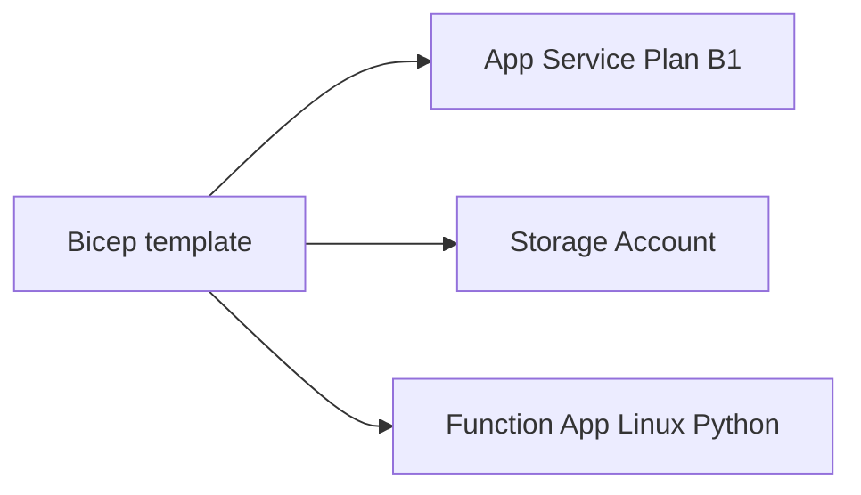

# 05 - Infrastructure as Code (Dedicated)

This tutorial deploys a Dedicated Function App stack using Bicep. It uses a Linux Basic B1 App Service Plan for cost-efficient learning and provisions the core resources needed for a Python Function App.

## Prerequisites

- Completed [04 - Logging & Monitoring](04-logging-monitoring.md)
- Azure CLI with Bicep support
- Variables available:

```bash
export RG="rg-func-dedicated-dev"
export APP_NAME="func-dedi-<unique-suffix>"
export PLAN_NAME="asp-dedi-b1-dev"
export STORAGE_NAME="stdedidev<unique>"
export LOCATION="eastus"
```

## What You'll Build

You will define and deploy a Dedicated App Service Plan, storage account, and Linux Python Function App by using `infra/dedicated/main.bicep`, then validate the deployed resources.

!!! info "Infrastructure Context"
    **Plan**: Dedicated (B1) | **Network**: Public internet | **VNet**: ❌ (requires Standard+ tier)

    Basic B1 has no VNet integration or private endpoints. The app runs on a fixed App Service Plan (always on, no scale-to-zero). VNet support requires upgrading to Standard (S1) or Premium (P1v3) tier.

    ```mermaid
    flowchart TD
        INET[Internet] -->|HTTPS| FA[Function App\nDedicated B1-P3v3\nLinux Python 3.11]

        subgraph VNET["VNet 10.0.0.0/16"]
            subgraph INT_SUB["Integration Subnet 10.0.1.0/24\nDelegation: Microsoft.Web/serverFarms"]
                FA
            end
            subgraph PE_SUB["Private Endpoint Subnet 10.0.2.0/24"]
                PE_BLOB[PE: blob]
                PE_QUEUE[PE: queue]
                PE_TABLE[PE: table]
                PE_FILE[PE: file]
            end
        end

        PE_BLOB --> ST["Storage Account"]
        PE_QUEUE --> ST
        PE_TABLE --> ST
        PE_FILE --> ST

        subgraph DNS[Private DNS Zones]
            DNS_BLOB[privatelink.blob.core.windows.net]
            DNS_QUEUE[privatelink.queue.core.windows.net]
            DNS_TABLE[privatelink.table.core.windows.net]
            DNS_FILE[privatelink.file.core.windows.net]
        end

        PE_BLOB -.-> DNS_BLOB
        PE_QUEUE -.-> DNS_QUEUE
        PE_TABLE -.-> DNS_TABLE
        PE_FILE -.-> DNS_FILE

        FA -.->|System-Assigned MI| ENTRA[Microsoft Entra ID]
        FA --> AI[Application Insights]

        RFP["📦 WEBSITE_RUN_FROM_PACKAGE=1\nNo content share required"] -.- FA
        ALWAYS_ON["⚙️ Always On: true\nFixed capacity"] -.- FA

        style FA fill:#5c2d91,color:#fff
        style VNET fill:#E8F5E9,stroke:#4CAF50
        style ST fill:#FFF3E0
        style DNS fill:#E3F2FD
    ```



## Steps

### Step 1 - Create and review the Bicep entry point

Use `infra/dedicated/main.bicep` as the Dedicated template root.

```bash
mkdir --parents infra/dedicated
touch infra/dedicated/main.bicep
ls infra/dedicated/main.bicep
```

### Step 2 - Define Dedicated plan and Function App resources

Your template should include these Dedicated-specific values:

```bicep
param location string = resourceGroup().location
param planName string
param appName string
param storageName string

resource plan 'Microsoft.Web/serverfarms@2023-12-01' = {
  name: planName
  location: location
  kind: 'linux'
  sku: {
    name: 'B1'
    tier: 'Basic'
  }
  properties: {
    reserved: true
  }
}

resource storage 'Microsoft.Storage/storageAccounts@2023-05-01' = {
  name: storageName
  location: location
  sku: {
    name: 'Standard_LRS'
  }
  kind: 'StorageV2'
}

resource functionApp 'Microsoft.Web/sites@2023-12-01' = {
  name: appName
  location: location
  kind: 'functionapp,linux'
  properties: {
    serverFarmId: plan.id
    siteConfig: {
      alwaysOn: true
      linuxFxVersion: 'Python|3.11'
      appSettings: [
        {
          name: 'FUNCTIONS_WORKER_RUNTIME'
          value: 'python'
        }
        {
          name: 'AzureWebJobsStorage'
          value: '<connection-string-or-identity-based-setting>'
        }
      ]
    }
  }
}
```

This is the classic `siteConfig.appSettings` model for Dedicated (not `functionAppConfig`).

### Step 3 - Configure Function App settings for Dedicated

Dedicated does not require Azure Files content share settings such as `WEBSITE_CONTENTAZUREFILECONNECTIONSTRING` as a general rule.

```bicep
resource functionApp 'Microsoft.Web/sites@2023-12-01' = {
  name: appName
  location: location
  kind: 'functionapp,linux'
  properties: {
    serverFarmId: plan.id
    siteConfig: {
      alwaysOn: true
      linuxFxVersion: 'Python|3.11'
      appSettings: [
        {
          name: 'FUNCTIONS_WORKER_RUNTIME'
          value: 'python'
        }
        {
          name: 'AzureWebJobsStorage'
          value: '<connection-string-or-identity-based-setting>'
        }
      ]
    }
  }
}
```

### Step 4 - Deploy the Bicep template

```bash
az group create \
  --name $RG \
  --location $LOCATION

az deployment group create \
  --resource-group $RG \
  --template-file infra/dedicated/main.bicep \
  --parameters \
    location=$LOCATION \
    planName=$PLAN_NAME \
    appName=$APP_NAME \
    storageName=$STORAGE_NAME
```

### Step 5 - Validate deployed resources

```bash
az appservice plan show \
  --name $PLAN_NAME \
  --resource-group $RG \
  --query "{name:name,sku:sku.name,tier:sku.tier,kind:kind}" \
  --output json

az functionapp show \
  --name $APP_NAME \
  --resource-group $RG \
  --query "{name:name,kind:kind,defaultHostName:defaultHostName}" \
  --output json
```

!!! info "Requires Standard tier or higher"
    VNet integration is not available on Basic (B1) tier. Upgrade to Standard (S1) or Premium (P1v2) for VNet support.

If you add optional VNet integration in this template, document subnet delegation to `Microsoft.Web/serverFarms` and deploy with S1 or higher.

## Verification

`az deployment group create ...`:

```json
{
  "id": "/subscriptions/<subscription-id>/resourceGroups/rg-func-dedicated-dev/providers/Microsoft.Resources/deployments/<auto-generated-deployment-name>",
  "name": "<auto-generated-deployment-name>",
  "properties": {
    "provisioningState": "Succeeded",
    "timestamp": "2026-04-03T10:45:12.000000+00:00"
  },
  "resourceGroup": "rg-func-dedicated-dev"
}
```

`az appservice plan show ... --query ...`:

```json
{
  "kind": "linux",
  "name": "asp-dedi-b1-dev",
  "sku": "B1",
  "tier": "Basic"
}
```

## Next Steps

You now have reproducible Dedicated infrastructure in Bicep. Next you will automate deployment through CI/CD.

> **Next:** [06 - CI/CD](06-ci-cd.md)

## See Also

- [Tutorial Overview & Plan Chooser](../index.md)
- [Python Language Guide](../../index.md)
- [Platform: Hosting Plans](../../../../platform/hosting.md)
- [Operations: Deployment](../../../../operations/deployment.md)
- [Recipes Index](../../recipes/index.md)

## Sources

- [Bicep documentation](https://learn.microsoft.com/azure/azure-resource-manager/bicep/)
- [Microsoft.Web/serverfarms resource reference](https://learn.microsoft.com/azure/templates/microsoft.web/serverfarms)
- [Microsoft.Web/sites resource reference](https://learn.microsoft.com/azure/templates/microsoft.web/sites)
