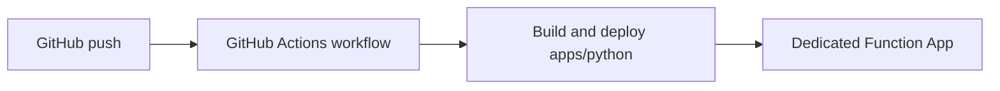

# 06 - CI/CD (Dedicated)

This tutorial sets up CI/CD for Dedicated with standard zip deployment. Dedicated supports Kudu/SCM and zipdeploy workflows, which makes GitHub Actions integration straightforward.

## Prerequisites

- Completed [05 - Infrastructure as Code](05-infrastructure-as-code.md)
- Function App deployed on Dedicated
- Variables set:

```bash
export RG="rg-func-dedicated-dev"
export APP_NAME="func-dedi-<unique-suffix>"
export PLAN_NAME="asp-dedi-b1-dev"
export STORAGE_NAME="stdedidev<unique>"
export LOCATION="eastus"
```

## What You'll Build

You will package the Python Function App from `apps/python`, deploy it with Zip Deploy and remote build settings, and implement an automated GitHub Actions deployment workflow.



## Steps

### Step 1 - Build a deployable zip package

```bash
python -m venv .venv
source .venv/bin/activate
pip install --requirement apps/python/requirements.txt

cd apps/python
zip --recurse-paths ../functionapp.zip .
cd ..
```

### Step 2 - Deploy with zipdeploy

```bash
az functionapp config appsettings set \
  --name $APP_NAME \
  --resource-group $RG \
  --settings \
    SCM_DO_BUILD_DURING_DEPLOYMENT=true \
    ENABLE_ORYX_BUILD=true

az functionapp deployment source config-zip \
  --name $APP_NAME \
  --resource-group $RG \
  --src functionapp.zip
```

### Step 3 - Verify deployment and endpoint health

```bash
az functionapp deployment list-publishing-profiles \
  --name $APP_NAME \
  --resource-group $RG \
  --output table

curl --request GET "https://$APP_NAME.azurewebsites.net/api/health"
```

### Step 4 - Add GitHub Actions workflow (recommended)

Create `.github/workflows/deploy-dedicated.yml`:

```yaml
name: deploy-dedicated

on:
  push:
    branches: [ main ]

jobs:
  build-and-deploy:
    runs-on: ubuntu-latest
    steps:
      - name: Checkout
        uses: actions/checkout@v4

      - name: Deploy Azure Functions app
        uses: Azure/functions-action@v1
        with:
          app-name: ${{ vars.AZURE_FUNCTIONAPP_NAME }}
          package: apps/python
          publish-profile: ${{ secrets.AZURE_FUNCTIONAPP_PUBLISH_PROFILE }}
          scm-do-build-during-deployment: true
          enable-oryx-build: true
```

### Step 5 - Deployment slots (S1+ only)

Deployment slots are unavailable on B1. Upgrade to S1 or P1v2, then create and use a staging slot:

```bash
az appservice plan update \
  --name $PLAN_NAME \
  --resource-group $RG \
  --sku S1

az functionapp deployment slot create \
  --name $APP_NAME \
  --resource-group $RG \
  --slot staging

az functionapp deployment source config-zip \
  --name $APP_NAME \
  --resource-group $RG \
  --slot staging \
  --src functionapp.zip

az functionapp deployment slot swap \
  --name $APP_NAME \
  --resource-group $RG \
  --slot staging \
  --target-slot production
```

!!! info "Requires Standard tier or higher"
    Deployment slots are not available on Basic (B1) tier. Upgrade to Standard (S1) or Premium (P1v2) before using slots.

## Verification

`az functionapp deployment source config-zip ...`:

```json
{
  "active": true,
  "author": "N/A",
  "complete": true,
  "deployer": "ZipDeploy",
  "id": "xxxxxxxxxxxxxxxx",
  "message": "Created via a push deployment",
  "status": 4,
  "url": "https://func-dedi-<unique-suffix>.scm.azurewebsites.net/api/deployments/xxxxxxxxxxxxxxxx"
}
```

`curl --request GET "https://$APP_NAME.azurewebsites.net/api/health"`:

```json
{
  "status": "healthy",
  "timestamp": "2026-04-03T11:20:00Z",
  "version": "1.0.0"
}
```

`az functionapp deployment slot create ...` (after S1 upgrade):

```json
{
  "hostNames": [
    "func-dedi-<unique-suffix>-staging.azurewebsites.net"
  ],
  "name": "func-dedi-<unique-suffix>/slots/staging",
  "state": "Running"
}
```

## Next Steps

You now have a repeatable Dedicated deployment pipeline with optional slot-based release flow on S1/P1v2.

> **Next:** [07 - Extending with Triggers](07-extending-triggers.md)

## See Also

- [Tutorial Overview & Plan Chooser](../index.md)
- [Python Language Guide](../../index.md)
- [Platform: Hosting Plans](../../../../platform/hosting.md)
- [Operations: Deployment](../../../../operations/deployment.md)
- [Recipes Index](../../recipes/index.md)

## Sources

- [Zip deployment for Azure Functions](https://learn.microsoft.com/azure/azure-functions/deployment-zip-push)
- [Deploy Azure Functions with GitHub Actions](https://learn.microsoft.com/azure/azure-functions/functions-how-to-github-actions)
- [Deployment slots in Azure Functions](https://learn.microsoft.com/azure/azure-functions/functions-deployment-slots)
