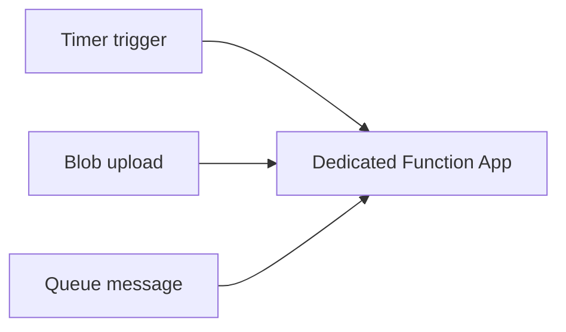

---
hide:
  - toc
validation:
  az_cli:
    last_tested: 2026-04-09
    cli_version: "2.83.0"
    core_tools_version: "4.8.0"
    result: pass
  bicep:
    last_tested: null
    result: not_tested
content_sources:
  - type: mslearn-adapted
    url: https://learn.microsoft.com/azure/azure-functions/functions-triggers-bindings
  - type: mslearn-adapted
    url: https://learn.microsoft.com/azure/azure-functions/functions-bindings-timer
  - type: mslearn-adapted
    url: https://learn.microsoft.com/azure/azure-functions/functions-bindings-storage-blob-trigger
  - type: mslearn-adapted
    url: https://learn.microsoft.com/azure/azure-functions/functions-bindings-storage-queue-trigger
---

# 07 - Extending with Triggers (Dedicated)

This tutorial extends your Dedicated Function App beyond HTTP with timer, blob, and queue triggers. On Dedicated, all standard triggers are supported, timer workloads benefit from Always On, and blob trigger polling works normally.

## Prerequisites

- Completed [06 - CI/CD](06-ci-cd.md)
- Variables exported:

```bash
export RG="rg-func-dedicated-dev"
export APP_NAME="func-dedi-<unique-suffix>"
export PLAN_NAME="asp-dedi-b1-dev"
export STORAGE_NAME="stdedidev<unique>"
export LOCATION="koreacentral"
```

## What You'll Build

You will add timer, blob, and queue-triggered functions under `apps/python/blueprints/`, register them in the app entry point, and validate trigger execution after deployment.

!!! info "Infrastructure Context"
    **Plan**: Dedicated (B1) | **Network**: Public internet | **VNet**: ❌ (requires Standard+ tier)

    Basic B1 has no VNet integration or private endpoints. The app runs on a fixed App Service Plan (always on, no scale-to-zero). VNet support requires upgrading to Standard (S1) or Premium (P1v3) tier.

    <!-- diagram-id: what-you-ll-build -->
    ```mermaid
    flowchart TD
        INET[Internet] -->|HTTPS| FA[Function App\nDedicated B1-P3v3\nLinux Python 3.11]

        subgraph VNET["VNet 10.0.0.0/16"]
            subgraph INT_SUB["Integration Subnet 10.0.1.0/24\nDelegation: Microsoft.Web/serverFarms"]
                FA
            end
            subgraph PE_SUB["Private Endpoint Subnet 10.0.2.0/24"]
                PE_BLOB[PE: blob]
                PE_QUEUE[PE: queue]
                PE_TABLE[PE: table]
                PE_FILE[PE: file]
            end
        end

        PE_BLOB --> ST["Storage Account"]
        PE_QUEUE --> ST
        PE_TABLE --> ST
        PE_FILE --> ST

        subgraph DNS[Private DNS Zones]
            DNS_BLOB[privatelink.blob.core.windows.net]
            DNS_QUEUE[privatelink.queue.core.windows.net]
            DNS_TABLE[privatelink.table.core.windows.net]
            DNS_FILE[privatelink.file.core.windows.net]
        end

        PE_BLOB -.-> DNS_BLOB
        PE_QUEUE -.-> DNS_QUEUE
        PE_TABLE -.-> DNS_TABLE
        PE_FILE -.-> DNS_FILE

        FA -.->|System-Assigned MI| ENTRA[Microsoft Entra ID]
        FA --> AI[Application Insights]

        RFP["📦 WEBSITE_RUN_FROM_PACKAGE=1\nNo content share required"] -.- FA
        ALWAYS_ON["⚙️ Always On: true\nFixed capacity"] -.- FA

        style FA fill:#5c2d91,color:#fff
        style VNET fill:#E8F5E9,stroke:#4CAF50
        style ST fill:#FFF3E0
        style DNS fill:#E3F2FD
    ```

<!-- diagram-id: what-you-ll-build-2 -->


## Steps

### Step 1 - Keep Always On enabled for background reliability

```bash
az functionapp config set \
  --name $APP_NAME \
  --resource-group $RG \
  --always-on true
```

Timer triggers are most reliable when Always On is enabled on Dedicated.

### Step 2 - Add a timer trigger

Create `apps/python/blueprints/scheduled_jobs.py`:

```python
import datetime
import logging
import azure.functions as func

bp = func.Blueprint()

@bp.function_name(name="cleanup_timer")
@bp.timer_trigger(schedule="0 */5 * * * *", arg_name="timer")
def cleanup_timer(timer: func.TimerRequest) -> None:
    logging.info("Cleanup timer executed at %s", datetime.datetime.utcnow().isoformat())
```

Register the blueprint in `apps/python/function_app.py`.

### Step 3 - Add a blob trigger (standard polling)

Create `apps/python/blueprints/blob_processor.py`:

```python
import logging
import azure.functions as func

bp = func.Blueprint()

@bp.function_name(name="blob_ingest")
@bp.blob_trigger(arg_name="input_blob", path="uploads/{name}", connection="AzureWebJobsStorage")
def blob_ingest(input_blob: func.InputStream) -> None:
    logging.info("Blob trigger fired for %s (%s bytes)", input_blob.name, input_blob.length)
```

Blob polling works on Dedicated App Service Plan.

### Step 4 - Add a queue trigger

Create `apps/python/blueprints/queue_processor.py`:

```python
import logging
import azure.functions as func

bp = func.Blueprint()

@bp.function_name(name="queue_worker")
@bp.queue_trigger(arg_name="msg", queue_name="jobs", connection="AzureWebJobsStorage")
def queue_worker(msg: func.QueueMessage) -> None:
    logging.info("Queue message processed: %s", msg.get_body().decode("utf-8"))
```

### Step 5 - Deploy and test triggers

```bash
cd apps/python && func azure functionapp publish $APP_NAME --python

az storage container create \
  --name uploads \
  --account-name $STORAGE_NAME

az storage queue create \
  --name jobs \
  --account-name $STORAGE_NAME

az storage blob upload \
  --account-name $STORAGE_NAME \
  --container-name uploads \
  --name sample.txt \
  --file ./README.md

az storage message put \
  --account-name $STORAGE_NAME \
  --queue-name jobs \
  --content "run-job-001"
```

### Step 6 - Review runtime and scale behavior

- Dedicated is always running and does not scale to zero.
- Autoscale on Basic (B1) is manual only; autoscale rules are available on Standard and higher tiers.
- Typical maximum instance limits by Dedicated tier are Basic: 3, Standard: 10, Premium: 30.
- Timeout default is 30 minutes and max is unlimited.
- Memory depends on selected plan SKU.

!!! info "Requires Standard tier or higher"
    VNet integration is not available on Basic (B1) tier. Upgrade to Standard (S1) or Premium (P1v2) for VNet support.

!!! info "Private endpoints on Dedicated"
    App Service private endpoints are supported on Basic (B1) and higher tiers. When enabled, validate private DNS resolution for the app hostname.

## Verification

`cd apps/python && func azure functionapp publish $APP_NAME --python`:

```text
Getting site publishing info...
Creating archive for current directory...
Uploading 8.4 MB [########################################################]
Deployment successful.
Syncing triggers...
Functions in func-dedi-<unique-suffix>:
    health - [httpTrigger]
    info - [httpTrigger]
    cleanup_timer - [timerTrigger]
    blob_ingest - [blobTrigger]
    queue_worker - [queueTrigger]
```

`az storage message put ...`:

```json
{
  "content": "run-job-001",
  "dequeueCount": 0,
  "expirationTime": "2026-04-10T11:55:17+00:00",
  "id": "xxxxxxxx-xxxx-xxxx-xxxx-xxxxxxxxxxxx",
  "insertionTime": "2026-04-03T11:55:17+00:00",
  "popReceipt": "<masked>",
  "timeNextVisible": "2026-04-03T11:55:17+00:00"
}
```

Application log sample (Kudu/Log Stream):

```text
[Information] Cleanup timer executed at 2026-04-03T11:55:00.102341
[Information] Blob trigger fired for uploads/sample.txt (12457 bytes)
[Information] Queue message processed: run-job-001
```

## Next Steps

You now have a full Dedicated track implementation with HTTP, timer, blob, and queue triggers, plus deployment and operations foundations.

> **Next:** [How Azure Functions Works](../../../../platform/architecture.md)

## See Also

- [Tutorial Overview & Plan Chooser](../index.md)
- [Python Language Guide](../../index.md)
- [Platform: Hosting Plans](../../../../platform/hosting.md)
- [Operations: Deployment](../../../../operations/deployment.md)
- [Recipes Index](../../recipes/index.md)

## Sources

- [Azure Functions triggers and bindings concepts](https://learn.microsoft.com/azure/azure-functions/functions-triggers-bindings)
- [Timer trigger for Azure Functions](https://learn.microsoft.com/azure/azure-functions/functions-bindings-timer)
- [Blob trigger for Azure Functions](https://learn.microsoft.com/azure/azure-functions/functions-bindings-storage-blob-trigger)
- [Queue trigger for Azure Functions](https://learn.microsoft.com/azure/azure-functions/functions-bindings-storage-queue-trigger)
