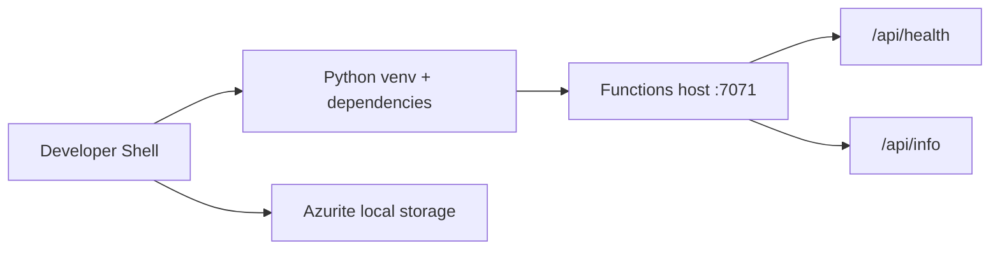

---
hide:
  - toc
validation:
  az_cli:
    last_tested: 2026-04-09
    cli_version: "2.83.0"
    core_tools_version: "4.8.0"
    result: pass
  bicep:
    last_tested: null
    result: not_tested
---

# 01 - Run Locally (Flex Consumption)

Run the Function App locally with Azure Functions Core Tools so you can validate routes, logging, and trigger behavior before your first FC1 deployment.

## Prerequisites

| Tool | Minimum version | Purpose |
|---|---|---|
| Python | 3.11 | Local runtime and dependencies |
| Azure Functions Core Tools | 4.x | Local Functions host |
| Azure CLI | 2.60+ | Azure authentication and resource commands |
| Azurite | Latest | Local Azure Storage emulator |

## What You'll Build

You will run the Python reference Function App locally with Azurite, validate HTTP routes, and verify Flex Consumption-specific behavior before cloud deployment.

!!! info "Infrastructure Context"
    **Plan**: Flex Consumption (FC1) — **Network**: Full private network (VNet + Private Endpoints)

    This tutorial runs locally — no Azure resources are created.

    ```mermaid
    flowchart LR
        DEV[Local Machine] --> HOST[Functions Host :7071]
        HOST --> AZURITE[Azurite Local Storage]
    ```



## Steps

### Step 1: Set Standard Variables

Use one variable set throughout this tutorial track.

```bash
export BASE_NAME="flexdemo"
export RG="rg-flexdemo"
export APP_NAME="flexdemo-func"
export PLAN_NAME="flexdemo-plan"
export STORAGE_NAME="flexdemostorage"
export APPINSIGHTS_NAME="flexdemo-insights"
export LOCATION="koreacentral"
```

Expected output:


```text
```

### Step 2: Create and Activate a Virtual Environment


```bash
python3 --version
virtualenv .venv
source .venv/bin/activate
pip install --upgrade pip
pip install --requirement apps/python/requirements.txt
```

Expected output:


```text
Python 3.11.x
Successfully installed ...
```

### Step 3: Create Local Settings


```bash
cp apps/python/local.settings.json.example apps/python/local.settings.json
```

Update `apps/python/local.settings.json` to include local development values:


```json
{
  "IsEncrypted": false,
  "Values": {
    "FUNCTIONS_WORKER_RUNTIME": "python",
    "AzureWebJobsStorage": "UseDevelopmentStorage=true",
    "AZURE_FUNCTIONS_ENVIRONMENT": "Development"
  }
}
```

Expected output:


```text
```

### Step 4: Start Azurite

Flex Consumption in Azure uses identity-based host storage, but local development still uses Azurite with `UseDevelopmentStorage=true`.


```bash
azurite --silent --location /tmp/azurite --debug /tmp/azurite/debug.log
```

Expected output:


```text
Azurite Blob service is starting at http://127.0.0.1:10000
Azurite Queue service is starting at http://127.0.0.1:10001
Azurite Table service is starting at http://127.0.0.1:10002
```

### Step 5: Start the Functions Host

In another terminal:


```bash
cd apps/python
func host start
```

Expected output:


```text
Azure Functions Core Tools
Core Tools Version:       4.x
Function Runtime Version: 4.x

Functions:

        health: [GET] http://localhost:7071/api/health
        info: [GET] http://localhost:7071/api/info
```

### Step 6: Verify Endpoints


```bash
curl --request GET "http://localhost:7071/api/health"
curl --request GET "http://localhost:7071/api/info"
```

Expected output:


```json
{"status":"healthy","timestamp":"2026-01-01T00:00:00Z","version":"1.0.0"}
```


```json
{"name":"azure-functions-field-guide","version":"1.0.0","python":"3.11.x","environment":"Development","telemetryMode":"basic","functionApp":"local","invocationId":"local"}
```

### Step 7: Validate Flex-Specific Constraints Early

- Flex Consumption is Linux-only.
- Blob trigger production path is Event Grid based; polling blob trigger is not supported for Flex.
- Scale behavior supports scale-to-zero and up to 1000 instances.
- Instance memory options are 512 MB, 2048 MB, or 4096 MB.
- Function timeout defaults to 30 minutes; max is unlimited.
- Deployment slots are not supported.

## Verification

- `func host start` lists at least `health` and `info` routes on `http://localhost:7071`.
- `curl --request GET "http://localhost:7071/api/health"` returns HTTP 200 with a JSON health payload.
- `curl --request GET "http://localhost:7071/api/info"` returns HTTP 200 with runtime/config metadata from `apps/python/blueprints/info.py`.

## Next Steps

> **Next:** [02 - First Deploy](02-first-deploy.md)

## See Also

- [Tutorial Overview & Plan Chooser](../index.md)
- [Python Language Guide](../../index.md)
- [Platform: Hosting Plans](../../../../platform/hosting.md)
- [Operations: Deployment](../../../../operations/deployment.md)
- [Recipes Index](../../recipes/index.md)

## Sources

- [Run Azure Functions locally](https://learn.microsoft.com/azure/azure-functions/functions-run-local)
- [Flex Consumption plan](https://learn.microsoft.com/azure/azure-functions/flex-consumption-plan)
- [Event Grid blob trigger for Azure Functions](https://learn.microsoft.com/azure/azure-functions/functions-event-grid-blob-trigger)
