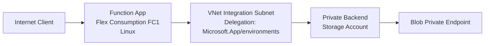

---
hide:
  - toc
validation:
  az_cli:
    last_tested: 2026-04-09
    cli_version: "2.83.0"
    core_tools_version: "4.8.0"
    result: pass
  bicep:
    last_tested: null
    result: not_tested
---

# 02 - First Deploy (Flex Consumption)

Deploy your first Azure Functions app to the Flex Consumption plan (FC1), validate runtime health, and confirm network + deployment behavior specific to Flex.

## Prerequisites

| Tool | Minimum version | Purpose |
|---|---|---|
| Azure CLI | 2.60+ | Provision resources |
| Azure Functions Core Tools | 4.x | Publish function code |
| jq | Latest | Parse deployment output |
| Bash | Any modern version | Run deployment script |

## What You'll Build

You will provision a Flex Consumption Function App with Azure CLI, publish Python code, and validate FC1 runtime behavior in Azure.

!!! info "Infrastructure Context"
    **Plan**: Flex Consumption (FC1) | **Network**: Full private network | **VNet**: ✅

    FC1 deploys with VNet integration, private endpoints for all storage services, private DNS zones, and user-assigned managed identity. Storage uses identity-based authentication (no shared keys).

    ```mermaid
    flowchart TD
        INET[Internet] -->|HTTPS| FA[Function App\nFlex Consumption FC1\nLinux Python 3.11]

        subgraph VNET["VNet 10.0.0.0/16"]
            subgraph INT_SUB["Integration Subnet 10.0.1.0/24\nDelegation: Microsoft.App/environments"]
                FA
            end
            subgraph PE_SUB["Private Endpoint Subnet 10.0.2.0/24"]
                PE_BLOB[PE: blob]
                PE_QUEUE[PE: queue]
                PE_TABLE[PE: table]
                PE_FILE[PE: file]
            end
        end

        PE_BLOB --> ST["Storage Account\nallowPublicAccess: false\nallowSharedKeyAccess: false"]
        PE_QUEUE --> ST
        PE_TABLE --> ST
        PE_FILE --> ST

        subgraph DNS[Private DNS Zones]
            DNS_BLOB[privatelink.blob.core.windows.net]
            DNS_QUEUE[privatelink.queue.core.windows.net]
            DNS_TABLE[privatelink.table.core.windows.net]
            DNS_FILE[privatelink.file.core.windows.net]
        end

        PE_BLOB -.-> DNS_BLOB
        PE_QUEUE -.-> DNS_QUEUE
        PE_TABLE -.-> DNS_TABLE
        PE_FILE -.-> DNS_FILE

        FA -.->|User-Assigned MI| UAMI[Managed Identity]
        UAMI -->|RBAC| ST
        FA --> AI[Application Insights]

        subgraph DEPLOY[Deployment]
            BLOB_CTR[Blob Container\ndeployment-packages]
        end
        ST --- BLOB_CTR

        style FA fill:#107c10,color:#fff
        style VNET fill:#E8F5E9,stroke:#4CAF50
        style ST fill:#FFF3E0
        style DNS fill:#E3F2FD
    ```



## Steps

### Step 1: Authenticate and Set Subscription

```bash
az login
az account set --subscription "<subscription-id>"
az account show --output json
```

Expected output:

```json
{
  "id": "<subscription-id>",
  "tenantId": "<tenant-id>",
  "user": {
    "name": "<redacted>",
    "type": "user"
  }
}
```

### Step 2: Set Deployment Variables

```bash
export BASE_NAME="flexdemo"
export RG="rg-flexdemo"
export APP_NAME="flexdemo-func"
export PLAN_NAME="flexdemo-plan"
export STORAGE_NAME="flexdemostorage"
export MI_NAME="flexdemo-identity"
export VNET_NAME="flexdemo-vnet"
export APPINSIGHTS_NAME="flexdemo-insights"
export LOCATION="koreacentral"
```

!!! note "No output"
    `export` commands set shell variables silently. No output is expected.

### Step 3: Create Storage Account (locked down)

```bash
az group create \
  --name "$RG" \
  --location "$LOCATION" \
  --output json

az storage account create \
  --name "$STORAGE_NAME" \
  --resource-group "$RG" \
  --location "$LOCATION" \
  --sku Standard_LRS \
  --kind StorageV2 \
  --allow-blob-public-access false \
  --allow-shared-key-access false \
  --min-tls-version TLS1_2
```

Expected output:

```json
{
  "id": "/subscriptions/<subscription-id>/resourceGroups/rg-flexdemo",
  "location": "koreacentral",
  "name": "rg-flexdemo",
  "properties": {
    "provisioningState": "Succeeded"
  }
}
```

```json
{
  "id": "/subscriptions/<subscription-id>/resourceGroups/rg-flexdemo/providers/Microsoft.Storage/storageAccounts/flexdemostorage",
  "kind": "StorageV2",
  "location": "koreacentral",
  "name": "flexdemostorage",
  "properties": {
    "allowBlobPublicAccess": false,
    "allowSharedKeyAccess": false,
    "minimumTlsVersion": "TLS1_2",
    "provisioningState": "Succeeded"
  },
  "sku": {
    "name": "Standard_LRS",
    "tier": "Standard"
  }
}
```

### Step 4: Create User-Assigned Managed Identity

```bash
export MI_NAME="flexdemo-identity"

az identity create \
  --name "$MI_NAME" \
  --resource-group "$RG" \
  --location "$LOCATION"

export MI_PRINCIPAL_ID=$(az identity show \
  --name "$MI_NAME" \
  --resource-group "$RG" \
  --query "principalId" \
  --output tsv)

export MI_CLIENT_ID=$(az identity show \
  --name "$MI_NAME" \
  --resource-group "$RG" \
  --query "clientId" \
  --output tsv)

export MI_ID=$(az identity show \
  --name "$MI_NAME" \
  --resource-group "$RG" \
  --query "id" \
  --output tsv)
```

Expected output:

```json
{
  "clientId": "<object-id>",
  "id": "/subscriptions/<subscription-id>/resourceGroups/rg-flexdemo/providers/Microsoft.ManagedIdentity/userAssignedIdentities/flexdemo-identity",
  "location": "koreacentral",
  "name": "flexdemo-identity",
  "principalId": "<object-id>",
  "resourceGroup": "rg-flexdemo",
  "tenantId": "<tenant-id>"
}
```

```text
The three export commands complete silently when values are captured.
```

!!! tip "AAD propagation delay"
    After creating a managed identity, wait 20-30 seconds before assigning RBAC roles. The identity's principal needs time to propagate to Azure Active Directory. If you see `Cannot find user or service principal in graph database`, wait and retry.


### Step 5: Assign RBAC Roles to Managed Identity

```bash
export STORAGE_ID=$(az storage account show \
  --name "$STORAGE_NAME" \
  --resource-group "$RG" \
  --query "id" \
  --output tsv)

az role assignment create \
  --assignee "$MI_PRINCIPAL_ID" \
  --role "Storage Blob Data Owner" \
  --scope "$STORAGE_ID"

az role assignment create \
  --assignee "$MI_PRINCIPAL_ID" \
  --role "Storage Account Contributor" \
  --scope "$STORAGE_ID"

az role assignment create \
  --assignee "$MI_PRINCIPAL_ID" \
  --role "Storage Queue Data Contributor" \
  --scope "$STORAGE_ID"
```

Expected output:

```json
{
  "id": "/subscriptions/<subscription-id>/resourceGroups/rg-flexdemo/providers/Microsoft.Authorization/roleAssignments/<object-id>",
  "principalId": "<object-id>",
  "principalType": "ServicePrincipal",
  "roleDefinitionName": "Storage Blob Data Owner",
  "scope": "/subscriptions/<subscription-id>/resourceGroups/rg-flexdemo/providers/Microsoft.Storage/storageAccounts/flexdemostorage"
}
```

```json
{
  "id": "/subscriptions/<subscription-id>/resourceGroups/rg-flexdemo/providers/Microsoft.Authorization/roleAssignments/<object-id>",
  "principalId": "<object-id>",
  "principalType": "ServicePrincipal",
  "roleDefinitionName": "Storage Account Contributor",
  "scope": "/subscriptions/<subscription-id>/resourceGroups/rg-flexdemo/providers/Microsoft.Storage/storageAccounts/flexdemostorage"
}
```

```json
{
  "id": "/subscriptions/<subscription-id>/resourceGroups/rg-flexdemo/providers/Microsoft.Authorization/roleAssignments/<object-id>",
  "principalId": "<object-id>",
  "principalType": "ServicePrincipal",
  "roleDefinitionName": "Storage Queue Data Contributor",
  "scope": "/subscriptions/<subscription-id>/resourceGroups/rg-flexdemo/providers/Microsoft.Storage/storageAccounts/flexdemostorage"
}
```

!!! tip "Why these three storage roles are required"
    - `Storage Blob Data Owner` allows host and deployment package blob access.
    - `Storage Account Contributor` allows control-plane operations for storage settings used by the runtime.
    - `Storage Queue Data Contributor` allows queue trigger and host queue operations.

### Step 6: Create VNet and Subnets

```bash
export VNET_NAME="flexdemo-vnet"

az network vnet create \
  --name "$VNET_NAME" \
  --resource-group "$RG" \
  --location "$LOCATION" \
  --address-prefixes "10.0.0.0/16" \
  --subnet-name "subnet-integration" \
  --subnet-prefixes "10.0.1.0/24"

az network vnet subnet create \
  --name "subnet-private-endpoints" \
  --resource-group "$RG" \
  --vnet-name "$VNET_NAME" \
  --address-prefixes "10.0.2.0/24"

az network vnet subnet update \
  --name "subnet-integration" \
  --resource-group "$RG" \
  --vnet-name "$VNET_NAME" \
  --delegations "Microsoft.App/environments"
```

Expected output:

```json
{
  "newVNet": {
    "id": "/subscriptions/<subscription-id>/resourceGroups/rg-flexdemo/providers/Microsoft.Network/virtualNetworks/flexdemo-vnet",
    "location": "koreacentral",
    "name": "flexdemo-vnet",
    "provisioningState": "Succeeded"
  }
}
```

```json
{
  "addressPrefix": "10.0.2.0/24",
  "id": "/subscriptions/<subscription-id>/resourceGroups/rg-flexdemo/providers/Microsoft.Network/virtualNetworks/flexdemo-vnet/subnets/subnet-private-endpoints",
  "name": "subnet-private-endpoints",
  "provisioningState": "Succeeded"
}
```

```json
{
  "delegations": [
    {
      "serviceName": "Microsoft.App/environments"
    }
  ],
  "name": "subnet-integration",
  "provisioningState": "Succeeded"
}
```

### Step 7: Create Storage Private Endpoints (x4)

```bash
for SVC in blob queue table file; do
  az network private-endpoint create \
    --name "pe-st-$SVC" \
    --resource-group "$RG" \
    --location "$LOCATION" \
    --vnet-name "$VNET_NAME" \
    --subnet "subnet-private-endpoints" \
    --private-connection-resource-id "$STORAGE_ID" \
    --group-ids "$SVC" \
    --connection-name "conn-st-$SVC"
done
```

Expected output:

```text
{
  "name": "pe-st-blob",
  "provisioningState": "Succeeded"
}
{
  "name": "pe-st-queue",
  "provisioningState": "Succeeded"
}
{
  "name": "pe-st-table",
  "provisioningState": "Succeeded"
}
{
  "name": "pe-st-file",
  "provisioningState": "Succeeded"
}
```

### Step 8: Create Private DNS Zones and Link to VNet (x4)

```bash
for SVC in blob queue table file; do
  az network private-dns zone create \
    --resource-group "$RG" \
    --name "privatelink.$SVC.core.windows.net"

  az network private-dns link vnet create \
    --resource-group "$RG" \
    --zone-name "privatelink.$SVC.core.windows.net" \
    --name "link-$SVC" \
    --virtual-network "$VNET_NAME" \
    --registration-enabled false

  az network private-endpoint dns-zone-group create \
    --resource-group "$RG" \
    --endpoint-name "pe-st-$SVC" \
    --name "$SVC-dns-zone-group" \
    --private-dns-zone "privatelink.$SVC.core.windows.net" \
    --zone-name "$SVC"
done
```

Expected output:

```text
{
  "name": "privatelink.blob.core.windows.net",
  "numberOfRecordSets": 1
}
{
  "name": "link-blob",
  "registrationEnabled": false,
  "virtualNetwork": {
    "id": "/subscriptions/<subscription-id>/resourceGroups/rg-flexdemo/providers/Microsoft.Network/virtualNetworks/flexdemo-vnet"
  }
}
{
  "name": "blob-dns-zone-group",
  "provisioningState": "Succeeded"
}
... repeated for queue, table, and file
```

### Step 9: Create Deployment Blob Container

```bash
az storage container create \
  --name "deployment-packages" \
  --account-name "$STORAGE_NAME" \
  --auth-mode login
```

Expected output:

```json
{
  "created": true
}
```

### Step 10: Lock Down Storage Network Access

Now that private endpoints and DNS zones are configured and the deployment container exists, disable public network access on the storage account so that all traffic is forced through private endpoints.

```bash
az storage account update \
  --name "$STORAGE_NAME" \
  --resource-group "$RG" \
  --default-action Deny
```

Expected output:

```json
{
  "networkRuleSet": {
    "bypass": "AzureServices",
    "defaultAction": "Deny",
    "ipRules": [],
    "virtualNetworkRules": []
  }
}
```

!!! warning "Order matters"
    This step must come **after** creating the deployment blob container (Step 9) and private endpoints/DNS zones (Steps 7-8). If you deny public access before these are in place, subsequent data-plane operations from your local machine will fail.

### Step 11: Create Application Insights

```bash
az monitor app-insights component create \
  --app "$APPINSIGHTS_NAME" \
  --resource-group "$RG" \
  --location "$LOCATION" \
  --application-type web

export APPINSIGHTS_CONN=$(az monitor app-insights component show \
  --app "$APPINSIGHTS_NAME" \
  --resource-group "$RG" \
  --query "connectionString" \
  --output tsv)
```

Expected output:

```json
{
  "appId": "<object-id>",
  "applicationType": "web",
  "connectionString": "InstrumentationKey=<redacted>;IngestionEndpoint=https://koreacentral-0.in.applicationinsights.azure.com/;LiveEndpoint=https://koreacentral.livediagnostics.monitor.azure.com/",
  "id": "/subscriptions/<subscription-id>/resourceGroups/rg-flexdemo/providers/microsoft.insights/components/flexdemo-insights",
  "name": "flexdemo-insights"
}
```

```text
The export command completes silently when the connection string is captured.
```

### Step 12: Create Flex Consumption Function App

```bash
az functionapp create \
  --name "$APP_NAME" \
  --resource-group "$RG" \
  --storage-account "$STORAGE_NAME" \
  --flexconsumption-location "$LOCATION" \
  --runtime python \
  --runtime-version 3.11 \
  --functions-version 4 \
  --assign-identity "$MI_ID"
```

Expected output:

```json
{
  "defaultHostName": "flexdemo-func.azurewebsites.net",
  "httpsOnly": false,
  "id": "/subscriptions/<subscription-id>/resourceGroups/rg-flexdemo/providers/Microsoft.Web/sites/flexdemo-func",
  "identity": {
    "type": "UserAssigned"
  },
  "kind": "functionapp,linux",
  "name": "flexdemo-func",
  "properties": {
    "functionAppConfig": {
      "runtime": {
        "name": "python",
        "version": "3.11"
      },
      "scaleAndConcurrency": {
        "instanceMemoryMB": 2048,
        "maximumInstanceCount": 100
      }
    },
    "sku": "FlexConsumption",
    "state": "Running"
  }
}
```

!!! note "Auto-created Application Insights"
    `az functionapp create` automatically creates its own Application Insights instance named `flexdemo-func`. This is separate from the `flexdemo-insights` instance created in Step 11. The auto-created instance can be deleted from the portal if you prefer to use only the manually created one.


### Step 13: Configure Deployment Storage to Use Managed Identity

By default, Flex Consumption uses a connection string for deployment storage authentication. Since this tutorial disables shared key access on the storage account (`allowSharedKeyAccess: false`), you must switch to identity-based authentication for deployment storage.

```bash
az functionapp deployment config set \
  --name "$APP_NAME" \
  --resource-group "$RG" \
  --deployment-storage-auth-type UserAssignedIdentity \
  --deployment-storage-auth-value "$MI_ID"
```

Expected output:

```json
{
  "storage": {
    "authentication": {
      "type": "userassignedidentity",
      "userAssignedIdentityResourceId": "/subscriptions/<subscription-id>/resourcegroups/rg-flexdemo/providers/Microsoft.ManagedIdentity/userAssignedIdentities/flexdemo-identity"
    },
    "type": "blobcontainer",
    "value": "https://flexdemostorage.blob.core.windows.net/app-package-flexdemofunc-<id>"
  }
}
```

!!! warning "Without this step, `func azure functionapp publish` will fail"
    If deployment storage uses connection string authentication while `allowSharedKeyAccess` is `false`, the publish command will return:

    `InaccessibleStorageException: Failed to access storage account for deployment: Key based authentication is not permitted on this storage account.`

!!! warning "Remove auto-created connection string settings"
    `az functionapp create` automatically adds `AzureWebJobsStorage` and `DEPLOYMENT_STORAGE_CONNECTION_STRING` connection string settings. Since the storage account has `allowSharedKeyAccess: false`, these settings will cause publish failures (`ServiceUnavailable`). Remove them before proceeding:

    ```bash
    az functionapp config appsettings delete \
      --name "$APP_NAME" \
      --resource-group "$RG" \
      --setting-names "AzureWebJobsStorage" "DEPLOYMENT_STORAGE_CONNECTION_STRING"
    ```

### Step 14: Configure App Settings (identity-based storage)

```bash
az functionapp config appsettings set \
  --name "$APP_NAME" \
  --resource-group "$RG" \
  --settings \
    "AzureWebJobsStorage__accountName=$STORAGE_NAME" \
    "AzureWebJobsStorage__credential=managedidentity" \
    "AzureWebJobsStorage__clientId=$MI_CLIENT_ID" \
    "APPLICATIONINSIGHTS_CONNECTION_STRING=$APPINSIGHTS_CONN"
```

Expected output:

```json
[
  {
    "name": "AzureWebJobsStorage__accountName",
    "slotSetting": false,
    "value": null
  },
  {
    "name": "AzureWebJobsStorage__credential",
    "slotSetting": false,
    "value": null
  },
  {
    "name": "AzureWebJobsStorage__clientId",
    "slotSetting": false,
    "value": null
  },
  {
    "name": "APPLICATIONINSIGHTS_CONNECTION_STRING",
    "slotSetting": false,
    "value": null
  }
]
```

!!! tip "Placeholder settings for reference app triggers"
    The reference app in `apps/python/` includes EventHub, Queue, and Timer triggers. These require additional app settings to prevent host startup errors. Add them after the core settings:

    ```bash
    az functionapp config appsettings set \
      --name "$APP_NAME" \
      --resource-group "$RG" \
      --settings \
        "EventHubConnection__fullyQualifiedNamespace=placeholder.servicebus.windows.net" \
        "QueueStorage__queueServiceUri=https://${STORAGE_NAME}.queue.core.windows.net" \
        "QueueStorage__credential=managedidentity" \
        "QueueStorage__clientId=$MI_CLIENT_ID" \
        "TIMER_LAB_SCHEDULE=0 0 0 1 1 *"
    ```

    Without these, the function host will enter `Error` state and HTTP endpoints will return `503 Service Unavailable`.

### Step 15: Enable VNet Integration

```bash
az functionapp vnet-integration add \
  --name "$APP_NAME" \
  --resource-group "$RG" \
  --vnet "$VNET_NAME" \
  --subnet "subnet-integration"
```

Expected output:

```json
{
  "id": "/subscriptions/<subscription-id>/resourceGroups/rg-flexdemo/providers/Microsoft.Network/virtualNetworks/flexdemo-vnet",
  "location": "Korea Central",
  "name": "flexdemo-vnet",
  "resourceGroup": "rg-flexdemo",
  "subnetResourceId": "/subscriptions/<subscription-id>/resourceGroups/rg-flexdemo/providers/Microsoft.Network/virtualNetworks/flexdemo-vnet/subnets/subnet-integration"
}
```

### Step 16: Publish Code with Core Tools

Flex does not expose Kudu/SCM workflows; publish with Core Tools (or One Deploy in CI/CD).

```bash
cd apps/python
func azure functionapp publish "$APP_NAME" --python
```

Expected output:

```text
Getting site publishing info...
Creating archive for current directory...
Uploading 11.16 MB [########################################]
Deployment completed successfully.
Functions in flexdemo-func:
    health - [httpTrigger]
    info - [httpTrigger]
    log_levels - [httpTrigger]
    external_dependency - [httpTrigger]
    test_error - [httpTrigger]
    ... (additional functions)
```

### Step 17: Verify FC1 Runtime and Plan Details

```bash
az functionapp show --name "$APP_NAME" --resource-group "$RG" \
  --query "{name:name,state:properties.state,sku:properties.sku,runtime:properties.functionAppConfig.runtime}" \
  --output json
```

Expected output:

```json
{
  "name": "flexdemo-func",
  "runtime": {
    "name": "python",
    "version": "3.11"
  },
  "sku": "FlexConsumption",
  "state": "Running"
}
```

### Step 18: Test Production Endpoint

```bash
curl --request GET "https://$APP_NAME.azurewebsites.net/api/health"
```

Expected output:

```json
{"status":"healthy","timestamp":"2026-04-04T05:38:46Z","version":"1.0.0"}
```

### Step 19: Validate Flex-Specific Behaviors

- Scale-to-zero is enabled by default on FC1.
- Maximum scale can reach 100 instances (default). Configurable up to 1000.
- Instance memory is selectable (512 MB, 2048 MB, 4096 MB).
- Default timeout is 30 minutes; max can be unlimited.
- Deployment slots are not supported on Flex.

## Verification

Endpoint test results from the Korea Central deployment (all returned HTTP 200):

- `GET /api/health` → `{"status": "healthy", "timestamp": "2026-04-04T05:38:46Z", "version": "1.0.0"}`
- `GET /api/info` → `{"name": "azure-functions-field-guide", "version": "1.0.0", "python": "3.11.14", "environment": "development", "telemetryMode": "basic"}`
- `GET /api/requests/log-levels` → `{"message": "Logged at all levels", "levels": ["DEBUG", "INFO", "WARNING", "ERROR", "CRITICAL"]}`
- `GET /api/dependencies/external` → `{"status": "success", "statusCode": 200, "responseTime": "783ms", "url": "https://httpbin.org/get"}`
- `GET /api/exceptions/test-error` → `{"error": "Handled exception", "type": "ValueError", "message": "Simulated error for testing"}`

## Next Steps

> **Next:** [03 - Configuration](03-configuration.md)

## See Also

- [Tutorial Overview & Plan Chooser](../index.md)
- [Python Language Guide](../../index.md)
- [Platform: Hosting Plans](../../../../platform/hosting.md)
- [Operations: Deployment](../../../../operations/deployment.md)
- [Recipes Index](../../recipes/index.md)

## Sources

- [Flex Consumption plan hosting](https://learn.microsoft.com/azure/azure-functions/flex-consumption-plan)
- [Create and manage Flex Consumption apps](https://learn.microsoft.com/azure/azure-functions/flex-consumption-how-to)
- [Azure Functions deployment technologies](https://learn.microsoft.com/azure/azure-functions/functions-deployment-technologies)
