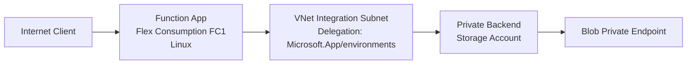

# 02 - First Deploy (Flex Consumption)

Deploy your first Azure Functions app to the Flex Consumption plan (FC1), validate runtime health, and confirm network + deployment behavior specific to Flex.

## Prerequisites

| Tool | Minimum version | Purpose |
|---|---|---|
| Azure CLI | 2.60+ | Provision resources |
| Azure Functions Core Tools | 4.x | Publish function code |
| jq | Latest | Parse deployment output |
| Bash | Any modern version | Run deployment script |

## What You'll Build

You will provision a Flex Consumption Function App with Bicep, publish Python code, and validate FC1 runtime behavior in Azure.



## Steps

### Step 1: Authenticate and Set Subscription

```bash
az login
az account set --subscription "<subscription-id>"
az account show --output json
```

Expected output:

```json
{
  "id": "<subscription-id>",
  "tenantId": "<tenant-id>",
  "user": {
    "name": "<redacted>",
    "type": "user"
  }
}
```

### Step 2: Set Deployment Variables

```bash
export BASE_NAME="flexdemo"
export RG="rg-flexdemo"
export APP_NAME="flexdemo-func"
export PLAN_NAME="flexdemo-plan"
export STORAGE_NAME="flexdemostorage"
export APPINSIGHTS_NAME="flexdemo-insights"
export LOCATION="koreacentral"
```

!!! note "No output"
    `export` commands set shell variables silently. No output is expected.

### Step 3: Provision Infrastructure with Bicep

This track uses the Flex template at `infra/flex-consumption/main.bicep`.
It configures identity-based host storage with a user-assigned managed identity (UAMI), so Flex uses blob container deployment and does **not** require `WEBSITE_CONTENTAZUREFILECONNECTIONSTRING`.

```bash
az group create --name "$RG" --location "$LOCATION" --output json
az deployment group create --resource-group "$RG" --template-file "infra/flex-consumption/main.bicep" --parameters baseName="$BASE_NAME" location="$LOCATION" --output json
```

Expected output:

```json
{
  "id": "/subscriptions/<subscription-id>/resourceGroups/rg-flexdemo/providers/Microsoft.Resources/deployments/main",
  "name": "main",
  "properties": {
    "provisioningState": "Succeeded",
    "outputs": {
      "functionAppName": {
        "type": "String",
        "value": "flexdemo-func"
      },
      "functionAppUrl": {
        "type": "String",
        "value": "https://flexdemo-func.azurewebsites.net"
      }
    }
  }
}
```

### Step 4: Publish Code with Core Tools

Flex does not expose Kudu/SCM workflows; publish with Core Tools (or One Deploy in CI/CD).

```bash
cd apps/python
func azure functionapp publish "$APP_NAME" --python
```

Expected output:

```text
Getting site publishing info...
Creating archive for current directory...
Uploading 12.3 MB [########################################]
Deployment completed successfully.
Functions in flexdemo-func:
    health - [httpTrigger]
    info - [httpTrigger]
```

### Step 5: Verify FC1 Runtime and Plan Details

```bash
az functionapp show --name "$APP_NAME" --resource-group "$RG" --output json
az appservice plan show --name "$PLAN_NAME" --resource-group "$RG" --output json
```

Expected output:

```json
{
  "id": "/subscriptions/<subscription-id>/resourceGroups/rg-flexdemo/providers/Microsoft.Web/serverfarms/flexdemo-plan",
  "kind": "functionapp",
  "location": "koreacentral",
  "name": "flexdemo-plan",
  "reserved": true,
  "sku": {
    "name": "FC1",
    "tier": "FlexConsumption"
  }
}
```

### Step 6: Test Production Endpoint

```bash
curl --request GET "https://$APP_NAME.azurewebsites.net/api/health"
```

Expected output:

```json
{"status":"healthy","timestamp":"2026-04-04T05:38:46Z","version":"1.0.0"}
```

### Step 7: Validate Flex-Specific Behaviors

- Scale-to-zero is enabled by default on FC1.
- Maximum scale can reach 1000 instances.
- Instance memory is selectable (512 MB, 2048 MB, 4096 MB).
- Default timeout is 30 minutes; max can be unlimited.
- Deployment slots are not supported on Flex.

## Verification

Endpoint test results from the Korea Central deployment (all returned HTTP 200):

- `GET /api/health` → `{"status": "healthy", "timestamp": "2026-04-04T05:38:46Z", "version": "1.0.0"}`
- `GET /api/info` → `{"name": "azure-functions-field-guide", "version": "1.0.0", "python": "3.11.14", "environment": "production", "telemetryMode": "basic"}`
- `GET /api/requests/log-levels` → `{"message": "Logged at all levels", "levels": ["DEBUG", "INFO", "WARNING", "ERROR", "CRITICAL"]}`
- `GET /api/dependencies/external` → `{"status": "success", "statusCode": 200, "responseTime": "783ms", "url": "https://httpbin.org/get"}`
- `GET /api/exceptions/test-error` → `{"error": "Handled exception", "type": "ValueError", "message": "Simulated error for testing"}`

## Next Steps

> **Next:** [03 - Configuration](03-configuration.md)

## See Also

- [Tutorial Overview & Plan Chooser](../index.md)
- [Python Language Guide](../../index.md)
- [Platform: Hosting Plans](../../../../platform/hosting.md)
- [Operations: Deployment](../../../../operations/deployment.md)
- [Recipes Index](../../recipes/index.md)

## Sources

- [Flex Consumption plan hosting](https://learn.microsoft.com/azure/azure-functions/flex-consumption-plan)
- [Create and manage Flex Consumption apps](https://learn.microsoft.com/azure/azure-functions/flex-consumption-how-to)
- [Azure Functions deployment technologies](https://learn.microsoft.com/azure/azure-functions/functions-deployment-technologies)
