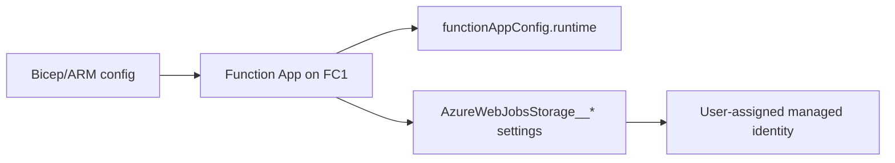

---
hide:
  - toc
validation:
  az_cli:
    last_tested: 2026-04-09
    cli_version: "2.83.0"
    core_tools_version: "4.8.0"
    result: pass
  bicep:
    last_tested: null
    result: not_tested
---

# 03 - Configuration (Flex Consumption)

Configure runtime, app settings, and host storage correctly for Flex Consumption so your app deploys cleanly and scales predictably.

## Prerequisites

| Tool | Minimum version | Purpose |
|---|---|---|
| Azure CLI | 2.60+ | Manage app configuration |
| jq | Latest | Read JSON output |
| Existing FC1 app | Deployed | Target for configuration |

## What You'll Build

You will configure a deployed Flex Consumption app to use identity-based host storage and validate that runtime settings come from `functionAppConfig`.

!!! info "Infrastructure Context"
    **Plan**: Flex Consumption (FC1) | **Network**: Full private network | **VNet**: ✅

    FC1 deploys with VNet integration, private endpoints for all storage services, private DNS zones, and user-assigned managed identity. Storage uses identity-based authentication (no shared keys).

    ```mermaid
    flowchart TD
        INET[Internet] -->|HTTPS| FA[Function App\nFlex Consumption FC1\nLinux Python 3.11]

        subgraph VNET["VNet 10.0.0.0/16"]
            subgraph INT_SUB["Integration Subnet 10.0.1.0/24\nDelegation: Microsoft.App/environments"]
                FA
            end
            subgraph PE_SUB["Private Endpoint Subnet 10.0.2.0/24"]
                PE_BLOB[PE: blob]
                PE_QUEUE[PE: queue]
                PE_TABLE[PE: table]
                PE_FILE[PE: file]
            end
        end

        PE_BLOB --> ST["Storage Account\nallowPublicAccess: false\nallowSharedKeyAccess: false"]
        PE_QUEUE --> ST
        PE_TABLE --> ST
        PE_FILE --> ST

        subgraph DNS[Private DNS Zones]
            DNS_BLOB[privatelink.blob.core.windows.net]
            DNS_QUEUE[privatelink.queue.core.windows.net]
            DNS_TABLE[privatelink.table.core.windows.net]
            DNS_FILE[privatelink.file.core.windows.net]
        end

        PE_BLOB -.-> DNS_BLOB
        PE_QUEUE -.-> DNS_QUEUE
        PE_TABLE -.-> DNS_TABLE
        PE_FILE -.-> DNS_FILE

        FA -.->|User-Assigned MI| UAMI[Managed Identity]
        UAMI -->|RBAC| ST
        FA --> AI[Application Insights]

        subgraph DEPLOY[Deployment]
            BLOB_CTR[Blob Container\ndeployment-packages]
        end
        ST --- BLOB_CTR

        style FA fill:#107c10,color:#fff
        style VNET fill:#E8F5E9,stroke:#4CAF50
        style ST fill:#FFF3E0
        style DNS fill:#E3F2FD
    ```



## Steps

### Step 1: Set Variables

```bash
export BASE_NAME="flexdemo"
export RG="rg-flexdemo"
export APP_NAME="flexdemo-func"
export PLAN_NAME="flexdemo-plan"
export STORAGE_NAME="flexdemostorage"
export APPINSIGHTS_NAME="flexdemo-insights"
export LOCATION="koreacentral"
```

Expected output:


```text
```

### Step 2: Configure Identity-Based Host Storage

Flex Consumption host storage must be identity-based. Use `AzureWebJobsStorage__accountName` and related identity keys, not connection strings.


```bash
az functionapp config appsettings set \
  --name "$APP_NAME" \
  --resource-group "$RG" \
  --settings \
    "AzureWebJobsStorage__accountName=$STORAGE_NAME" \
    "AzureWebJobsStorage__credential=managedidentity" \
    "AzureWebJobsStorage__clientId=<managed-identity-client-id>" \
  --output json
```

!!! tip "Why __clientId is required"
    When using a **user-assigned managed identity** (UAMI), you must provide `AzureWebJobsStorage__clientId` so the Functions host knows which identity to authenticate with. Without it, the host cannot resolve which UAMI to use and storage operations will fail. The reference template sets this value in `infra/flex-consumption/main.bicep` under `functionAppSettings.properties.AzureWebJobsStorage__clientId`.

Expected output:


```json
[
  {
    "name": "AzureWebJobsStorage__accountName",
    "slotSetting": false,
    "value": null
  },
  {
    "name": "AzureWebJobsStorage__credential",
    "slotSetting": false,
    "value": null
  },
  {
    "name": "AzureWebJobsStorage__clientId",
    "slotSetting": false,
    "value": null
  }
]
```

### Step 3: Set Additional App Settings

On Flex Consumption, the runtime name and version are defined in `functionAppConfig` (not in `FUNCTIONS_WORKER_RUNTIME`). Set only the remaining app-level settings here.


```bash
az functionapp config appsettings set \
  --name "$APP_NAME" \
  --resource-group "$RG" \
  --settings \
    "AZURE_FUNCTIONS_ENVIRONMENT=Production" \
  --output json
```

!!! warning "Do not set FUNCTIONS_WORKER_RUNTIME on Flex"
    `FUNCTIONS_WORKER_RUNTIME` is **not supported** on Flex Consumption. The runtime is configured via `functionAppConfig.runtime` (see Step 4). Setting it as an app setting may cause unexpected behavior.

Expected output:


```json
[
  {
    "name": "AZURE_FUNCTIONS_ENVIRONMENT",
    "slotSetting": false,
    "value": null
  }
]
```

### Step 4: Validate Runtime Configuration Source

On Flex, runtime/version and scale settings are defined in `functionAppConfig` (resource properties), not classic `siteConfig.appSettings` for runtime identity.


```bash
az functionapp show --name "$APP_NAME" --resource-group "$RG" --query "properties.functionAppConfig" --output json
```

Expected output:


```json
{
  "deployment": {
    "storage": {
      "type": "blobContainer"
    }
  },
  "runtime": {
    "name": "python",
    "version": "3.11"
  },
  "scaleAndConcurrency": {
    "instanceMemoryMB": 2048,
    "maximumInstanceCount": 100
  }
}
```

### Step 5: Confirm Flex Plan Characteristics

!!! warning "Auto-generated plan name"
    When using `--flexconsumption-location` to create the Function App (Step 12 in Tutorial 02), Azure auto-generates the App Service Plan name (e.g., `ASP-rgflexdemo-376c`) instead of using `$PLAN_NAME`. Query the actual plan name first:

    ```bash
    PLAN_NAME_ACTUAL=$(az functionapp show --name "$APP_NAME" --resource-group "$RG" \
      --query "properties.serverFarmId" --output tsv | awk -F/ '{print $NF}')
    echo "Actual plan name: $PLAN_NAME_ACTUAL"
    ```

```bash
az appservice plan show --name "$PLAN_NAME_ACTUAL" --resource-group "$RG" --query "{sku:sku,reserved:reserved,kind:kind}" --output json
```

Expected output:


```json
{
  "kind": "functionapp",
  "reserved": null,
  "sku": {
    "name": "FC1",
    "tier": "FlexConsumption"
  }
}
```

### Step 6: Configuration Checklist for Flex

- Linux only (`reserved: true`).
- Host storage uses identity (`AzureWebJobsStorage__accountName`, `__credential`, `__clientId` for UAMI).
- Deployment package source is blob container (`functionAppConfig.deployment.storage.type = blobContainer`).
- Blob triggers in production must use Event Grid integration.
- No deployment slots.

## Verification

- `az functionapp show --query "properties.functionAppConfig.runtime"` returns Python runtime metadata.
- `az functionapp config appsettings list` includes `AzureWebJobsStorage__accountName`, `AzureWebJobsStorage__credential`, and `AzureWebJobsStorage__clientId`.
- `az appservice plan show` reports `sku.name` as `FC1` and `sku.tier` as `FlexConsumption`.

## Next Steps

> **Next:** [04 - Logging and Monitoring](04-logging-monitoring.md)

## See Also

- [Tutorial Overview & Plan Chooser](../index.md)
- [Python Language Guide](../../index.md)
- [Platform: Hosting Plans](../../../../platform/hosting.md)
- [Operations: Deployment](../../../../operations/deployment.md)
- [Recipes Index](../../recipes/index.md)

## Sources

- [App settings reference for Azure Functions](https://learn.microsoft.com/azure/azure-functions/functions-app-settings)
- [Flex Consumption how-to](https://learn.microsoft.com/azure/azure-functions/flex-consumption-how-to)
- [Identity-based connections for Azure Functions](https://learn.microsoft.com/azure/azure-functions/functions-reference#connecting-to-host-storage-with-an-identity)
