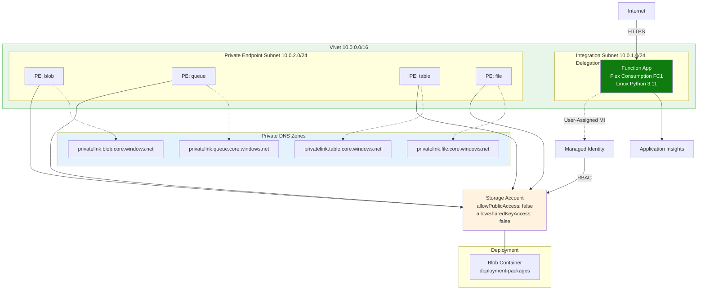
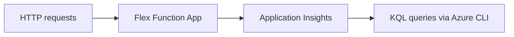

---
validation:
  az_cli:
    last_tested: 2026-04-09
    cli_version: "2.83.0"
    core_tools_version: "4.8.0"
    result: pass
  bicep:
    last_tested: null
    result: not_tested
content_sources:
  - type: mslearn-adapted
    url: https://learn.microsoft.com/azure/azure-functions/monitor-functions
  - type: mslearn-adapted
    url: https://learn.microsoft.com/azure/azure-monitor/logs/log-query-overview
  - type: mslearn-adapted
    url: https://learn.microsoft.com/azure/azure-monitor/app/app-insights-overview
---

# 04 - Logging and Monitoring (Flex Consumption)

Set up observability for your Flex Consumption app so you can verify deployments, inspect failures, and monitor scale behavior.

## Prerequisites

| Tool | Minimum version | Purpose |
|---|---|---|
| Azure CLI | 2.60+ | Query Function App + App Insights |
| Application Insights resource | Existing | Telemetry backend |
| Deployed FC1 app | Existing | Live target to inspect |

## What You'll Build

You will generate real requests and exception telemetry from a Flex Consumption app and validate the data path in Application Insights.

!!! info "Infrastructure Context"
    **Plan**: Flex Consumption (FC1) | **Network**: Full private network | **VNet**: ✅

    FC1 deploys with VNet integration, private endpoints for all storage services, private DNS zones, and user-assigned managed identity. Storage uses identity-based authentication (no shared keys).

    <!-- diagram-id: what-you-ll-build -->


<!-- diagram-id: what-you-ll-build-2 -->


## Steps

### Step 1: Set Variables

```bash
export BASE_NAME="flexdemo"
export RG="rg-flexdemo"
export APP_NAME="flexdemo-func"
export PLAN_NAME="flexdemo-plan"
export STORAGE_NAME="flexdemostorage"
export APPINSIGHTS_NAME="flexdemo-insights"
export LOCATION="koreacentral"
```

Expected output:


```text
```

### Step 2: Confirm Application Insights Wiring


```bash
az monitor app-insights component show --app "$APPINSIGHTS_NAME" --resource-group "$RG" --output json
az functionapp config appsettings list --name "$APP_NAME" --resource-group "$RG" --query "[?name=='APPLICATIONINSIGHTS_CONNECTION_STRING']" --output json
```

Expected output:


```json
{
  "appId": "xxxxxxxxxxxxxxxxxxxxxxxxxxxxxxxx",
  "id": "/subscriptions/<subscription-id>/resourceGroups/rg-flexdemo/providers/microsoft.insights/components/flexdemo-insights",
  "name": "flexdemo-insights",
  "type": "microsoft.insights/components"
}
```


```json
[
  {
    "name": "APPLICATIONINSIGHTS_CONNECTION_STRING",
    "slotSetting": false,
    "value": null
  }
]
```

### Step 3: Generate Traffic


```bash
curl --request GET "https://$APP_NAME.azurewebsites.net/api/health"
curl --request GET "https://$APP_NAME.azurewebsites.net/api/info"
curl --request GET "https://$APP_NAME.azurewebsites.net/api/exceptions/test-error"
```

Expected output:


```json
{"status":"healthy","timestamp":"2026-01-01T00:00:00Z","version":"1.0.0"}
```


```json
{"error":"Handled exception","type":"ValueError","message":"Simulated error for testing"}
```

### Step 4: Query Request and Exception Telemetry


```bash
az monitor app-insights query --app "$APPINSIGHTS_NAME" --analytics-query "requests | where timestamp > ago(30m) | project timestamp, name, resultCode, duration | order by timestamp desc | take 20" --output json
az monitor app-insights query --app "$APPINSIGHTS_NAME" --analytics-query "exceptions | where timestamp > ago(30m) | project timestamp, type, outerMessage | order by timestamp desc | take 20" --output json
```

!!! tip "App Insights query by name vs appId"
    If `--app "$APPINSIGHTS_NAME"` fails with `PathNotFoundError`, use the appId instead:

    ```bash
    APPINSIGHTS_ID=$(az monitor app-insights component show \
      --app "$APPINSIGHTS_NAME" --resource-group "$RG" \
      --query "appId" --output tsv)
    az monitor app-insights query --apps "$APPINSIGHTS_ID" --analytics-query "..."
    ```

    Telemetry ingestion can take 2-5 minutes after requests. Wait and retry if results are empty.

Expected output:


```json
{
  "tables": [
    {
      "name": "PrimaryResult",
      "rows": [
        [
          "2026-01-01T00:00:00Z",
          "GET /api/health",
          "200",
          "00:00:00.0430000"
        ]
      ]
    }
  ]
}
```

### Step 5: Check Scale-Sensitive Telemetry

Flex can scale to zero and out to 1000 instances, so monitor cold starts, errors, and dependency latency.


```bash
az monitor app-insights query --app "$APPINSIGHTS_NAME" --analytics-query "traces | where timestamp > ago(30m) | where message contains 'Function started' or message contains 'Host lock lease acquired' | project timestamp, severityLevel, message | order by timestamp desc | take 50" --output json
```

Expected output:


```json
{
  "tables": [
    {
      "name": "PrimaryResult",
      "rows": [
        [
          "2026-01-01T00:01:12Z",
          1,
          "Function started (Id=xxxxxxxx-xxxx-xxxx-xxxx-xxxxxxxxxxxx)"
        ]
      ]
    }
  ]
}
```

### Step 6: Logging Guidance for Flex

- Keep structured logs in Python (`logging.info(..., extra={...})`) for KQL filtering.
- Treat deployment verification as: workflow logs + health checks + App Insights (not Kudu).
- Track trigger-specific behavior separately; queue-triggered functions scale per function.

## Verification

- `GET /api/health` and `GET /api/info` appear in the `requests` table with `resultCode` `200`.
- `GET /api/exceptions/test-error` appears in traces/requests and returns a handled exception payload.
- KQL output confirms recent telemetry ingestion within the last 15-30 minutes.

## Next Steps

> **Next:** [05 - Infrastructure as Code](05-infrastructure-as-code.md)

## See Also

- [Tutorial Overview & Plan Chooser](../index.md)
- [Python Language Guide](../../index.md)
- [Platform: Hosting Plans](../../../../platform/hosting.md)
- [Operations: Deployment](../../../../operations/deployment.md)
- [Recipes Index](../../recipes/index.md)

## Sources

- [Monitor Azure Functions](https://learn.microsoft.com/azure/azure-functions/monitor-functions)
- [Azure Monitor Logs query overview](https://learn.microsoft.com/azure/azure-monitor/logs/log-query-overview)
- [Application Insights overview](https://learn.microsoft.com/azure/azure-monitor/app/app-insights-overview)
