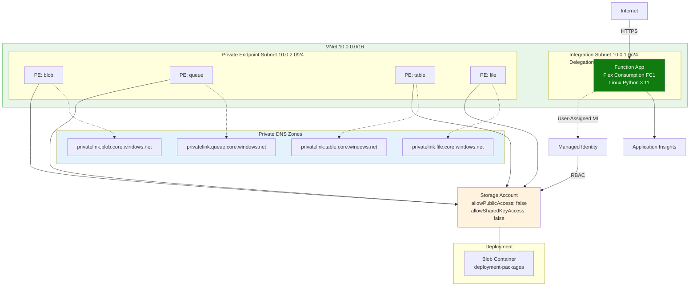
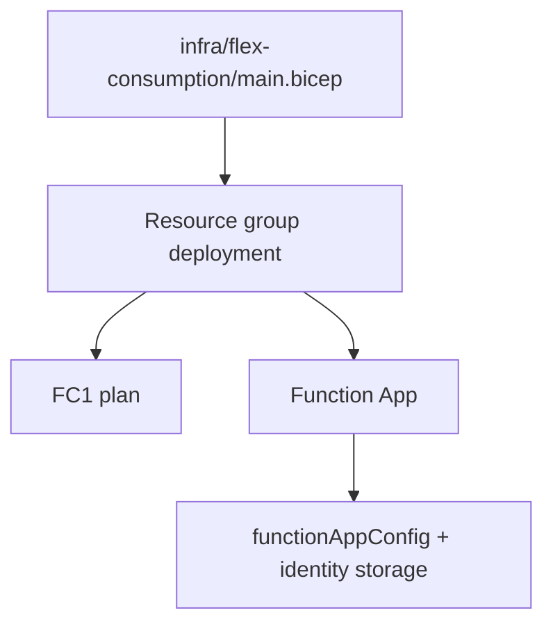

---
validation:
  az_cli:
    last_tested: 2026-04-09
    cli_version: 2.83.0
    core_tools_version: 4.8.0
    result: pass
  bicep:
    last_tested: '2026-06-06'
    result: syntax_validated
content_sources:

- type: mslearn-adapted
  url: https://learn.microsoft.com/azure/azure-resource-manager/bicep/overview
- type: mslearn-adapted
  url: https://learn.microsoft.com/azure/azure-functions/flex-consumption-plan
- type: mslearn-adapted
  url: https://learn.microsoft.com/azure/azure-functions/functions-networking-options
content_validation:
  status: verified
  last_reviewed: '2026-05-23'
  reviewer: agent
  core_claims:
  - claim: This page uses Microsoft Learn as the primary source basis for its Azure-specific
      guidance.
    source: https://learn.microsoft.com/azure/azure-resource-manager/bicep/overview
    verified: true
---
# 05 - Infrastructure as Code (Flex Consumption)

Use Bicep to provision Flex Consumption infrastructure reproducibly, including FC1 plan settings, identity-based host storage, and blob-based deployment configuration.

## Prerequisites

| Tool | Minimum version | Purpose |
|---|---|---|
| Azure CLI | 2.60+ | Deploy Bicep template |
| Bicep CLI | Current | Validate and build templates |
| Existing Azure subscription access | Contributor | Create resources |

## What You'll Build

You will validate and deploy the Flex Consumption infrastructure template, then confirm FC1 runtime, networking delegation, and blob-based deployment configuration.

!!! info "Infrastructure Context"
    **Plan**: Flex Consumption (FC1) | **Network**: Full private network | **VNet**: ✅

    FC1 deploys with VNet integration, private endpoints for all storage services, private DNS zones, and user-assigned managed identity. Storage uses identity-based authentication (no shared keys).

    <!-- diagram-id: what-you-ll-build -->


<!-- diagram-id: what-you-ll-build-2 -->


## Steps

### Step 1: Set Variables

```bash
export BASE_NAME="flexdemo"
export RG="rg-flexdemo"
export APP_NAME="flexdemo-func"
export PLAN_NAME="flexdemo-plan"
export STORAGE_NAME="flexdemostorage"
export APPINSIGHTS_NAME="flexdemo-insights"
export LOCATION="koreacentral"
```

Expected output:


```text
```

### Step 2: Review Template Layout

The Flex plan track template is at `infra/flex-consumption/main.bicep` and composes shared modules from `infra/modules/`.

```bash
az bicep build --file "infra/flex-consumption/main.bicep"
```

| CLI element | Explanation |
|---|---|
| Command(s) | `az bicep build` |
| Key flags | `--file` |
| Variables | None |
| Expected result | Azure CLI completes successfully and returns JSON, table, or no output depending on the command; verify the next documented check before continuing. |


Expected output:


```text
```

### Step 3: Preview Deployment Changes


```bash
az group create --name "$RG" --location "$LOCATION" --output json
az deployment group what-if --resource-group "$RG" --template-file "infra/flex-consumption/main.bicep" --parameters baseName="$BASE_NAME" location="$LOCATION" --output json
```

| CLI element | Explanation |
|---|---|
| Command(s) | `az group create`, `az deployment group what-if` |
| Key flags | `--name`, `--location`, `--output`, `--resource-group`, `--template-file`, `--parameters` |
| Variables | `$RG`, `$LOCATION`, `$BASE_NAME` |
| Expected result | Azure CLI returns provisioning details; confirm the resource name and successful provisioning state before continuing. |


Expected output:


```json
{
  "status": "Succeeded",
  "changes": [
    {
      "resourceId": "/subscriptions/<subscription-id>/resourceGroups/rg-flexdemo/providers/Microsoft.Web/serverfarms/flexdemo-plan",
      "changeType": "Create"
    }
  ]
}
```

### Step 4: Deploy Infrastructure


```bash
az deployment group create --resource-group "$RG" --template-file "infra/flex-consumption/main.bicep" --parameters baseName="$BASE_NAME" location="$LOCATION" --output json
```

| CLI element | Explanation |
|---|---|
| Command(s) | `az deployment group create` |
| Key flags | `--resource-group`, `--template-file`, `--parameters`, `--output` |
| Variables | `$RG`, `$BASE_NAME`, `$LOCATION` |
| Expected result | Azure CLI returns provisioning details; confirm the resource name and successful provisioning state before continuing. |


Expected output:


```json
{
  "id": "/subscriptions/<subscription-id>/resourceGroups/rg-flexdemo/providers/Microsoft.Resources/deployments/main",
  "name": "main",
  "properties": {
    "provisioningState": "Succeeded"
  }
}
```

### Step 5: Validate Flex IaC Requirements

!!! warning "Auto-generated plan name"
    When using `--flexconsumption-location` to create the Function App (Step 12 in Tutorial 02), Azure auto-generates the App Service Plan name (e.g., `ASP-rgflexdemo-376c`) instead of using `$PLAN_NAME`. Query the actual plan name first:

    ```bash
    PLAN_NAME_ACTUAL=$(az functionapp show --name "$APP_NAME" --resource-group "$RG" \
      --query "properties.serverFarmId" --output tsv | awk -F/ '{print $NF}')
    echo "Actual plan name: $PLAN_NAME_ACTUAL"
    ```

    | CLI element | Explanation |
    |---|---|
    | Command(s) | `az functionapp show` |
    | Key flags | `--name`, `--resource-group`, `--query`, `--output` |
    | Variables | `$APP_NAME`, `$RG`, `$NF`, `$PLAN_NAME_ACTUAL` |
    | Expected result | Azure CLI returns the requested resource data; verify names, IDs, status fields, or metric values match the scenario. |


```bash
az appservice plan show --name "$PLAN_NAME_ACTUAL" --resource-group "$RG" --query "sku" --output json
az functionapp show --name "$APP_NAME" --resource-group "$RG" --query "properties.functionAppConfig" --output json
```

| CLI element | Explanation |
|---|---|
| Command(s) | `az appservice plan show`, `az functionapp show` |
| Key flags | `--name`, `--resource-group`, `--query`, `--output` |
| Variables | `$PLAN_NAME_ACTUAL`, `$RG`, `$APP_NAME` |
| Expected result | Azure CLI returns the requested resource data; verify names, IDs, status fields, or metric values match the scenario. |


Expected output:


```json
{
  "name": "FC1",
  "tier": "FlexConsumption"
}
```


```json
{
  "deployment": {
    "storage": {
      "type": "blobContainer"
    }
  },
  "runtime": {
    "name": "python",
    "version": "3.11"
  },
  "scaleAndConcurrency": {
    "instanceMemoryMB": 2048,
    "maximumInstanceCount": 100
  }
}
```

### Step 6: Confirm Networking Delegation

Flex subnet delegation must target `Microsoft.App/environments`.


```bash
az network vnet subnet show --resource-group "$RG" --vnet-name "flexdemo-vnet" --name "subnet-integration" --query "delegations" --output json
```

| CLI element | Explanation |
|---|---|
| Command(s) | `az network vnet subnet show` |
| Key flags | `--resource-group`, `--vnet-name`, `--name`, `--query`, `--output` |
| Variables | `$RG` |
| Expected result | Azure CLI returns the requested resource data; verify names, IDs, status fields, or metric values match the scenario. |


Expected output:


```json
[
  {
    "name": "delegation",
    "serviceName": "Microsoft.App/environments"
  }
]
```

### Step 7: Optional Scripted Deployment Path

`infra/deploy.sh` runs from the `infra/` directory and deploys `infra/main.bicep` (via `--template-file main.bicep`) as the infrastructure entry point.


```bash
cd infra
cp .env.example .env
./deploy.sh
```

Expected output:


```text
Step 3/5: Deploying infrastructure (Bicep)...
Infrastructure deployed!
Step 4/5: Deploying function app code...
Deployment completed successfully.
```

### Option B: Deploy with Azure CLI (No Bicep)

If you prefer not to use Bicep, you can provision all Flex Consumption resources with Azure CLI. This creates the same infrastructure as the Bicep template above.

!!! note "Same result, different tool"
    Both Option A (Bicep) and Option B (CLI) produce identical infrastructure. Choose whichever fits your workflow.

#### B-1: Resource Group and Storage Account

```bash
az group create \
  --name "$RG" \
  --location "$LOCATION"

az storage account create \
  --name "$STORAGE_NAME" \
  --resource-group "$RG" \
  --location "$LOCATION" \
  --sku Standard_LRS \
  --kind StorageV2 \
  --allow-blob-public-access false \
  --allow-shared-key-access false \
  --min-tls-version TLS1_2
```

| CLI element | Explanation |
|---|---|
| Command(s) | `az group create`, `az storage account create` |
| Key flags | `--name`, `--location`, `--resource-group`, `--sku`, `--kind`, `--allow-blob-public-access`, `--allow-shared-key-access`, `--min-tls-version` |
| Variables | `$RG`, `$LOCATION`, `$STORAGE_NAME` |
| Expected result | Azure CLI returns provisioning details; confirm the resource name and successful provisioning state before continuing. |


#### B-2: User-Assigned Managed Identity

```bash
export MI_NAME="${BASE_NAME}-identity"

az identity create \
  --name "$MI_NAME" \
  --resource-group "$RG" \
  --location "$LOCATION"

export MI_PRINCIPAL_ID=$(az identity show \
  --name "$MI_NAME" \
  --resource-group "$RG" \
  --query "principalId" \
  --output tsv)

export MI_CLIENT_ID=$(az identity show \
  --name "$MI_NAME" \
  --resource-group "$RG" \
  --query "clientId" \
  --output tsv)

export MI_ID=$(az identity show \
  --name "$MI_NAME" \
  --resource-group "$RG" \
  --query "id" \
  --output tsv)
```

| CLI element | Explanation |
|---|---|
| Command(s) | `az identity create`, `az identity show` |
| Key flags | `--name`, `--resource-group`, `--location`, `--query`, `--output` |
| Variables | `$MI_NAME`, `$RG`, `$LOCATION` |
| Expected result | Azure CLI returns provisioning details; confirm the resource name and successful provisioning state before continuing. |


#### B-3: RBAC Role Assignments

```bash
export STORAGE_ID=$(az storage account show \
  --name "$STORAGE_NAME" \
  --resource-group "$RG" \
  --query "id" \
  --output tsv)

az role assignment create \
  --assignee "$MI_PRINCIPAL_ID" \
  --role "Storage Blob Data Owner" \
  --scope "$STORAGE_ID"

az role assignment create \
  --assignee "$MI_PRINCIPAL_ID" \
  --role "Storage Account Contributor" \
  --scope "$STORAGE_ID"

az role assignment create \
  --assignee "$MI_PRINCIPAL_ID" \
  --role "Storage Queue Data Contributor" \
  --scope "$STORAGE_ID"
```

| CLI element | Explanation |
|---|---|
| Command(s) | `az storage account show`, `az role assignment create` |
| Key flags | `--name`, `--resource-group`, `--query`, `--output`, `--assignee`, `--role`, `--scope` |
| Variables | `$STORAGE_NAME`, `$RG`, `$MI_PRINCIPAL_ID`, `$STORAGE_ID` |
| Expected result | Azure CLI returns provisioning details; confirm the resource name and successful provisioning state before continuing. |


#### B-4: VNet and Subnets

```bash
export VNET_NAME="${BASE_NAME}-vnet"

az network vnet create \
  --name "$VNET_NAME" \
  --resource-group "$RG" \
  --location "$LOCATION" \
  --address-prefixes "10.0.0.0/16" \
  --subnet-name "subnet-integration" \
  --subnet-prefixes "10.0.1.0/24"

az network vnet subnet create \
  --name "subnet-private-endpoints" \
  --resource-group "$RG" \
  --vnet-name "$VNET_NAME" \
  --address-prefixes "10.0.2.0/24"

az network vnet subnet update \
  --name "subnet-integration" \
  --resource-group "$RG" \
  --vnet-name "$VNET_NAME" \
  --delegations "Microsoft.App/environments"
```

| CLI element | Explanation |
|---|---|
| Command(s) | `az network vnet create`, `az network vnet subnet create`, `az network vnet subnet update` |
| Key flags | `--name`, `--resource-group`, `--location`, `--address-prefixes`, `--subnet-name`, `--subnet-prefixes`, `--vnet-name`, `--delegations` |
| Variables | `$VNET_NAME`, `$RG`, `$LOCATION` |
| Expected result | Azure CLI returns provisioning details; confirm the resource name and successful provisioning state before continuing. |


#### B-5: Storage Private Endpoints (×4)

```bash
for SVC in blob queue table file; do
  az network private-endpoint create \
    --name "${BASE_NAME}-pe-$SVC" \
    --resource-group "$RG" \
    --location "$LOCATION" \
    --vnet-name "$VNET_NAME" \
    --subnet "subnet-private-endpoints" \
    --private-connection-resource-id "$STORAGE_ID" \
    --group-ids "$SVC" \
    --connection-name "${BASE_NAME}-plsc-$SVC"
done
```

| CLI element | Explanation |
|---|---|
| Command(s) | `az network private-endpoint create` |
| Key flags | `--name`, `--resource-group`, `--location`, `--vnet-name`, `--subnet`, `--private-connection-resource-id`, `--group-ids`, `--connection-name` |
| Variables | `$SVC`, `$RG`, `$LOCATION`, `$VNET_NAME`, `$STORAGE_ID` |
| Expected result | Azure CLI returns provisioning details; confirm the resource name and successful provisioning state before continuing. |


#### B-6: Private DNS Zones and VNet Links (×4)

```bash
for SVC in blob queue table file; do
  az network private-dns zone create \
    --resource-group "$RG" \
    --name "privatelink.$SVC.core.windows.net"

  az network private-dns link vnet create \
    --resource-group "$RG" \
    --zone-name "privatelink.$SVC.core.windows.net" \
    --name "${BASE_NAME}-$SVC-dns-link" \
    --virtual-network "$VNET_NAME" \
    --registration-enabled false

  az network private-endpoint dns-zone-group create \
    --resource-group "$RG" \
    --endpoint-name "${BASE_NAME}-pe-$SVC" \
    --name "$SVC-dns-zone-group" \
    --private-dns-zone "privatelink.$SVC.core.windows.net" \
    --zone-name "$SVC"
done
```

| CLI element | Explanation |
|---|---|
| Command(s) | `az network private-dns zone create`, `az network private-dns link vnet`, `az network private-endpoint dns-zone-group create` |
| Key flags | `--resource-group`, `--name`, `--zone-name`, `--virtual-network`, `--registration-enabled`, `--endpoint-name`, `--private-dns-zone` |
| Variables | `$RG`, `$SVC`, `$VNET_NAME` |
| Expected result | Azure CLI returns provisioning details; confirm the resource name and successful provisioning state before continuing. |


#### B-7: Deployment Blob Container

```bash
az storage container create \
  --name "deployment-packages" \
  --account-name "$STORAGE_NAME" \
  --auth-mode login
```

| CLI element | Explanation |
|---|---|
| Command(s) | `az storage container create` |
| Key flags | `--name`, `--account-name`, `--auth-mode` |
| Variables | `$STORAGE_NAME` |
| Expected result | Azure CLI returns provisioning details; confirm the resource name and successful provisioning state before continuing. |


#### B-8: Application Insights

```bash
az monitor app-insights component create \
  --app "$APPINSIGHTS_NAME" \
  --resource-group "$RG" \
  --location "$LOCATION" \
  --application-type web

export APPINSIGHTS_CONN=$(az monitor app-insights component show \
  --app "$APPINSIGHTS_NAME" \
  --resource-group "$RG" \
  --query "connectionString" \
  --output tsv)
```

| CLI element | Explanation |
|---|---|
| Command(s) | `az monitor app-insights component create`, `az monitor app-insights component show` |
| Key flags | `--app`, `--resource-group`, `--location`, `--application-type`, `--query`, `--output` |
| Variables | `$APPINSIGHTS_NAME`, `$RG`, `$LOCATION` |
| Expected result | Azure CLI returns provisioning details; confirm the resource name and successful provisioning state before continuing. |


!!! warning "`az functionapp plan create --sku FC1` does not work"
    Flex Consumption plans cannot be created with `az functionapp plan create`. Instead, use `az functionapp create --flexconsumption-location` which creates both the plan and app together. The plan name is auto-generated.

```bash
az functionapp create \
  --name "$APP_NAME" \
  --resource-group "$RG" \
  --storage-account "$STORAGE_NAME" \
  --flexconsumption-location "$LOCATION" \
  --runtime python \
  --runtime-version 3.11 \
  --functions-version 4 \
  --assign-identity "$MI_ID"
```

| CLI element | Explanation |
|---|---|
| Command(s) | `az functionapp create` |
| Key flags | `--name`, `--resource-group`, `--storage-account`, `--flexconsumption-location`, `--runtime`, `--runtime-version`, `--functions-version`, `--assign-identity` |
| Variables | `$APP_NAME`, `$RG`, `$STORAGE_NAME`, `$LOCATION`, `$MI_ID` |
| Expected result | Azure CLI returns provisioning details; confirm the resource name and successful provisioning state before continuing. |


#### B-10: App Settings (Identity-Based Storage)

```bash
az functionapp config appsettings set \
  --name "$APP_NAME" \
  --resource-group "$RG" \
  --settings \
    "AzureWebJobsStorage__accountName=$STORAGE_NAME" \
    "AzureWebJobsStorage__credential=managedidentity" \
    "AzureWebJobsStorage__clientId=$MI_CLIENT_ID" \
    "APPLICATIONINSIGHTS_CONNECTION_STRING=$APPINSIGHTS_CONN"
```

| CLI element | Explanation |
|---|---|
| Command(s) | `az functionapp config appsettings set` |
| Key flags | `--name`, `--resource-group`, `--settings` |
| Variables | `$APP_NAME`, `$RG`, `$STORAGE_NAME`, `$MI_CLIENT_ID`, `$APPINSIGHTS_CONN` |
| Expected result | Azure CLI applies the configuration change; confirm the returned JSON or follow-up query shows the expected value. |


#### B-11: VNet Integration

```bash
az functionapp vnet-integration add \
  --name "$APP_NAME" \
  --resource-group "$RG" \
  --vnet "$VNET_NAME" \
  --subnet "subnet-integration"
```

| CLI element | Explanation |
|---|---|
| Command(s) | `az functionapp vnet-integration add` |
| Key flags | `--name`, `--resource-group`, `--vnet`, `--subnet` |
| Variables | `$APP_NAME`, `$RG`, `$VNET_NAME` |
| Expected result | Azure CLI completes successfully and returns JSON, table, or no output depending on the command; verify the next documented check before continuing. |


#### B-12: Validate

```bash
az appservice plan show \
  --name "$PLAN_NAME" \
  --resource-group "$RG" \
  --query "sku" \
  --output json

az network vnet subnet show \
  --resource-group "$RG" \
  --vnet-name "$VNET_NAME" \
  --name "subnet-integration" \
  --query "delegations" \
  --output json
```

| CLI element | Explanation |
|---|---|
| Command(s) | `az appservice plan show`, `az network vnet subnet show` |
| Key flags | `--name`, `--resource-group`, `--query`, `--output`, `--vnet-name` |
| Variables | `$PLAN_NAME`, `$RG`, `$VNET_NAME` |
| Expected result | Azure CLI returns the requested resource data; verify names, IDs, status fields, or metric values match the scenario. |


## Verification

- `az deployment group what-if` and `az deployment group create` complete with `Succeeded` provisioning state.
- `az appservice plan show` confirms `FC1` / `FlexConsumption`.
- `az functionapp show --query "properties.functionAppConfig"` confirms blob container deployment + Python runtime.
- Subnet delegation output includes `Microsoft.App/environments`.

## Next Steps

> **Next:** [06 - CI/CD](06-ci-cd.md)

## See Also

- [Tutorial Overview & Plan Chooser](../index.md)
- [Python Language Guide](../../index.md)
- [Platform: Hosting Plans](../../../../platform/hosting.md)
- [Operations: Deployment](../../../../operations/deployment.md)
- [Recipes Index](../../recipes/index.md)

## Sources

- [Bicep overview](https://learn.microsoft.com/azure/azure-resource-manager/bicep/overview)
- [Flex Consumption plan hosting](https://learn.microsoft.com/azure/azure-functions/flex-consumption-plan)
- [Azure Functions networking options](https://learn.microsoft.com/azure/azure-functions/functions-networking-options)
