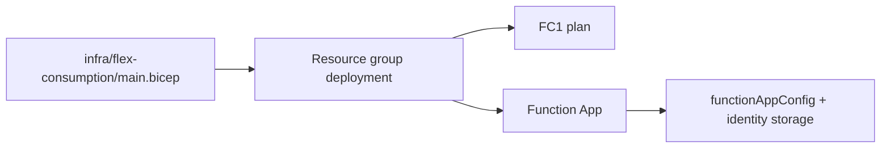

# 05 - Infrastructure as Code (Flex Consumption)

Use Bicep to provision Flex Consumption infrastructure reproducibly, including FC1 plan settings, identity-based host storage, and blob-based deployment configuration.

## Prerequisites

| Tool | Minimum version | Purpose |
|---|---|---|
| Azure CLI | 2.60+ | Deploy Bicep template |
| Bicep CLI | Current | Validate and build templates |
| Existing Azure subscription access | Contributor | Create resources |

## What You'll Build

You will validate and deploy the Flex Consumption infrastructure template, then confirm FC1 runtime, networking delegation, and blob-based deployment configuration.



## Steps

### Step 1: Set Variables

```bash
export BASE_NAME="flexdemo"
export RG="rg-flexdemo"
export APP_NAME="flexdemo-func"
export PLAN_NAME="flexdemo-plan"
export STORAGE_NAME="flexdemostorage"
export APPINSIGHTS_NAME="flexdemo-insights"
export LOCATION="eastus2"
```

Expected output:


```text
```

### Step 2: Review Template Layout

The Flex plan track template is at `infra/flex-consumption/main.bicep` and composes shared modules from `infra/modules/`.

```bash
az bicep build --file "infra/flex-consumption/main.bicep"
```

Expected output:


```text
```

### Step 3: Preview Deployment Changes


```bash
az group create --name "$RG" --location "$LOCATION" --output json
az deployment group what-if --resource-group "$RG" --template-file "infra/flex-consumption/main.bicep" --parameters baseName="$BASE_NAME" location="$LOCATION" --output json
```

Expected output:


```json
{
  "status": "Succeeded",
  "changes": [
    {
      "resourceId": "/subscriptions/<subscription-id>/resourceGroups/rg-flexdemo/providers/Microsoft.Web/serverfarms/flexdemo-plan",
      "changeType": "Create"
    }
  ]
}
```

### Step 4: Deploy Infrastructure


```bash
az deployment group create --resource-group "$RG" --template-file "infra/flex-consumption/main.bicep" --parameters baseName="$BASE_NAME" location="$LOCATION" --output json
```

Expected output:


```json
{
  "id": "/subscriptions/<subscription-id>/resourceGroups/rg-flexdemo/providers/Microsoft.Resources/deployments/main",
  "name": "main",
  "properties": {
    "provisioningState": "Succeeded"
  }
}
```

### Step 5: Validate Flex IaC Requirements


```bash
az appservice plan show --name "$PLAN_NAME" --resource-group "$RG" --query "sku" --output json
az functionapp show --name "$APP_NAME" --resource-group "$RG" --query "properties.functionAppConfig" --output json
```

Expected output:


```json
{
  "name": "FC1",
  "tier": "FlexConsumption"
}
```


```json
{
  "deployment": {
    "storage": {
      "type": "blobContainer"
    }
  },
  "runtime": {
    "name": "python",
    "version": "3.11"
  },
  "scaleAndConcurrency": {
    "instanceMemoryMB": 2048,
    "maximumInstanceCount": 100
  }
}
```

### Step 6: Confirm Networking Delegation

Flex subnet delegation must target `Microsoft.App/environments`.


```bash
az network vnet subnet show --resource-group "$RG" --vnet-name "flexdemo-vnet" --name "subnet-integration" --query "delegations" --output json
```

Expected output:


```json
[
  {
    "name": "delegation",
    "serviceName": "Microsoft.App/environments"
  }
]
```

### Step 7: Optional Scripted Deployment Path

`infra/deploy.sh` runs from the `infra/` directory and deploys `infra/main.bicep` (via `--template-file main.bicep`) as the infrastructure entry point.


```bash
cd infra
cp .env.example .env
./deploy.sh
```

Expected output:


```text
Step 3/5: Deploying infrastructure (Bicep)...
Infrastructure deployed!
Step 4/5: Deploying function app code...
Deployment completed successfully.
```

## Verification

- `az deployment group what-if` and `az deployment group create` complete with `Succeeded` provisioning state.
- `az appservice plan show` confirms `FC1` / `FlexConsumption`.
- `az functionapp show --query "properties.functionAppConfig"` confirms blob container deployment + Python runtime.
- Subnet delegation output includes `Microsoft.App/environments`.

## Next Steps

> **Next:** [06 - CI/CD](06-ci-cd.md)

## See Also

- [Tutorial Overview & Plan Chooser](../index.md)
- [Python Language Guide](../../index.md)
- [Platform: Hosting Plans](../../../../platform/hosting.md)
- [Operations: Deployment](../../../../operations/deployment.md)
- [Recipes Index](../../recipes/index.md)

## Sources

- [Bicep overview](https://learn.microsoft.com/azure/azure-resource-manager/bicep/overview)
- [Flex Consumption plan hosting](https://learn.microsoft.com/azure/azure-functions/flex-consumption-plan)
- [Azure Functions networking options](https://learn.microsoft.com/azure/azure-functions/functions-networking-options)
