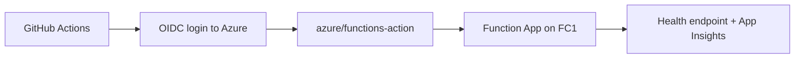

---
hide:
  - toc
validation:
  az_cli:
    last_tested: 2026-04-09
    cli_version: "2.83.0"
    core_tools_version: "4.8.0"
    result: pass
  bicep:
    last_tested: null
    result: not_tested
content_sources:
  - type: mslearn-adapted
    url: https://learn.microsoft.com/azure/azure-functions/functions-how-to-github-actions
  - type: mslearn-adapted
    url: https://learn.microsoft.com/azure/developer/github/connect-from-azure-openid-connect
  - type: mslearn-adapted
    url: https://learn.microsoft.com/azure/azure-functions/functions-deployment-technologies
---

# 06 - CI/CD (Flex Consumption)

Automate build and deployment for your Flex Consumption Function App with GitHub Actions and OIDC authentication.

## Prerequisites

| Tool | Minimum version | Purpose |
|---|---|---|
| GitHub repository | Actions enabled | CI/CD execution |
| Azure CLI | 2.60+ | Create app registration and role assignments |
| Deployed FC1 Function App | Existing | Deployment target |

## What You'll Build

You will configure OIDC-based GitHub Actions deployment to a Flex Consumption Function App and validate deployment telemetry without relying on Kudu.

!!! info "Infrastructure Context"
    **Plan**: Flex Consumption (FC1) | **Network**: Full private network | **VNet**: ✅

    FC1 deploys with VNet integration, private endpoints for all storage services, private DNS zones, and user-assigned managed identity. Storage uses identity-based authentication (no shared keys).

    <!-- diagram-id: what-you-ll-build -->
    ```mermaid
    flowchart TD
        INET[Internet] -->|HTTPS| FA[Function App\nFlex Consumption FC1\nLinux Python 3.11]

        subgraph VNET["VNet 10.0.0.0/16"]
            subgraph INT_SUB["Integration Subnet 10.0.1.0/24\nDelegation: Microsoft.App/environments"]
                FA
            end
            subgraph PE_SUB["Private Endpoint Subnet 10.0.2.0/24"]
                PE_BLOB[PE: blob]
                PE_QUEUE[PE: queue]
                PE_TABLE[PE: table]
                PE_FILE[PE: file]
            end
        end

        PE_BLOB --> ST["Storage Account\nallowPublicAccess: false\nallowSharedKeyAccess: false"]
        PE_QUEUE --> ST
        PE_TABLE --> ST
        PE_FILE --> ST

        subgraph DNS[Private DNS Zones]
            DNS_BLOB[privatelink.blob.core.windows.net]
            DNS_QUEUE[privatelink.queue.core.windows.net]
            DNS_TABLE[privatelink.table.core.windows.net]
            DNS_FILE[privatelink.file.core.windows.net]
        end

        PE_BLOB -.-> DNS_BLOB
        PE_QUEUE -.-> DNS_QUEUE
        PE_TABLE -.-> DNS_TABLE
        PE_FILE -.-> DNS_FILE

        FA -.->|User-Assigned MI| UAMI[Managed Identity]
        UAMI -->|RBAC| ST
        FA --> AI[Application Insights]

        subgraph DEPLOY[Deployment]
            BLOB_CTR[Blob Container\ndeployment-packages]
        end
        ST --- BLOB_CTR

        style FA fill:#107c10,color:#fff
        style VNET fill:#E8F5E9,stroke:#4CAF50
        style ST fill:#FFF3E0
        style DNS fill:#E3F2FD
    ```

<!-- diagram-id: what-you-ll-build-2 -->


## Steps

### Step 1: Set Variables

```bash
export BASE_NAME="flexdemo"
export RG="rg-flexdemo"
export APP_NAME="flexdemo-func"
export PLAN_NAME="flexdemo-plan"
export STORAGE_NAME="flexdemostorage"
export APPINSIGHTS_NAME="flexdemo-insights"
export LOCATION="koreacentral"
export SUBSCRIPTION_ID="<subscription-id>"
```

Expected output:


```text
```

### Step 2: Create Azure AD App and Service Principal

```bash
az ad app create --display-name "github-flex-functions" --output json
az ad sp create --id "xxxxxxxx-xxxx-xxxx-xxxx-xxxxxxxxxxxx" --output json
```

Expected output:


```json
{
  "appId": "xxxxxxxx-xxxx-xxxx-xxxx-xxxxxxxxxxxx",
  "id": "xxxxxxxx-xxxx-xxxx-xxxx-xxxxxxxxxxxx",
  "displayName": "github-flex-functions"
}
```

### Step 3: Add Federated Credential for GitHub OIDC


```bash
az ad app federated-credential create --id "xxxxxxxx-xxxx-xxxx-xxxx-xxxxxxxxxxxx" --parameters '{"name":"github-main","issuer":"https://token.actions.githubusercontent.com","subject":"repo:your-org/azure-functions-python-guide:ref:refs/heads/main","audiences":["api://AzureADTokenExchange"]}' --output json
```

Expected output:


```json
{
  "name": "github-main",
  "issuer": "https://token.actions.githubusercontent.com",
  "subject": "repo:your-org/azure-functions-python-guide:ref:refs/heads/main"
}
```

### Step 4: Grant Deployment Permissions


```bash
az role assignment create --assignee "xxxxxxxx-xxxx-xxxx-xxxx-xxxxxxxxxxxx" --role "Contributor" --scope "/subscriptions/$SUBSCRIPTION_ID/resourceGroups/$RG" --output json
```

Expected output:


```json
{
  "id": "/subscriptions/<subscription-id>/resourceGroups/rg-flexdemo/providers/Microsoft.Authorization/roleAssignments/xxxxxxxx-xxxx-xxxx-xxxx-xxxxxxxxxxxx",
  "principalId": "xxxxxxxx-xxxx-xxxx-xxxx-xxxxxxxxxxxx",
  "scope": "/subscriptions/<subscription-id>/resourceGroups/rg-flexdemo"
}
```

### Step 5: Configure GitHub Variables

Set these repository or environment variables in GitHub Actions:

| Name | Value |
|---|---|
| `AZURE_CLIENT_ID` | `xxxxxxxx-xxxx-xxxx-xxxx-xxxxxxxxxxxx` |
| `AZURE_TENANT_ID` | `<tenant-id>` |
| `AZURE_SUBSCRIPTION_ID` | `<subscription-id>` |
| `AZURE_FUNCTIONAPP_NAME` | `flexdemo-func` |

### Step 6: Add Flex Deployment Workflow

Create `.github/workflows/deploy-flex.yml`:


```yaml
name: Deploy Flex Consumption Function App

on:
  push:
    branches:
      - main
  workflow_dispatch:

permissions:
  id-token: write
  contents: read

jobs:
  deploy:
    runs-on: ubuntu-latest
    steps:
      - name: Checkout
        uses: actions/checkout@v4

      - name: Setup Python
        uses: actions/setup-python@v5
        with:
          python-version: "3.11"

      - name: Install dependencies
        run: |
          pip install --upgrade pip
          pip install --requirement apps/python/requirements.txt

      - name: Azure login with OIDC
        uses: azure/login@v2
        with:
          client-id: ${{ vars.AZURE_CLIENT_ID }}
          tenant-id: ${{ vars.AZURE_TENANT_ID }}
          subscription-id: ${{ vars.AZURE_SUBSCRIPTION_ID }}

      - name: Deploy function app
        uses: azure/functions-action@v1
        with:
          app-name: ${{ vars.AZURE_FUNCTIONAPP_NAME }}
          package: apps/python
          remote-build: true
```

For Flex Consumption, `azure/functions-action@v1` should use remote build (or pre-vendored `.python_packages`) to ensure Python dependencies are built in a Linux-compatible environment. Do not assume Kudu/SCM endpoints are available.

### Step 7: Verify Deployment Health


```bash
curl --request GET "https://$APP_NAME.azurewebsites.net/api/health"
az monitor app-insights query --app "$APPINSIGHTS_NAME" --analytics-query "requests | where timestamp > ago(15m) | project timestamp, name, resultCode | order by timestamp desc | take 10" --output json
```

Expected output:


```json
{"status":"healthy","timestamp":"2026-01-01T00:00:00Z","version":"1.0.0"}
```

## Verification

- The workflow authenticates with OIDC (`azure/login@v2`) and does not use publish profiles.
- Deployment step uses `package: apps/python` and `remote-build: true`.
- Post-deploy health check returns HTTP 200 and recent requests appear in Application Insights.

## Next Steps

> **Next:** [07 - Extending Triggers](07-extending-triggers.md)

## See Also

- [Tutorial Overview & Plan Chooser](../index.md)
- [Python Language Guide](../../index.md)
- [Platform: Hosting Plans](../../../../platform/hosting.md)
- [Operations: Deployment](../../../../operations/deployment.md)
- [Recipes Index](../../recipes/index.md)

## Sources

- [Deploy Azure Functions with GitHub Actions](https://learn.microsoft.com/azure/azure-functions/functions-how-to-github-actions)
- [Use OIDC with GitHub Actions and Azure](https://learn.microsoft.com/azure/developer/github/connect-from-azure-openid-connect)
- [Azure Functions deployment technologies](https://learn.microsoft.com/azure/azure-functions/functions-deployment-technologies)
