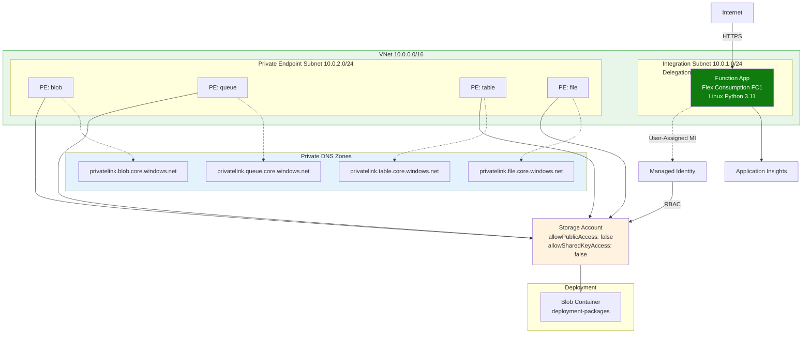
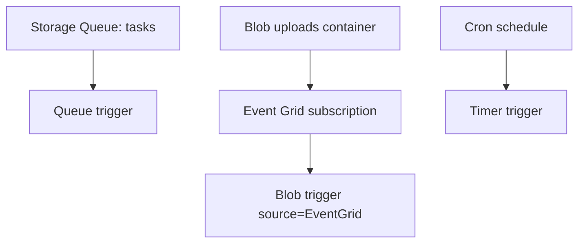

---
validation:
  az_cli:
    last_tested: 2026-04-09
    cli_version: "2.83.0"
    core_tools_version: "4.8.0"
    result: pass
  bicep:
    last_tested: null
    result: not_tested
content_sources:
  - type: mslearn-adapted
    url: https://learn.microsoft.com/azure/azure-functions/functions-triggers-bindings
  - type: mslearn-adapted
    url: https://learn.microsoft.com/azure/azure-functions/functions-event-grid-blob-trigger
  - type: mslearn-adapted
    url: https://learn.microsoft.com/azure/azure-functions/functions-bindings-storage-queue
---

# 07 - Extending Triggers (Flex Consumption)

Add non-HTTP triggers to your Flex Consumption app with the correct trigger model for FC1 scaling and networking behavior.

## Prerequisites

| Tool | Minimum version | Purpose |
|---|---|---|
| Python | 3.11 | Update function code |
| Azure Functions Core Tools | 4.x | Run and publish triggers |
| Azure Storage Account | Existing | Queue and blob event source |
| Event Grid integration | Enabled | Blob event delivery for Flex |

## What You'll Build

You will extend the Python Flex app with timer, queue, and Event Grid-based blob triggers, then validate end-to-end event processing.

!!! info "Infrastructure Context"
    **Plan**: Flex Consumption (FC1) | **Network**: Full private network | **VNet**: ✅

    FC1 deploys with VNet integration, private endpoints for all storage services, private DNS zones, and user-assigned managed identity. Storage uses identity-based authentication (no shared keys).

    <!-- diagram-id: what-you-ll-build -->


<!-- diagram-id: what-you-ll-build-2 -->


## Steps

### Step 1: Set Variables

```bash
export BASE_NAME="flexdemo"
export RG="rg-flexdemo"
export APP_NAME="flexdemo-func"
export PLAN_NAME="flexdemo-plan"
export STORAGE_NAME="flexdemostorage"
export APPINSIGHTS_NAME="flexdemo-insights"
export LOCATION="koreacentral"
```

Expected output:


```text
```

### Step 2: Add a Timer Trigger Blueprint

Create `apps/python/blueprints/scheduled.py` and register it in `apps/python/function_app.py`.


```python
import azure.functions as func
import logging
from datetime import datetime, timezone

bp = func.Blueprint()

@bp.timer_trigger(schedule="0 */5 * * * *", arg_name="timer", run_on_startup=False)
def scheduled_cleanup(timer: func.TimerRequest) -> None:
    logging.info("Timer fired at %s", datetime.now(timezone.utc).isoformat())
```

Expected output:


```text
```

### Step 3: Add Queue Trigger (Per-Function Scaling)

Queue-triggered functions on Flex scale independently from other functions in the same app.


```python
import azure.functions as func
import logging

bp = func.Blueprint()

@bp.queue_trigger(arg_name="msg", queue_name="tasks", connection="AzureWebJobsStorage")
def process_queue_message(msg: func.QueueMessage) -> None:
    logging.info("Queue message: %s", msg.get_body().decode("utf-8"))
```

Expected output:


```text
```

### Step 4: Add Blob Trigger with Event Grid Path

For Flex Consumption, production blob triggers **must** use the Event Grid-based blob trigger. The standard polling blob trigger is not supported on Flex Consumption. Use the `source="EventGrid"` parameter on `@bp.blob_trigger()` to enable Event Grid delivery.


```python
import azure.functions as func
import logging

bp = func.Blueprint()

@bp.blob_trigger(
    arg_name="input_blob",
    path="uploads/{name}",
    connection="AzureWebJobsStorage",
    source="EventGrid",
)
def process_blob_event(input_blob: func.InputStream) -> None:
    logging.info(
        "Blob trigger (Event Grid): name=%s, size=%d bytes",
        input_blob.name,
        input_blob.length,
    )
    content = input_blob.read()
    logging.info("Read %d bytes from blob", len(content))
```

!!! warning "source parameter is required on Flex"
    Without `source="EventGrid"`, the trigger defaults to the polling model, which is **not supported** on Flex Consumption. Your function will fail to process blobs.

Expected output:


```text
```

### Step 5: Create Event Subscription for Blob Events

The Event Grid-based blob trigger uses a **webhook endpoint** exposed by the Functions runtime. The URL pattern is:

```text
https://<APP_NAME>.azurewebsites.net/runtime/webhooks/blobs?functionName=Host.Functions.process_blob_event&code=<system-key>
```

Retrieve the system key and create the subscription:


```bash
# Get the blob extension system key
BLOB_KEY=$(az functionapp keys list \
  --name "$APP_NAME" \
  --resource-group "$RG" \
  --query "systemKeys.blobs_extension" \
  --output tsv)

# Create the Event Grid subscription pointing to the blob webhook endpoint
az eventgrid event-subscription create \
  --name "blob-created-subscription" \
  --source-resource-id "/subscriptions/<subscription-id>/resourceGroups/$RG/providers/Microsoft.Storage/storageAccounts/$STORAGE_NAME" \
  --endpoint "https://$APP_NAME.azurewebsites.net/runtime/webhooks/blobs?functionName=Host.Functions.process_blob_event&code=$BLOB_KEY" \
  --endpoint-type webhook \
  --included-event-types "Microsoft.Storage.BlobCreated" \
  --output json
```

Expected output:


```json
{
  "id": "/subscriptions/<subscription-id>/resourceGroups/rg-flexdemo/providers/Microsoft.Storage/storageAccounts/flexdemostorage/providers/Microsoft.EventGrid/eventSubscriptions/blob-created-subscription",
  "name": "blob-created-subscription",
  "provisioningState": "Succeeded"
}
```

### Step 6: Publish and Validate Trigger Registration


```bash
cd apps/python
func azure functionapp publish "$APP_NAME" --python
az functionapp function list --name "$APP_NAME" --resource-group "$RG" --output table
```

Expected output:


```text
Name                         Trigger
---------------------------  -----------------
health                       httpTrigger
scheduled_cleanup            timerTrigger
process_queue_message        queueTrigger
process_blob_event           blobTrigger
```

### Step 7: Trigger Tests

!!! warning "Storage is network-locked"
    If the storage account has `defaultAction: Deny` (set in Tutorial 02 Step 10), you cannot run data-plane operations from your local machine. Either temporarily allow public access or run these commands from within the VNet:

    ```bash
    az storage account update \
      --name "$STORAGE_NAME" \
      --resource-group "$RG" \
      --default-action Allow
    ```

    Remember to lock it down again after testing.

```bash
az storage queue create --name "tasks" --account-name "$STORAGE_NAME" --auth-mode login --output json
az storage message put --queue-name "tasks" --content '{"task":"reindex"}' --account-name "$STORAGE_NAME" --auth-mode login --output json
```

Upload a blob to emit Event Grid event:


```bash
az storage container create --name "uploads" --account-name "$STORAGE_NAME" --auth-mode login --output json
az storage blob upload --container-name "uploads" --name "sample.txt" --file "/tmp/sample.txt" --account-name "$STORAGE_NAME" --auth-mode login --output json
```

Expected output:


```json
{
  "messageId": "xxxxxxxx-xxxx-xxxx-xxxx-xxxxxxxxxxxx",
  "insertionTime": "2026-01-01T00:00:00Z"
}
```


```json
{
  "etag": "\"0x8DXXXXXXXXXXXX\"",
  "lastModified": "2026-01-01T00:00:00+00:00"
}
```

## Verification

- `az functionapp function list` includes timer, queue, and blob triggers after publish.
- Queue test succeeds after creating the `tasks` queue.
- Blob upload succeeds after creating the `uploads` container and emits `BlobCreated` events to the subscription.
- Blob trigger production path remains Event Grid-based (`source="EventGrid"`) for Flex compliance.

## Next Steps

> **Next:** [How Azure Functions Works](../../../../platform/architecture.md)

## See Also

- [Tutorial Overview & Plan Chooser](../index.md)
- [Python Language Guide](../../index.md)
- [Platform: Hosting Plans](../../../../platform/hosting.md)
- [Operations: Deployment](../../../../operations/deployment.md)
- [Recipes Index](../../recipes/index.md)

## Sources

- [Azure Functions trigger and binding concepts](https://learn.microsoft.com/azure/azure-functions/functions-triggers-bindings)
- [Event Grid blob trigger for Azure Functions](https://learn.microsoft.com/azure/azure-functions/functions-event-grid-blob-trigger)
- [Queue storage trigger for Azure Functions](https://learn.microsoft.com/azure/azure-functions/functions-bindings-storage-queue)
