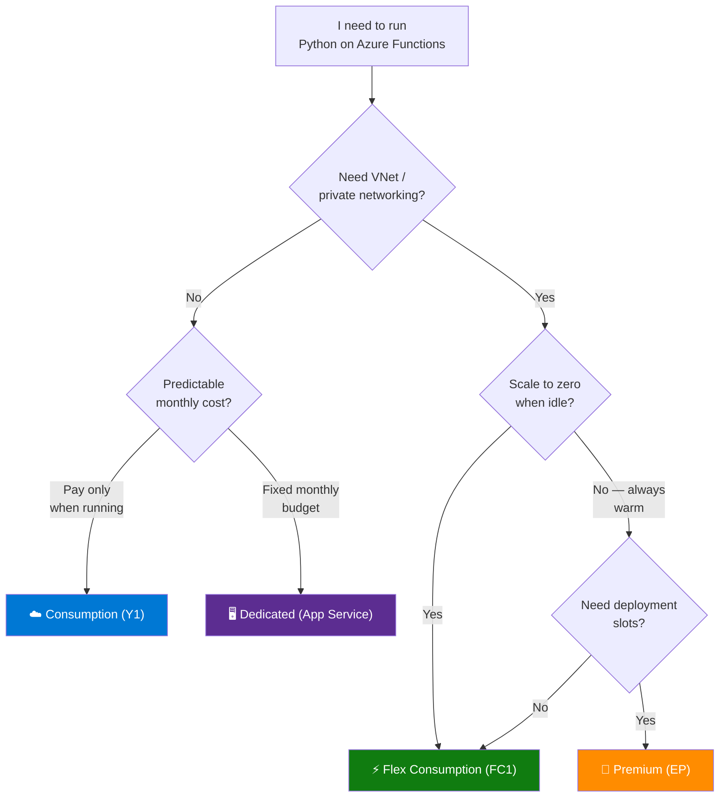
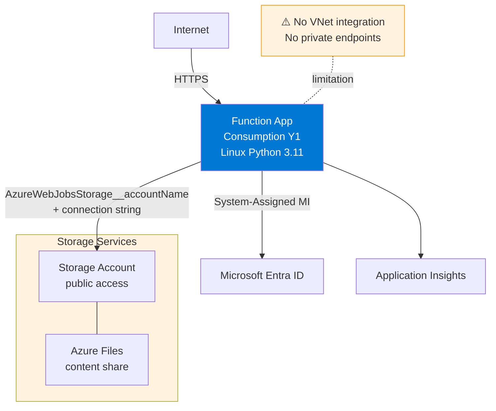
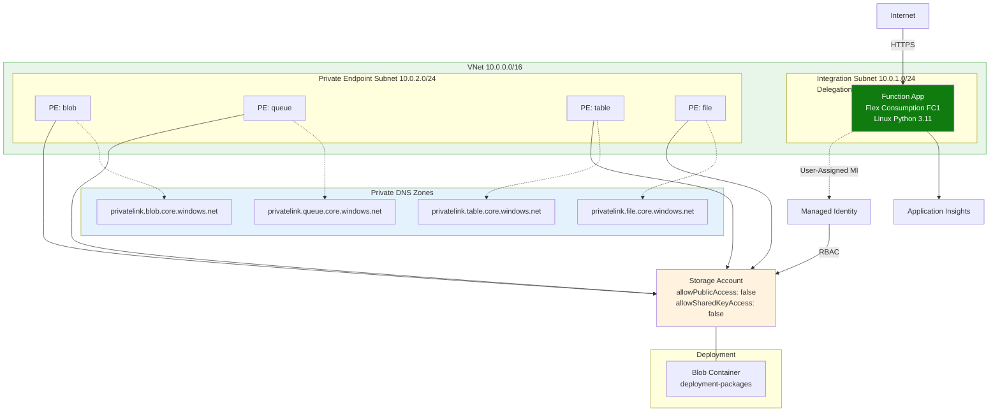
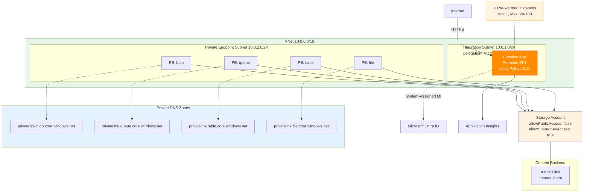
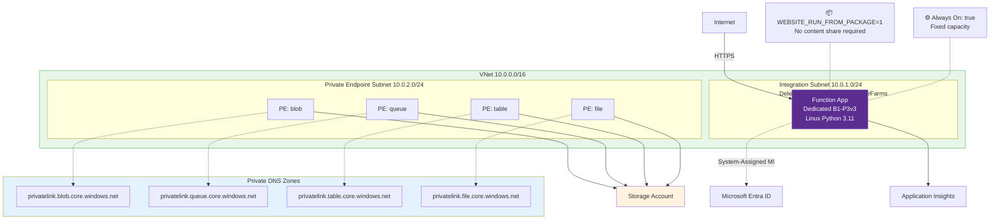

---
hide:
  - toc
---

# Tutorial — Choose Your Hosting Plan

This tutorial section provides **four independent, step-by-step tracks** — one for each Azure Functions hosting plan. Every track covers the same seven topics so you can follow the complete journey from local development to production on whichever plan fits your workload.

## Which Plan Should I Start With?

> **Not sure yet?** Start with **Flex Consumption** — it offers the broadest feature set (VNet, scale-to-zero, configurable memory) and is Microsoft's recommended default for new projects. You can migrate between plans later, though some migrations have limitations — see [Migrate apps from Consumption to Flex Consumption](https://learn.microsoft.com/azure/azure-functions/migration/migrate-plan-consumption-to-flex).

## Plan Comparison at a Glance

| Feature | Consumption (Y1) | Flex Consumption (FC1) | Premium (EP) | Dedicated (ASP) |
|---------|:-----------------:|:----------------------:|:------------:|:----------------:|
| **Scale to zero** | ✅ | ✅ | ❌ (min 1 instance) | ❌ |
| **VNet integration** | ❌ | ✅ | ✅ | ✅ (Standard+) |
| **Private endpoints** | ❌ | ✅ | ✅ | ✅ (Standard+) |
| **Deployment slots** | ✅ (Windows only, 2 incl. production) | ❌ | ✅ | ✅ (Standard+) |
| **Max instances** | 100 (Linux) / 200 (Windows) | 1,000 | 20–100 (region/OS dependent) | 10–30 |
| **Default timeout** | 5 min | 30 min | 30 min | 30 min |
| **Max timeout** | 10 min | Unlimited | Unlimited | Unlimited |
| **Instance memory** | 1.5 GB fixed | 512 / 2,048 / 4,096 MB | 3.5–14 GB | Plan-dependent |
| **OS** | Windows / Linux | Linux only | Windows / Linux | Windows / Linux |
| **Python versions** | 3.10–3.12 | 3.10–3.12 | 3.10–3.14 (Preview) | 3.10–3.14 (Preview) |
| **Storage backend** | File share | Blob container | File share | File share |
| **Kudu / SCM** | ✅ (Windows only) | ❌ | ✅ | ✅ |
| **Pricing model** | Per-execution | Per-execution | Pre-allocated | Pre-allocated |

## Network Architecture by Plan

Each hosting plan has a different network topology. The diagrams below show the **full infrastructure** that each tutorial track deploys — including VNet, subnets, private endpoints, DNS zones, and identity configuration.

### ☁️ Consumption (Y1) — Public Network

### ⚡ Flex Consumption (FC1) — Full Private Network

### 🚀 Premium (EP) — Private Network with Warm Instances

### 🖥️ Dedicated (App Service Plan) — Fixed Capacity with VNet

!!! tip "VNet is optional for Dedicated"
    The Dedicated plan supports VNet integration on Standard (S1) tier and above. The Basic (B1) tier used in the beginner tutorial does **not** include VNet integration. The diagram above shows the full architecture available at Standard+ tiers.

## Tutorial Tracks

Each track contains the same seven steps. Pick your plan and follow from start to finish.

### ☁️ [Consumption (Y1)](consumption/01-local-run.md)

Classic serverless — pay only when your functions execute. Best for lightweight, event-driven workloads that don't need VNet access.

| Step | Topic |
|------|-------|
| 01 | [Run Locally](consumption/01-local-run.md) |
| 02 | [First Deploy](consumption/02-first-deploy.md) |
| 03 | [Configuration](consumption/03-configuration.md) |
| 04 | [Logging & Monitoring](consumption/04-logging-monitoring.md) |
| 05 | [Infrastructure as Code](consumption/05-infrastructure-as-code.md) |
| 06 | [CI/CD](consumption/06-ci-cd.md) |
| 07 | [Extending with Triggers](consumption/07-extending-triggers.md) |
### ⚡ [Flex Consumption (FC1)](flex-consumption/01-local-run.md)

Next-generation serverless — scale-to-zero with VNet integration, configurable instance memory, and per-function scaling. Microsoft's recommended default for new projects.

| Step | Topic |
|------|-------|
| 01 | [Run Locally](flex-consumption/01-local-run.md) |
| 02 | [First Deploy](flex-consumption/02-first-deploy.md) |
| 03 | [Configuration](flex-consumption/03-configuration.md) |
| 04 | [Logging & Monitoring](flex-consumption/04-logging-monitoring.md) |
| 05 | [Infrastructure as Code](flex-consumption/05-infrastructure-as-code.md) |
| 06 | [CI/CD](flex-consumption/06-ci-cd.md) |
| 07 | [Extending with Triggers](flex-consumption/07-extending-triggers.md) |

### 🚀 [Premium (EP)](premium/01-local-run.md)

Always-warm instances with VNet support and deployment slots. Best for latency-sensitive workloads or long-running functions that need guaranteed capacity.

| Step | Topic |
|------|-------|
| 01 | [Run Locally](premium/01-local-run.md) |
| 02 | [First Deploy](premium/02-first-deploy.md) |
| 03 | [Configuration](premium/03-configuration.md) |
| 04 | [Logging & Monitoring](premium/04-logging-monitoring.md) |
| 05 | [Infrastructure as Code](premium/05-infrastructure-as-code.md) |
| 06 | [CI/CD](premium/06-ci-cd.md) |
| 07 | [Extending with Triggers](premium/07-extending-triggers.md) |

### 🖥️ [Dedicated (App Service Plan)](dedicated/01-local-run.md)

Traditional App Service hosting with predictable pricing. Best when you already have an App Service Plan with spare capacity, or need features like deployment slots on a fixed budget.

| Step | Topic |
|------|-------|
| 01 | [Run Locally](dedicated/01-local-run.md) |
| 02 | [First Deploy](dedicated/02-first-deploy.md) |
| 03 | [Configuration](dedicated/03-configuration.md) |
| 04 | [Logging & Monitoring](dedicated/04-logging-monitoring.md) |
| 05 | [Infrastructure as Code](dedicated/05-infrastructure-as-code.md) |
| 06 | [CI/CD](dedicated/06-ci-cd.md) |
| 07 | [Extending with Triggers](dedicated/07-extending-triggers.md) |

## What Each Step Covers

| Step | Topic | You Will Learn |
|------|-------|----------------|
| 01 | **Run Locally** | Set up local dev environment, run functions with Core Tools, test endpoints |
| 02 | **First Deploy** | Provision Azure resources and deploy your first function app |
| 03 | **Configuration** | Manage app settings, connection strings, and environment-specific config |
| 04 | **Logging & Monitoring** | Configure Application Insights, structured logging, and live metrics |
| 05 | **Infrastructure as Code** | Define all resources in Bicep, deploy reproducibly |
| 06 | **CI/CD** | Automate build, test, and deploy with GitHub Actions |
| 07 | **Extending with Triggers** | Add Timer, Blob, Queue, and Event Grid triggers beyond HTTP |

## See Also

- [Scaling and Plans](../../../platform/scaling.md) — Deep comparison of all hosting plans
- [Networking](../../../platform/networking.md) — VNet integration and private endpoint concepts
- [Cost Optimization](../../../start-here/hosting-options.md) — Choosing the right plan for your budget
- [Deployment Scenarios](../../../platform/deployment-scenarios.md) — Cross-plan comparison of VNet, PE, identity, and deployment patterns

## Sources

- [Azure Functions hosting options (Microsoft Learn)](https://learn.microsoft.com/azure/azure-functions/functions-scale)
- [Flex Consumption plan (Microsoft Learn)](https://learn.microsoft.com/azure/azure-functions/flex-consumption-plan)
- [Azure Functions Premium plan (Microsoft Learn)](https://learn.microsoft.com/azure/azure-functions/functions-premium-plan)
- [Azure Functions pricing (Microsoft Learn)](https://learn.microsoft.com/azure/azure-functions/pricing)
