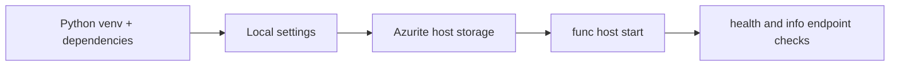

# 01 - Run Locally (Premium)

Run the Function App locally with Azure Functions Core Tools using Premium-plan assumptions so local behavior stays close to Elastic Premium production.

## Prerequisites

| Tool | Minimum version | Purpose |
|---|---|---|
| Python | 3.11 | Runtime for local execution |
| Azure Functions Core Tools | 4.x | Local Azure Functions host |
| Azure CLI | 2.60+ | Subscription and resource commands |
| Azurite | Latest | Local Storage emulator for `AzureWebJobsStorage` |

Premium track variables used in every tutorial:

```bash
export RG="rg-func-premium-demo"
export APP_NAME="func-premium-demo"
export PLAN_NAME="plan-premium-demo"
export STORAGE_NAME="stpremdemo123"
export LOCATION="eastus2"
```

## What You'll Build

- A local Python Functions runtime started from `apps/python/`.
- A local configuration file at `apps/python/local.settings.json` using Azurite host storage.
- A quick validation flow for `/api/health` and `/api/info` before Premium deployment.



## Steps

1. Create and activate a virtual environment, then install dependencies.

    ```bash
    python3 --version
    python3 -m venv .venv
    source .venv/bin/activate
    python3 -m pip install --upgrade pip
    python3 -m pip install --requirement apps/python/requirements.txt
    ```

2. Copy local settings and set required values.

    ```bash
    cp apps/python/local.settings.json.example apps/python/local.settings.json
    ```

    Use this baseline in `apps/python/local.settings.json`:

    ```json
    {
      "IsEncrypted": false,
      "Values": {
        "FUNCTIONS_WORKER_RUNTIME": "python",
        "AzureWebJobsStorage": "UseDevelopmentStorage=true",
        "AZURE_FUNCTIONS_ENVIRONMENT": "Development"
      }
    }
    ```

3. Start Azurite for local host storage.

    ```bash
    azurite --silent --location "/tmp/azurite" --debug "/tmp/azurite/debug.log"
    ```

4. Start the Functions host from the app directory.

    ```bash
    cd apps/python
    func host start
    ```

5. Call sample endpoints from a second terminal.

    ```bash
    curl --request GET "http://localhost:7071/api/health"
    curl --request GET "http://localhost:7071/api/info"
    ```

6. Validate Premium-specific operating assumptions before deployment.

    - Python Functions on Premium run on Linux in this tutorial track.
    - Plan SKUs are `EP1`, `EP2`, and `EP3` in tier `ElasticPremium`.
    - Pre-warmed instances reduce cold start, and Premium does not scale to zero (minimum 1 instance always running).
    - Scaling is plan-level, not per-function; max scale is 100 instances.
    - Default execution timeout is 30 minutes; max timeout is unlimited.
    - Memory per instance: EP1 = 3.5 GB, EP2 = 7 GB, EP3 = 14 GB.

## Verification

```text
Python 3.11.x
Successfully installed ...
Azurite Blob service is starting at http://127.0.0.1:10000
Azure Functions Core Tools
Core Tools Version:       4.x.x
Function Runtime Version: 4.x.x.x

Functions:
        health: [GET] http://localhost:7071/api/health
        info: [GET] http://localhost:7071/api/info
```

```json
{"status":"healthy","timestamp":"2026-01-01T00:00:00Z","version":"1.0.0"}
```

## Next Steps

> **Next:** [02 - First Deploy](02-first-deploy.md)

## See Also

- [Tutorial Overview & Plan Chooser](../index.md)
- [Python Language Guide](../../index.md)
- [Platform: Hosting Plans](../../../../platform/hosting.md)
- [Operations: Deployment](../../../../operations/deployment.md)
- [Recipes Index](../../recipes/index.md)

## Sources

- [Run Azure Functions locally](https://learn.microsoft.com/azure/azure-functions/functions-run-local)
- [Azure Functions Premium plan](https://learn.microsoft.com/azure/azure-functions/functions-premium-plan)
- [Azure Functions hosting options](https://learn.microsoft.com/azure/azure-functions/functions-scale)
