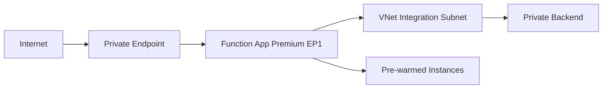

# 02 - First Deploy (Premium)

Deploy a Python Function App to an Elastic Premium plan (`EP1`) with VNet integration and private endpoint support, then publish code and verify the app is live.

## Prerequisites

- You completed [01 - Run Locally](01-local-run.md).
- You are signed in to Azure CLI and have Contributor access.
- You already exported: `$RG`, `$APP_NAME`, `$PLAN_NAME`, `$STORAGE_NAME`, `$LOCATION` (use `koreacentral` for this guide).

## Steps

1. Authenticate and set subscription context.

    ```bash
    az login
    az account set --subscription "<subscription-id>"
    ```

2. Create resource group and storage account.

    ```bash
    az group create \
      --name "$RG" \
      --location "$LOCATION"

    az storage account create \
      --name "$STORAGE_NAME" \
      --resource-group "$RG" \
      --location "$LOCATION" \
      --sku "Standard_LRS" \
      --kind "StorageV2"
    ```

3. Create the Premium plan and Function App (Linux example).

    ```bash
    az functionapp plan create \
      --name "$PLAN_NAME" \
      --resource-group "$RG" \
      --location "$LOCATION" \
      --sku "EP1" \
      --is-linux

    az functionapp create \
      --name "$APP_NAME" \
      --resource-group "$RG" \
      --plan "$PLAN_NAME" \
      --storage-account "$STORAGE_NAME" \
      --runtime "python" \
      --runtime-version "3.11" \
      --functions-version "4" \
      --os-type "Linux"
    ```

!!! warning "Enterprise policy: Shared key access"
    Some enterprise subscriptions enforce Azure Policy that sets `allowSharedKeyAccess: false` on all storage accounts. Premium (EP1) requires `WEBSITE_CONTENTAZUREFILECONNECTIONSTRING` with a connection string that uses shared key access to create the content file share during provisioning. If your subscription has this policy, the Function App creation will fail with a 403 error. Solutions:

    - Request a policy exemption from your Azure administrator
    - Use Flex Consumption (FC1) which supports identity-based blob storage without shared keys
    - Use Dedicated (B1) which uses `WEBSITE_RUN_FROM_PACKAGE` without a content file share

4. Configure app settings using classic `siteConfig.appSettings` model values.

    ```bash
    az functionapp config appsettings set \
      --name "$APP_NAME" \
      --resource-group "$RG" \
      --settings \
        "FUNCTIONS_WORKER_RUNTIME=python"
    ```

    For Premium, both host-storage models are valid:
    - Connection string: `AzureWebJobsStorage=<connection-string>`
    - Identity-based: `AzureWebJobsStorage__accountName=<storage-account-name>`

5. Create a VNet with separate subnets for integration and private endpoints.

    ```bash
    az network vnet create \
      --name "vnet-premium-demo" \
      --resource-group "$RG" \
      --location "$LOCATION" \
      --address-prefixes "10.20.0.0/16" \
      --subnet-name "snet-integration" \
      --subnet-prefixes "10.20.1.0/24"

    az network vnet subnet create \
      --name "snet-private-endpoints" \
      --resource-group "$RG" \
      --vnet-name "vnet-premium-demo" \
      --address-prefixes "10.20.2.0/24"

    az network vnet subnet update \
      --name "snet-integration" \
      --resource-group "$RG" \
      --vnet-name "vnet-premium-demo" \
      --delegations "Microsoft.Web/serverFarms"

    az functionapp vnet-integration add \
      --name "$APP_NAME" \
      --resource-group "$RG" \
      --vnet "vnet-premium-demo" \
      --subnet "snet-integration"
    ```

6. Create a private endpoint for inbound private access.

    ```bash
    APP_ID=$(az functionapp show \
      --name "$APP_NAME" \
      --resource-group "$RG" \
      --query "id" \
      --output tsv)

    az network private-endpoint create \
      --name "pe-$APP_NAME" \
      --resource-group "$RG" \
      --location "$LOCATION" \
      --vnet-name "vnet-premium-demo" \
      --subnet "snet-private-endpoints" \
      --private-connection-resource-id "$APP_ID" \
      --group-ids "sites" \
      --connection-name "conn-$APP_NAME"
    ```

7. Publish function code (Premium supports file share-based deployment and SCM/Kudu).

    ```bash
    cd apps/python
    func azure functionapp publish "$APP_NAME" --python
    ```

8. Verify app status and endpoint.

    ```bash
    az functionapp show \
      --name "$APP_NAME" \
      --resource-group "$RG" \
      --output table

    curl --request GET "https://$APP_NAME.azurewebsites.net/api/health"
    ```

## Expected Output

### Expected output when policy allows shared key access

```json
{
  "id": "/subscriptions/<subscription-id>/resourceGroups/rg-func-premium-demo/providers/Microsoft.Web/sites/func-premium-demo",
  "location": "koreacentral",
  "name": "func-premium-demo",
  "state": "Running",
  "defaultHostName": "func-premium-demo.azurewebsites.net"
}
```

```text
Getting site publishing info...
Creating archive for current directory...
Uploading 14.8 MB [########################################]
Upload completed successfully.
Deployment completed successfully.
Syncing triggers...
Functions in func-premium-demo:
    health - [httpTrigger]
    info - [httpTrigger]
```

```json
{"status":"healthy","timestamp":"2026-01-01T00:00:00Z","version":"1.0.0"}
```

### Deployment Verification Results

!!! warning "Blocked by enterprise policy"
    In our Korea Central deployment, EP1 Premium was blocked during provisioning by the same `allowSharedKeyAccess: false` policy as Consumption. Premium plans also require `WEBSITE_CONTENTAZUREFILECONNECTIONSTRING` with shared key access for the content file share.

    **Observed error:**

    ```text
    ERROR: Creation of storage file share failed with: 'The remote server returned an error: (403) Forbidden.'.
    Please check if the storage account is accessible.
    ```

    **Workarounds:**

    - Request a policy exemption from your Azure administrator
    - Use Flex Consumption (FC1) which supports identity-based blob storage
    - Use Dedicated (B1) which uses `WEBSITE_RUN_FROM_PACKAGE` without a content file share



## Next Steps

> **Next:** [03 - Configuration](03-configuration.md)

## See Also

- [Tutorial Overview & Plan Chooser](../index.md)
- [Python Language Guide](../../index.md)
- [Platform: Hosting Plans](../../../../platform/hosting.md)
- [Operations: Deployment](../../../../operations/deployment.md)
- [Recipes Index](../../recipes/index.md)

## Sources

- [Azure Functions Premium plan](https://learn.microsoft.com/azure/azure-functions/functions-premium-plan)
- [Integrate your app with an Azure virtual network](https://learn.microsoft.com/azure/app-service/configure-vnet-integration-enable)
- [Use private endpoints for Azure App Service apps](https://learn.microsoft.com/azure/app-service/networking/private-endpoint)
