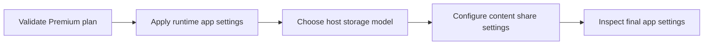

---
hide:
  - toc
validation:
  az_cli:
    last_tested: 2026-04-09
    cli_version: "2.83.0"
    core_tools_version: "4.8.0"
    result: pass
  bicep:
    last_tested: null
    result: not_tested
---

# 03 - Configuration (Premium)

Configure runtime settings, storage options, and networking-related app configuration for Azure Functions on Elastic Premium.

## Prerequisites

- You completed [02 - First Deploy](02-first-deploy.md).
- You exported `$RG`, `$APP_NAME`, `$PLAN_NAME`, `$STORAGE_NAME`, `$LOCATION`.
- Your Function App is running on `EP1`, `EP2`, or `EP3` (`ElasticPremium`).

## What You'll Build

- A validated Premium runtime configuration for Python on Linux.
- Host storage configured with either connection string or managed identity.
- Premium content-share settings aligned with Azure Files-based content storage.

!!! info "Infrastructure Context"
    **Plan**: Premium (EP1) | **Network**: VNet + Private Endpoints | **Always warm**: ✅

    Premium deploys with VNet integration (delegated subnet), a private endpoint for inbound access, private DNS zone, and pre-warmed instances. Storage uses connection string or identity-based authentication.

    ```mermaid
    flowchart TD
        INET[Internet] -->|HTTPS| FA[Function App\nPremium EP1\nLinux Python 3.11]

        subgraph VNET["VNet 10.0.0.0/16"]
            subgraph INT_SUB["Integration Subnet 10.0.1.0/24\nDelegation: Microsoft.Web/serverFarms"]
                FA
            end
            subgraph PE_SUB["Private Endpoint Subnet 10.0.2.0/24"]
                PE_BLOB[PE: blob]
                PE_QUEUE[PE: queue]
                PE_TABLE[PE: table]
                PE_FILE[PE: file]
            end
        end

        PE_BLOB --> ST["Storage Account\nallowPublicAccess: false\nallowSharedKeyAccess: true"]
        PE_QUEUE --> ST
        PE_TABLE --> ST
        PE_FILE --> ST

        subgraph DNS[Private DNS Zones]
            DNS_BLOB[privatelink.blob.core.windows.net]
            DNS_QUEUE[privatelink.queue.core.windows.net]
            DNS_TABLE[privatelink.table.core.windows.net]
            DNS_FILE[privatelink.file.core.windows.net]
        end

        PE_BLOB -.-> DNS_BLOB
        PE_QUEUE -.-> DNS_QUEUE
        PE_TABLE -.-> DNS_TABLE
        PE_FILE -.-> DNS_FILE

        FA -.->|System-Assigned MI| ENTRA[Microsoft Entra ID]
        FA --> AI[Application Insights]

        subgraph STORAGE[Content Backend]
            SHARE[Azure Files\ncontent share]
        end
        ST --- SHARE

        WARM["🔥 Pre-warmed instances\nMin: 1, Max: 20-100"] -.- FA

        style FA fill:#ff8c00,color:#fff
        style VNET fill:#E8F5E9,stroke:#4CAF50
        style ST fill:#FFF3E0
        style DNS fill:#E3F2FD
        style WARM fill:#FFF3E0,stroke:#FF9800
    ```



## Steps

1. Confirm plan SKU and operating system.

    ```bash
    az functionapp plan show \
      --name "$PLAN_NAME" \
      --resource-group "$RG" \
      --query "{sku:sku.name,tier:sku.tier,kind:kind,reserved:reserved}" \
      --output json
    ```

2. Set required runtime app settings (classic app settings path).

    ```bash
    az functionapp config appsettings set \
      --name "$APP_NAME" \
      --resource-group "$RG" \
      --settings \
        "FUNCTIONS_WORKER_RUNTIME=python" \
        "FUNCTIONS_EXTENSION_VERSION=~4"
    ```

    Do not set `WEBSITE_RUN_FROM_PACKAGE=1` for this Premium track when you use Azure Files content share settings (`WEBSITE_CONTENTSHARE` and `WEBSITE_CONTENTAZUREFILECONNECTIONSTRING`).

3. Configure host storage as a connection string.

    ```bash
    STORAGE_CONNECTION_STRING=$(az storage account show-connection-string \
      --name "$STORAGE_NAME" \
      --resource-group "$RG" \
      --query "connectionString" \
      --output tsv)

    az functionapp config appsettings set \
      --name "$APP_NAME" \
      --resource-group "$RG" \
      --settings "AzureWebJobsStorage=$STORAGE_CONNECTION_STRING"
    ```

4. (Alternative) configure host storage as identity-based.

    ```bash
    az functionapp config appsettings set \
      --name "$APP_NAME" \
      --resource-group "$RG" \
      --settings \
        "AzureWebJobsStorage__accountName=$STORAGE_NAME" \
        "AzureWebJobsStorage__credential=managedidentity"
    ```

    !!! warning "Identity-based storage requires Managed Identity and RBAC"
        Before using identity-based host storage, you must:

        1. Enable system-assigned managed identity on the Function App:
           `az functionapp identity assign --name "$APP_NAME" --resource-group "$RG"`
        2. Get the managed identity principal ID:
           `az functionapp identity show --name "$APP_NAME" --resource-group "$RG" --query "principalId" --output tsv`
        3. Grant required storage-account scoped RBAC roles:
           - `Storage Blob Data Owner`
           - `Storage Queue Data Contributor`
           - `Storage Table Data Contributor`
        4. Set both `AzureWebJobsStorage__accountName` and `AzureWebJobsStorage__credential=managedidentity` app settings.


5. Configure file share-based content settings (Premium-supported).

    ```bash
    az functionapp config appsettings set \
      --name "$APP_NAME" \
      --resource-group "$RG" \
      --settings \
        "WEBSITE_CONTENTSHARE=$APP_NAME" \
        "WEBSITE_CONTENTAZUREFILECONNECTIONSTRING=$STORAGE_CONNECTION_STRING"
    ```

6. Set Premium behavior settings and environment values.

    ```bash
    az functionapp config appsettings set \
      --name "$APP_NAME" \
      --resource-group "$RG" \
      --settings \
        "AZURE_FUNCTIONS_ENVIRONMENT=Production" \
        "WEBSITE_CONTENTOVERVNET=1" \
        "WEBSITE_VNET_ROUTE_ALL=1"
    ```

7. Inspect current app settings and verify key values.

    ```bash
    az functionapp config appsettings list \
      --name "$APP_NAME" \
      --resource-group "$RG" \
      --output table
    ```

8. Review Premium configuration constraints.

    - Premium uses plan-level scaling and keeps at least one warm instance running.
    - Maximum scale is 100 instances for the plan.
    - Execution timeout default is 30 minutes; maximum is unlimited.
    - Kudu/SCM endpoint is available at `https://$APP_NAME.scm.azurewebsites.net`.
    - File share-based deployment/content is supported on Premium.

## Verification

```json
{
  "sku": "EP1",
  "tier": "ElasticPremium",
  "kind": "elastic",
  "reserved": true
}
```

```text
[
  {
    "name": "FUNCTIONS_WORKER_RUNTIME",
    "slotSetting": false,
    "value": "python"
  },
  {
    "name": "AzureWebJobsStorage",
    "slotSetting": false,
    "value": "DefaultEndpointsProtocol=https;AccountName=stpremdemo123;AccountKey=<masked>;EndpointSuffix=core.windows.net"
  }
]
```

## Next Steps

> **Next:** [04 - Logging and Monitoring](04-logging-monitoring.md)

## See Also

- [Tutorial Overview & Plan Chooser](../index.md)
- [Python Language Guide](../../index.md)
- [Platform: Hosting Plans](../../../../platform/hosting.md)
- [Operations: Deployment](../../../../operations/deployment.md)
- [Recipes Index](../../recipes/index.md)

## Sources

- [App settings reference for Azure Functions](https://learn.microsoft.com/azure/azure-functions/functions-app-settings)
- [Functions scale and hosting](https://learn.microsoft.com/azure/azure-functions/functions-scale)
- [Azure Functions networking options](https://learn.microsoft.com/azure/azure-functions/functions-networking-options)
