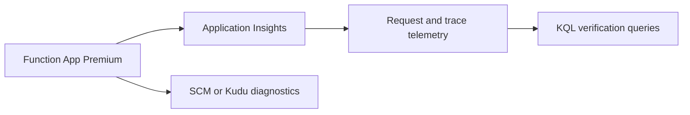

---
hide:
  - toc
---

# 04 - Logging and Monitoring (Premium)

Enable observability for a Premium Function App using Application Insights, Log Analytics queries, and Kudu/SCM diagnostics.

## Prerequisites

- You completed [03 - Configuration](03-configuration.md).
- You exported `$RG`, `$APP_NAME`, `$PLAN_NAME`, `$STORAGE_NAME`, `$LOCATION`.
- Your Function App is deployed and returning `200` from `/api/health`.

## What You'll Build

- Application Insights and Log Analytics integration for a Premium Function App.
- Live log streaming and KQL query checks for requests, traces, and exceptions.
- A repeatable diagnostics workflow using SCM/Kudu endpoints.

!!! info "Infrastructure Context"
    **Plan**: Premium (EP1) | **Network**: VNet + Private Endpoints | **Always warm**: ✅

    Premium deploys with VNet integration (delegated subnet), a private endpoint for inbound access, private DNS zone, and pre-warmed instances. Storage uses connection string or identity-based authentication.

    ```mermaid
    flowchart TD
        INET[Internet] -->|HTTPS| FA[Function App\nPremium EP1\nLinux Python 3.11]

        subgraph VNET["VNet 10.0.0.0/16"]
            subgraph INT_SUB["Integration Subnet 10.0.1.0/24\nDelegation: Microsoft.Web/serverFarms"]
                FA
            end
            subgraph PE_SUB["Private Endpoint Subnet 10.0.2.0/24"]
                PE_BLOB[PE: blob]
                PE_QUEUE[PE: queue]
                PE_TABLE[PE: table]
                PE_FILE[PE: file]
            end
        end

        PE_BLOB --> ST["Storage Account\nallowPublicAccess: false\nallowSharedKeyAccess: true"]
        PE_QUEUE --> ST
        PE_TABLE --> ST
        PE_FILE --> ST

        subgraph DNS[Private DNS Zones]
            DNS_BLOB[privatelink.blob.core.windows.net]
            DNS_QUEUE[privatelink.queue.core.windows.net]
            DNS_TABLE[privatelink.table.core.windows.net]
            DNS_FILE[privatelink.file.core.windows.net]
        end

        PE_BLOB -.-> DNS_BLOB
        PE_QUEUE -.-> DNS_QUEUE
        PE_TABLE -.-> DNS_TABLE
        PE_FILE -.-> DNS_FILE

        FA -.->|System-Assigned MI| ENTRA[Microsoft Entra ID]
        FA --> AI[Application Insights]

        subgraph STORAGE[Content Backend]
            SHARE[Azure Files\ncontent share]
        end
        ST --- SHARE

        WARM["🔥 Pre-warmed instances\nMin: 1, Max: 20-100"] -.- FA

        style FA fill:#ff8c00,color:#fff
        style VNET fill:#E8F5E9,stroke:#4CAF50
        style ST fill:#FFF3E0
        style DNS fill:#E3F2FD
        style WARM fill:#FFF3E0,stroke:#FF9800
    ```



## Steps

1. Create a Log Analytics workspace and Application Insights component.

    ```bash
    az monitor log-analytics workspace create \
      --workspace-name "log-$APP_NAME" \
      --resource-group "$RG" \
      --location "$LOCATION"

    az monitor app-insights component create \
      --app "appi-$APP_NAME" \
      --resource-group "$RG" \
      --location "$LOCATION" \
      --workspace "/subscriptions/<subscription-id>/resourceGroups/$RG/providers/Microsoft.OperationalInsights/workspaces/log-$APP_NAME" \
      --application-type "web"
    ```

2. Attach Application Insights connection string to the Function App.

    ```bash
    APPINSIGHTS_CONNECTION_STRING=$(az monitor app-insights component show \
      --app "appi-$APP_NAME" \
      --resource-group "$RG" \
      --query "connectionString" \
      --output tsv)

    az functionapp config appsettings set \
      --name "$APP_NAME" \
      --resource-group "$RG" \
      --settings "APPLICATIONINSIGHTS_CONNECTION_STRING=$APPINSIGHTS_CONNECTION_STRING"
    ```

3. Stream live logs from the app.

    ```bash
    az webapp log tail \
      --name "$APP_NAME" \
      --resource-group "$RG"
    ```

4. Query recent request telemetry.

    ```bash
    az monitor app-insights query \
      --app "appi-$APP_NAME" \
      --resource-group "$RG" \
      --analytics-query "requests | where timestamp > ago(15m) | project timestamp, name, resultCode, duration | order by timestamp desc | take 20" \
      --output table
    ```

5. Query exceptions and traces.

    ```bash
    az monitor app-insights query \
      --app "appi-$APP_NAME" \
      --resource-group "$RG" \
      --analytics-query "exceptions | where timestamp > ago(24h) | project timestamp, type, outerMessage | order by timestamp desc | take 20" \
      --output table

    az monitor app-insights query \
      --app "appi-$APP_NAME" \
      --resource-group "$RG" \
      --analytics-query "traces | where timestamp > ago(15m) | project timestamp, severityLevel, message | order by timestamp desc | take 20" \
      --output table
    ```

6. Use Kudu/SCM for runtime diagnostics (Premium supports SCM).

    ```bash
    az functionapp deployment list-publishing-profiles \
      --name "$APP_NAME" \
      --resource-group "$RG" \
      --output table
    ```

    Then open `https://$APP_NAME.scm.azurewebsites.net` and inspect:
    - `LogFiles/Application/Functions/Function/*`
    - `Debug console` for filesystem checks
    - deployed artifacts (file share-based content)

7. Confirm Premium monitoring expectations.

    - Pre-warmed instances reduce trigger and HTTP cold-start latency.
    - Because at least one instance always runs, baseline telemetry remains active.
    - Scaling events occur at plan level across functions in the same app plan.

## Verification

```text
Live Log Stream --- Connected
2026-01-01T00:01:02.345 [Information] Executing 'Functions.health' (Reason='This function was programmatically called via the host APIs.', Id=xxxxxxxx-xxxx-xxxx-xxxx-xxxxxxxxxxxx)
2026-01-01T00:01:02.512 [Information] Executed 'Functions.health' (Succeeded, Id=xxxxxxxx-xxxx-xxxx-xxxx-xxxxxxxxxxxx, Duration=167ms)
```

```text
Timestamp                  Name    ResultCode    Duration
-------------------------  ------  ----------    --------
2026-01-01T00:01:02.512Z   health  200           00:00:00.167
```

## Next Steps

> **Next:** [05 - Infrastructure as Code](05-infrastructure-as-code.md)

## See Also

- [Tutorial Overview & Plan Chooser](../index.md)
- [Python Language Guide](../../index.md)
- [Platform: Hosting Plans](../../../../platform/hosting.md)
- [Operations: Deployment](../../../../operations/deployment.md)
- [Recipes Index](../../recipes/index.md)

## Sources

- [Monitor Azure Functions](https://learn.microsoft.com/azure/azure-functions/monitor-functions)
- [Application Insights query with Azure CLI](https://learn.microsoft.com/azure/azure-monitor/app/azure-cli)
- [Kudu service overview](https://github.com/projectkudu/kudu/wiki)
