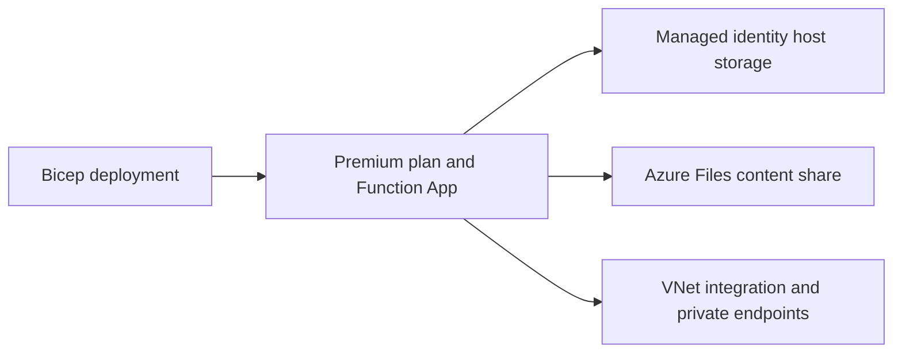

# 05 - Infrastructure as Code (Premium)

Deploy Azure Functions Premium infrastructure with Bicep from `infra/premium/main.bicep`, including Elastic Premium plan settings, VNet integration, private endpoints, identity-based host storage, and Azure Files content share.

## Prerequisites

- You completed [04 - Logging and Monitoring](04-logging-monitoring.md).
- You exported `$RG`, `$APP_NAME`, `$PLAN_NAME`, `$STORAGE_NAME`, `$LOCATION`.
- Azure CLI is authenticated to your target subscription.

## What You'll Build

- A Premium (`EP1`) Function App infrastructure model defined with Bicep.
- VNet integration, private endpoints, and private DNS links for core dependencies.
- Identity-based host storage settings plus Azure Files content-share configuration.

!!! info "Infrastructure Context"
    **Plan**: Premium (EP1) | **Network**: VNet + Private Endpoints | **Always warm**: ✅

    Premium deploys with VNet integration (delegated subnet), a private endpoint for inbound access, private DNS zone, and pre-warmed instances. Storage uses connection string or identity-based authentication.

    ```mermaid
    flowchart TD
        INET[Internet] -->|HTTPS| FA[Function App\nPremium EP1\nLinux Python 3.11]

        subgraph VNET["VNet 10.0.0.0/16"]
            subgraph INT_SUB["Integration Subnet 10.0.1.0/24\nDelegation: Microsoft.Web/serverFarms"]
                FA
            end
            subgraph PE_SUB["Private Endpoint Subnet 10.0.2.0/24"]
                PE_BLOB[PE: blob]
                PE_QUEUE[PE: queue]
                PE_TABLE[PE: table]
                PE_FILE[PE: file]
            end
        end

        PE_BLOB --> ST["Storage Account\nallowPublicAccess: false\nallowSharedKeyAccess: true"]
        PE_QUEUE --> ST
        PE_TABLE --> ST
        PE_FILE --> ST

        subgraph DNS[Private DNS Zones]
            DNS_BLOB[privatelink.blob.core.windows.net]
            DNS_QUEUE[privatelink.queue.core.windows.net]
            DNS_TABLE[privatelink.table.core.windows.net]
            DNS_FILE[privatelink.file.core.windows.net]
        end

        PE_BLOB -.-> DNS_BLOB
        PE_QUEUE -.-> DNS_QUEUE
        PE_TABLE -.-> DNS_TABLE
        PE_FILE -.-> DNS_FILE

        FA -.->|System-Assigned MI| ENTRA[Microsoft Entra ID]
        FA --> AI[Application Insights]

        subgraph STORAGE[Content Backend]
            SHARE[Azure Files\ncontent share]
        end
        ST --- SHARE

        WARM["🔥 Pre-warmed instances\nMin: 1, Max: 20-100"] -.- FA

        style FA fill:#ff8c00,color:#fff
        style VNET fill:#E8F5E9,stroke:#4CAF50
        style ST fill:#FFF3E0
        style DNS fill:#E3F2FD
        style WARM fill:#FFF3E0,stroke:#FF9800
    ```



## Steps

1. Create the Premium IaC folder.

    ```bash
    mkdir --parents "infra/premium"
    ```

2. Create `infra/premium/main.bicep` with Premium plan and storage resources.

    ```bicep
    targetScope = 'resourceGroup'

    param location string = resourceGroup().location
    param planName string
    param appName string
    param storageName string

    resource plan 'Microsoft.Web/serverfarms@2023-12-01' = {
      name: planName
      location: location
      sku: {
        name: 'EP1'
        tier: 'ElasticPremium'
      }
      kind: 'elastic'
      properties: {
        reserved: true
      }
    }

    resource storage 'Microsoft.Storage/storageAccounts@2023-01-01' = {
      name: storageName
      location: location
      sku: {
        name: 'Standard_LRS'
      }
      kind: 'StorageV2'
      properties: {
        supportsHttpsTrafficOnly: true
      }
    }

    resource fileService 'Microsoft.Storage/storageAccounts/fileServices@2023-01-01' = {
      name: '${storage.name}/default'
    }

    resource contentShare 'Microsoft.Storage/storageAccounts/fileServices/shares@2023-01-01' = {
      name: '${storage.name}/default/${toLower(appName)}'
      properties: {
        accessTier: 'TransactionOptimized'
      }
    }
    ```

3. Add VNet, delegated subnet, and private endpoint resources.

    ```bicep
    resource vnet 'Microsoft.Network/virtualNetworks@2023-09-01' = {
      name: 'vnet-premium-demo'
      location: location
      properties: {
        addressSpace: {
          addressPrefixes: [
            '10.20.0.0/16'
          ]
        }
        subnets: [
          {
            name: 'snet-integration'
            properties: {
              addressPrefix: '10.20.1.0/24'
              delegations: [
                {
                  name: 'web-farms'
                  properties: {
                    serviceName: 'Microsoft.Web/serverFarms'
                  }
                }
              ]
            }
          }
          {
            name: 'snet-private-endpoints'
            properties: {
              addressPrefix: '10.20.2.0/24'
              privateEndpointNetworkPolicies: 'Disabled'
            }
          }
        ]
      }
    }

    resource privateEndpoint 'Microsoft.Network/privateEndpoints@2023-09-01' = {
      name: 'pe-${appName}'
      location: location
      properties: {
        subnet: {
          id: resourceId('Microsoft.Network/virtualNetworks/subnets', vnet.name, 'snet-private-endpoints')
        }
        privateLinkServiceConnections: [
          {
            name: 'conn-${appName}'
            properties: {
              privateLinkServiceId: functionApp.id
              groupIds: [
                'sites'
              ]
            }
          }
        ]
      }
    }
    ```

4. Add Function App configuration with identity-based host storage.

    ```bicep
    resource functionApp 'Microsoft.Web/sites@2024-04-01' = {
      name: appName
      location: location
      kind: 'functionapp,linux'
      properties: {
        serverFarmId: plan.id
        httpsOnly: true
        virtualNetworkSubnetId: resourceId('Microsoft.Network/virtualNetworks/subnets', vnet.name, 'snet-integration')
        siteConfig: {
          linuxFxVersion: 'Python|3.11'
          minTlsVersion: '1.2'
          ftpsState: 'Disabled'
          appSettings: [
            {
              name: 'FUNCTIONS_EXTENSION_VERSION'
              value: '~4'
            }
            {
              name: 'FUNCTIONS_WORKER_RUNTIME'
              value: 'python'
            }
            {
              name: 'WEBSITE_CONTENTSHARE'
              value: toLower(appName)
            }
            {
              name: 'WEBSITE_CONTENTAZUREFILECONNECTIONSTRING'
              value: 'DefaultEndpointsProtocol=https;AccountName=${storageName};AccountKey=<resolved-at-deploy>;EndpointSuffix=core.windows.net'
            }
            {
              name: 'AzureWebJobsStorage__accountName'
              value: storageName
            }
            {
              name: 'AzureWebJobsStorage__credential'
              value: 'managedidentity'
            }
            {
              name: 'APPLICATIONINSIGHTS_CONNECTION_STRING'
              value: '<resolved-at-deploy>'
            }
          ]
        }
      }
    }
    ```

    !!! note "Connection strings vs identity-based storage"
        The repository Premium template uses **identity-based host storage** (`AzureWebJobsStorage__accountName` + `AzureWebJobsStorage__credential=managedidentity`) and **Azure Files** for content share deployment (`WEBSITE_CONTENTSHARE` + `WEBSITE_CONTENTAZUREFILECONNECTIONSTRING`). This matches `infra/premium/main.bicep`.

        Premium uses classic `siteConfig.appSettings` and does not use `functionAppConfig`.

5. Deploy the template.

    ```bash
    az group create \
      --name "$RG" \
      --location "$LOCATION"

    az deployment group create \
      --resource-group "$RG" \
      --name "premium-main" \
      --template-file "infra/premium/main.bicep" \
      --parameters \
        baseName="premdemo" \
        location="$LOCATION"
    ```

    !!! note "Tutorial snippet vs actual infra/"
        The Bicep snippets above are simplified for learning. The actual `infra/premium/main.bicep` uses a `baseName` parameter and shared modules (`infra/modules/`). Use the deployment command in this section to deploy the repository template directly.

6. Verify Premium resources and SKU.

    ```bash
    az resource list \
      --resource-group "$RG" \
      --output table

    az functionapp plan show \
      --name "$PLAN_NAME" \
      --resource-group "$RG" \
      --query "{sku:sku.name,tier:sku.tier,maxWorkers:maximumElasticWorkerCount}" \
      --output json
    ```

## Verification

```text
Name                              ResourceType
--------------------------------  --------------------------------------
plan-premium-demo                 Microsoft.Web/serverfarms
func-premium-demo                 Microsoft.Web/sites
stpremdemo123                     Microsoft.Storage/storageAccounts
vnet-premium-demo                 Microsoft.Network/virtualNetworks
pe-func-premium-demo              Microsoft.Network/privateEndpoints
```

```json
{
  "sku": "EP1",
  "tier": "ElasticPremium",
  "maxWorkers": 100
}
```

## Next Steps

> **Next:** [06 - CI/CD](06-ci-cd.md)

## See Also

- [Tutorial Overview & Plan Chooser](../index.md)
- [Python Language Guide](../../index.md)
- [Platform: Hosting Plans](../../../../platform/hosting.md)
- [Operations: Deployment](../../../../operations/deployment.md)
- [Recipes Index](../../recipes/index.md)

## Sources

- [Azure Functions infrastructure as code](https://learn.microsoft.com/azure/azure-functions/functions-infrastructure-as-code)
- [Azure Functions Premium plan](https://learn.microsoft.com/azure/azure-functions/functions-premium-plan)
- [Azure private endpoints](https://learn.microsoft.com/azure/private-link/private-endpoint-overview)
