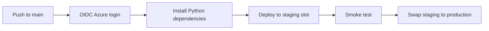

---
hide:
  - toc
validation:
  az_cli:
    last_tested: 2026-04-09
    cli_version: "2.83.0"
    core_tools_version: "4.8.0"
    result: pass
  bicep:
    last_tested: null
    result: not_tested
---

# 06 - CI/CD (Premium)

Build a GitHub Actions pipeline for Azure Functions Premium, then add safe production rollout with deployment slots.

## Prerequisites

- You completed [05 - Infrastructure as Code](05-infrastructure-as-code.md).
- You exported `$RG`, `$APP_NAME`, `$PLAN_NAME`, `$STORAGE_NAME`, `$LOCATION`.
- GitHub repository admin access for Actions variables and environments.

## What You'll Build

- A GitHub Actions workflow that deploys Python Functions from `apps/python` to a staging slot.
- OIDC-based Azure authentication and slot swap rollout for Premium.
- A CI check step that installs Python dependencies from `apps/python/requirements.txt`.

!!! info "Infrastructure Context"
    **Plan**: Premium (EP1) | **Network**: VNet + Private Endpoints | **Always warm**: ✅

    Premium deploys with VNet integration (delegated subnet), a private endpoint for inbound access, private DNS zone, and pre-warmed instances. Storage uses connection string or identity-based authentication.

    ```mermaid
    flowchart TD
        INET[Internet] -->|HTTPS| FA[Function App\nPremium EP1\nLinux Python 3.11]

        subgraph VNET["VNet 10.0.0.0/16"]
            subgraph INT_SUB["Integration Subnet 10.0.1.0/24\nDelegation: Microsoft.Web/serverFarms"]
                FA
            end
            subgraph PE_SUB["Private Endpoint Subnet 10.0.2.0/24"]
                PE_BLOB[PE: blob]
                PE_QUEUE[PE: queue]
                PE_TABLE[PE: table]
                PE_FILE[PE: file]
            end
        end

        PE_BLOB --> ST["Storage Account\nallowPublicAccess: false\nallowSharedKeyAccess: true"]
        PE_QUEUE --> ST
        PE_TABLE --> ST
        PE_FILE --> ST

        subgraph DNS[Private DNS Zones]
            DNS_BLOB[privatelink.blob.core.windows.net]
            DNS_QUEUE[privatelink.queue.core.windows.net]
            DNS_TABLE[privatelink.table.core.windows.net]
            DNS_FILE[privatelink.file.core.windows.net]
        end

        PE_BLOB -.-> DNS_BLOB
        PE_QUEUE -.-> DNS_QUEUE
        PE_TABLE -.-> DNS_TABLE
        PE_FILE -.-> DNS_FILE

        FA -.->|System-Assigned MI| ENTRA[Microsoft Entra ID]
        FA --> AI[Application Insights]

        subgraph STORAGE[Content Backend]
            SHARE[Azure Files\ncontent share]
        end
        ST --- SHARE

        WARM["🔥 Pre-warmed instances\nMin: 1, Max: 20-100"] -.- FA

        style FA fill:#ff8c00,color:#fff
        style VNET fill:#E8F5E9,stroke:#4CAF50
        style ST fill:#FFF3E0
        style DNS fill:#E3F2FD
        style WARM fill:#FFF3E0,stroke:#FF9800
    ```



## Steps

1. Configure OIDC service principal for GitHub Actions.

    ```bash
    az ad app create \
      --display-name "github-$APP_NAME"

    az ad sp create \
      --id "<app-id-from-previous-command>"

    az ad app federated-credential create \
      --id "<app-id-from-previous-command>" \
      --parameters '{
        "name": "github-main",
        "issuer": "https://token.actions.githubusercontent.com",
        "subject": "repo:<org>/<repo>:ref:refs/heads/main",
        "audiences": ["api://AzureADTokenExchange"]
      }'

    az role assignment create \
      --assignee "<app-id-from-previous-command>" \
      --role "Contributor" \
      --scope "/subscriptions/<subscription-id>/resourceGroups/$RG"
    ```

2. Create deployment slots for Premium staging and warm-up.

    ```bash
    az functionapp deployment slot create \
      --name "$APP_NAME" \
      --resource-group "$RG" \
      --slot "staging"

    az functionapp deployment slot list \
      --name "$APP_NAME" \
      --resource-group "$RG" \
      --output table
    ```

    !!! warning "Staging slot requires separate configuration"
        The staging slot starts as a blank app. You must configure it separately:

        - Assign a system-assigned managed identity
        - Grant the same 4 storage RBAC roles as the production slot
        - Set all required app settings (`FUNCTIONS_WORKER_RUNTIME`, `AzureWebJobsStorage__accountName`, etc.)
        - Create the content share for the slot

        The first deployment to a new slot may fail with "Application Error (ServiceUnavailable)" if the slot is not fully initialized. Wait 30–60 seconds after creation before deploying.

3. Mark slot-specific app settings.

    ```bash
    az functionapp config appsettings set \
      --name "$APP_NAME" \
      --resource-group "$RG" \
      --slot "staging" \
      --slot-settings \
        "AZURE_FUNCTIONS_ENVIRONMENT=Staging"
    ```

4. Define required GitHub Actions repository variables before workflow execution.

    - `AZURE_CLIENT_ID`
    - `AZURE_TENANT_ID`
    - `AZURE_SUBSCRIPTION_ID`
    - `AZURE_FUNCTIONAPP_NAME`
    - `AZURE_RESOURCE_GROUP`

5. Create a GitHub Actions workflow for deploy-to-slot then swap.

    ```yaml
    name: Deploy Premium Function App

    on:
      push:
        branches:
          - main
      workflow_dispatch:

    permissions:
      id-token: write
      contents: read

    jobs:
      deploy:
        runs-on: ubuntu-latest
        steps:
          - name: Checkout
            uses: actions/checkout@v4

          - name: Setup Python
            uses: actions/setup-python@v5
            with:
              python-version: '3.11'

          - name: Install dependencies
            run: |
              python -m pip install --upgrade pip
              pip install --requirement requirements.txt
            working-directory: apps/python

          - name: Azure login
            uses: azure/login@v2
            with:
              client-id: ${{ vars.AZURE_CLIENT_ID }}
              tenant-id: ${{ vars.AZURE_TENANT_ID }}
              subscription-id: ${{ vars.AZURE_SUBSCRIPTION_ID }}

          - name: Deploy to staging slot
            uses: azure/functions-action@v1
            with:
              app-name: ${{ vars.AZURE_FUNCTIONAPP_NAME }}
              slot-name: staging
              package: apps/python

          - name: Smoke test staging
            run: |
              curl --request GET "https://${{ vars.AZURE_FUNCTIONAPP_NAME }}-staging.azurewebsites.net/api/health"

          - name: Swap staging to production
            run: |
              az functionapp deployment slot swap \
                --name "${{ vars.AZURE_FUNCTIONAPP_NAME }}" \
                --resource-group "${{ vars.AZURE_RESOURCE_GROUP }}" \
                --slot "staging" \
                --target-slot "production"
    ```

6. Deploy from local terminal to staging slot (manual fallback).

    ```bash
    cd apps/python
    func azure functionapp publish "$APP_NAME" --python --slot "staging"
    ```

7. Validate staging and swap to production with Azure CLI.

    ```bash
    curl --request GET "https://$APP_NAME-staging.azurewebsites.net/api/health"

    az functionapp deployment slot swap \
      --name "$APP_NAME" \
      --resource-group "$RG" \
      --slot "staging" \
      --target-slot "production"

    curl --request GET "https://$APP_NAME.azurewebsites.net/api/health"
    ```

8. Verify deployment history and SCM endpoints.

    ```bash
    az functionapp deployment slot list \
      --name "$APP_NAME" \
      --resource-group "$RG" \
      --output table
    ```

    Premium includes SCM/Kudu endpoints per slot:
    - Production: `https://$APP_NAME.scm.azurewebsites.net`
    - Staging: `https://$APP_NAME-staging.scm.azurewebsites.net`

## Verification

```text
Name       Status
---------  ---------
production Running
staging    Running
```

```text
Deploying to function app slot...
Deployment completed successfully.
Syncing triggers...
```

```json
{"status":"healthy","timestamp":"2026-01-01T00:00:00Z","version":"1.0.0"}
```

## Next Steps

> **Next:** [07 - Extending Triggers](07-extending-triggers.md)

## See Also

- [Tutorial Overview & Plan Chooser](../index.md)
- [Python Language Guide](../../index.md)
- [Platform: Hosting Plans](../../../../platform/hosting.md)
- [Operations: Deployment](../../../../operations/deployment.md)
- [Recipes Index](../../recipes/index.md)

## Sources

- [Deploy to Azure Functions using GitHub Actions](https://learn.microsoft.com/azure/azure-functions/functions-how-to-github-actions)
- [Deployment slots for Azure Functions](https://learn.microsoft.com/azure/azure-functions/functions-deployment-slots)
- [Swap deployment slots](https://learn.microsoft.com/azure/azure-functions/functions-deployment-slots#swap-slots)
