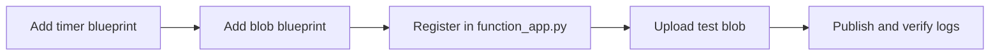

# 07 - Extending Triggers (Premium)

Add non-HTTP triggers to a Premium Function App, focusing on Blob polling and production-safe trigger behavior on always-warm Elastic Premium instances.

## Prerequisites

- You completed [06 - CI/CD](06-ci-cd.md).
- You exported `$RG`, `$APP_NAME`, `$PLAN_NAME`, `$STORAGE_NAME`, `$LOCATION`.
- Your app settings include `AzureWebJobsStorage` (connection string or identity-based).

## What You'll Build

- Two additional triggers (Timer and Blob) using Python blueprints.
- Updated blueprint registration in `apps/python/function_app.py`.
- A trigger validation flow using blob upload and live log checks.

!!! info "Infrastructure Context"
    **Plan**: Premium (EP1) | **Network**: VNet + Private Endpoints | **Always warm**: ✅

    Premium deploys with VNet integration (delegated subnet), a private endpoint for inbound access, private DNS zone, and pre-warmed instances. Storage uses connection string or identity-based authentication.

    ```mermaid
    flowchart LR
        INET[Internet] -->|Private Endpoint| PE[Private Endpoint]
        PE --> FA[Function App EP1\npre-warmed]
        FA -->|VNet Integration| SUBNET["Integration Subnet"]
        FA --> ST["Storage Account\n+ Azure Files"]
    ```



## Steps

1. Add a Timer trigger blueprint.

    ```python
    # apps/python/blueprints/scheduled.py
    import azure.functions as func
    import logging

    bp = func.Blueprint()

    @bp.timer_trigger(schedule="0 */5 * * * *", arg_name="timer", run_on_startup=False)
    def scheduled_cleanup(timer: func.TimerRequest) -> None:
        if timer.past_due:
            logging.warning("Timer trigger is past due")
        logging.info("Scheduled cleanup executed")
    ```

2. Add a standard polling Blob trigger (supported on Premium).

    ```python
    # apps/python/blueprints/blob_processor.py
    import azure.functions as func
    import logging

    bp = func.Blueprint()

    @bp.blob_trigger(arg_name="blob", path="uploads/{name}", connection="AzureWebJobsStorage")
    def process_blob(blob: func.InputStream) -> None:
        logging.info("Processing blob: %s", blob.name)
        logging.info("Blob size: %d bytes", blob.length)
    ```

    On Premium, polling blob trigger works by default. Event Grid is optional when you need lower-latency eventing.

3. Register new blueprints in `apps/python/function_app.py`.

    ```python
    from blueprints.scheduled import bp as scheduled_bp
    from blueprints.blob_processor import bp as blob_bp

    app.register_blueprint(scheduled_bp)
    app.register_blueprint(blob_bp)
    ```

4. Create containers and upload a blob for trigger testing.

    ```bash
    az storage container create \
      --name "uploads" \
      --account-name "$STORAGE_NAME" \
      --auth-mode login

    az storage container create \
      --name "processed" \
      --account-name "$STORAGE_NAME" \
      --auth-mode login

    python3 -c "from pathlib import Path; Path('/tmp/sample.txt').write_text('hello premium blob\n', encoding='utf-8')"

    az storage blob upload \
      --container-name "uploads" \
      --name "sample.txt" \
      --file "/tmp/sample.txt" \
      --account-name "$STORAGE_NAME" \
      --auth-mode login

5. Publish updated code to Premium.

    ```bash
    cd apps/python
    func azure functionapp publish "$APP_NAME" --python
    ```

6. Verify trigger execution with log stream.

    ```bash
    az webapp log tail \
      --name "$APP_NAME" \
      --resource-group "$RG"
    ```

7. Validate Premium trigger behavior.

    - Pre-warmed instances keep the host warm, so trigger cold starts are largely eliminated.
    - Scale remains plan-level for Premium apps (not per-function).
    - Standard blob polling trigger is supported; Event Grid trigger remains optional.
    - Keep timeout-sensitive jobs aware of Premium defaults (30 minutes default, unlimited max).

## Verification

```text
Functions in func-premium-demo:
    scheduled_cleanup - [timerTrigger]
    process_blob - [blobTrigger]
```

```text
2026-01-01T00:05:00.000 [Information] Executing 'Functions.scheduled_cleanup' (Reason='Timer fired', Id=xxxxxxxx-xxxx-xxxx-xxxx-xxxxxxxxxxxx)
2026-01-01T00:05:00.120 [Information] Executed 'Functions.scheduled_cleanup' (Succeeded, Id=xxxxxxxx-xxxx-xxxx-xxxx-xxxxxxxxxxxx, Duration=120ms)
2026-01-01T00:05:10.000 [Information] Processing blob: uploads/sample.txt
```

## Next Steps

> **Next:** [How Azure Functions Works](../../../../platform/architecture.md)

## See Also

- [Tutorial Overview & Plan Chooser](../index.md)
- [Python Language Guide](../../index.md)
- [Platform: Hosting Plans](../../../../platform/hosting.md)
- [Operations: Deployment](../../../../operations/deployment.md)
- [Recipes Index](../../recipes/index.md)

## Sources

- [Azure Functions triggers and bindings](https://learn.microsoft.com/azure/azure-functions/functions-triggers-bindings)
- [Blob trigger for Azure Functions](https://learn.microsoft.com/azure/azure-functions/functions-bindings-storage-blob-trigger)
- [Event Grid-based blob trigger](https://learn.microsoft.com/azure/azure-functions/functions-event-grid-blob-trigger)
