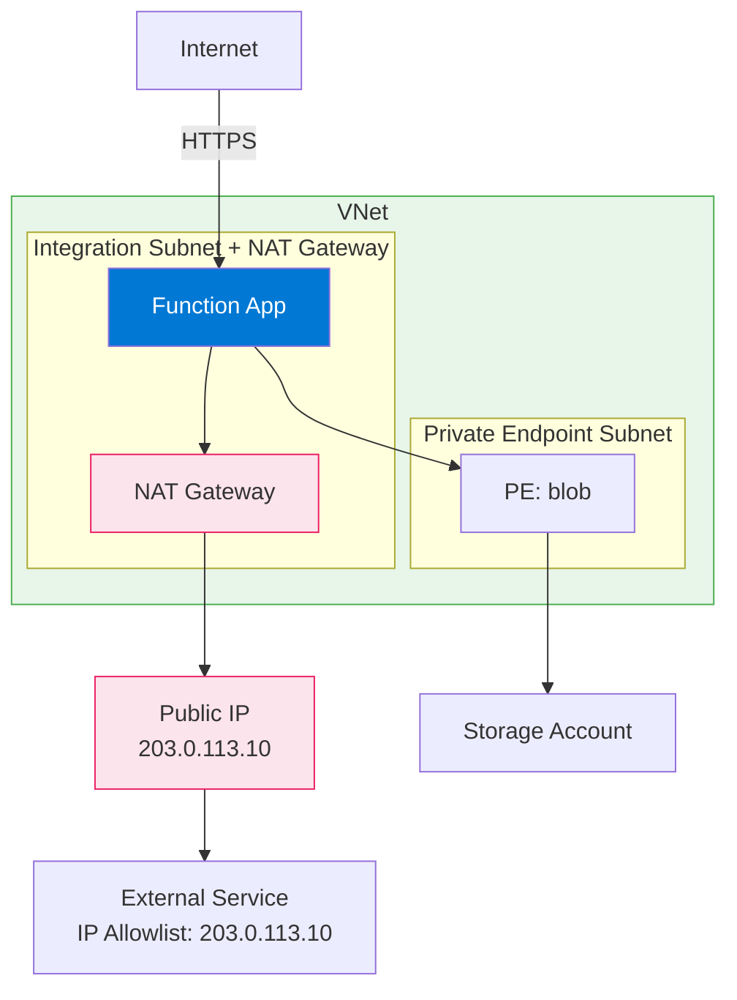
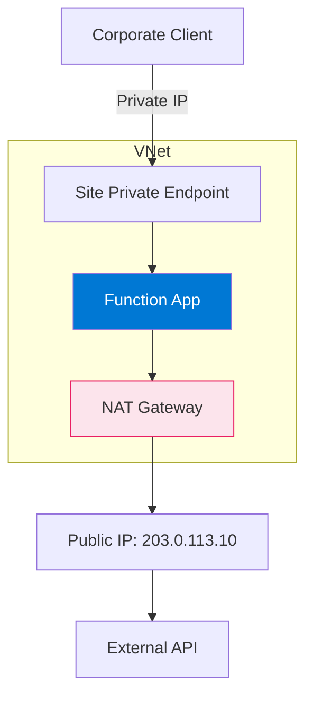

---
content_sources:
  - type: mslearn-adapted
    url: https://learn.microsoft.com/azure/azure-functions/functions-networking-options
  - type: mslearn-adapted
    url: https://learn.microsoft.com/azure/app-service/overview-nat-gateway-integration
  - type: mslearn-adapted
    url: https://learn.microsoft.com/azure/nat-gateway/nat-overview
  diagrams:
    - id: nat-gateway-architecture
      type: flowchart
      source: self-generated
      justification: "NAT Gateway integration pattern from MSLearn documentation"
      based_on:
        - https://learn.microsoft.com/azure/app-service/overview-nat-gateway-integration
---

# Scenario 4: Fixed Outbound IP (NAT Gateway)

Stable outbound IP addresses for function app egress through NAT Gateway, enabling IP-based allowlisting on downstream services.

## When to Use

- Downstream services require IP allowlisting (legacy firewalls, third-party APIs)
- Regulatory requirements for predictable egress identity
- Multi-region deployments needing consistent outbound IPs per region
- SaaS integrations that authenticate by source IP

## Architecture

<!-- diagram-id: nat-gateway-architecture -->


## Supported Plans

| Plan | Supported | Notes |
|------|:---------:|-------|
| Consumption (Y1) | :material-close: | No VNet integration |
| Flex Consumption (FC1) | :material-check: | Attach NAT to integration subnet |
| Premium (EP) | :material-check: | Full support |
| Dedicated (B1) | :material-close: | Requires S1+ for VNet |
| Dedicated (S1+) | :material-check: | Full support |

## Prerequisites

Complete [Scenario 2: Private Egress](private-egress.md) first. This scenario adds NAT Gateway to the integration subnet.

**Required from Scenario 2:**
- [ ] Function App with VNet integration enabled
- [ ] Integration subnet configured

**Additional requirements:**
- [ ] Public IP address or prefix for NAT Gateway
- [ ] NAT Gateway resource

## Step-by-Step Configuration

### Step 1: Create Public IP for NAT Gateway

```bash
az network public-ip create \
  --name "pip-nat-func" \
  --resource-group "$RG" \
  --location "$LOCATION" \
  --sku Standard \
  --allocation-method Static \
  --zone 1 2 3
```

| Command/Parameter | Purpose |
|-------------------|---------|
| `--sku Standard` | Required for NAT Gateway (Basic not supported) |
| `--allocation-method Static` | Ensures IP doesn't change |
| `--zone 1 2 3` | Zone-redundant for high availability |

### Step 2: Create NAT Gateway

```bash
az network nat gateway create \
  --name "nat-func" \
  --resource-group "$RG" \
  --location "$LOCATION" \
  --public-ip-addresses "pip-nat-func" \
  --idle-timeout 10
```

| Command/Parameter | Purpose |
|-------------------|---------|
| `--public-ip-addresses "pip-nat-func"` | Associates the static public IP |
| `--idle-timeout 10` | Connection idle timeout in minutes (4-120) |

### Step 3: Associate NAT Gateway with Integration Subnet

```bash
az network vnet subnet update \
  --name "snet-integration" \
  --resource-group "$RG" \
  --vnet-name "$VNET_NAME" \
  --nat-gateway "nat-func"
```

| Command/Parameter | Purpose |
|-------------------|---------|
| `--nat-gateway "nat-func"` | Routes all subnet egress through NAT Gateway |

### Step 4: Get NAT Gateway Public IP

```bash
az network public-ip show \
  --name "pip-nat-func" \
  --resource-group "$RG" \
  --query "ipAddress" \
  --output tsv
```

Save this IP address for downstream allowlisting.

### Step 5: Enable Route All (Premium/Dedicated Only)

For Premium and Dedicated plans, ensure all egress routes through VNet:

```bash
az functionapp config appsettings set \
  --name "$APP_NAME" \
  --resource-group "$RG" \
  --settings "WEBSITE_VNET_ROUTE_ALL=1"
```

| Command/Parameter | Purpose |
|-------------------|---------|
| `WEBSITE_VNET_ROUTE_ALL=1` | Forces all outbound traffic through VNet (and thus NAT) |

!!! note "Flex Consumption"
    FC1 already routes outbound traffic through VNet by default. `WEBSITE_VNET_ROUTE_ALL` is not required.

## Using Public IP Prefix (Multiple IPs)

For high-throughput workloads, use a public IP prefix instead of a single IP:

```bash
# Create IP prefix (e.g., /30 = 4 IPs)
az network public-ip prefix create \
  --name "pip-prefix-nat-func" \
  --resource-group "$RG" \
  --location "$LOCATION" \
  --length 30

# Create NAT Gateway with prefix
az network nat gateway create \
  --name "nat-func" \
  --resource-group "$RG" \
  --location "$LOCATION" \
  --public-ip-prefixes "pip-prefix-nat-func" \
  --idle-timeout 10
```

| Command/Parameter | Purpose |
|-------------------|---------|
| `--length 30` | CIDR prefix length (/28 = 16 IPs, /30 = 4 IPs, /31 = 2 IPs) |

## Verification

### Check NAT Gateway Association

```bash
az network vnet subnet show \
  --name "snet-integration" \
  --resource-group "$RG" \
  --vnet-name "$VNET_NAME" \
  --query "natGateway.id" \
  --output tsv
```

### Verify Outbound IP

Create a function that calls an external service showing the source IP:

```bash
curl --request GET "https://$APP_NAME.azurewebsites.net/api/check-ip"
```

Or call httpbin.org to see your egress IP:

```python
# Example function code
import azure.functions as func
import requests

def main(req: func.HttpRequest) -> func.HttpResponse:
    response = requests.get("https://httpbin.org/ip")
    return func.HttpResponse(response.text)
```

Expected: The `origin` field should match your NAT Gateway public IP.

### Test from Function App

```bash
az functionapp show \
  --name "$APP_NAME" \
  --resource-group "$RG" \
  --query "outboundIpAddresses" \
  --output tsv
```

!!! warning "outboundIpAddresses vs NAT Gateway"
    The `outboundIpAddresses` property shows default platform IPs. With NAT Gateway configured, actual egress uses the NAT Gateway IP, not these listed IPs.

## Capacity Planning

NAT Gateway has specific capacity limits:

| Metric | Limit |
|--------|-------|
| Concurrent connections per public IP | 64,000 |
| Packets per second | 1 million |
| Connections per second | 50,000 |

For high-scale workloads:
- Add more public IPs or use IP prefix
- Distribute across multiple NAT Gateways with different subnets

## Cost Considerations

NAT Gateway pricing:

| Component | Approximate Cost |
|-----------|------------------|
| NAT Gateway (per hour) | ~$0.045/hour |
| Data processed (per GB) | ~$0.045/GB |
| Public IP (per hour) | ~$0.005/hour |

!!! tip "Cost Optimization"
    NAT Gateway charges apply 24/7 regardless of usage. For development environments, consider:
    
    - Sharing one NAT Gateway across multiple function apps
    - Using NAT only in production, not dev/test

## Troubleshooting

| Symptom | Likely Cause | Solution |
|---------|--------------|----------|
| External service sees wrong IP | `WEBSITE_VNET_ROUTE_ALL` not set (EP/ASP) | Add the setting and restart |
| Connection timeouts | NAT Gateway not associated | Verify subnet has `natGateway` property |
| SNAT exhaustion | Too many concurrent connections | Add more public IPs or optimize connection pooling |
| High latency | NAT Gateway in different region | Ensure NAT is in same region as function app |

## Combining with Private Ingress

NAT Gateway can be combined with site private endpoint for full isolation:

<!-- diagram-id: full-isolation-with-nat -->


## See Also

- [Networking Scenarios Overview](index.md)
- [Scenario 2: Private Egress](private-egress.md)
- [Scenario 3: Private Ingress](private-ingress.md)
- [Platform: Networking](../platform/networking.md)

## Sources

- [Azure Functions networking options (Microsoft Learn)](https://learn.microsoft.com/azure/azure-functions/functions-networking-options)
- [NAT Gateway integration with App Service (Microsoft Learn)](https://learn.microsoft.com/azure/app-service/overview-nat-gateway-integration)
- [What is Azure NAT Gateway? (Microsoft Learn)](https://learn.microsoft.com/azure/nat-gateway/nat-overview)
