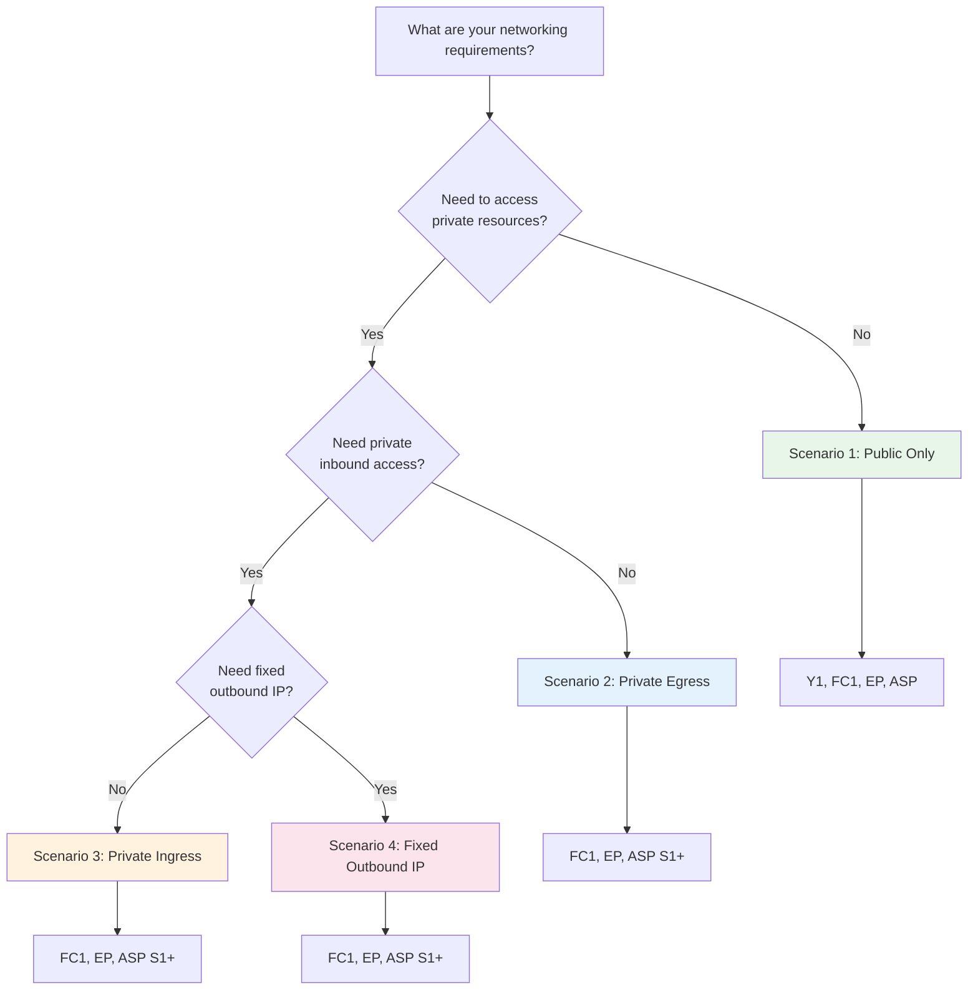

---
content_sources:
  - type: mslearn-adapted
    url: https://learn.microsoft.com/azure/azure-functions/functions-networking-options
  - type: mslearn-adapted
    url: https://learn.microsoft.com/azure/azure-functions/flex-consumption-plan
  - type: mslearn-adapted
    url: https://learn.microsoft.com/azure/azure-functions/functions-premium-plan
  - type: mslearn-adapted
    url: https://learn.microsoft.com/azure/app-service/overview-vnet-integration
  diagrams:
    - id: network-scenario-decision-tree
      type: flowchart
      source: self-generated
      justification: "Decision tree synthesized from MSLearn networking options documentation"
      based_on:
        - https://learn.microsoft.com/azure/azure-functions/functions-networking-options
---

# Networking Scenarios

This section helps you choose the right network configuration for your Azure Functions deployment based on your security and connectivity requirements.

## Quick Decision Guide

<!-- diagram-id: network-scenario-decision-tree -->

## Network Scenario Matrix

Choose your network scenario based on requirements, then select a compatible hosting plan.

!!! note "Matrix Scope"
    This matrix shows **guide-tested configurations**. Basic (B1) is marked as untested for private scenarios because this guide focuses on Standard (S1+) for production VNet workloads. Azure platform documentation indicates Basic tier supports VNet integration and private endpoints, but B1's resource constraints make it unsuitable for most private networking use cases.

| Scenario | Description | Y1 | FC1 | EP | ASP B1 | ASP S1+ |
|----------|-------------|:--:|:---:|:--:|:------:|:-------:|
| [**1. Public Only**](public-only.md) | Internet ingress, public egress | :material-check: | :material-check: | :material-check: | :material-check: | :material-check: |
| [**2. Private Egress**](private-egress.md) | Internet ingress, VNet egress to private backends | :material-close: | :material-check: | :material-check: | :material-minus:[^1] | :material-check: |
| [**3. Private Ingress**](private-ingress.md) | Private endpoint ingress, VNet egress | :material-close: | :material-check: | :material-check: | :material-minus:[^1] | :material-check: |
| [**4. Fixed Outbound IP**](fixed-outbound-nat.md) | NAT Gateway for stable egress IP | :material-close: | :material-check: | :material-check: | :material-minus:[^1] | :material-check: |

[^1]: Basic (B1) supports VNet integration per Azure documentation, but is not tested or recommended for private networking scenarios in this guide. Use Standard (S1+) for production.

## Scenario Comparison

| Feature | Public Only | Private Egress | Private Ingress | Fixed Outbound |
|---------|-------------|----------------|-----------------|----------------|
| **Inbound** | Public internet | Public internet | Private endpoint | Private endpoint |
| **Outbound** | Public internet | VNet (private) | VNet (private) | NAT Gateway (fixed IP) |
| **Storage access** | Public | Private endpoints | Private endpoints | Private endpoints |
| **Use case** | Dev/test, public APIs | Backend services | Zero-trust, compliance | IP allowlisting |
| **Complexity** | Low | Medium | Medium-High | High |
| **Cost impact** | Lowest | + VNet + PE | + VNet + PE + Site PE | + VNet + PE + NAT |

## Plan-Specific Networking Details

### Subnet Delegation Requirements

| Plan | Delegation | Notes |
|------|------------|-------|
| Flex Consumption (FC1) | `Microsoft.App/environments` | Cannot share with Container Apps environments |
| Premium (EP) | `Microsoft.Web/serverFarms` | Can share with other Premium/ASP apps |
| Dedicated (ASP S1+) | `Microsoft.Web/serverFarms` | Can share with other Premium/ASP apps |

### Storage Authentication by Plan

| Plan | Public Scenario | Private Scenario |
|------|-----------------|------------------|
| Consumption (Y1) | Connection string (shared key required) | N/A |
| Flex Consumption (FC1) | Identity-based or connection string | Identity-based (recommended) |
| Premium (EP) | Connection string or identity-based | Connection string (content share requires shared key) |
| Dedicated (ASP) | Connection string or identity-based | Identity-based with `WEBSITE_RUN_FROM_PACKAGE=1` |

!!! warning "Enterprise Policy: Shared Key Access"
    Some enterprise subscriptions enforce `allowSharedKeyAccess: false` on storage accounts. This blocks Y1 and EP deployments that require Azure Files content shares. Use FC1 (identity-based blob storage) or ASP with `WEBSITE_RUN_FROM_PACKAGE=1` in these environments.

## Getting Started

1. **Choose your scenario** from the matrix above based on your networking requirements
2. **Complete the base deployment** using your language tutorial's `02-first-deploy.md`
3. **Apply the network configuration** from the relevant scenario guide

Each scenario guide provides:

- Prerequisites and planning checklist
- Step-by-step CLI commands with plan-specific variations
- Verification steps
- Troubleshooting tips

## See Also

- [Platform: Networking](../platform/networking.md) — Detailed networking concepts
- [Platform: Deployment Scenarios](../platform/deployment-scenarios.md) — Plan-centric deployment comparison
- [Best Practices: Networking](../best-practices/networking.md) — Production networking patterns
- [Troubleshooting: DNS VNet Resolution](../troubleshooting/lab-guides/dns-vnet-resolution.md) — Common DNS issues

## Sources

- [Azure Functions networking options (Microsoft Learn)](https://learn.microsoft.com/azure/azure-functions/functions-networking-options)
- [Azure Functions Flex Consumption plan (Microsoft Learn)](https://learn.microsoft.com/azure/azure-functions/flex-consumption-plan)
- [Azure Functions Premium plan (Microsoft Learn)](https://learn.microsoft.com/azure/azure-functions/functions-premium-plan)
- [Integrate your app with an Azure virtual network (Microsoft Learn)](https://learn.microsoft.com/azure/app-service/overview-vnet-integration)
