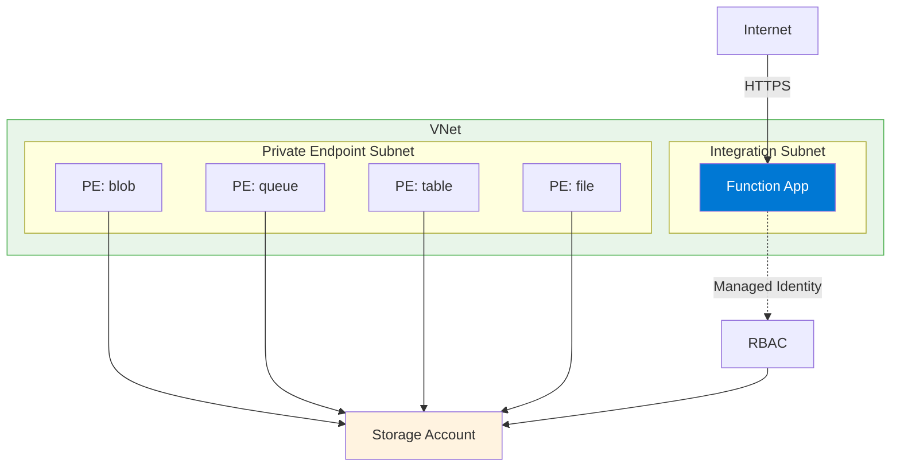

---
content_sources:
  - type: mslearn-adapted
    url: https://learn.microsoft.com/azure/azure-functions/functions-networking-options
  - type: mslearn-adapted
    url: https://learn.microsoft.com/azure/azure-functions/functions-create-vnet
  - type: mslearn-adapted
    url: https://learn.microsoft.com/azure/app-service/overview-vnet-integration
  diagrams:
    - id: private-egress-architecture
      type: flowchart
      source: self-generated
      justification: "VNet integration pattern from MSLearn networking documentation"
      based_on:
        - https://learn.microsoft.com/azure/azure-functions/functions-create-vnet
---

# Scenario 2: Private Egress (VNet + Storage PE)

Public inbound access with private outbound connectivity to backend services through VNet integration and private endpoints.

## When to Use

- Access databases, storage, or other services secured behind private endpoints
- Compliance requirements for private data plane traffic
- Hybrid connectivity to on-premises through VPN/ExpressRoute
- Multi-tier architectures with private backend services

## Architecture

<!-- diagram-id: private-egress-architecture -->


## Supported Plans

| Plan | Supported | Subnet Delegation |
|------|:---------:|-------------------|
| Consumption (Y1) | :material-close: | N/A |
| Flex Consumption (FC1) | :material-check: | `Microsoft.App/environments` |
| Premium (EP) | :material-check: | `Microsoft.Web/serverFarms` |
| Dedicated (B1) | :material-close: | N/A (requires S1+) |
| Dedicated (S1+) | :material-check: | `Microsoft.Web/serverFarms` |

## Prerequisites

Before starting, complete the base deployment from your language tutorial's `02-first-deploy.md`, then return here to add VNet integration.

**Required resources:**
- [ ] Function App deployed and running
- [ ] VNet with address space (e.g., `10.0.0.0/16`)
- [ ] Integration subnet (e.g., `10.0.1.0/24`) — empty, delegated
- [ ] Private endpoint subnet (e.g., `10.0.2.0/24`)
- [ ] Managed identity enabled on the function app

## Step-by-Step Configuration

### Step 1: Set Variables

```bash
export RG="rg-func-private-demo"
export APP_NAME="func-private-demo"
export STORAGE_NAME="stprivatedemo"
export VNET_NAME="vnet-func-demo"
export LOCATION="koreacentral"
```

| Command/Parameter | Purpose |
|-------------------|---------|
| `export RG=...` | Resource group containing all resources |
| `export VNET_NAME=...` | Virtual network name for integration |

### Step 2: Create VNet and Subnets

```bash
az network vnet create \
  --name "$VNET_NAME" \
  --resource-group "$RG" \
  --location "$LOCATION" \
  --address-prefixes "10.0.0.0/16" \
  --subnet-name "snet-integration" \
  --subnet-prefixes "10.0.1.0/24"

az network vnet subnet create \
  --name "snet-private-endpoints" \
  --resource-group "$RG" \
  --vnet-name "$VNET_NAME" \
  --address-prefixes "10.0.2.0/24"
```

| Command/Parameter | Purpose |
|-------------------|---------|
| `--address-prefixes "10.0.0.0/16"` | Total VNet address space |
| `--subnet-prefixes "10.0.1.0/24"` | Integration subnet CIDR |

### Step 3: Delegate Subnet (Plan-Specific)

=== "Flex Consumption (FC1)"

    ```bash
    az network vnet subnet update \
      --name "snet-integration" \
      --resource-group "$RG" \
      --vnet-name "$VNET_NAME" \
      --delegations "Microsoft.App/environments"
    ```

=== "Premium (EP) / Dedicated (S1+)"

    ```bash
    az network vnet subnet update \
      --name "snet-integration" \
      --resource-group "$RG" \
      --vnet-name "$VNET_NAME" \
      --delegations "Microsoft.Web/serverFarms"
    ```

| Command/Parameter | Purpose |
|-------------------|---------|
| `--delegations "Microsoft.App/environments"` | FC1 subnet delegation |
| `--delegations "Microsoft.Web/serverFarms"` | EP/ASP subnet delegation |

### Step 4: Enable VNet Integration

```bash
az functionapp vnet-integration add \
  --name "$APP_NAME" \
  --resource-group "$RG" \
  --vnet "$VNET_NAME" \
  --subnet "snet-integration"
```

| Command/Parameter | Purpose |
|-------------------|---------|
| `--vnet "$VNET_NAME"` | Target virtual network |
| `--subnet "snet-integration"` | Delegated integration subnet |

### Step 5: Create Storage Private Endpoints

```bash
export STORAGE_ID=$(az storage account show \
  --name "$STORAGE_NAME" \
  --resource-group "$RG" \
  --query "id" \
  --output tsv)

for SVC in blob queue table file; do
  az network private-endpoint create \
    --name "pe-st-$SVC" \
    --resource-group "$RG" \
    --location "$LOCATION" \
    --vnet-name "$VNET_NAME" \
    --subnet "snet-private-endpoints" \
    --private-connection-resource-id "$STORAGE_ID" \
    --group-ids "$SVC" \
    --connection-name "conn-st-$SVC"
done
```

| Command/Parameter | Purpose |
|-------------------|---------|
| `--group-ids "$SVC"` | Storage sub-resource (blob, queue, table, file) |
| `--private-connection-resource-id "$STORAGE_ID"` | Links endpoint to the storage account |

### Step 6: Create Private DNS Zones

```bash
for SVC in blob queue table file; do
  az network private-dns zone create \
    --resource-group "$RG" \
    --name "privatelink.$SVC.core.windows.net"

  az network private-dns link vnet create \
    --resource-group "$RG" \
    --zone-name "privatelink.$SVC.core.windows.net" \
    --name "link-$SVC" \
    --virtual-network "$VNET_NAME" \
    --registration-enabled false

  az network private-endpoint dns-zone-group create \
    --resource-group "$RG" \
    --endpoint-name "pe-st-$SVC" \
    --name "$SVC-dns-zone-group" \
    --private-dns-zone "privatelink.$SVC.core.windows.net" \
    --zone-name "$SVC"
done
```

| Command/Parameter | Purpose |
|-------------------|---------|
| `--registration-enabled false` | Disables auto-registration of VMs |
| `az network private-endpoint dns-zone-group create` | Links PE to DNS zone for automatic IP registration |

### Step 7: Lock Down Storage (Optional)

After private endpoints are configured, disable public access:

```bash
az storage account update \
  --name "$STORAGE_NAME" \
  --resource-group "$RG" \
  --default-action Deny \
  --allow-blob-public-access false
```

| Command/Parameter | Purpose |
|-------------------|---------|
| `--default-action Deny` | Blocks all public network access |

!!! warning "Order Matters"
    Disable public access **after** private endpoints and DNS zones are configured. Otherwise, your function app will lose storage connectivity.

### Step 8: Configure Identity-Based Storage (Recommended)

=== "Flex Consumption (FC1)"

    FC1 supports both system-assigned and user-assigned managed identity for storage. System-assigned is simpler; user-assigned is required if you need to pre-configure RBAC before app creation.

    **Option A: System-Assigned (simpler)**

    ```bash
    az functionapp config appsettings set \
      --name "$APP_NAME" \
      --resource-group "$RG" \
      --settings \
        "AzureWebJobsStorage__accountName=$STORAGE_NAME" \
        "AzureWebJobsStorage__credential=managedidentity"
    ```

    **Option B: User-Assigned (pre-configured RBAC)**

    ```bash
    export MI_CLIENT_ID=$(az identity show \
      --name "$MI_NAME" \
      --resource-group "$RG" \
      --query "clientId" \
      --output tsv)

    az functionapp config appsettings set \
      --name "$APP_NAME" \
      --resource-group "$RG" \
      --settings \
        "AzureWebJobsStorage__accountName=$STORAGE_NAME" \
        "AzureWebJobsStorage__credential=managedidentity" \
        "AzureWebJobsStorage__clientId=$MI_CLIENT_ID"
    ```

=== "Premium (EP) / Dedicated (S1+)"

    EP and ASP can use system-assigned managed identity:

    ```bash
    az functionapp config appsettings set \
      --name "$APP_NAME" \
      --resource-group "$RG" \
      --settings \
        "AzureWebJobsStorage__accountName=$STORAGE_NAME" \
        "AzureWebJobsStorage__credential=managedidentity"
    ```

| Command/Parameter | Purpose |
|-------------------|---------|
| `AzureWebJobsStorage__accountName` | Storage account name (not connection string) |
| `AzureWebJobsStorage__credential=managedidentity` | Use managed identity for authentication |

## Verification

### Check VNet Integration

```bash
az functionapp vnet-integration list \
  --name "$APP_NAME" \
  --resource-group "$RG" \
  --output table
```

### Test DNS Resolution (from within VNet)

```bash
nslookup $STORAGE_NAME.blob.core.windows.net
```

Expected: Returns private IP (e.g., `10.0.2.x`), not public IP.

### Test Function Endpoint

```bash
curl --request GET "https://$APP_NAME.azurewebsites.net/api/health"
```

## Troubleshooting

| Symptom | Likely Cause | Solution |
|---------|--------------|----------|
| Storage access denied | DNS not resolving to private IP | Verify DNS zone linked to VNet |
| Function timeout | VNet integration not active | Check `az functionapp vnet-integration list` |
| 403 on storage | RBAC not assigned | Assign `Storage Blob Data Owner` to managed identity |
| Deployment fails | Public access disabled too early | Re-enable public access, complete deployment, then disable |

## Next Steps

- [Scenario 3: Private Ingress](private-ingress.md) — Add site private endpoint for private inbound access
- [Scenario 4: Fixed Outbound IP](fixed-outbound-nat.md) — Add NAT Gateway for stable egress IP

## See Also

- [Networking Scenarios Overview](index.md)
- [Platform: Networking](../platform/networking.md)
- [Troubleshooting: DNS VNet Resolution](../troubleshooting/lab-guides/dns-vnet-resolution.md)

## Sources

- [Azure Functions networking options (Microsoft Learn)](https://learn.microsoft.com/azure/azure-functions/functions-networking-options)
- [Create a function with VNet integration (Microsoft Learn)](https://learn.microsoft.com/azure/azure-functions/functions-create-vnet)
- [Integrate your app with an Azure virtual network (Microsoft Learn)](https://learn.microsoft.com/azure/app-service/overview-vnet-integration)
