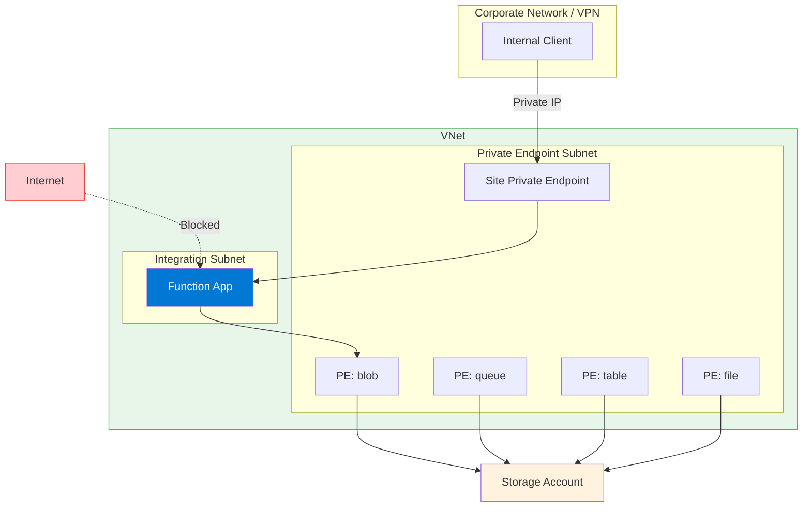

---
content_sources:
  - type: mslearn-adapted
    url: https://learn.microsoft.com/azure/azure-functions/functions-networking-options
  - type: mslearn-adapted
    url: https://learn.microsoft.com/azure/app-service/networking/private-endpoint
  - type: mslearn-adapted
    url: https://learn.microsoft.com/azure/private-link/private-endpoint-overview
  diagrams:
    - id: private-ingress-architecture
      type: flowchart
      source: self-generated
      justification: "Private endpoint ingress pattern from MSLearn networking documentation"
      based_on:
        - https://learn.microsoft.com/azure/app-service/networking/private-endpoint
---

# Scenario 3: Private Ingress (Site Private Endpoint)

Full network isolation with private inbound access via site private endpoint and private outbound through VNet integration.

## When to Use

- Zero-trust architectures requiring no public exposure
- Compliance requirements (PCI-DSS, HIPAA, FedRAMP)
- Internal-only APIs accessible only from corporate network
- Backend services in hub-spoke or landing zone architectures

## Architecture

<!-- diagram-id: private-ingress-architecture -->


## Supported Plans

| Plan | Supported | Notes |
|------|:---------:|-------|
| Consumption (Y1) | :material-close: | No private endpoint support |
| Flex Consumption (FC1) | :material-check: | Requires VNet integration first |
| Premium (EP) | :material-check: | Recommended for private workloads |
| Dedicated (B1) | :material-close: | Requires S1+ tier |
| Dedicated (S1+) | :material-check: | Full support |

## Prerequisites

Complete [Scenario 2: Private Egress](private-egress.md) first. This scenario adds a site private endpoint on top of VNet integration.

**Required from Scenario 2:**
- [ ] Function App with VNet integration enabled
- [ ] Storage private endpoints configured
- [ ] Private DNS zones linked to VNet

**Additional requirements:**
- [ ] Private DNS zone for `privatelink.azurewebsites.net`
- [ ] Network access from client (VPN, ExpressRoute, or same VNet)

## Step-by-Step Configuration

### Step 1: Get Function App Resource ID

```bash
export APP_ID=$(az functionapp show \
  --name "$APP_NAME" \
  --resource-group "$RG" \
  --query "id" \
  --output tsv)
```

| Command/Parameter | Purpose |
|-------------------|---------|
| `--query "id"` | Retrieves the full resource ID for private endpoint creation |

### Step 2: Create Site Private Endpoint

```bash
az network private-endpoint create \
  --name "pe-$APP_NAME" \
  --resource-group "$RG" \
  --location "$LOCATION" \
  --vnet-name "$VNET_NAME" \
  --subnet "snet-private-endpoints" \
  --private-connection-resource-id "$APP_ID" \
  --group-ids "sites" \
  --connection-name "conn-$APP_NAME"
```

| Command/Parameter | Purpose |
|-------------------|---------|
| `--group-ids "sites"` | Targets the function app's primary web endpoint |
| `--private-connection-resource-id "$APP_ID"` | Links the endpoint to the function app |

### Step 3: Create Private DNS Zone for Web Apps

```bash
az network private-dns zone create \
  --resource-group "$RG" \
  --name "privatelink.azurewebsites.net"

az network private-dns link vnet create \
  --resource-group "$RG" \
  --zone-name "privatelink.azurewebsites.net" \
  --name "link-webapp" \
  --virtual-network "$VNET_NAME" \
  --registration-enabled false
```

| Command/Parameter | Purpose |
|-------------------|---------|
| `privatelink.azurewebsites.net` | Standard private DNS zone for App Service/Functions |
| `--registration-enabled false` | Disables auto-registration |

### Step 4: Link Private Endpoint to DNS Zone

```bash
az network private-endpoint dns-zone-group create \
  --resource-group "$RG" \
  --endpoint-name "pe-$APP_NAME" \
  --name "webapp-dns-zone-group" \
  --private-dns-zone "privatelink.azurewebsites.net" \
  --zone-name "webapp"
```

| Command/Parameter | Purpose |
|-------------------|---------|
| `az network private-endpoint dns-zone-group create` | Automatically registers the private IP in the DNS zone |

### Step 5: Disable Public Network Access (Optional but Recommended)

```bash
az functionapp config access-restriction set \
  --name "$APP_NAME" \
  --resource-group "$RG" \
  --default-action Deny

az functionapp update \
  --name "$APP_NAME" \
  --resource-group "$RG" \
  --set publicNetworkAccess=Disabled
```

| Command/Parameter | Purpose |
|-------------------|---------|
| `--default-action Deny` | Blocks all public access via access restrictions |
| `publicNetworkAccess=Disabled` | Completely disables the public endpoint |

!!! warning "SCM Site Access"
    Disabling public access also blocks the SCM/Kudu site. For deployment:
    
    - Use a self-hosted agent in the VNet for CI/CD
    - Deploy from a VM with VNet access
    - Use Azure DevOps or GitHub Actions with VNet connectivity

### Step 6: SCM Access for Deployment

!!! info "SCM Access with Private Endpoints"
    When you create a private endpoint with `--group-ids "sites"`, both the main site and SCM/Kudu endpoint are accessible via the same private endpoint. The DNS zone creates A records for both:
    
    - `your-app.azurewebsites.net` → private IP
    - `your-app.scm.azurewebsites.net` → same private IP
    
    No separate SCM private endpoint is needed for most scenarios.

For deployment from within the VNet:

```bash
# From a VM or agent in the VNet
func azure functionapp publish "$APP_NAME"
```

| Command/Parameter | Purpose |
|-------------------|---------|
| `func azure functionapp publish` | Deploys to the function app via SCM endpoint |

## Verification

### Check Private Endpoint Status

```bash
az network private-endpoint show \
  --name "pe-$APP_NAME" \
  --resource-group "$RG" \
  --query "privateLinkServiceConnections[0].privateLinkServiceConnectionState.status" \
  --output tsv
```

Expected output: `Approved`

### Test DNS Resolution (from VNet)

```bash
nslookup $APP_NAME.azurewebsites.net
```

Expected: Returns private IP (e.g., `10.0.2.x`), not public IP.

### Test Function Endpoint (from VNet)

```bash
curl --request GET "https://$APP_NAME.azurewebsites.net/api/health"
```

!!! note "Access from VNet Only"
    After disabling public access, the function is only reachable from within the VNet or connected networks (VPN/ExpressRoute).

## CI/CD Considerations

With public access disabled, deployment requires VNet connectivity:

### Option A: Self-Hosted Agent in VNet

Deploy a VM or container in the VNet running Azure DevOps agent or GitHub Actions runner.

### Option B: Azure DevOps with VNet Integration

Use Azure DevOps Managed DevOps Pool with VNet integration (preview).

### Option C: GitHub Actions with Private Networking

Use GitHub Actions larger runners with Azure private networking (preview).

### Option D: Temporary Public Access

```bash
# Enable public access for deployment
az functionapp update \
  --name "$APP_NAME" \
  --resource-group "$RG" \
  --set publicNetworkAccess=Enabled

# Deploy
func azure functionapp publish "$APP_NAME"

# Disable public access
az functionapp update \
  --name "$APP_NAME" \
  --resource-group "$RG" \
  --set publicNetworkAccess=Disabled
```

| Command/Parameter | Purpose |
|-------------------|---------|
| `--set publicNetworkAccess=Enabled` | Temporarily allows public access for deployment |
| `func azure functionapp publish` | Deploys the function app code |
| `--set publicNetworkAccess=Disabled` | Restores private-only access after deployment |

## Troubleshooting

| Symptom | Likely Cause | Solution |
|---------|--------------|----------|
| Connection refused | DNS resolving to public IP | Verify DNS zone linked to VNet |
| 403 Forbidden | Public access disabled, not on VNet | Connect via VPN or from VM in VNet |
| Deployment fails | SCM site not accessible | Add SCM private endpoint or use temporary public access |
| DNS not resolving | Zone not linked or cached | Check `az network private-dns link vnet list`, clear DNS cache |

## Next Steps

- [Scenario 4: Fixed Outbound IP](fixed-outbound-nat.md) — Add NAT Gateway for stable egress IP

## See Also

- [Networking Scenarios Overview](index.md)
- [Scenario 2: Private Egress](private-egress.md)
- [Platform: Networking](../platform/networking.md)

## Sources

- [Azure Functions networking options (Microsoft Learn)](https://learn.microsoft.com/azure/azure-functions/functions-networking-options)
- [Use private endpoints for Azure App Service (Microsoft Learn)](https://learn.microsoft.com/azure/app-service/networking/private-endpoint)
- [What is Azure Private Endpoint? (Microsoft Learn)](https://learn.microsoft.com/azure/private-link/private-endpoint-overview)
