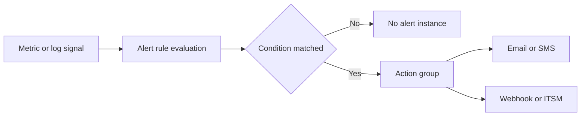

---
content_sources:
  - type: mslearn-adapted
    url: https://learn.microsoft.com/azure/azure-monitor/alerts/action-groups
  - type: mslearn-adapted
    url: https://learn.microsoft.com/azure/azure-monitor/alerts/alerts-metric
  - type: mslearn-adapted
    url: https://learn.microsoft.com/azure/azure-monitor/alerts/alerts-log
  - type: mslearn-adapted
    url: https://learn.microsoft.com/azure/azure-monitor/alerts/alerts-create-log-alert-rule
  - type: mslearn-adapted
    url: https://learn.microsoft.com/azure/azure-monitor/alerts/proactive-diagnostics
---

# Alerts
This guide explains how to build actionable alerting for Azure Functions.
It covers metric alerts, log query alerts, smart detection, and action groups.
!!! tip "Platform Guide"
    For scaling architecture and plan comparison, see [Scaling](../platform/scaling.md).
!!! tip "Language Guide"
    For Python deployment specifics, see the [Python Tutorial](../language-guides/python/tutorial/index.md).
## Prerequisites
- Azure CLI installed and authenticated with `az login`.
- Contributor (or higher) permissions for the target resource group.
- Function App deployed and connected to Application Insights.
- Action group recipients and ownership mapping defined.
- Baseline traffic and error profile from at least 7 days of telemetry.
Suggested variables used in examples:
```bash
RG="rg-functions-prod"
APP_NAME="func-orders-prod"
ACTION_GROUP_NAME="ag-functions-prod"
ACTION_GROUP_SHORT="funcpd"
FUNC_ID="/subscriptions/<subscription-id>/resourceGroups/rg-functions-prod/providers/Microsoft.Web/sites/func-orders-prod"
APPINSIGHTS_ID="/subscriptions/<subscription-id>/resourceGroups/rg-observability-prod/providers/microsoft.insights/components/appi-functions-prod"
WORKSPACE_ID="/subscriptions/<subscription-id>/resourceGroups/rg-observability-prod/providers/Microsoft.OperationalInsights/workspaces/log-functions-prod"
ACTION_GROUP_ID="/subscriptions/<subscription-id>/resourceGroups/rg-functions-prod/providers/microsoft.insights/actionGroups/ag-functions-prod"
```

| Command/Parameter | Purpose |
|-------------------|---------|
| `RG` | Resource group name |
| `APP_NAME` | Function app name |
| `ACTION_GROUP_NAME` | Full name for the action group |
| `ACTION_GROUP_SHORT` | Short name for SMS/notification headers |
| `FUNC_ID` | Azure resource ID for the function app |
| `APPINSIGHTS_ID` | Azure resource ID for Application Insights |
| `WORKSPACE_ID` | Azure resource ID for the Log Analytics workspace |
| `ACTION_GROUP_ID` | Azure resource ID for the action group |

## When to Use
Use the alert type that matches the failure signal:

| Alert type | Best use case | Typical evaluation | Good for paging |
|---|---|---|---|
| **Metric alerts** | Fast health regressions from platform metrics | 1-minute to 5-minute windows | Yes |
| **Log query alerts** | Pattern-based failures requiring KQL context | 5-minute to 15-minute windows | Yes |
| **Smart detection** | ML-based anomaly hints in Application Insights | Model-driven intervals | No (triage first) |
Quick decision rule:
- Choose **metric alerts** for immediate platform symptoms like 5xx bursts.
- Choose **log query alerts** for scoped conditions like per-function failure ratio.
- Choose **smart detection** as supplementary signal, not your only paging mechanism.
## Procedure
### Alerting principles
Use alert rules that are:
- **Actionable**: someone can do something immediately.
- **Low-noise**: avoid alert fatigue from unstable thresholds.
- **Correlated**: combine function metrics and dependency signals.
- **Owner-mapped**: every alert routes to a responsible team.
### Alert processing flow
<!-- diagram-id: alert-processing-flow -->

### Action groups first
Create action groups before rules so all alerts route consistently.
```bash
az monitor action-group create \
    --resource-group "$RG" \
    --name "$ACTION_GROUP_NAME" \
    --short-name "$ACTION_GROUP_SHORT" \
    --location global
```

| Command/Parameter | Purpose |
|-------------------|---------|
| `az monitor action-group create` | Creates a new action group for alert notifications |
| `--resource-group "$RG"` | Specifies the resource group |
| `--name "$ACTION_GROUP_NAME"` | Specifies the action group name |
| `--short-name` | A short name used in email and SMS notifications |
| `--location global` | Action groups are global resources in Azure |

Example output (PII masked):
```json
{
  "enabled": true,
  "id": "/subscriptions/<subscription-id>/resourceGroups/rg-functions-prod/providers/microsoft.insights/actionGroups/ag-functions-prod",
  "name": "ag-functions-prod",
  "resourceGroup": "rg-functions-prod"
}
```
Add receivers (email, webhook, SMS, automation runbook) according to incident process.
```bash
az monitor action-group update \
    --resource-group "$RG" \
    --name "$ACTION_GROUP_NAME" \
    --add-action email ops-email oncall@example.com
```

| Command/Parameter | Purpose |
|-------------------|---------|
| `az monitor action-group update` | Updates an existing action group |
| `--add-action email` | Adds an email receiver to the group |
| `ops-email` | Friendly name for the receiver |
| `oncall@example.com` | Target email address for notifications |

Example output (PII masked):
```json
{
  "enabled": true,
  "id": "/subscriptions/<subscription-id>/resourceGroups/rg-functions-prod/providers/microsoft.insights/actionGroups/ag-functions-prod",
  "name": "ag-functions-prod",
  "resourceGroup": "rg-functions-prod"
}
```
### Metric alerts
Metric alerts are ideal for fast detection of high-level service degradation.
Typical Azure Functions metric alert candidates:
- HTTP 5xx response trend.
- Function execution activity drop (throughput anomaly).
- High execution duration percentile.
- Instance count saturation relative to configured limits.
Example metric alert (placeholder threshold, tune per baseline):
```bash
az monitor metrics alert create \
    --resource-group "$RG" \
    --name "func-http5xx-critical" \
    --scopes "$FUNC_ID" \
    --condition "total Http5xx > 10" \
    --description "Execution anomaly detected" \
    --severity 2 \
    --evaluation-frequency 1m \
    --window-size 5m \
    --action "$ACTION_GROUP_ID"
```

| Command/Parameter | Purpose |
|-------------------|---------|
| `az monitor metrics alert create` | Creates a new alert based on numerical metrics |
| `--name "func-http5xx-critical"` | Name of the alert rule |
| `--scopes "$FUNC_ID"` | Target resource ID for the alert |
| `--condition "total Http5xx > 10"` | Threshold condition for firing (more than 10 HTTP 5xx errors) |
| `--severity 2` | Sets the alert severity (0: Critical, 1: Error, 2: Warning, etc.) |
| `--evaluation-frequency 1m` | How often the rule is evaluated |
| `--window-size 5m` | The look-back period for calculating the metric |
| `--action "$ACTION_GROUP_ID"` | Action group to notify when the alert fires |

Example output (PII masked):
```json
{
  "enabled": true,
  "name": "func-http5xx-critical",
  "severity": 2,
  "evaluationFrequency": "PT1M",
  "windowSize": "PT5M"
}
```
Example output (PII masked):
```json
{
  "enabled": true,
  "name": "func-http5xx-critical",
  "severity": 2,
  "evaluationFrequency": "PT1M",
  "windowSize": "PT5M"
}
```
### Log query alerts
Log alerts are better for nuanced failure patterns not represented by one metric.
Common KQL-based alert scenarios:
- Failure rate exceeds baseline for specific functions.
- Repeated exception signature appears in short window.
- Queue backlog age exceeds acceptable processing delay.
Example KQL pattern for failed requests count:
```kql
AppRequests
| where TimeGenerated > ago(5m)
| where toint(ResultCode) >= 500
| summarize failures=count()
```
Concrete KQL used for failure-ratio alert:
```kql
let lookback = 5m;
AppRequests
| where TimeGenerated > ago(lookback)
| summarize total_requests=count(), failed_requests=countif(toint(ResultCode) >= 500) by OperationName
| extend failure_ratio=toreal(failed_requests) / toreal(total_requests)
| where total_requests >= 50
| where failure_ratio > 0.05
| project OperationName, total_requests, failed_requests, failure_ratio
```
Create log alert with full command:
```bash
az monitor scheduled-query create \
    --resource-group "$RG" \
    --name "func-failure-ratio-critical" \
    --scopes "$WORKSPACE_ID" \
    --description "Failure ratio exceeded 5% for one or more functions" \
    --severity 2 \
    --disabled false \
    --evaluation-frequency "PT5M" \
    --window-size "PT5M" \
    --condition "count 'FAILURE_RATIO_QUERY' > 0" \
    --condition-query "FAILURE_RATIO_QUERY=let lookback = 5m; AppRequests | where TimeGenerated > ago(lookback) | summarize total_requests=count(), failed_requests=countif(toint(ResultCode) >= 500) by OperationName | extend failure_ratio=toreal(failed_requests) / toreal(total_requests) | where total_requests >= 50 | where failure_ratio > 0.05 | project OperationName, total_requests, failed_requests, failure_ratio" \
    --action-groups "$ACTION_GROUP_ID" \
    --auto-mitigate true
```

| Command/Parameter | Purpose |
|-------------------|---------|
| `az monitor scheduled-query create` | Creates a new log query (KQL) based alert |
| `--scopes "$WORKSPACE_ID"` | Target Log Analytics workspace ID |
| `--condition "count ... > 0"` | Firing condition based on query results |
| `--condition-query` | The actual KQL query to execute (checking failure ratio) |
| `--evaluation-frequency "PT5M"` | Runs the query every 5 minutes |
| `--auto-mitigate true` | Automatically resolves the alert if conditions are no longer met |

Example output (PII masked):
```json
{
  "enabled": true,
  "name": "func-failure-ratio-critical",
  "severity": 2,
  "windowSize": "PT5M"
}
```
### Smart detection
Application Insights smart detection can identify anomalies such as sudden failure spikes or performance degradation.
Use smart detection as supplementary signal, not your only paging mechanism.
### Recommended baseline alert set
Start with this minimum set and tune after two to four weeks of production data:
1. **Availability / health endpoint failures**.
2. **HTTP 5xx count spike**.
3. **P95 duration increase**.
4. **Queue backlog growth**.
5. **Critical dependency failures** (database, messaging, external API).
Expanded baseline with specific metrics and starting thresholds:

| Alert | Signal | Metric or query | Threshold | Eval/window |
|---|---|---|---|---|
| `func-http5xx-critical` | Metric | `Http5xx` (Total) | `> 10` | `1m/5m` |
| `func-activity-drop-warning` | Metric | `FunctionExecutionCount` (Total) | `< 10` | `5m/15m` |
| `func-duration-warning` | Metric | `AverageResponseTime` (average) | `> 2000 ms` | `5m/15m` |
| `queue-backlog-critical` | Metric | `ApproximateMessageCount` | `> 1000` | `5m/10m` |
| `func-failure-ratio-critical` | Log query | AppRequests failure ratio KQL | `count > 0` | `5m/5m` |
| `dependency-failure-warning` | Log query | dependencies failure ratio KQL | `count > 0` | `5m/15m` |
For p95 duration alerting, prefer a scheduled-query alert that uses KQL `percentile(duration, 95)`.

### Tuning guidance
- Build thresholds from observed baseline and SLO targets.
- Use dynamic thresholds where workloads are highly seasonal.
- Separate warning and critical severities.
- Suppress expected noise during planned maintenance windows.
### Incident routing patterns
- Route warning severity to chat and ticket systems.
- Route critical severity to paging channel.
- Attach runbook links in alert descriptions.
- Include ownership metadata by service or function group.
### List alerts
List metric alerts:
```bash
az monitor metrics alert list \
    --resource-group "$RG" \
    --query "[].{name:name,enabled:enabled,severity:severity}" \
    --output table
```

| Command/Parameter | Purpose |
|-------------------|---------|
| `az monitor metrics alert list` | Lists all existing metric alerts |
| `--query` | Extracts specific fields (name, enabled status, severity) |
| `--output table` | Formats results as a table |

Example output (PII masked):
```text
Name                        Enabled    Severity
--------------------------  ---------  --------
func-http5xx-critical       True       2
func-duration-warning       True       3
```
List log query alerts:
```bash
az monitor scheduled-query list \
    --resource-group "$RG" \
    --query "[].{name:name,enabled:enabled,severity:severity}" \
    --output table
```

| Command/Parameter | Purpose |
|-------------------|---------|
| `az monitor scheduled-query list` | Lists all log query alerts |
| `--query` | Extracts specific fields for the summary |
| `--output table` | Formats results as a table |

Example output (PII masked):
```text
Name                            Enabled    Severity
------------------------------  ---------  --------
func-failure-ratio-critical     True       2
dependency-failure-warning      True       3
```
### Alert quality checklist
- Rule has clear owner.
- Rule has clear remediation path.
- Rule uses tested query/metric scope.
- Rule avoids duplicate pages for same incident.
- Rule is reviewed after every major incident.
## Verification
Validate alert creation, firing, and delivery before production sign-off.
1. Verify alert definitions exist.

    ```bash
    az monitor metrics alert list \
        --resource-group "$RG" \
        --output table

    az monitor scheduled-query list \
        --resource-group "$RG" \
        --output table
    ```

    | Command/Parameter | Purpose |
    |-------------------|---------|
    | `az monitor metrics alert list` | Verifies the creation of metric alerts |
    | `az monitor scheduled-query list` | Verifies the creation of log query alerts |
    | `--output table` | Formats the verification output |

2. Validate metric alert firing path.

    - Temporarily reduce threshold for a non-critical test rule.
    - Generate controlled failure traffic against a test endpoint.
    - Confirm alert transitions to Fired in Azure Monitor.
    - Confirm action group notification arrives in the expected channel.

3. Validate log alert firing path.

    - Run a controlled test that emits known failure telemetry.
    - Confirm scheduled query alert returns rows during evaluation.
    - Confirm alert instance is created and notifications are sent.

4. Confirm evidence in activity log.

    ```bash
    az monitor activity-log list \
        --resource-group "$RG" \
        --offset 1d \
        --query "[?contains(operationName.value, 'ALERTRULES')].{time:eventTimestamp,operation:operationName.value,status:status.value}" \
        --output table
    ```

    | Command/Parameter | Purpose |
    |-------------------|---------|
    | `az monitor activity-log list` | Searches the management plane log for alert rule events |
    | `--offset 1d` | Looks back at events from the last 24 hours |
    | `--query` | Filters for operations related to `ALERTRULES` |
    | `--output table` | Formats results as a table |

## Rollback / Troubleshooting
### False positives
- Increase threshold or enlarge window size.
- Add KQL filters for expected transient errors.
- Split warning and critical severities to reduce paging noise.
- Temporarily disable a noisy rule while tuning.

Disable a noisy metric alert:
```bash
az monitor metrics alert update \
    --resource-group "$RG" \
    --name "func-http5xx-critical" \
    --enabled false
```

| Command/Parameter | Purpose |
|-------------------|---------|
| `az monitor metrics alert update` | Modifies an existing metric alert rule |
| `--name "func-http5xx-critical"` | Target alert rule to disable |
| `--enabled false` | Deactivates the rule without deleting it |

### Missing alerts
- Confirm telemetry ingestion in Application Insights.
- Confirm the alert `--scopes` target the correct resource.
- Confirm evaluation frequency and window size fit event frequency.
- Confirm action group receivers are configured and enabled.

Inspect one metric alert:
```bash
az monitor metrics alert show \
    --resource-group "$RG" \
    --name "func-http5xx-critical" \
    --output json
```

| Command/Parameter | Purpose |
|-------------------|---------|
| `az monitor metrics alert show` | Gets full details for a metric alert |
| `--output json` | Returns full JSON for detailed inspection |

Inspect one log alert:
```bash
az monitor scheduled-query show \
    --resource-group "$RG" \
    --name "func-failure-ratio-critical" \
    --output json
```

| Command/Parameter | Purpose |
|-------------------|---------|
| `az monitor scheduled-query show` | Gets full details for a log query alert |
| `--output json` | Returns full JSON for detailed inspection |

### Recovery after tuning
Re-enable the rule once thresholds and filters are corrected:
```bash
az monitor metrics alert update \
    --resource-group "$RG" \
    --name "func-http5xx-critical" \
    --enabled true
```

| Command/Parameter | Purpose |
|-------------------|---------|
| `az monitor metrics alert update` | Re-activates a tuned alert rule |
| `--enabled true` | Enables the alert rule to resume evaluation |

## See Also
- [Monitoring](monitoring.md)
- [Recovery](recovery.md)
- [Troubleshooting Playbooks](../troubleshooting/playbooks/index.md)
## Sources
- [Create and manage action groups](https://learn.microsoft.com/azure/azure-monitor/alerts/action-groups)
- [Create metric alerts in Azure Monitor](https://learn.microsoft.com/azure/azure-monitor/alerts/alerts-metric)
- [Create log search alerts in Azure Monitor](https://learn.microsoft.com/azure/azure-monitor/alerts/alerts-log)
- [Manage scheduled query rules with Azure CLI](https://learn.microsoft.com/azure/azure-monitor/alerts/alerts-create-log-alert-rule)
- [Smart detection in Application Insights](https://learn.microsoft.com/azure/azure-monitor/alerts/proactive-diagnostics)
