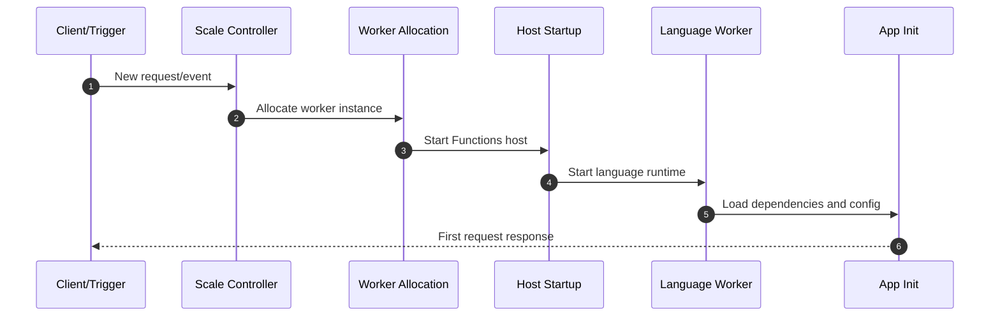
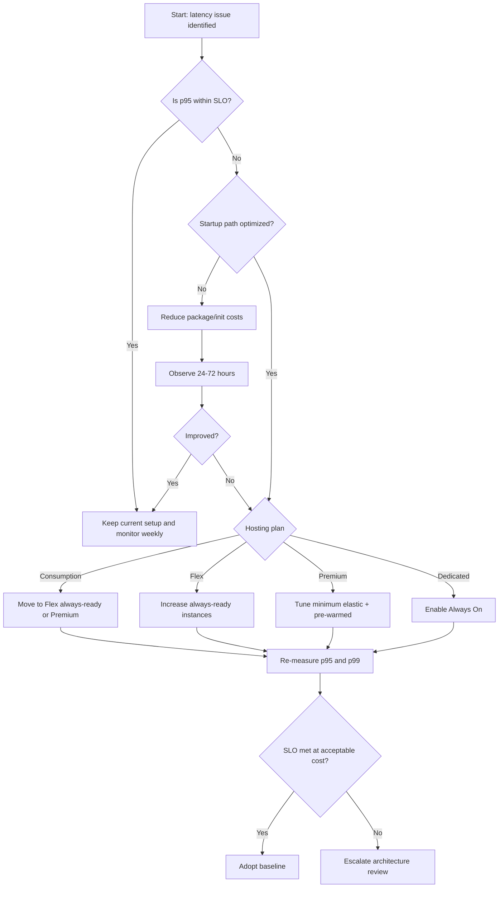

---
content_sources:
  - type: mslearn-adapted
    url: https://learn.microsoft.com/azure/azure-functions/functions-scale
  - type: mslearn-adapted
    url: https://learn.microsoft.com/azure/azure-functions/flex-consumption-plan
  - type: mslearn-adapted
    url: https://learn.microsoft.com/azure/azure-functions/functions-premium-plan
  - type: mslearn-adapted
    url: https://learn.microsoft.com/azure/azure-functions/performance-reliability
  - type: mslearn-adapted
    url: https://learn.microsoft.com/azure/azure-functions/analyze-telemetry-data
content_validation:
  status: verified
  last_reviewed: 2026-04-12
  reviewer: agent
  core_claims:
    - claim: "Cold start includes worker allocation, host startup, language worker startup, and application initialization phases."
      source: https://learn.microsoft.com/azure/azure-functions/performance-reliability
      verified: true
    - claim: "Flex Consumption supports always-ready instances to reduce cold-start frequency for selected functions or app behavior."
      source: https://learn.microsoft.com/azure/azure-functions/flex-consumption-plan
      verified: true
    - claim: "Premium plan provides always-ready and pre-warmed instances to reduce startup latency."
      source: https://learn.microsoft.com/azure/azure-functions/functions-premium-plan
      verified: true
    - claim: "Dedicated plans use Always On to keep workers active and reduce cold-start effects."
      source: https://learn.microsoft.com/azure/azure-functions/functions-scale
      verified: true
---

# Cold Start
This guide explains cold start behavior in Azure Functions and practical mitigation techniques per hosting plan.
Cold start is startup latency after an app has no warm instance available.
!!! tip "Platform Guide"
    For scaling architecture and plan comparison, see [Scaling](../platform/scaling.md).
!!! tip "Language Guide"
    For Python deployment specifics, see the [Python Tutorial](../language-guides/python/tutorial/index.md).
## Prerequisites
Before tuning cold start in production, prepare these inputs and permissions:
- Azure CLI 2.60.0 or later with `functionapp`, `monitor`, and `resource` commands.
- A Function App running in Consumption, Flex Consumption, Premium, or Dedicated.
- Application Insights enabled for the Function App.
- Contributor or higher RBAC on the Function App and plan resources.
- A baseline latency objective (for example, `p95 < 1.5s` for HTTP endpoints).
Use long-form CLI flags and keep sensitive values masked in runbooks.

## When to Use
Invest in cold start mitigation when at least one condition is true:
- Interactive HTTP APIs show first-hit latency that violates your SLO.
- Burst traffic patterns trigger repeated scale-out and startup penalties.
- Background trigger latency affects queue drain targets or downstream SLAs.
- Deployment slots swap correctly, but first requests still spike.
- Cost or platform constraints prevent immediate migration to a larger plan tier.

## Procedure
### 1) Understand startup phases
#### What causes cold start
Cold start usually combines several phases:

1. Worker instance allocation.
2. Functions host startup.
3. Language worker startup.
4. Application initialization (dependency loading, configuration reads, SDK clients).
Non-HTTP triggers can also experience startup latency when scale controller activates new workers.

#### Cold start phase timeline
<!-- diagram-id: cold-start-phase-timeline -->


### 2) Select plan-specific mitigation
#### Plan-specific mitigation options
| Hosting plan | Mitigation controls |
|---|---|
| Consumption | Optimize startup path, reduce package size, avoid heavy initialization |
| Flex Consumption | Configure always-ready instances for selected functions or app behavior |
| Premium | Use always-ready and pre-warmed instances |
| Dedicated (App Service Plan) | Enable Always On to keep workers active |

#### Consumption
Use Consumption when cost efficiency is primary and latency tolerance is moderate.
Apply startup optimization first:
```bash
az functionapp config appsettings set \
    --resource-group <resource-group> \
    --name <function-app-name> \
    --settings WEBSITE_RUN_FROM_PACKAGE=1
```

| Command/Parameter | Purpose |
|-------------------|---------|
| `az functionapp config appsettings set` | Configures the application setting for the function app |
| `--settings WEBSITE_RUN_FROM_PACKAGE=1` | Enables the app to run directly from the deployment package to speed up startup |

#### Flex Consumption (FC1)
Flex Consumption supports always-ready instances to reduce cold-start frequency.
Use this when low-latency response is required without moving to Premium.
Check always-ready settings:
```bash
az functionapp scale config show \
    --resource-group <resource-group> \
    --name <function-app-name> \
    --query "alwaysReady" \
    --output json
```

| Command/Parameter | Purpose |
|-------------------|---------|
| `az functionapp scale config show` | Displays the current scaling configuration |
| `--query "alwaysReady"` | Filters for always-ready instance settings |
| `--output json` | Formats output as JSON |

Example output (PII masked):
```json
{
  "instanceCount": 1,
  "target": "http"
}
```
Set always-ready instance count using the dedicated Flex scale CLI:
```bash
az functionapp scale config always-ready set \
    --resource-group <resource-group> \
    --name <function-app-name> \
    --settings http=2
```

| Command/Parameter | Purpose |
|-------------------|---------|
| `az functionapp scale config always-ready set` | Configures always-ready instances for specific triggers |
| `--settings http=2` | Ensures 2 instances are always ready for HTTP traffic |

#### Premium (EP)
Premium supports always-ready instances and pre-warmed capacity for scale-out events.
This is the strongest built-in mitigation for latency-sensitive serverless workloads.
Premium always-ready and pre-warmed settings are configured in the Azure portal or with ARM/Bicep templates (CLI support varies by API version):
```bash
# Premium always-ready/pre-warmed configuration:
# Use Azure portal (Function App > Scale out)
# or ARM/Bicep properties for the plan.
```
Check pre-warmed and minimum elastic instance settings:
```bash
az resource show \
    --resource-group <resource-group> \
    --name <function-app-name>/web \
    --resource-type Microsoft.Web/sites/config \
    --api-version 2023-12-01 \
    --query "properties.{preWarmedInstanceCount:preWarmedInstanceCount,minimumElasticInstanceCount:minimumElasticInstanceCount}" \
    --output json
```

| Command/Parameter | Purpose |
|-------------------|---------|
| `az resource show` | Gets the resource details for the Premium plan configuration |
| `--resource-type Microsoft.Web/sites/config` | Targets the site configuration object |
| `--query` | Extracts pre-warmed and minimum elastic instance counts |

Example output (PII masked):
```json
{
  "minimumElasticInstanceCount": 2,
  "preWarmedInstanceCount": 1
}
```
Set warm-capacity values:
```bash
az resource update \
    --resource-group <resource-group> \
    --name <function-app-name>/web \
    --resource-type Microsoft.Web/sites/config \
    --api-version 2023-12-01 \
    --set properties.minimumElasticInstanceCount=2 \
    --set properties.preWarmedInstanceCount=1
```

| Command/Parameter | Purpose |
|-------------------|---------|
| `az resource update` | Modifies the configuration for the function app |
| `--set properties.minimumElasticInstanceCount=2` | Sets the minimum number of instances that are always running |
| `--set properties.preWarmedInstanceCount=1` | Sets the number of instances to keep warm for scale-out |

#### Dedicated plan
Enable Always On so the app remains loaded:
```bash
az functionapp config set \
    --resource-group <resource-group> \
    --name <function-app-name> \
    --always-on true
```

| Command/Parameter | Purpose |
|-------------------|---------|
| `az functionapp config set` | Updates the app service configuration |
| `--always-on true` | Keeps the process active to eliminate cold starts on Dedicated plans |

Check Always On configuration:
```bash
az functionapp config show \
    --resource-group <resource-group> \
    --name <function-app-name> \
    --query "alwaysOn" \
    --output tsv
```

| Command/Parameter | Purpose |
|-------------------|---------|
| `az functionapp config show` | Displays the current configuration for the app |
| `--query "alwaysOn"` | Filters for the Always On setting value |
| `--output tsv` | Returns the raw tab-separated value |

Example output:
```text
true
```

### 3) Optimize startup path
#### Startup optimization techniques
Apply these regardless of hosting plan:
- Keep deployment artifact small.
- Remove unused dependencies.
- Delay expensive initialization until first use where safe.
- Reuse SDK clients and HTTP connections.
- Avoid synchronous network calls in module initialization.

#### Dependency and package optimization
Operationally, dependency volume and native package loading often dominate startup time.
Recommended practices:
- Audit dependencies quarterly and remove unused packages.
- Prefer lighter libraries for common operations.
- Use run-from-package deployment for immutable and consistent startup files.
- Keep extension bundle and worker runtime versions current and supported.

#### Warmup and traffic shaping
For plans without strong always-ready guarantees, use conservative warmup patterns:
- Scheduled health ping to keep app active where appropriate.
- Gradual traffic ramp during deployments.
- Pre-deployment synthetic checks before traffic cutover.
!!! note "Cost tradeoff"
    Warmup strategies can increase baseline cost. Tune against your latency SLO and budget.

### 4) Apply decision flow
#### Operational decision flow
1. If latency SLO is moderate, optimize startup path first.
2. If p95 remains unstable, enable plan-native warm capacity.
3. If strict low-latency is mandatory, use Premium or Dedicated with warm strategy.
<!-- diagram-id: operational-decision-flow -->


### 5) Compare expected outcomes
The following cold-start duration ranges are operational estimates from field experience and are not official Microsoft benchmark values.

| Hosting plan | Optimization level | Typical cold start duration (HTTP) | Expected operational outcome |
|---|---|---|---|
| Consumption | None | 2s-15s | Lowest cost, highest startup variability |
| Consumption | Startup optimized | 1.5s-8s | Better median latency, cold starts still frequent |
| Flex Consumption | Startup optimized + always-ready | 0.5s-3s | Lower cold-start frequency with moderate baseline cost |
| Premium | Always-ready + pre-warmed tuned | 0.2s-1.5s | Strong latency consistency under burst and scale-out |
| Dedicated | Always On enabled | 0.2s-1.2s | Near-warm behavior for most traffic patterns |

## Verification
### Measure latency trend
Track cold-start symptoms with KQL and metrics:
```kql
requests
| where timestamp > ago(24h)
| summarize p95_duration=percentile(duration, 95), p99_duration=percentile(duration, 99) by bin(timestamp, 5m)
| render timechart
```
Correlate duration spikes with scale-out and instance changes to separate code regressions from startup events.

### Measure inferred cold start duration
Use this query to estimate cold-start duration when request gaps indicate worker inactivity:
```kql
let inactivityThresholdMinutes = 10;
requests
| where timestamp > ago(24h)
| where success == true
| project timestamp, operation_Name, cloud_RoleInstance, duration
| order by cloud_RoleInstance asc, timestamp asc
| serialize
| extend prevTs = prev(timestamp), prevInstance = prev(cloud_RoleInstance)
| extend gapMinutes = iif(cloud_RoleInstance == prevInstance, datetime_diff('minute', timestamp, prevTs), 0)
| where gapMinutes >= inactivityThresholdMinutes
| summarize coldStartCount=count(), p50ColdStart=percentile(duration, 50), p95ColdStart=percentile(duration, 95), maxColdStart=max(duration) by operation_Name
| order by p95ColdStart desc
```

### View startup metrics from Azure Monitor
```bash
az monitor metrics list \
    --resource "/subscriptions/<subscription-id>/resourceGroups/<resource-group>/providers/Microsoft.Web/sites/<function-app-name>" \
    --metric "AverageResponseTime" "Requests" "FunctionExecutionUnits" \
    --interval PT5M \
    --aggregation Average \
    --start-time 2026-01-15T00:00:00Z \
    --end-time 2026-01-15T02:00:00Z \
    --output table
```

| Command/Parameter | Purpose |
|-------------------|---------|
| `az monitor metrics list` | Retrieves the specified platform metrics |
| `--metric` | List of metrics including response time and execution units |
| `--interval PT5M` | Aggregates data in 5-minute time windows |
| `--aggregation Average` | Calculates the average values for the metrics |
| `--output table` | Formats results as a table |

Example output (PII masked):
```text
Name                    TimeGrain    Average
----------------------  -----------  -------
AverageResponseTime     00:05:00     0.31
Requests                00:05:00     52
FunctionExecutionUnits  00:05:00     1.47
```

## Rollback / Troubleshooting
If mitigation does not improve latency, run this sequence:

1. Verify settings are persisted on the target resource.
2. Re-check app initialization for blocking network calls and heavy package load.
3. Roll back warm-capacity changes if cost increased without measurable benefit.
4. Compare before/after KQL evidence across a 24-hour window.

Common checks and rollback commands:
- Dedicated Always On not effective: confirm plan type and rollback if required.
```bash
az functionapp config set \
    --resource-group <resource-group> \
    --name <function-app-name> \
    --always-on false
```

| Command/Parameter | Purpose |
|-------------------|---------|
| `az functionapp config set` | Updates the app configuration |
| `--always-on false` | Disables Always On to save resources on non-production Dedicated plans |

- Flex always-ready overprovisioned: reduce warm instances and monitor p95.
```bash
az resource update \
    --resource-group <resource-group> \
    --name <function-app-name> \
    --resource-type Microsoft.Web/sites \
    --api-version 2023-12-01 \
    --set properties.functionAppConfig.scaleAndConcurrency.alwaysReady.instanceCount=0
```

| Command/Parameter | Purpose |
|-------------------|---------|
| `az resource update` | Modifies the raw resource properties |
| `--resource-type Microsoft.Web/sites` | Targets the main Function App resource |
| `--set ...alwaysReady.instanceCount=0` | Resets the always-ready instance count to zero |

- Premium warm capacity ineffective: restore previous known-good values.
```bash
az resource update \
    --resource-group <resource-group> \
    --name <function-app-name>/web \
    --resource-type Microsoft.Web/sites/config \
    --api-version 2023-12-01 \
    --set properties.minimumElasticInstanceCount=1 \
    --set properties.preWarmedInstanceCount=0
```

| Command/Parameter | Purpose |
|-------------------|---------|
| `az resource update` | Updates the site configuration |
| `--set properties.minimumElasticInstanceCount=1` | Resets minimum instances to the default value |
| `--set properties.preWarmedInstanceCount=0` | Disables pre-warmed instances to reduce costs |

Escalate to platform diagnostics if startup remains unstable after rollback and startup-path optimization.

## See Also
- [Monitoring](monitoring.md)
- [Deployment](deployment.md)
- [Platform Hosting](../platform/hosting.md)

## Sources
- [Azure Functions hosting options and scaling](https://learn.microsoft.com/azure/azure-functions/functions-scale)
- [Flex Consumption plan for Azure Functions](https://learn.microsoft.com/azure/azure-functions/flex-consumption-plan)
- [Azure Functions Premium plan](https://learn.microsoft.com/azure/azure-functions/functions-premium-plan)
- [Improve performance and reliability of Azure Functions](https://learn.microsoft.com/azure/azure-functions/performance-reliability)
- [Monitor Azure Functions](https://learn.microsoft.com/azure/azure-functions/analyze-telemetry-data)
