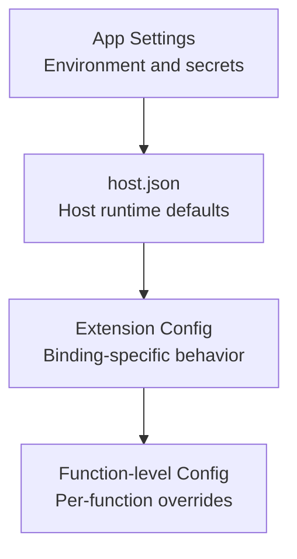
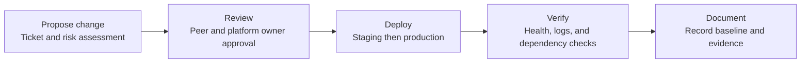

---
content_sources:
  - type: mslearn-adapted
    url: https://learn.microsoft.com/azure/azure-functions/functions-app-settings
  - type: mslearn-adapted
    url: https://learn.microsoft.com/azure/azure-functions/functions-host-json
  - type: mslearn-adapted
    url: https://learn.microsoft.com/azure/app-service/app-service-key-vault-references
  - type: mslearn-adapted
    url: https://learn.microsoft.com/azure/azure-functions/functions-reference#configure-an-identity-based-connection
  - type: mslearn-adapted
    url: https://learn.microsoft.com/azure/azure-functions/functions-how-to-use-azure-function-app-settings
content_validation:
  status: verified
  last_reviewed: 2026-04-12
  reviewer: agent
  core_claims:
    - claim: "App settings are the correct layer for environment-specific values, secrets, and feature flags in Azure Functions."
      source: https://learn.microsoft.com/azure/azure-functions/functions-app-settings
      verified: true
    - claim: "host.json controls host-wide runtime behavior such as logging, retries, extension tuning, and sampling."
      source: https://learn.microsoft.com/azure/azure-functions/functions-host-json
      verified: true
    - claim: "Key Vault references can be used to back app settings with secrets managed outside the Function App configuration itself."
      source: https://learn.microsoft.com/azure/app-service/app-service-key-vault-references
      verified: true
    - claim: "Identity-based connections are supported for Azure Functions configuration instead of storing connection secrets directly."
      source: https://learn.microsoft.com/azure/azure-functions/functions-reference#configure-an-identity-based-connection
      verified: true
---

# Configuration
This guide covers operational runtime configuration for Azure Functions.
It focuses on app settings, `host.json`, secret management, and safe rollout patterns.
!!! tip "Platform Guide"
    For scaling architecture and plan comparison, see [Scaling](../platform/scaling.md).
!!! tip "Language Guide"
    For Python deployment specifics, see the [Python Tutorial](../language-guides/python/tutorial/index.md).
## Prerequisites
- Azure CLI 2.56.0 or later with a signed-in context.
- Contributor or higher role on the Function App resource group.
- Access to Application Insights logs for post-change verification.
- Access to Key Vault and managed identity role assignments for secret-backed settings.
- A deployment method that keeps `host.json` versioned with code.
## When to Use
Choose configuration layers by scope and change frequency:
- **App settings** for environment-specific values, secrets, feature flags, and per-slot overrides.
- **`host.json`** for host-wide runtime behavior such as logging, retries, extension tuning, and sampling.
- **Extension-specific configuration** when tuning one binding type (for example Service Bus or Event Hubs) without changing business logic.
- **Function-level attributes or decorators** when behavior differs by function (for example retry policy per trigger).
- **`local.settings.json`** only for local developer execution, never as a production source of truth.
<!-- diagram-id: when-to-use -->

## Procedure
### Configuration layers
Use a layered model:

1. App settings for environment values.
2. `host.json` for runtime host behavior.
3. Local development settings for workstation execution.
### App settings
Common settings:
| Setting | Purpose |
|---|---|
| `AzureWebJobsStorage` or identity-based equivalent | Host storage dependency |
| `FUNCTIONS_WORKER_RUNTIME` | Worker runtime selection |
| `APPLICATIONINSIGHTS_CONNECTION_STRING` | Monitoring destination |
| `WEBSITE_RUN_FROM_PACKAGE` | Immutable package deployment behavior |
| Custom settings | Feature flags and endpoints |
Set values:
```bash
az functionapp config appsettings set \
    --resource-group <resource-group> \
    --name <app-name> \
    --settings FUNCTIONS_WORKER_RUNTIME=<worker-runtime>
```

| Command/Parameter | Purpose |
|-------------------|---------|
| `az functionapp config appsettings set` | Adds or updates application settings for the function app |
| `--resource-group <resource-group>` | Specifies the resource group |
| `--name <app-name>` | Specifies the function app name |
| `--settings` | Space-separated list of key=value pairs to set |

List values (redact secrets before sharing):
```bash
az functionapp config appsettings list \
    --resource-group <resource-group> \
    --name <app-name> \
    --query "[].{name:name,value:value}" \
    --output table
```

| Command/Parameter | Purpose |
|-------------------|---------|
| `az functionapp config appsettings list` | Lists all application settings |
| `--query` | JMESPath query to filter and format the settings |
| `--output table` | Formats the output as a table |

Example output:
```text
Name                                         Value
-------------------------------------------  ----------------------------------------------
FUNCTIONS_WORKER_RUNTIME                     python
WEBSITE_RUN_FROM_PACKAGE                     1
APPLICATIONINSIGHTS_CONNECTION_STRING        InstrumentationKey=xxxxxxxx-xxxx-xxxx-xxxx-xxxxxxxxxxxx
MySecretSetting                              @Microsoft.KeyVault(SecretUri=https://kv-prod.vault.azure.net/secrets/db-password/)
```
### `host.json` essentials
`host.json` controls host-level behavior such as logging, sampling, and extension configuration.
```json
{
  "version": "2.0",
  "logging": {
    "applicationInsights": {
      "samplingSettings": {
        "isEnabled": true,
        "excludedTypes": "Request;Exception"
      }
    },
    "logLevel": {
      "default": "Information"
    }
  },
  "extensionBundle": {
    "id": "Microsoft.Azure.Functions.ExtensionBundle",
    "version": "[4.*, 5.0.0)"
  }
}
```
!!! note "Sampling"
    Sampling can reduce telemetry costs, but keep critical request and exception visibility.
Show effective host-level overrides from app settings:
```bash
az functionapp config appsettings list \
    --resource-group <resource-group> \
    --name <app-name> \
    --query "[?starts_with(name, 'AzureFunctionsJobHost__')].{name:name,value:value}" \
    --output table
```

| Command/Parameter | Purpose |
|-------------------|---------|
| `az functionapp config appsettings list` | Lists application settings |
| `--query` | Filters for settings prefixed with `AzureFunctionsJobHost__` |
| `--output table` | Formats the output as a table |
Example output:
```text
Name                                                                  Value
--------------------------------------------------------------------  -----------
AzureFunctionsJobHost__logging__logLevel__default                    Warning
AzureFunctionsJobHost__extensions__serviceBus__prefetchCount         32
AzureFunctionsJobHost__extensions__queues__batchSize                 16
```
### `local.settings.json`
Use local settings only for local runtime execution.
```json
{
  "IsEncrypted": false,
  "Values": {
    "AzureWebJobsStorage": "UseDevelopmentStorage=true",
    "FUNCTIONS_WORKER_RUNTIME": "<worker-runtime>",
    "APPLICATIONINSIGHTS_CONNECTION_STRING": "InstrumentationKey=<masked>"
  }
}
```
Operational rules:
- Do not commit production secrets.
- Keep a sanitized `local.settings.json.example` in source control.
- Inject secrets at deployment time via secure pipeline mechanisms.
### Key Vault references
Use Key Vault references to resolve secrets in app settings without storing plaintext secret values.
Format:
```text
@Microsoft.KeyVault(SecretUri=https://<key-vault-name>.vault.azure.net/secrets/<secret-name>/)
```
Set a Key Vault-backed app setting:
```bash
az functionapp config appsettings set \
    --resource-group <resource-group> \
    --name <app-name> \
    --settings "MySecretSetting=@Microsoft.KeyVault(SecretUri=https://<key-vault-name>.vault.azure.net/secrets/<secret-name>/)"
```

| Command/Parameter | Purpose |
|-------------------|---------|
| `az functionapp config appsettings set` | Configures the application setting |
| `--settings "MySecretSetting=..."` | Sets the value as a Key Vault reference |

Check Key Vault reference resolution status:
```bash
az rest \
    --method get \
    --url "https://management.azure.com/subscriptions/<subscription-id>/resourceGroups/<resource-group>/providers/Microsoft.Web/sites/<app-name>/config/configreferences/appsettings/list?api-version=2023-12-01" \
    --query "properties[?contains(name, 'MySecretSetting')].{name:name,status:status,details:details}" \
    --output table
```

| Command/Parameter | Purpose |
|-------------------|---------|
| `az rest --method get` | Sends a direct GET request to the Azure Resource Manager API |
| `--url` | Target endpoint for configuration reference status |
| `--query` | Extracts name, resolution status, and details |
| `--output table` | Formats results as a table |

### Managed identity for secret access
Enable system-assigned identity:
```bash
az functionapp identity assign \
    --resource-group <resource-group> \
    --name <app-name>
```

| Command/Parameter | Purpose |
|-------------------|---------|
| `az functionapp identity assign` | Enables a system-assigned managed identity for the app |
| `--resource-group <resource-group>` | Specifies the resource group |
| `--name <app-name>` | Specifies the function app name |

Grant the identity least-privilege access to Key Vault and dependent services.
Prefer identity-based connection patterns over connection strings when bindings support it.
### Identity-based connection patterns (including Flex Consumption)
Use identity-based connections to remove secret sprawl and align with zero-trust operations.
For Flex Consumption, use this pattern for production-grade storage and binding access, especially in locked-down environments.
Host storage with identity:
```text
AzureWebJobsStorage__accountName=<storage-account-name>
AzureWebJobsStorage__credential=managedidentity
AzureWebJobsStorage__clientId=<user-assigned-identity-client-id>
```
Binding connection with identity (`MyStorage` prefix example):
```text
MyStorage__blobServiceUri=https://<storage-account-name>.blob.core.windows.net
MyStorage__queueServiceUri=https://<storage-account-name>.queue.core.windows.net
MyStorage__credential=managedidentity
MyStorage__clientId=<user-assigned-identity-client-id>
```
Set the settings from CLI:
```bash
az functionapp config appsettings set \
    --resource-group <resource-group> \
    --name <app-name> \
    --settings \
        AzureWebJobsStorage__accountName=<storage-account-name> \
        AzureWebJobsStorage__credential=managedidentity \
        MyStorage__blobServiceUri=https://<storage-account-name>.blob.core.windows.net \
        MyStorage__queueServiceUri=https://<storage-account-name>.queue.core.windows.net \
        MyStorage__credential=managedidentity
```

| Command/Parameter | Purpose |
|-------------------|---------|
| `az functionapp config appsettings set` | Configures multiple application settings at once |
| `AzureWebJobsStorage__accountName` | Sets the storage account name for the host |
| `AzureWebJobsStorage__credential=managedidentity` | Configures host storage to use managed identity |
| `MyStorage__*` | Configures identity-based connection for application storage |

### Slot-specific settings
When using slots, mark environment-specific values as slot settings.
```bash
az functionapp config appsettings set \
    --resource-group <resource-group> \
    --name <app-name> \
    --slot staging \
    --slot-settings AZURE_FUNCTIONS_ENVIRONMENT=Staging
```

| Command/Parameter | Purpose |
|-------------------|---------|
| `az functionapp config appsettings set` | Configures settings for a specific deployment slot |
| `--slot staging` | Specifies the target slot |
| `--slot-settings` | Defines the settings as sticky to the slot |

### Configuration change management workflow
Use a controlled workflow for every production configuration update.
<!-- diagram-id: configuration-change-management-workflow -->

Recommended sequence:

1. Propose change with expected impact and rollback trigger.
2. Review against security, scale, and dependency constraints.
3. Deploy to staging slot or non-production app first.
4. Verify telemetry, trigger behavior, and secret resolution.
5. Promote to production and archive evidence links.
### Configuration checklist
- Configuration updates are versioned and reviewed.
- Secrets come from Key Vault references.
- `host.json` changes are validated before production rollout.
## Verification
Run these checks after every change:
```bash
az functionapp config appsettings list \
    --resource-group <resource-group> \
    --name <app-name> \
    --query "[?name=='FUNCTIONS_WORKER_RUNTIME' || name=='WEBSITE_RUN_FROM_PACKAGE' || starts_with(name, 'AzureFunctionsJobHost__')].{name:name,value:value}" \
    --output table
```

| Command/Parameter | Purpose |
|-------------------|---------|
| `az functionapp config appsettings list` | Retrieves current application settings |
| `--query` | Filters for core worker runtime and host-level override settings |

```bash
az functionapp identity show \
    --resource-group <resource-group> \
    --name <app-name> \
    --query "{type:type,principalId:principalId,tenantId:tenantId}" \
    --output table
```

| Command/Parameter | Purpose |
|-------------------|---------|
| `az functionapp identity show` | Displays the managed identity details for the app |
| `--query` | Extracts identity type and identifiers |

```bash
az monitor app-insights query \
    --app <application-insights-name> \
    --analytics-query "traces | where timestamp > ago(15m) | where message contains 'Host started' | project timestamp, message | take 5" \
    --output table
```

| Command/Parameter | Purpose |
|-------------------|---------|
| `az monitor app-insights query` | Runs a KQL query against Application Insights |
| `--analytics-query` | Checks the trace log for recent host startup success |
| `--output table` | Formats results as a table |
Example output:
```text
Timestamp                    Message
---------------------------  -------------------------------
2026-04-05T09:20:41.184Z     Host started (HostId=prod-func)
2026-04-05T09:20:42.017Z     2 functions loaded
```
Success indicators:
- Changed settings appear with expected values and expected slot scope.
- Managed identity remains enabled and principal ID is unchanged unless intentionally rotated.
- No startup failures related to binding initialization or secret resolution.
- Key Vault reference status is `Resolved` for all secret-backed settings.
## Rollback / Troubleshooting
Use this section when new settings cause startup errors, trigger failures, or inconsistent behavior across environments.
Config drift and incorrect settings playbook:

1. Re-list current settings and compare with approved baseline from source control or release records.
2. Restore known-good app settings and `host.json` values from last successful deployment.
3. Restart the app and verify host startup and trigger listener status.
4. If only one slot is affected, swap back or redeploy the previous slot package.
Targeted checks:
- **`AzureWebJobsStorage` failures**: confirm identity settings, role assignments, and storage DNS reachability.
- **Key Vault reference unresolved**: confirm vault access policy or RBAC and private endpoint routing.
- **Unexpected throttling or backlog**: review `host.json` concurrency and extension settings.
- **Local vs cloud mismatch**: verify `local.settings.json` values are not assumed in cloud runtime.
Rollback command examples:
```bash
az functionapp config appsettings delete \
    --resource-group <resource-group> \
    --name <app-name> \
    --setting-names AzureFunctionsJobHost__extensions__serviceBus__prefetchCount
```

| Command/Parameter | Purpose |
|-------------------|---------|
| `az functionapp config appsettings delete` | Removes one or more application settings |
| `--setting-names` | Specifies the keys of the settings to delete |

```bash
az functionapp deployment slot swap \
    --resource-group <resource-group> \
    --name <app-name> \
    --slot staging \
    --target-slot production
```

| Command/Parameter | Purpose |
|-------------------|---------|
| `az functionapp deployment slot swap` | Swaps slots to restore a previously stable configuration |
| `--slot staging` | Specifies the source slot |
| `--target-slot production` | Specifies the target slot |

## See Also
- [Deployment](deployment.md)
- [Monitoring](monitoring.md)
- [Cost Optimization](cost-optimization.md)
- [Platform Security](../platform/security.md)
## Sources
- [App settings reference for Azure Functions](https://learn.microsoft.com/azure/azure-functions/functions-app-settings)
- [host.json reference for Azure Functions](https://learn.microsoft.com/azure/azure-functions/functions-host-json)
- [Use Key Vault references in App Service and Functions](https://learn.microsoft.com/azure/app-service/app-service-key-vault-references)
- [Azure Functions identity-based connections](https://learn.microsoft.com/azure/azure-functions/functions-reference#configure-an-identity-based-connection)
- [How to manage Azure Functions app settings](https://learn.microsoft.com/azure/azure-functions/functions-how-to-use-azure-function-app-settings)
