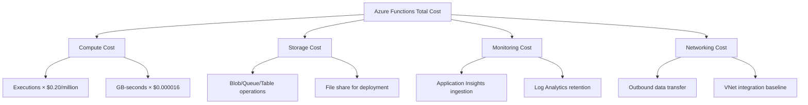
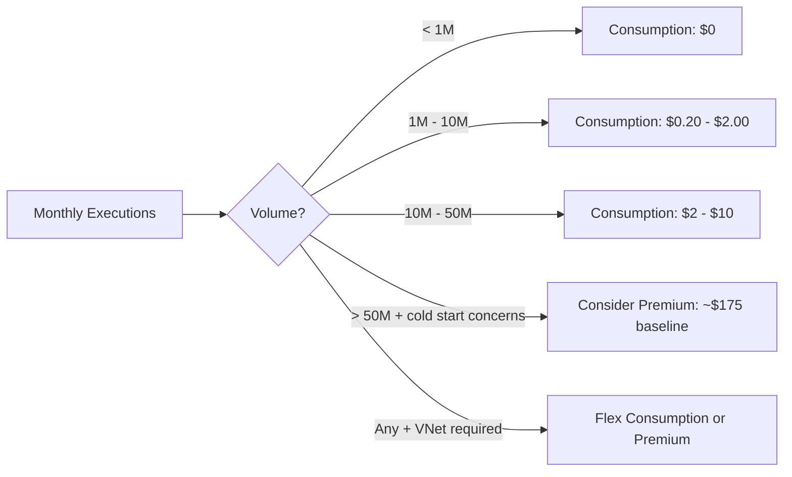

---
content_sources:
  - type: mslearn-adapted
    url: https://learn.microsoft.com/azure/azure-functions/consumption-plan
  - type: mslearn-adapted
    url: https://learn.microsoft.com/azure/azure-functions/functions-premium-plan
  - type: mslearn-adapted
    url: https://learn.microsoft.com/azure/azure-functions/functions-scale
  - type: mslearn-adapted
    url: https://learn.microsoft.com/azure/azure-functions/flex-consumption-plan
  - type: mslearn-adapted
    url: https://learn.microsoft.com/azure/azure-monitor/logs/cost-logs
---

# Cost Optimization

Azure Functions on Consumption and Flex Consumption offers cost-effective serverless pricing models. This guide explains how pricing works, how to take advantage of the free grant, when to choose Flex or Premium, and how to control costs through scale limits, Application Insights sampling, and operational practices.

## Prerequisites

- Azure CLI access to the subscription.
- Access to Azure Cost Management + Billing.
- Access to Application Insights and Log Analytics.

## When to Use

Azure Functions serverless pricing means you pay only for what you use — but ancillary services (storage, Application Insights, networking) can silently exceed function compute costs. Understanding the full cost picture prevents budget surprises.

<!-- diagram-id: when-to-use -->


## Procedure

### Consumption Plan Pricing

The Consumption plan charges based on two dimensions:

| Metric | Price | Unit |
|---|---|---|
| **Executions** | $0.20 per million | Per function invocation |
| **Resource consumption** | $0.000016/GB-s | GB-seconds (memory × execution time) |

### How GB-Seconds Are Calculated

Azure measures the memory your function uses during execution and multiplies it by the execution duration in seconds. Memory is measured in 128 MB increments, rounded up:

```
GB-seconds = (Memory in GB, rounded to nearest 128 MB) × (Execution time in seconds)
```

For example, a function that uses 200 MB of memory and runs for 0.5 seconds:

```
Memory: 200 MB → rounds to 256 MB = 0.25 GB
GB-seconds: 0.25 × 0.5 = 0.125 GB-s
Cost: 0.125 × $0.000016 = $0.000002
```

At this rate, you would need millions of executions per month to generate meaningful charges.

### Free Grant

For the legacy Consumption (Y1) plan, each Azure subscription includes this monthly free grant:

| Resource | Free Monthly Amount |
|---|---|
| Executions | **1,000,000** (one million) |
| Resource consumption | **400,000 GB-seconds** |

This free grant resets every month. For many development, staging, and low-traffic production workloads on Y1, it can cover 100% of Azure Functions compute cost.
Flex Consumption billing differs (consumption-based execution plus optional always-ready baseline cost), so validate current Flex pricing separately.

### What the Free Grant Covers (Example)

Consider a function that averages 200 MB memory and 100 ms execution time:

```
Per execution: 0.25 GB × 0.1s = 0.025 GB-s
Monthly budget: 400,000 GB-s ÷ 0.025 = 16,000,000 executions on resource alone
```

Combined with the 1M execution grant, you can run approximately **1,000,000 invocations per month completely free** (the execution count limit is reached before the GB-s limit in this scenario).

### What You Still Pay For

The free grant covers Functions **compute** only. You still incur charges for:
Pricing examples below are illustrative only and vary by region, agreement, and offer type.

| Resource | Typical Monthly Cost | Optimization Strategy |
|---|---|---|
| Storage Account (required by Functions) | $0.50 – $5.00 | Use Standard LRS, clean up old deployment packages |
| Application Insights (log ingestion) | $2.30/GB ingested | Enable sampling, exclude verbose trace types |
| Log Analytics workspace (log storage) | $2.76/GB retained beyond 31 days | Set retention to 30 days for non-production |
| Bandwidth (outbound data transfer) | Free for first 100 GB/month | Minimize payload sizes, use compression |
| VNet integration (Premium/FC1) | Included in plan cost | Only enable if required |

Application Insights log ingestion is often the largest cost component for low-traffic function apps. See the sampling section below to control this.

### Cost Comparison by Plan

Price examples in this section are approximate as of 2026-04 and can change over time by region and offer.

| Plan | Base Cost | Per-Execution Cost | Best For |
|---|---|---|---|
| Consumption (Y1) | $0 | $0.20/million + GB-s | Low/variable traffic, cost-sensitive |
| Flex Consumption (FC1) | $0 (idle) | $0.20/million + GB-s | Private networking without baseline cost |
| Premium (EP1) | ~$175/month | Included in base | Consistent traffic, no cold starts |
| Premium (EP2) | ~$350/month | Included in base | High memory/CPU workloads |
| Dedicated (B1) | ~$55/month | Included in base | Predictable, always-on workloads |

### Break-even analysis

<!-- diagram-id: break-even-analysis -->


**Rule of thumb**: Premium breaks even with Consumption at roughly **50-100 million executions/month** depending on execution duration and memory usage. Below that threshold, Consumption is cheaper.

### When to Upgrade to Premium

The Premium plan has a base cost (starting at approximately $175/month for the smallest tier, EP1), so it only makes sense when you need specific capabilities:

| Need | Consumption | Flex Consumption | Premium |
|---|---|---|---|
| No cold starts | ❌ 3–8s cold start | ✅ Optional always-ready | ✅ Always-ready instances |
| VNet integration | ❌ Not available | ✅ Supported | ✅ Full VNet integration |
| Longer timeout | ❌ Max 10 minutes | ✅ Unlimited | ✅ Unlimited |
| More CPU/memory | ❌ Fixed allocation | ✅ 512/2048/4096 MB | ✅ Configurable (EP1–EP3) |
| Predictable latency | ❌ Variable with cold starts | ✅ Better with always-ready | ✅ Consistent with warm instances |

**Rule of thumb:** Move from Consumption to Flex Consumption first when you need private networking or better cold-start control without committing to Premium baseline costs.

!!! tip "Platform Guide"
    For detailed hosting plan comparisons, see [Hosting Plans](../platform/hosting.md). For scaling behavior per plan, see [Scaling](../platform/scaling.md).

### Flex Consumption Billing Note

Flex Consumption combines consumption-based execution billing with optional always-ready baseline billing. If always-ready is set to `0`, idle cost behavior is similar to classic Consumption. If always-ready instances are configured, you incur a baseline cost even with low traffic.

### Controlling Application Insights Costs

Application Insights charges for data ingestion. For function apps that process millions of requests, this can add up quickly. Control costs with sampling in `host.json`:

```json
{
  "version": "2.0",
  "logging": {
    "applicationInsights": {
      "samplingSettings": {
        "isEnabled": true,
        "maxTelemetryItemsPerSecond": 5,
        "excludedTypes": "Request;Exception"
      }
    }
  }
}
```

Key settings:

- **`isEnabled: true`** — Enable adaptive sampling (enabled by default)
- **`maxTelemetryItemsPerSecond`** — Target rate of telemetry items per second per instance. Lower values = more aggressive sampling = lower cost
- **`excludedTypes`** — Telemetry types that are never sampled (always collected). Exclude `Request` and `Exception` to ensure you never miss errors

### Estimating Application Insights Cost

```
Monthly cost = (Ingested GB) × $2.30/GB
First 5 GB/month are free
```

A typical function invocation generates approximately 1–3 KB of telemetry. At 1M invocations/month with no sampling:

```
1,000,000 × 2 KB = 2 GB → (2 - 5 free) = $0 (within free tier)
```

At 10M invocations/month:

```
10,000,000 × 2 KB = 20 GB → (20 - 5) × $2.30 = $34.50/month
```

With `maxTelemetryItemsPerSecond: 5` on a single instance, you can reduce this dramatically.

### Additional Application Insights Cost Controls

| Technique | Savings | Trade-off |
|---|---|---|
| Adaptive sampling (default) | 50-90% reduction | May miss rare events |
| Daily cap | Hard limit on ingestion | Data loss after cap reached |
| Per-environment settings | Aggressive sampling in dev/staging | Reduced observability in lower environments |
| Exclude dependency telemetry | 30-50% reduction | Lose dependency tracking |
| Use Basic pricing tier | 50% cheaper per GB | Fewer features |

### Scale Limits to Control Runaway Costs

Set a maximum instance count to prevent unexpected cost spikes from traffic surges or DoS attacks.

For **Flex Consumption**, configure via the Azure portal or Bicep template (`scaleAndConcurrency.maximumInstanceCount`). To update an existing app:

```bash
az functionapp scale config set \
  --resource-group $RG \
  --name $APP_NAME \
  --maximum-instance-count 20
```

For **Consumption** and **Premium** plans:

```bash
az resource update \
  --resource-group $RG \
  --name $APP_NAME \
  --resource-type "Microsoft.Web/sites" \
  --set properties.siteConfig.functionAppScaleLimit=20
```

This caps your function app at 20 concurrent instances. Requests beyond capacity are queued rather than triggering new instances. The trade-off is higher latency under extreme load rather than higher cost.

### Cost Monitoring

Set up a budget alert so you are notified before costs exceed expectations:

```bash
az consumption budget create \
  --budget-name "functions-monthly" \
  --amount 50 \
  --time-grain Monthly \
  --category Cost \
  --start-date "2026-04-01" \
  --end-date "2027-03-31" \
  --resource-group $RG \
  --notifications "{\"Actual_GreaterThan_80_Percent\":{\"enabled\":true,\"operator\":\"GreaterThan\",\"threshold\":80,\"contactEmails\":[\"<your-email>\"]}}"
```

### Cost Analysis KQL

Track Application Insights ingestion volume to catch cost spikes early:

```kusto
let appName = "func-myapp-prod";
union requests, traces, exceptions, dependencies
| where timestamp > ago(7d)
| where cloud_RoleName =~ appName
| summarize
    Records = count(),
    EstimatedMB = round(sum(itemCount * 2.0) / 1024, 2)
  by bin(timestamp, 1d), itemType
| order by timestamp desc
```

## Verification

- [ ] Application Insights sampling enabled in `host.json`
- [ ] Scale limit configured for production function apps
- [ ] Budget alert set with notification threshold
- [ ] Correct plan selected based on traffic volume and requirements
- [ ] Log Analytics retention period reviewed (30 days for non-production)
- [ ] Storage account lifecycle rules configured for deployment packages

## Rollback / Troubleshooting

| Anti-Pattern | Why It's Costly | Better Approach |
|---|---|---|
| No Application Insights sampling | Log ingestion exceeds compute cost | Enable adaptive sampling with `maxTelemetryItemsPerSecond: 5` |
| Premium plan for low-traffic app | $175+/month for occasional use | Use Consumption or Flex Consumption |
| No scale limit set | Traffic spike or DoS creates unlimited instances | Set `functionAppScaleLimit` or `maximumInstanceCount` |
| Storing large blobs in function memory | High GB-seconds from memory × duration | Stream blobs instead of loading into memory |
| No budget alerts | Discover cost spike at month-end | Set budget with 80% threshold alert |
| Always-ready instances on FC1 when not needed | Baseline cost for idle instances | Set always-ready to 0 for dev/staging |

!!! tip "Operations Guide"
    For monitoring dashboards and Application Insights queries, see [Monitoring](monitoring.md). For alert rules and action groups, see [Alerts](alerts.md).

## See Also

- [Monitoring](monitoring.md)
- [Alerts](alerts.md)
- [Cold Start](cold-start.md)
- [Hosting Plans](../platform/hosting.md)
- [Scaling](../platform/scaling.md)

## Sources

- [Consumption Plan (Microsoft Learn)](https://learn.microsoft.com/azure/azure-functions/consumption-plan)
- [Premium Plan (Microsoft Learn)](https://learn.microsoft.com/azure/azure-functions/functions-premium-plan)
- [Azure Functions Scaling (Microsoft Learn)](https://learn.microsoft.com/azure/azure-functions/functions-scale)
- [Flex Consumption Plan (Microsoft Learn)](https://learn.microsoft.com/azure/azure-functions/flex-consumption-plan)
- [Application Insights pricing (Microsoft Learn)](https://learn.microsoft.com/azure/azure-monitor/logs/cost-logs)
