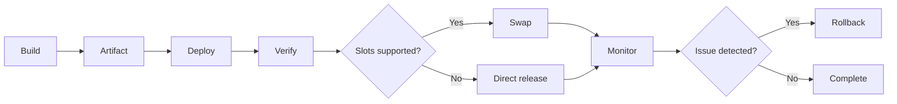

---
content_sources:
  - type: mslearn-adapted
    url: https://learn.microsoft.com/azure/azure-functions/run-functions-from-deployment-package
  - type: mslearn-adapted
    url: https://learn.microsoft.com/azure/azure-functions/functions-how-to-github-actions
  - type: mslearn-adapted
    url: https://learn.microsoft.com/azure/azure-functions/functions-deployment-slots
  - type: mslearn-adapted
    url: https://learn.microsoft.com/azure/azure-functions/functions-run-local
content_validation:
  status: verified
  last_reviewed: 2026-04-12
  reviewer: agent
  core_claims:
    - claim: "Running a function app from a deployment package supports immutable artifact deployment behavior."
      source: https://learn.microsoft.com/azure/azure-functions/run-functions-from-deployment-package
      verified: true
    - claim: "GitHub Actions is a supported CI/CD deployment method for Azure Functions."
      source: https://learn.microsoft.com/azure/azure-functions/functions-how-to-github-actions
      verified: true
    - claim: "Deployment slots are used for safer releases and rollback on supported Azure Functions hosting plans."
      source: https://learn.microsoft.com/azure/azure-functions/functions-deployment-slots
      verified: true
    - claim: "Local validation with Azure Functions Core Tools is part of the supported deployment workflow before publishing."
      source: https://learn.microsoft.com/azure/azure-functions/functions-run-local
      verified: true
---

# Deployment
This guide covers operational deployment execution for Azure Functions.
It focuses on release methods, slot strategy, and rollback safety.

!!! tip "Platform Guide"
    For scaling architecture and plan comparison, see [Scaling](../platform/scaling.md).

!!! tip "Language Guide"
    For Python deployment specifics, see the [Python Tutorial](../language-guides/python/tutorial/index.md).

## Prerequisites
Validate access, artifact quality, and hosting plan constraints before deployment.

### CLI access
```bash
az --version
func --version
```

| Command/Parameter | Purpose |
|-------------------|---------|
| `az --version` | Checks the Azure CLI version |
| `func --version` | Checks the Azure Functions Core Tools version |

```bash
az account show --output table
```

| Command/Parameter | Purpose |
|-------------------|---------|
| `az account show` | Shows the current Azure subscription details |
| `--output table` | Formats the output as a table |

### RBAC permissions
Minimum deployment role is `Contributor` on the target resource group.

```bash
az role assignment list \
    --assignee <object-id> \
    --resource-group <resource-group> \
    --output table
```

| Command/Parameter | Purpose |
|-------------------|---------|
| `az role assignment list` | Lists role assignments |
| `--assignee <object-id>` | Filters by the user, group, or service principal object ID |
| `--resource-group <resource-group>` | Filters by the resource group name |
| `--output table` | Formats the output as a table |

### Artifact ready
Build once and deploy one immutable artifact.

```bash
ls -lh <path-to-artifact-zip>
sha256sum <path-to-artifact-zip>
```

| Command/Parameter | Purpose |
|-------------------|---------|
| `ls -lh` | Lists file details with human-readable sizes |
| `sha256sum` | Computes the SHA256 hash of the artifact for integrity verification |

### Hosting plan check
```bash
az functionapp show \
    --resource-group <resource-group> \
    --name <app-name> \
    --query "{name:name,kind:kind,reserved:reserved,state:state}" \
    --output table
```

| Command/Parameter | Purpose |
|-------------------|---------|
| `az functionapp show` | Gets the details of a function app |
| `--resource-group <resource-group>` | Specifies the resource group |
| `--name <app-name>` | Specifies the function app name |
| `--query` | JMESPath query to filter specific properties |
| `--output table` | Formats the output as a table |

## When to Use
Choose deployment method by governance level, release frequency, and plan capability.

| Method | When to use it | Notes |
|---|---|---|
| `func azure functionapp publish` | Emergency/operator-run deployment | Fast, manual, low governance |
| Zip deploy (`az functionapp deployment source config-zip`) | Scripted artifact deployment | Standard on Consumption, Premium, Dedicated |
| GitHub Actions | Repository-native CI/CD | Recommended for PR-to-main flow |
| Azure DevOps | Enterprise gated release | Useful for approvals and stage controls |

1. **Fast mitigation**
    - Use Core Tools publish when pipelines are unavailable.
2. **Routine production release**
    - Use immutable zip artifact and verification gate.
3. **Regulated environments**
    - Use Azure DevOps approvals and governed service connections.
4. **Flex Consumption**
    - Deploy directly to production because slots are unsupported.
    - Prefer remote build when dependency compilation is platform-sensitive.

## Procedure

### Deployment workflow
<!-- diagram-id: deployment-workflow -->


### Deploy with Core Tools
```bash
func azure functionapp publish <app-name>
```

| Command/Parameter | Purpose |
|-------------------|---------|
| `func azure functionapp publish` | Deploys the local function project to Azure |
| `<app-name>` | Specifies the target function app name |

Use this for operator-driven release or emergency recovery deployment.

!!! note "Production practice"
    Prefer pipeline deployment for repeatability and auditability.

### Deploy with zip artifact
```bash
az functionapp deployment source config-zip \
    --resource-group <resource-group> \
    --name <app-name> \
    --src <path-to-artifact-zip>
```

| Command/Parameter | Purpose |
|-------------------|---------|
| `az functionapp deployment source config-zip` | Deploys a zip artifact to the function app |
| `--resource-group <resource-group>` | Specifies the resource group |
| `--name <app-name>` | Specifies the function app name |
| `--src <path-to-artifact-zip>` | Path to the local zip file to deploy |

Enable run-from-package when using immutable artifact patterns:

```bash
az functionapp config appsettings set \
    --resource-group <resource-group> \
    --name <app-name> \
    --settings WEBSITE_RUN_FROM_PACKAGE=1
```

| Command/Parameter | Purpose |
|-------------------|---------|
| `az functionapp config appsettings set` | Configures application settings for the function app |
| `--resource-group <resource-group>` | Specifies the resource group |
| `--name <app-name>` | Specifies the function app name |
| `--settings WEBSITE_RUN_FROM_PACKAGE=1` | Enables the app to run directly from the deployment package |

### GitHub Actions pipeline
```yaml
name: deploy-functions

on:
  push:
    branches: [ main ]

jobs:
  deploy:
    runs-on: ubuntu-latest
    steps:
      - name: Checkout
        uses: actions/checkout@v4

      - name: Azure login with OIDC
        uses: azure/login@v2
        with:
          client-id: ${{ secrets.AZURE_CLIENT_ID }}
          tenant-id: ${{ secrets.AZURE_TENANT_ID }}
          subscription-id: ${{ secrets.AZURE_SUBSCRIPTION_ID }}

      - name: Deploy function app
        uses: azure/functions-action@v1
        with:
          app-name: <app-name>
          package: <artifact-directory-or-zip>
```

Use OIDC where possible to avoid long-lived deployment secrets.

### Azure DevOps pipeline
```yaml
trigger:
  branches:
    include:
      - main

steps:
  - task: AzureFunctionApp@2
    displayName: Deploy Azure Function App
    inputs:
      azureSubscription: <service-connection>
      appType: functionAppLinux
      appName: <app-name>
      package: <artifact-path>
```

### Deployment slots (Consumption, Premium, and Dedicated)
Use slots for safe cutover and fast rollback.

> **Note:** Classic Consumption supports 2 slots total (including production). Flex Consumption does not support deployment slots.

#### Create staging slot
```bash
az functionapp deployment slot create \
    --resource-group <resource-group> \
    --name <app-name> \
    --slot staging
```

| Command/Parameter | Purpose |
|-------------------|---------|
| `az functionapp deployment slot create` | Creates a new deployment slot for the function app |
| `--resource-group <resource-group>` | Specifies the resource group |
| `--name <app-name>` | Specifies the function app name |
| `--slot staging` | Names the slot "staging" |

#### Configure slot-specific settings
```bash
az functionapp config appsettings set \
    --resource-group <resource-group> \
    --name <app-name> \
    --slot staging \
    --slot-settings AZURE_FUNCTIONS_ENVIRONMENT=Staging
```

| Command/Parameter | Purpose |
|-------------------|---------|
| `az functionapp config appsettings set` | Configures app settings for the specified slot |
| `--slot staging` | Target slot for the setting change |
| `--slot-settings` | Defines settings as "sticky" to the slot (doesn't swap with production) |

#### Swap staging into production
```bash
az functionapp deployment slot swap \
    --resource-group <resource-group> \
    --name <app-name> \
    --slot staging \
    --target-slot production
```

| Command/Parameter | Purpose |
|-------------------|---------|
| `az functionapp deployment slot swap` | Swaps the traffic between two slots |
| `--slot staging` | Specifies the source slot |
| `--target-slot production` | Specifies the target slot for cutover |

### Flex Consumption deployment specifics
1. **No deployment slots**
    - Deploy directly to production.
    - Use smaller and more frequent releases.
2. **Remote build requirements**
    - Use remote build when runtime-specific dependencies must compile in Azure.
    - Validate runtime version and lockfile before publish.
3. **Rollback approach**
    - Redeploy the last-known-good artifact because swap-back is unavailable.

### Post-deploy checks
- Health endpoint is successful.
- Failure ratio does not regress.
- Duration percentiles stay within expected range.
- Queue backlog does not grow unexpectedly.

Expanded CLI checks:

```bash
az functionapp function list \
    --resource-group <resource-group> \
    --name <app-name> \
    --output table
```

| Command/Parameter | Purpose |
|-------------------|---------|
| `az functionapp function list` | Lists all functions within the app |
| `--resource-group <resource-group>` | Specifies the resource group |
| `--name <app-name>` | Specifies the function app name |
| `--output table` | Formats the list as a table |

```bash
az monitor app-insights metrics show \
    --app <app-insights-name> \
    --resource-group <resource-group> \
    --metrics requests/failed \
    --interval PT5M \
    --offset 30m \
    --output table
```

| Command/Parameter | Purpose |
|-------------------|---------|
| `az monitor app-insights metrics show` | Retrieves metrics from Application Insights |
| `--app <app-insights-name>` | Specifies the Application Insights resource |
| `--metrics requests/failed` | Filters for failed request counts |
| `--interval PT5M` | Aggregates data in 5-minute intervals |
| `--offset 30m` | Looks back at the last 30 minutes of data |
| `--output table` | Formats metrics as a table |

## Verification
Validate deployment state, slot inventory, runtime health, and release identity.

### Deployment status and slot listing
`az functionapp deployment source show` returns source-control deployment configuration (for example, GitHub or Local Git integration). For zip deploy/Core Tools deployment verification, use deployment logs and app health checks instead.

```bash
az functionapp deployment source show \
    --resource-group <resource-group> \
    --name <app-name> \
    --output json
```

| Command/Parameter | Purpose |
|-------------------|---------|
| `az functionapp deployment source show` | Shows the source control deployment configuration |
| `--resource-group <resource-group>` | Specifies the resource group |
| `--name <app-name>` | Specifies the function app name |
| `--output json` | Formats output as JSON to see detail |

```json
{
  "branch": "main",
  "deploymentRollbackEnabled": true,
  "isGitHubAction": true,
  "repoUrl": "https://github.com/<org>/<repo>",
  "isManualIntegration": false
}
```

```bash
az functionapp deployment slot list \
    --resource-group <resource-group> \
    --name <app-name> \
    --output table
```

| Command/Parameter | Purpose |
|-------------------|---------|
| `az functionapp deployment slot list` | Lists all deployment slots for the app |
| `--resource-group <resource-group>` | Specifies the resource group |
| `--name <app-name>` | Specifies the function app name |
| `--output table` | Formats the slot list as a table |

```text
Name         Status     Traffic %
-----------  ---------  ---------
production   Running    100
staging      Running    0
```

### Runtime and endpoint checks
```bash
az functionapp show \
    --resource-group <resource-group> \
    --name <app-name> \
    --query "{state:state,hostNames:defaultHostName,lastModifiedTimeUtc:lastModifiedTimeUtc}" \
    --output table
```

| Command/Parameter | Purpose |
|-------------------|---------|
| `az functionapp show` | Gets the status and metadata for the function app |
| `--query` | Extracts state, hostname, and last modified timestamp |
| `--output table` | Formats the output as a table |

```bash
curl --silent --show-error --fail https://<app-name>.azurewebsites.net/api/health
```

| Command/Parameter | Purpose |
|-------------------|---------|
| `curl --silent` | Suppresses progress meter and error messages |
| `--show-error` | Shows error message if it fails |
| `--fail` | Returns a non-zero exit code if the HTTP response is 4xx or 5xx |
| `https://<app-name>.azurewebsites.net/api/health` | URL of the health check endpoint |

```text
{"status":"ok","version":"2026.01.15","commit":"a1b2c3d4"}
```

Expected output:
1. Function App state is `Running`.
2. Health endpoint returns HTTP `200`.
3. Version and commit match the released artifact.
4. Failure and duration metrics remain within baseline.

## Rollback / Troubleshooting
Preferred sequence:

1. Roll back with slot swap-back when slots are in use.
2. Redeploy last-known-good artifact when slots are unavailable.
3. Reapply previous config baseline if release changed settings.

### Slot swap-back
```bash
az functionapp deployment slot swap \
    --resource-group <resource-group> \
    --name <function-app-name> \
    --slot staging \
    --target-slot production
```

| Command/Parameter | Purpose |
|-------------------|---------|
| `az functionapp deployment slot swap` | Swaps the traffic between two slots |
| `--slot staging` | Specifies the source slot |
| `--target-slot production` | Specifies the target slot for cutover |

### Artifact rollback
```bash
az functionapp deployment source config-zip \
    --resource-group <resource-group> \
    --name <app-name> \
    --src <last-known-good-zip>
```

| Command/Parameter | Purpose |
|-------------------|---------|
| `az functionapp deployment source config-zip` | Redeploys a known-good artifact to the function app |
| `--src <last-known-good-zip>` | Path to the stable zip file to restore |

### Diagnostics during rollback
```bash
az functionapp log tail \
    --resource-group <resource-group> \
    --name <app-name>
```

| Command/Parameter | Purpose |
|-------------------|---------|
| `az functionapp log tail` | Streams the real-time log output for the function app |
| `--resource-group <resource-group>` | Specifies the resource group |
| `--name <app-name>` | Specifies the function app name |

```text
2026-01-15T12:02:11Z [Information] Host started (Id=xxxxxxxx-xxxx-xxxx-xxxx-xxxxxxxxxxxx)
2026-01-15T12:02:15Z [Warning] Function 'QueueProcessor' timeout threshold near limit
2026-01-15T12:02:18Z [Information] HTTP trigger processed with status 200
```

```bash
az monitor log-analytics query \
    --workspace "$WORKSPACE_ID" \
    --analytics-query "AppRequests | where TimeGenerated > ago(30m) | summarize total=count(), failed=countif(Success == false)"
```

| Command/Parameter | Purpose |
|-------------------|---------|
| `az monitor log-analytics query` | Executes a KQL query against Log Analytics |
| `--workspace "$WORKSPACE_ID"` | ID of the target Log Analytics workspace |
| `--analytics-query` | The Kusto query string |

```text
TableName      total    failed
-------------  -------  ------
PrimaryResult  1845     11
```

Troubleshooting checks: compare artifact hash with release manifest, diff app settings against baseline,
verify runtime compatibility, and validate trigger dependency identity/access.

## See Also
- [Configuration](configuration.md)
- [Monitoring](monitoring.md)
- [Recovery](recovery.md)

## Sources
- [Deploy Azure Functions from package files](https://learn.microsoft.com/azure/azure-functions/run-functions-from-deployment-package)
- [Deploy Azure Functions with GitHub Actions](https://learn.microsoft.com/azure/azure-functions/functions-how-to-github-actions)
- [Deployment slots in Azure Functions](https://learn.microsoft.com/azure/azure-functions/functions-deployment-slots)
- [Functions Core Tools reference](https://learn.microsoft.com/azure/azure-functions/functions-run-local)
