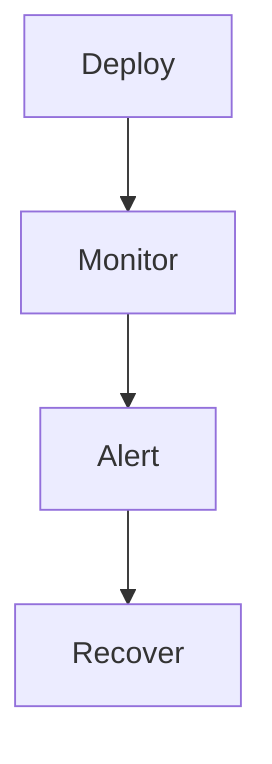

---
content_sources:

  - type: mslearn-adapted
    url: https://learn.microsoft.com/en-us/azure/azure-functions/functions-best-practices
  - type: mslearn-adapted
    url: https://learn.microsoft.com/en-us/azure/azure-functions/functions-monitoring
  - type: mslearn-adapted
    url: https://learn.microsoft.com/en-us/azure/azure-functions/functions-diagnostics
content_validation:
  status: verified
  last_reviewed: '2026-05-23'
  reviewer: agent
  core_claims:
    - claim: This page uses Microsoft Learn as the primary source basis for its Azure-specific guidance.
      source: https://learn.microsoft.com/en-us/azure/azure-functions/functions-best-practices
      verified: true
---
# Operations

Operations documentation is the day-2 execution layer for Azure Functions.
Use it to deploy, configure, monitor, alert, and recover production workloads.

!!! tip "Platform Guide"
    For scaling architecture and plan comparison, see [Scaling](../platform/scaling.md).

!!! tip "Language Guide"
    For Python deployment specifics, see the [Python Tutorial](../language-guides/python/tutorial/index.md).

## Scope

<!-- diagram-id: scope -->

- Execute releases safely with rollback paths.
- Manage runtime settings and secret delivery.
- Monitor health, latency, failures, and backlog.
- Alert on actionable signals.
- Reduce cold-start impact by hosting plan.
- Handle retries, poison messages, and dead-letter flows.
- Prepare and test disaster recovery procedures.

## Documents

- [Deployment](deployment.md)
- [Configuration](configuration.md)
- [Monitoring](monitoring.md)
- [Alerts](alerts.md)
- [Cold Start](cold-start.md)
- [Retries and Poison Handling](retries-and-poison-handling.md)
- [Recovery](recovery.md)

## Review Matrix

| Review area | Page-specific check |
|---|---|
| Scope | Confirm the guidance applies to Operations. |
| Source basis | Validate the recommendation against the Microsoft Learn sources in this page. |
| Evidence | Capture command output, portal state, metrics, logs, or screenshots before treating the result as proven. |

## See Also

- [Hosting](../platform/hosting.md)
- [Reliability](../platform/reliability.md)
- [Troubleshooting: First 10 Minutes](../troubleshooting/first-10-minutes/index.md)

## Sources

- [Microsoft Learn source 1](https://learn.microsoft.com/en-us/azure/azure-functions/functions-best-practices)
- [Microsoft Learn source 2](https://learn.microsoft.com/en-us/azure/azure-functions/functions-monitoring)
- [Microsoft Learn source 3](https://learn.microsoft.com/en-us/azure/azure-functions/functions-diagnostics)
