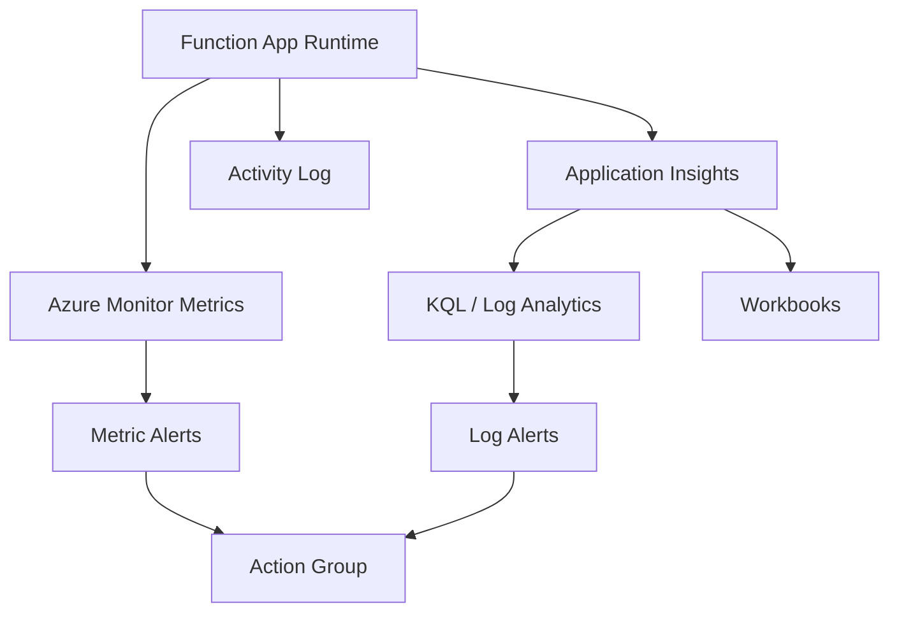
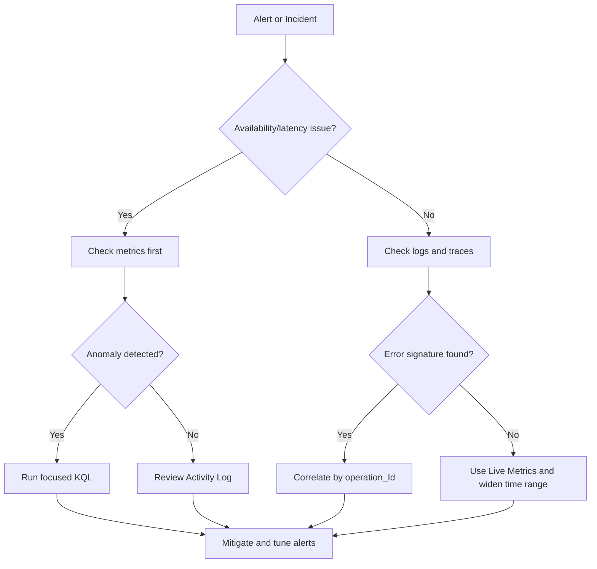

---
content_sources:
  - type: mslearn-adapted
    url: https://learn.microsoft.com/azure/azure-functions/monitor-functions
  - type: mslearn-adapted
    url: https://learn.microsoft.com/azure/azure-monitor/app/app-insights-overview
  - type: mslearn-adapted
    url: https://learn.microsoft.com/azure/azure-monitor/logs/data-platform-logs
  - type: mslearn-adapted
    url: https://learn.microsoft.com/azure/azure-monitor/visualize/workbooks-overview
content_validation:
  status: verified
  last_reviewed: 2026-04-12
  reviewer: agent
  core_claims:
    - claim: "Azure Functions monitoring combines Azure Monitor platform metrics with Application Insights telemetry."
      source: https://learn.microsoft.com/azure/azure-functions/monitor-functions
      verified: true
    - claim: "Application Insights provides requests, dependencies, traces, and exceptions for operational analysis."
      source: https://learn.microsoft.com/azure/azure-monitor/app/app-insights-overview
      verified: true
    - claim: "Control-plane and platform logs are available through Azure Monitor logs for operational investigations."
      source: https://learn.microsoft.com/azure/azure-monitor/logs/data-platform-logs
      verified: true
    - claim: "Azure Monitor workbooks are used to build dashboards and visual operational views over collected telemetry."
      source: https://learn.microsoft.com/azure/azure-monitor/visualize/workbooks-overview
      verified: true
---

# Monitoring

This guide describes how to monitor Azure Functions in production using Azure Monitor and Application Insights.
It combines metrics, logs, traces, and dashboards into a practical operational workflow.

!!! tip "Platform Guide"
    For scaling architecture and plan comparison, see [Scaling](../platform/scaling.md).

!!! tip "Language Guide"
    For Python deployment specifics, see the [Python Tutorial](../language-guides/python/tutorial/index.md).

## Prerequisites

- A running Function App in Consumption, Flex Consumption, Premium, or Dedicated.
- An Application Insights resource connected to the app.
- Access to Azure Monitor metrics and Log Analytics query permissions.
- Azure CLI installed and authenticated.
- Resource placeholders ready for commands.

```bash
RG=<resource-group>
APP_NAME=<app-name>
SUBSCRIPTION_ID=<subscription-id>
```

| Command/Parameter | Purpose |
|-------------------|---------|
| `RG` | Sets the resource group name variable |
| `APP_NAME` | Sets the function app name variable |
| `SUBSCRIPTION_ID` | Sets the Azure subscription identifier variable |

## When to Use

Use the signal that best answers the operational question.

| Scenario | Primary approach | Why | Secondary approach |
|---|---|---|---|
| Traffic increase/decrease | Metrics | Fast trend view with low query cost | Logs |
| Error spike after deployment | Logs (`requests`, `exceptions`) | Rich failure context | Traces |
| Latency regression | Metrics + KQL percentile | Quantify p95/p99 drift | Live Metrics |
| External dependency incident | Dependencies | Clear target/result visibility | Exceptions |
| Host recycle/cold start analysis | Traces | Runtime lifecycle evidence | Instance metrics |
| Configuration change impact | Activity logs | Control-plane history | Logs + traces |

## Procedure

### Monitoring architecture

Azure Functions emits multiple telemetry streams:

- **Platform metrics** in Azure Monitor (execution count, failures, instance activity).
- **Application telemetry** in Application Insights (requests, dependencies, traces, exceptions).
- **Activity logs** for control-plane changes.

Use all three for complete operational visibility.

<!-- diagram-id: monitoring-architecture -->


### Enable Application Insights

Set the connection string in app settings:

```bash
az functionapp config appsettings set \
    --resource-group <resource-group> \
    --name <app-name> \
    --settings APPLICATIONINSIGHTS_CONNECTION_STRING="InstrumentationKey=<masked>;IngestionEndpoint=https://<region>.in.applicationinsights.azure.com/"
```

| Command/Parameter | Purpose |
|-------------------|---------|
| `az functionapp config appsettings set` | Configures the Application Insights connection string |
| `--resource-group <resource-group>` | Specifies the resource group |
| `--name <app-name>` | Specifies the function app name |
| `--settings` | Sets the connection string to route telemetry to the correct resource |

Prefer connection strings over legacy instrumentation-key-only configuration.

### Core metrics to track

Track a small set of high-signal metrics first:

| Signal | Why it matters |
|---|---|
| Execution count | Detect traffic shifts and workload volume |
| Execution duration | Detect latency regressions and cold start symptoms |
| Failure count/rate | Detect runtime and dependency instability |
| Instance count | Observe scale behavior per plan |
| Queue or backlog depth | Detect processing lag in event-driven flows |

!!! note "Backlog metrics"
    Queue-length and lag metrics usually come from the messaging service (for example, Storage Queue or Service Bus), not only from the Function App resource.

Query metrics with Azure CLI:

```bash
APP_ID=$(az functionapp show \
    --resource-group "$RG" \
    --name "$APP_NAME" \
    --query id \
    --output tsv)

az monitor metrics list \
    --resource "$APP_ID" \
    --metric "Function Execution Count" "Function Execution Units" \
    --interval PT5M \
    --aggregation Total Average \
    --start-time 2026-04-05T00:00:00Z \
    --end-time 2026-04-05T01:00:00Z \
    --output table
```

| Command/Parameter | Purpose |
|-------------------|---------|
| `az functionapp show` | Gets the resource ID of the function app |
| `az monitor metrics list` | Retrieves numerical platform metrics |
| `--resource "$APP_ID"` | Target resource for metric retrieval |
| `--metric` | List of metrics to query (execution count and units) |
| `--interval PT5M` | Aggregates data into 5-minute time grains |
| `--aggregation Total Average` | Specified aggregation types to return |
| `--start-time` / `--end-time` | ISO 8601 timestamps for the query window |
| `--output table` | Formats the metrics as a table |

Sample output (PII masked):

```text
Cost    Interval    Metric                    TimeStamp                   Total    Average
0       PT5M        Function Execution Count  2026-04-05T00:00:00Z       184      6.13
0       PT5M        Function Execution Units  2026-04-05T00:00:00Z       42       1.40
```

### Live Metrics stream

Use Live Metrics during deployments and incidents for near real-time visibility:

1. Open Application Insights.
2. Select **Live Metrics**.
3. Watch request rate, failures, and server response time during rollout.

This is especially useful during slot swaps and traffic ramp-up windows.

### Log Analytics and KQL basics

Application Insights data is queryable with KQL.

#### Recent failed invocations

```kql
requests
| where timestamp > ago(1h)
| where success == false
| project timestamp, name, resultCode, duration, operation_Id
| order by timestamp desc
```

#### Slow operations over time

```kql
requests
| where timestamp > ago(24h)
| summarize p95_duration=percentile(duration, 95), avg_duration=avg(duration) by bin(timestamp, 5m)
| render timechart
```

#### Exceptions by type

```kql
exceptions
| where timestamp > ago(7d)
| summarize failures=count() by type, outerMessage
| order by failures desc
```

#### End-to-end correlation

```kql
union requests, dependencies, traces, exceptions
| where operation_Id == "<operation-id>"
| project timestamp, itemType, name, message, resultCode, duration
| order by timestamp asc
```

#### Host startup events

```kql
traces
| where timestamp > ago(24h)
| where message has_any ("Host started", "Host initialized", "Stopping JobHost")
| project timestamp, severityLevel, cloud_RoleName, message
| order by timestamp desc
```

#### Dependency health by target

```kql
dependencies
| where timestamp > ago(6h)
| summarize total_calls=count(), failed_calls=countif(success == false), p95_duration=percentile(duration, 95) by target, type
| extend failure_rate = toreal(failed_calls) / iif(total_calls == 0, 1.0, toreal(total_calls))
| order by failure_rate desc, failed_calls desc
```

### Dashboards and workbooks

Build a workbook that answers these operational questions:

- Is availability stable?
- Are failures isolated to a function, dependency, or region?
- Did a deployment change latency or error distribution?
- Is queue backlog growing faster than throughput?

Recommended workbook visuals:

- Timechart of request count and failure rate.
- P95/P99 duration trend by function name.
- Exceptions by type and operation.
- Dependency failure trend for external calls.
- Queue depth trend alongside execution rate.

### Sampling and data volume control

Adjust Application Insights sampling in `host.json` when telemetry volume grows.

```json
{
  "version": "2.0",
  "logging": {
    "applicationInsights": {
      "samplingSettings": {
        "isEnabled": true,
        "maxTelemetryItemsPerSecond": 5,
        "excludedTypes": "Request;Exception"
      }
    }
  }
}
```

Keep request and exception data unsampled for reliable incident triage.

### Operational monitoring decision flow

<!-- diagram-id: operational-monitoring-decision-flow -->


### Operational monitoring routine

Daily:

- Check failure trend and top exception signatures.
- Verify queue backlog and processing lag.

Per deployment:

- Monitor Live Metrics during release window.
- Compare before/after latency and failure ratio.

Weekly:

- Review dashboard trends and adjust alert sensitivity.
- Validate telemetry cost and sampling strategy.

## Verification

Validate that monitoring is working end-to-end after changes.

1. Trigger at least one function invocation.
2. Confirm metrics appear in 5-minute bins.
3. Confirm logs and traces are queryable.
4. Confirm workbook visuals show data.
5. Confirm alert rules evaluate without data-source errors.

Metric verification command:

```bash
az monitor metrics list \
    --resource "$APP_ID" \
    --metric "Function Execution Count" \
    --interval PT5M \
    --aggregation Total \
    --start-time 2026-04-05T00:00:00Z \
    --end-time 2026-04-05T00:30:00Z \
    --query "value[0].timeseries[0].data[?total > \`0\`].[timeStamp,total]" \
    --output table
```

| Command/Parameter | Purpose |
|-------------------|---------|
| `az monitor metrics list` | Queries the specified metric |
| `--metric "Function Execution Count"` | Tracks how many times functions were invoked |
| `--query` | JMESPath filter to only show intervals where total executions are greater than zero |
| `--output table` | Formats results as a table |

Log verification command:

```kql
requests
| where timestamp > ago(15m)
| summarize total_requests=count(), failed_requests=countif(success == false)
```

Expected result: `total_requests` is greater than `0`, metric timestamps align with test traffic, and dependency calls appear in `dependencies` for external calls.

## Rollback / Troubleshooting

### Missing telemetry in Application Insights

- Metrics appear but `requests` table is empty.
- Live Metrics stream has no flow.

1. Verify `APPLICATIONINSIGHTS_CONNECTION_STRING` exists.
2. Verify endpoint/region value is correct.
3. Restart Function App after config changes.
4. Validate egress/network rules for telemetry ingestion.

```bash
az functionapp config appsettings list \
    --resource-group "$RG" \
    --name "$APP_NAME" \
    --query "[?name=='APPLICATIONINSIGHTS_CONNECTION_STRING'].value" \
    --output tsv
```

| Command/Parameter | Purpose |
|-------------------|---------|
| `az functionapp config appsettings list` | Lists application settings |
| `--query` | Extracts the value of the Application Insights connection string |
| `--output tsv` | Returns the raw string value |

### Sampling too aggressive

- Log request counts are much lower than platform metrics.
- Exception evidence is sparse during incidents.

1. Inspect `host.json` sampling settings.
2. Exclude `Request;Exception` from sampling.
3. Increase `maxTelemetryItemsPerSecond` temporarily for investigations.

Rollback:

- Revert to last known-good sampling settings.
- Redeploy and re-run verification queries.

### Common blind spots

- Monitoring only HTTP success and ignoring non-HTTP triggers.
- Missing downstream dependency metrics.
- Over-sampling that removes needed forensic signals.
- No version marker in logs, making release impact hard to isolate.

## See Also

- [Alerts](alerts.md)
- [Cold Start](cold-start.md)
- [Troubleshooting KQL](../troubleshooting/kql/index.md)

## Sources

- [Monitor Azure Functions](https://learn.microsoft.com/azure/azure-functions/monitor-functions)
- [Application Insights overview](https://learn.microsoft.com/azure/azure-monitor/app/app-insights-overview)
- [Logs in Azure Monitor](https://learn.microsoft.com/azure/azure-monitor/logs/data-platform-logs)
- [Create and share Azure Monitor workbooks](https://learn.microsoft.com/azure/azure-monitor/visualize/workbooks-overview)
