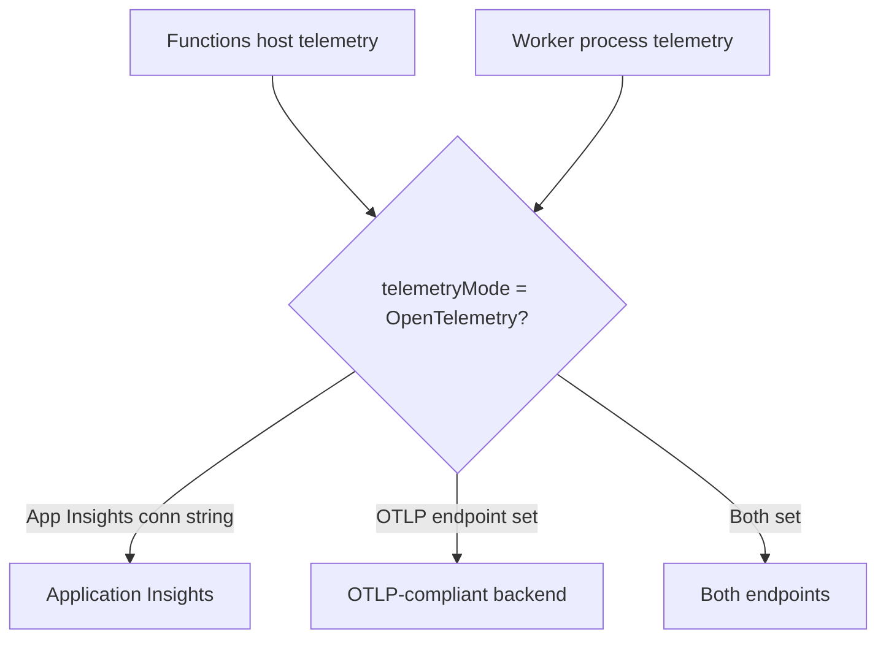

---
content_sources:
  references:
    - type: mslearn-adapted
      url: https://learn.microsoft.com/en-us/azure/azure-functions/opentelemetry-howto
    - type: mslearn-adapted
      url: https://learn.microsoft.com/en-us/azure/azure-functions/functions-monitoring
  diagrams:
    - id: opentelemetry-export-flow
      type: flowchart
      source: self-generated
      justification: Flow view of OpenTelemetry export paths, synthesized from Microsoft Learn documentation cited on this page.
      based_on:
        - https://learn.microsoft.com/en-us/azure/azure-functions/opentelemetry-howto
content_validation:
  status: verified
  last_reviewed: 2026-07-17
  reviewer: agent
  core_claims:
    - claim: "OpenTelemetry output is enabled at the function app level by adding telemetryMode set to OpenTelemetry in host.json."
      source: https://learn.microsoft.com/en-us/azure/azure-functions/opentelemetry-howto
      verified: true
    - claim: "When both an Application Insights connection string and an OTLP exporter are configured, OpenTelemetry data is sent to both endpoints."
      source: https://learn.microsoft.com/en-us/azure/azure-functions/opentelemetry-howto
      verified: true
    - claim: "OpenTelemetry is not supported for C# in-process apps."
      source: https://learn.microsoft.com/en-us/azure/azure-functions/opentelemetry-howto
      verified: true
    - claim: "When the host is configured to use OpenTelemetry, the Azure portal does not support log streaming."
      source: https://learn.microsoft.com/en-us/azure/azure-functions/opentelemetry-howto
      verified: true
---
# OpenTelemetry Export

Azure Functions can export logs and traces in OpenTelemetry (OTLP) format instead of relying solely on the Application Insights SDK. This lets you send the same host and worker telemetry to Application Insights, to any OTLP-compliant backend (Datadog, New Relic, Grafana), or to both. This page covers enabling and operating OpenTelemetry export in production.

!!! tip "Related Guide"
    For the day-2 monitoring workflow with Application Insights, see [Monitoring](monitoring.md).

## Prerequisites

- A function app on a supported runtime (OpenTelemetry is **not** supported for C# in-process apps).
- Access to update `host.json` and application settings.
- A destination: an Application Insights resource, an OTLP endpoint, or both.

## When to Use

- You need to send Functions telemetry to a non-Azure observability backend.
- You want standards-based, correlated traces and logs across the host and worker processes.
- You are standardizing telemetry across a multi-service estate on OpenTelemetry semantics.

Stay with the default Application Insights SDK path if you only need Azure Monitor and portal features such as live log streaming.

## Export Paths

<!-- diagram-id: opentelemetry-export-flow -->


## Procedure

### Step 1: Enable OpenTelemetry in the Host

Add `telemetryMode` to the root of `host.json`. This makes the host export OpenTelemetry regardless of language stack.

```json
{
    "version": "2.0",
    "telemetryMode": "OpenTelemetry"
}
```

### Step 2: Configure the Destination via App Settings

The app's environment variables determine where data is sent.

| App setting | Purpose |
|---|---|
| `APPLICATIONINSIGHTS_CONNECTION_STRING` | Sends OpenTelemetry data to an Application Insights workspace. |
| `OTEL_EXPORTER_OTLP_ENDPOINT` | The OTLP endpoint URL from your observability provider. |
| `OTEL_EXPORTER_OTLP_HEADERS` | Authentication headers (for example API keys) for the OTLP endpoint. |

When both an Application Insights connection string and an OTLP exporter are configured, data is sent to **both** endpoints. To export only to OTLP, remove `APPLICATIONINSIGHTS_CONNECTION_STRING`.

```bash
az functionapp config appsettings set --resource-group $RG --name $APP_NAME --settings OTEL_EXPORTER_OTLP_ENDPOINT="https://otlp.example-provider.com" OTEL_EXPORTER_OTLP_HEADERS="api-key=<redacted>"
```

| CLI element | Explanation |
|---|---|
| Command | `az functionapp config appsettings set` |
| Key flags | `--resource-group`, `--name`, `--settings` |
| Variables | `$RG`, `$APP_NAME`, provider endpoint and headers |
| Expected result | Settings applied; confirm they appear in the app configuration before validating export. |

### Step 3: Instrument the Worker Process

Enabling OpenTelemetry in both the host and the app code gives better trace/log correlation. Worker-side setup is language-specific — install the OpenTelemetry packages and register the exporter in your app's entry point (`Program.cs`, `function_app.py`, `src/index.js`, or Maven dependencies). See the language-specific instructions in the Microsoft Learn source below.

## Verification

- Confirm telemetry arrives at the configured backend (Application Insights or OTLP destination).
- In Application Insights, verify traces and logs correlate across the host and worker (shared operation IDs).
- Query for `instrumentation.provider == 'opentelemetry'` to confirm OpenTelemetry-sourced records.

## Rollback / Troubleshooting

- **Revert**: remove `telemetryMode` from `host.json` (or set it back to the default) to return to the Application Insights SDK path.
- **No log streaming**: when the host uses OpenTelemetry, the Azure portal does not support live log streaming — this is expected.
- **`logging.applicationInsights` ignored**: when `telemetryMode` is `OpenTelemetry`, the `logging.applicationInsights` section of `host.json` no longer applies.
- **Duplicate telemetry**: avoid adding a console exporter or the Azure Monitor distro in the worker when the host already emits equivalent telemetry.
- **Missing request telemetry**: with parent-based sampling, requests whose incoming `traceparent` is not sampled will not generate request telemetry.
- **Recent invocations view**: the portal's *Recent function invocation* traces appear only when telemetry is sent to Azure Monitor.

## See Also

- [Monitoring](monitoring.md)
- [Alerts](alerts.md)
- [Configuration](configuration.md)

## Sources

- [Use OpenTelemetry with Azure Functions (Microsoft Learn)](https://learn.microsoft.com/en-us/azure/azure-functions/opentelemetry-howto)
- [Monitor Azure Functions (Microsoft Learn)](https://learn.microsoft.com/en-us/azure/azure-functions/functions-monitoring)
