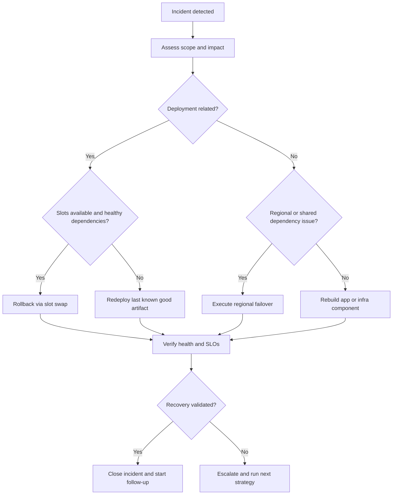
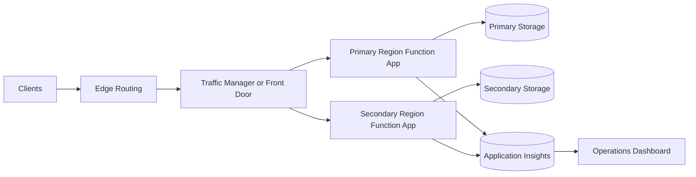

# Recovery
This guide covers operational recovery for Azure Functions: rollback, backup planning, and regional resilience.
It focuses on practical runbook execution for minimizing downtime and data loss.
!!! tip "Platform Guide"
    For scaling architecture and plan comparison, see [Scaling](../platform/scaling.md).
!!! tip "Language Guide"
    For Python deployment specifics, see the [Python Tutorial](../language-guides/python/tutorial/index.md).
## Prerequisites
Prepare these baseline capabilities before an incident:
- Azure CLI installed and authenticated with rights to the target subscription.
- Release artifacts stored in immutable storage with version identifiers.
- Monitoring available in Application Insights or Log Analytics.
- Documented RTO and RPO values approved by service owners.
- Primary and secondary region deployments provisioned with infrastructure as code.
Use consistent variable names in all runbooks:
```bash
RG_PRIMARY="rg-functions-prod-krc"
RG_SECONDARY="rg-functions-prod-jpe"
APP_PRIMARY="func-orders-prod-krc"
APP_SECONDARY="func-orders-prod-jpe"
STORAGE_ARTIFACTS="stfuncartifactsprod"
TM_PROFILE="tm-functions-prod"
FD_PROFILE="afd-functions-prod"
HEALTH_PATH="/api/health"
```
## When to Use
Use rollback, failover, or rebuild based on blast radius and dependency health.
### Rollback
Rollback is the default for deployment-induced incidents where infrastructure is healthy.
- Trigger condition: elevated failures begin right after a release.
- Typical scope: single app, single region, no regional dependency outage.
- Expected speed: minutes (fastest option when slots are available).

### Failover
Failover is preferred when region-level or shared dependency instability affects availability.
- Trigger condition: sustained platform or dependency failures in the primary region.
- Typical scope: multiple apps or critical dependencies in one geography.
- Expected speed: minutes to tens of minutes based on DNS and warm capacity.

### Rebuild
Rebuild is used when both deployment state and environment integrity are uncertain.
- Trigger condition: configuration drift, corrupted runtime state, or failed rollback attempts.
- Typical scope: app plus supporting resources requiring controlled rehydration.
- Expected speed: longer; prioritize data consistency and security posture.

### Recovery objectives
Define service objectives before incidents occur:
- **RTO** (Recovery Time Objective): target time to restore service.
- **RPO** (Recovery Point Objective): acceptable data loss window.
RTO and RPO determine architecture, replication, and operational tooling.

## Procedure
Use the runbook that matches observed symptoms and dependency status.

### Recovery decision flow
Use this decision path to choose rollback, failover, or rebuild.



### Scenario A: deployment regression with slots available
1. Confirm release timing aligns with error spike.
2. Validate staging slot is last known good version.
3. Run slot swap rollback.
4. Execute health checks and smoke tests.
5. Pause further releases until root cause is documented.

For Premium and Dedicated plans, deployment slots are the fastest rollback path.

```bash
az functionapp deployment slot swap \
    --resource-group "$RG_PRIMARY" \
    --name "$APP_PRIMARY" \
    --slot staging \
    --target-slot production
```

Example output:

```text
{
  "changed": true,
  "name": "func-orders-prod-krc",
  "resourceGroup": "rg-functions-prod-krc",
  "slotSwapStatus": {
    "sourceSlotName": "staging",
    "destinationSlotName": "production",
    "timestampUtc": "2026-04-04T09:11:23Z"
  },
  "status": "Succeeded"
}
```

### Scenario B: deployment regression without slots
1. Identify immutable artifact version to restore.
2. Redeploy artifact with `config-zip`.
3. Re-apply known-good settings baseline if drift is detected.
4. Restart function app if runtime remains unhealthy.
5. Validate queue/trigger processing catch-up.

For plans without slot support, redeploy the last known good artifact.

```bash
az functionapp deployment source config-zip \
    --resource-group "$RG_PRIMARY" \
    --name "$APP_PRIMARY" \
    --src "/tmp/orders-api-2026.03.28.zip"
```

Example output:

```text
{
  "active": true,
  "author": "<deployment-identity>",
  "complete": true,
  "deployer": "az_cli_functions",
  "id": "xxxxxxxx-xxxx-xxxx-xxxx-xxxxxxxxxxxx",
  "lastSuccessEndTime": "2026-04-04T09:18:44Z",
  "message": "Deployment successful",
  "status": 4
}
```

### Artifact and configuration backup
Maintain these backups for every release:
- Immutable build artifact with version metadata.
- Infrastructure templates and parameter sets.
- Exported app settings baseline (with secret values protected).
- Runbook steps for redeploy and validation.
Keep backup assets in secured, versioned storage.

### Data and state resilience
Most Azure Functions apps depend on storage and messaging services for state.
Recovery depends on those services' durability configuration:
- Use geo-redundant options where business continuity requires cross-region resilience.
- Align queue/topic retention and replay capability with RPO targets.
- Protect durable workflow state with storage redundancy and backup policy.

### Scenario C: regional outage or severe dependency instability
1. Confirm primary region dependency or platform degradation.
2. Verify secondary region app and dependencies are healthy.
3. Trigger Traffic Manager or Front Door failover action.
4. Monitor client success rate and latency during convergence.
5. Update incident channel with effective failover time.

### Regional recovery planning
Region-level recovery usually requires pre-provisioned secondary environment.
Recommended pattern:
1. Provision primary and secondary environments with infrastructure as code.
2. Replicate critical configuration and secrets strategy.
3. Use traffic management or DNS failover process.
4. Exercise failover and failback drills on a schedule.

Multi-region failover architecture:



Concrete failover patterns:
- **Traffic Manager Priority Routing**
    - Configure endpoint priority: primary = `1`, secondary = `2`.
    - Use endpoint monitoring path aligned to app health endpoint.
    - Keep DNS TTL low enough for acceptable failover convergence.
- **Front Door Origin Group Failover**
    - Place both regional function origins in one origin group.
    - Configure health probes with low interval for faster detection.
    - Use weighted or priority routing based on active-passive vs active-active.

Traffic Manager example:

```bash
az network traffic-manager endpoint update \
    --resource-group "$RG_PRIMARY" \
    --profile-name "$TM_PROFILE" \
    --type azureEndpoints \
    --name primary-endpoint \
    --endpoint-status Disabled
```

Example output:

```text
{
  "endpointStatus": "Disabled",
  "name": "primary-endpoint",
  "priority": 1,
  "targetResourceId": "/subscriptions/<subscription-id>/resourceGroups/rg-functions-prod-krc/providers/Microsoft.Web/sites/func-orders-prod-krc",
  "type": "Microsoft.Network/trafficManagerProfiles/azureEndpoints"
}
```

Front Door example:

```bash
az afd origin update \
    --resource-group "$RG_PRIMARY" \
    --profile-name "$FD_PROFILE" \
    --origin-group-name "functions-origins" \
    --origin-name "origin-primary" \
    --enabled-state Disabled
```

### Scenario D: rebuild from clean infrastructure baseline
1. Freeze change pipeline and snapshot forensic evidence.
2. Deploy infrastructure templates into clean target scope.
3. Deploy last known good application artifact.
4. Restore non-secret configuration and key vault references.
5. Run full verification checklist before reopening traffic.

### Health-based decision gates
Before failover or rollback, validate:
- Current incident scope (app-only or dependency-wide).
- Secondary environment readiness.
- Data consistency and queue lag status.
- Alert suppression or rerouting during controlled switch.

## Verification
After recovery action:
- Confirm health endpoint and key user journeys.
- Verify failure rate and latency return to baseline.
- Validate message processing catch-up.
- Re-enable normal alert thresholds and dashboards.

Health check verification command:

```bash
az rest \
    --method get \
    --url "https://$APP_PRIMARY.azurewebsites.net$HEALTH_PATH"
```

Example output:

```text
{
  "checks": {
    "application": "Healthy",
    "storage": "Healthy",
    "queue": "Healthy"
  },
  "durationMs": 38,
  "status": "Healthy",
  "timestampUtc": "2026-04-04T09:22:10Z",
  "version": "2026.03.28"
}
```

## Rollback / Troubleshooting
If recovery does not stabilize service, apply these controls.
- Revert traffic decision and isolate failing component path.
- Compare app settings and connection references between regions.
- Check dependency health (storage, messaging, downstream APIs) before app-level retries.
- Review deployment history and pin known-good release hash.
- Escalate to platform support for region-level anomalies.

## Advanced Topics
### Recovery drill checklist
- Documented owner and escalation path.
- Tested rollback command set.
- Tested region failover procedure.
- Measured achieved RTO/RPO versus targets.
- Action items tracked for gaps found during drill.

## See Also
- [Deployment](deployment.md)
- [Alerts](alerts.md)
- [Troubleshooting Methodology](../troubleshooting/methodology.md)

## Sources
- [Reliability in Azure Functions](https://learn.microsoft.com/azure/azure-functions/functions-best-practices)
- [Business continuity and disaster recovery for Azure applications](https://learn.microsoft.com/azure/architecture/framework/resiliency/disaster-recovery)
- [Azure Storage redundancy options](https://learn.microsoft.com/azure/storage/common/storage-redundancy)
- [Deployment slots in Azure Functions](https://learn.microsoft.com/azure/azure-functions/functions-deployment-slots)
- [Azure Traffic Manager endpoint monitoring](https://learn.microsoft.com/azure/traffic-manager/traffic-manager-monitoring)
- [Azure Front Door health probes](https://learn.microsoft.com/azure/frontdoor/health-probes)
