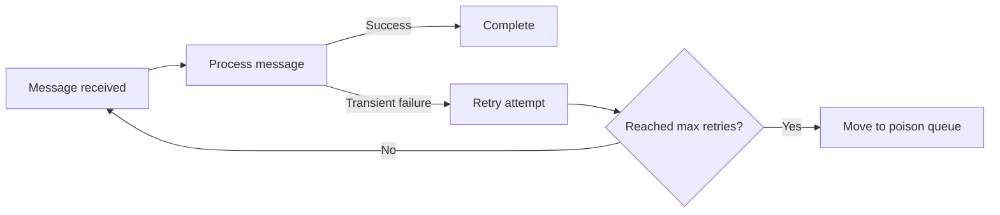
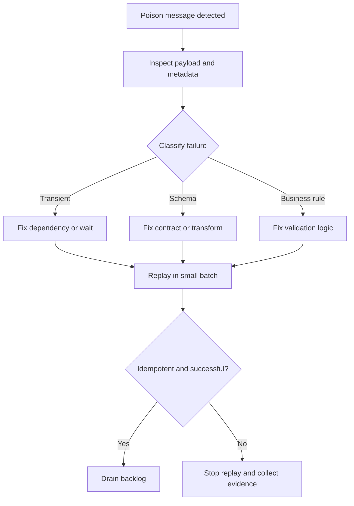

---
content_sources:
  - type: mslearn-adapted
    url: https://learn.microsoft.com/azure/azure-functions/functions-bindings-error-pages
  - type: mslearn-adapted
    url: https://learn.microsoft.com/azure/azure-functions/functions-bindings-storage-queue-trigger
  - type: mslearn-adapted
    url: https://learn.microsoft.com/azure/azure-functions/functions-bindings-service-bus-trigger
  - type: mslearn-adapted
    url: https://learn.microsoft.com/azure/azure-functions/functions-bindings-event-hubs-trigger
---

# Retries and Poison Handling
This guide explains retry execution and poison/dead-letter handling for Azure Functions event-driven workloads.
Use these patterns to protect reliability under transient failures and malformed messages.
!!! tip "Platform Guide"
    For scaling architecture and plan comparison, see [Scaling](../platform/scaling.md).
!!! tip "Language Guide"
    For Python deployment specifics, see the [Python Tutorial](../language-guides/python/tutorial/index.md).
## Prerequisites
- Access to a Function App with Queue, Service Bus, or Event Hubs triggers.
- Azure CLI 2.55+ and access to `az monitor`, `az storage`, and `az servicebus` command groups.
- Permissions to read metrics, inspect queue/subscription state, and deploy `host.json` updates.
- Application Insights connected to the Function App for KQL validation.
- A rollback path for retry configuration (slot swap or previous artifact).
## When to Use
Use this runbook when retries, poison queues, or dead-letter counts start increasing and delivery latency grows.

Choose the retry layer intentionally:
1. **Trigger/runtime retries** for transient infrastructure issues.
2. **Application-level retries** for dependency-specific failures where business logic can decide what is retryable.
3. **Both layers** only when cumulative retry budget is explicitly bounded.
## Procedure

### Reliability model
Azure Functions reliability for triggers is a combination of trigger-level delivery semantics, runtime retry policy behavior, and destination after retry exhaustion (poison queue or dead-letter). Design for idempotency first, then tune retries.

### Built-in retry support
Azure Functions supports retry behavior for selected triggers.
Common trigger categories with retry support include:
- Azure Storage Queue trigger.
- Azure Service Bus trigger.
- Azure Event Hubs trigger.

Configure retry behavior according to binding/runtime model for your language and extension.

### `host.json` and trigger extension settings
Some retry and poison behavior is controlled in `host.json` extension sections.

Example storage queue extension settings:
```json
{
  "version": "2.0",
  "extensions": {
    "queues": {
      "maxDequeueCount": 5,
      "visibilityTimeout": "00:00:30",
      "batchSize": 16,
      "newBatchThreshold": 8
    }
  }
}
```
`maxDequeueCount` determines when a message is treated as poison for Storage Queue trigger processing.

Concrete Service Bus extension retry example:
```json
{
  "version": "2.0",
  "extensions": {
    "serviceBus": {
      "prefetchCount": 0,
      "maxConcurrentCalls": 16,
      "autoCompleteMessages": false,
      "clientRetryOptions": {
        "mode": "exponential",
        "tryTimeout": "00:01:00",
        "delay": "00:00:01",
        "maxDelay": "00:00:30",
        "maxRetries": 5
      }
    }
  }
}
```

Concrete Event Hubs extension retry example:
`clientRetryOptions` controls Event Hubs SDK transport retries (service communication behavior), not Azure Functions invocation retry policy. Configure function-level retries separately using `host.json` settings or function retry attributes, depending on trigger and language.

```json
{
  "version": "2.0",
  "extensions": {
    "eventHubs": {
      "batchCheckpointFrequency": 1,
      "prefetchCount": 300,
      "maxBatchSize": 64,
      "clientRetryOptions": {
        "mode": "exponential",
        "tryTimeout": "00:01:00",
        "delay": "00:00:00.80",
        "maxDelay": "00:00:30",
        "maxRetries": 5
      }
    }
  }
}
```

### Poison queue behavior (Storage Queue)
For Storage Queue triggers, messages that exceed `maxDequeueCount` are moved to a poison queue.

Operational pattern:
- Main queue: `orders`.
- Poison queue: `orders-poison`.
- Build a dedicated poison-message processor for triage and replay.

This prevents infinite reprocessing loops and preserves failed payloads for investigation.

<!-- diagram-id: poison-queue-behavior-storage-queue -->


### Dead-letter behavior (Service Bus)
Service Bus uses dead-lettering semantics.
Messages can be moved to the dead-letter subqueue after max delivery attempts or explicit dead-letter action.

Operational responsibilities:
- Monitor dead-letter message count.
- Capture reason and error metadata.
- Provide controlled replay tools or manual remediation workflow.

### Retry strategy design
Use layered retry design:
1. **Trigger/runtime retries** for transient infrastructure issues.
2. **Application-level retries** for outbound dependencies when safe.
3. **Circuit breaker/timeouts** to avoid cascading failure.

Keep overall retry budget bounded to avoid queue starvation.

Custom retry in function code can use .NET Polly, Python retry decorators, or Node.js policy-based utilities.
Avoid duplicate retry layering: if trigger-level retries are already active, excessive in-code retries can amplify latency and cost.

### Idempotency requirements
Because retries and at-least-once delivery are common, handlers should be idempotent:
- Use deterministic operation keys.
- Record processed message identifiers where required.
- Make writes safe for duplicate delivery.

Without idempotency, retries can create duplicate side effects.

Python idempotent handling example:
```python
import hashlib
import json
import os

import azure.functions as func
from azure.core.exceptions import ResourceExistsError
from azure.data.tables import TableServiceClient

app = func.FunctionApp()
table = TableServiceClient.from_connection_string(os.environ["AzureWebJobsStorage"]).get_table_client("ProcessedMessages")
table.create_table_if_not_exists()

def seen_before(payload: dict) -> bool:
    try:
        key = hashlib.sha256(json.dumps(payload, sort_keys=True).encode("utf-8")).hexdigest()
        table.create_entity(entity={"PartitionKey": "orders", "RowKey": key})
        return False
    except ResourceExistsError:
        return True

@app.queue_trigger(arg_name="msg", queue_name="orders", connection="AzureWebJobsStorage")
def process_order(msg: func.QueueMessage) -> None:
    payload = json.loads(msg.get_body().decode("utf-8"))
    if seen_before(payload):
        return
    # Execute side effects exactly once for this payload key.
```

### Monitoring retry and poison health
Track these operational signals:
- Retry attempt trend by function.
- Poison queue message count growth.
- Dead-letter count and age.
- Processing lag between enqueue and completion.

Use alerts when poison/dead-letter counts grow continuously.

### Operational triage workflow
1. Inspect message payload and metadata.
2. Classify failure type (transient, schema, business rule, dependency outage).
3. Fix root cause.
4. Replay safely from poison/dead-letter store.
5. Verify no duplicate side effects.

<!-- diagram-id: operational-triage-workflow -->


### CLI investigation examples
Peek poison queue messages (Storage Queue):
```bash
az storage message peek \
    --account-name $STORAGE_NAME \
    --queue-name orders-poison \
    --auth-mode login \
    --num-messages 5
```
Example output (PII masked):
```json
[
  {
    "id": "<message-id>",
    "dequeueCount": 5,
    "insertionTime": "2026-03-18T09:42:11+00:00",
    "content": "eyJvcmRlcklkIjoiT1JELTEwMDEifQ=="
  }
]
```

Check queue metrics (poison queue growth):
```bash
az monitor metrics list \
    --resource "/subscriptions/<subscription-id>/resourceGroups/$RG/providers/Microsoft.Storage/storageAccounts/$STORAGE_NAME" \
    --metric QueueMessageCount \
    --interval PT5M \
    --aggregation Average
```
Example output (PII masked):
```json
{
  "interval": "PT5M",
  "value": [
    {
      "name": {"value": "QueueMessageCount"},
      "timeseries": [{"data": [{"timeStamp": "2026-03-18T09:45:00Z", "average": 21.0}]}]
    }
  ]
}
```

Check Service Bus dead-letter count:
```bash
az servicebus queue show \
    --resource-group $RG \
    --namespace-name $SERVICEBUS_NAMESPACE \
    --name orders \
    --query "countDetails"
```
Example output (PII masked):
```json
{
  "activeMessageCount": 24,
  "deadLetterMessageCount": 17,
  "scheduledMessageCount": 0
}
```

## Verification
Validate that retry tuning reduces failure amplification and poison/dead-letter growth stabilizes.

KQL query: retry rates by function (last 60 minutes):
```kusto
traces
| where timestamp > ago(60m)
| where message has_any ("Retrying", "retry attempt", "dequeueCount")
| extend FunctionName = tostring(customDimensions["FunctionName"])
| summarize RetryEvents = count() by bin(timestamp, 5m), FunctionName
| order by timestamp asc
```

KQL query: poison queue and dead-letter growth signal:
```kusto
traces
| where timestamp > ago(60m)
| where message has_any ("orders-poison", "dead-letter", "deadletter")
| extend QueueName = coalesce(tostring(customDimensions["QueueName"]), tostring(customDimensions["EntityName"]), "unknown")
| summarize Events = count() by bin(timestamp, 5m), QueueName
| order by timestamp asc
```

Verification checklist:
- Retry event frequency declines after policy update.
- Poison/dead-letter growth is non-monotonic or decreasing.

## Rollback / Troubleshooting
Use this section when retries trigger cascading failures (dependency saturation, lock churn, rising latency).

Immediate containment:
1. Reduce trigger concurrency before increasing retries.
2. Roll back `host.json` retry settings to known-good values.
3. Pause replay workers if poison/dead-letter growth accelerates.
4. Tighten timeout and circuit breaker policies for weak dependencies.

Troubleshooting sequence:
1. Confirm whether failures are transient or deterministic from sampled payloads.
2. Compare retry volume with downstream dependency error rates.
3. Validate visibility timeout or lock duration versus actual processing time.
4. Resume replay in controlled batches and monitor duplication signals.

Common anti-patterns:
- Raising retry counts without reducing concurrency.
- Replaying poison queues before fixing schema/business-rule defects.
- Combining trigger-level and in-code retries without total budget limits.

## See Also
- [Monitoring](monitoring.md)
- [Alerts](alerts.md)
- [Platform Reliability](../platform/reliability.md)

## Sources
- [Azure Functions error handling and retries](https://learn.microsoft.com/azure/azure-functions/functions-bindings-error-pages)
- [Azure Queue Storage trigger for Azure Functions](https://learn.microsoft.com/azure/azure-functions/functions-bindings-storage-queue-trigger)
- [Azure Service Bus trigger for Azure Functions](https://learn.microsoft.com/azure/azure-functions/functions-bindings-service-bus-trigger)
- [Azure Event Hubs trigger for Azure Functions](https://learn.microsoft.com/azure/azure-functions/functions-bindings-event-hubs-trigger)
