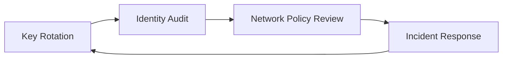

---
content_sources:
  - type: mslearn-adapted
    url: https://learn.microsoft.com/azure/azure-functions/security-concepts
  - type: mslearn-adapted
    url: https://learn.microsoft.com/azure/azure-functions/function-keys-how-to
  - type: mslearn-adapted
    url: https://learn.microsoft.com/azure/role-based-access-control/overview
  - type: mslearn-adapted
    url: https://learn.microsoft.com/azure/azure-functions/functions-identity-based-connections-tutorial
  - type: mslearn-adapted
    url: https://learn.microsoft.com/azure/app-service/app-service-web-tutorial-rest-api#app-service-cors-versus-your-cors
  - type: mslearn-adapted
    url: https://learn.microsoft.com/azure/app-service/configure-ssl-bindings
  - type: mslearn-adapted
    url: https://learn.microsoft.com/azure/app-service/app-service-ip-restrictions
  - type: mslearn-adapted
    url: https://learn.microsoft.com/azure/azure-monitor/essentials/platform-logs-overview
---

# Security Operations
This guide covers day-to-day security operations for Azure Functions: key rotation, RBAC audits, CORS controls, TLS/HTTPS enforcement, IP restrictions, and security monitoring.

!!! tip "Platform Guide"
    For security architecture and auth design decisions, see [Security](../platform/security.md).

!!! tip "Language Guide"
    For Python authentication code examples, see [HTTP Authentication](../language-guides/python/recipes/http-auth.md).

Treat security as continuous operations, not one-time setup.
For production function apps, run a recurring process for keys, access, transport, network boundaries, and monitoring.

## Prerequisites
- Azure CLI 2.58.0 or later (`az version`).
- Required permissions for `Microsoft.Web/sites/*`, `Microsoft.Authorization/roleAssignments/read`, and diagnostic settings management.
- Log Analytics workspace connected to the function app.
- Shell variables configured for repeatable commands.

```bash
RG="rg-functions-prod"
APP_NAME="func-prod-api"
FUNCTION_NAME="HttpIngress"
LAW_NAME="law-functions-prod"
VNET_NAME="vnet-functions-prod"
SUBNET_NAME="snet-functions-integration"
SUBSCRIPTION_ID="<subscription-id>"
APP_RESOURCE_ID="/subscriptions/$SUBSCRIPTION_ID/resourceGroups/$RG/providers/Microsoft.Web/sites/$APP_NAME"
WORKSPACE_ID="/subscriptions/$SUBSCRIPTION_ID/resourceGroups/$RG/providers/Microsoft.OperationalInsights/workspaces/$LAW_NAME"
```

## When to Use
Use this runbook in these cases:
- New production deployment that needs baseline hardening.
- Recurring maintenance windows (daily, weekly, monthly).
- Confirmed or suspected secret leakage, identity compromise, or abnormal access pattern.
- Ownership change in CI/CD pipelines, app teams, or platform teams.
- Policy rollout affecting TLS, networking, identity, or monitoring controls.

## Procedure
Operate controls in a fixed loop so key material, identities, and network boundaries are continuously validated.

<!-- diagram-id: procedure -->


### Function key rotation
Function keys are shared secrets.
Rotate on schedule (for example, every 30-90 days) and immediately after leakage or incident response.

List current function and host keys:

```bash
az functionapp function keys list --name "$APP_NAME" --resource-group "$RG" --function-name "$FUNCTION_NAME"
az functionapp keys list --name "$APP_NAME" --resource-group "$RG"
```

Example output (sanitized):

```text
{"default":"xxxxxxxxxxxxxxxxxxxxxxxxxxxxxxxxxxxxxxxxxxx"}
{"functionKeys":{"default":"xxxxxxxxxxxxxxxxxxxxxxxxxxxxxxxxxxxxxxxxxxx"},"masterKey":"xxxxxxxxxxxxxxxxxxxxxxxxxxxxxxxxxxxxxxxxxxx"}
```

Regenerate keys (recommended: let Azure generate secure values automatically):

```bash
az functionapp function keys set --name "$APP_NAME" --resource-group "$RG" --function-name "$FUNCTION_NAME" --key-name "default"
az functionapp keys set --name "$APP_NAME" --resource-group "$RG" --key-type "functionKeys" --key-name "default"
```
Only supply explicit `--key-value` when you have a specific operational need (for example, controlled migration or deterministic rollback).


Automate rotation with Azure Automation, Logic Apps, or a scheduled function.
Recommended runbook:
1. Generate and set new keys.
2. Save values as new Azure Key Vault secret versions.
3. Notify consumers to refresh secrets.
4. Confirm traffic cutover.
5. Revoke old keys.

### RBAC and access control audit
RBAC drift is a frequent operational risk.
Review role assignments regularly and remove broad standing access.

```bash
az role assignment list --scope "$APP_RESOURCE_ID" --include-inherited true
```

Example output (sanitized):

```text
[{"principalName":"func-prod-ops-mi","principalType":"ServicePrincipal","roleDefinitionName":"Website Contributor","scope":"/subscriptions/<subscription-id>/resourceGroups/rg-functions-prod/providers/Microsoft.Web/sites/func-prod-api"}]
```

Audit Owner/Contributor grants:

```bash
az role assignment list --scope "$APP_RESOURCE_ID" --include-inherited true --query "[?roleDefinitionName=='Owner' || roleDefinitionName=='Contributor'].{principalName:principalName,principalType:principalType,role:roleDefinitionName,scope:scope}" --output table
```

Audit one deployment principal (masked ID):

```bash
az role assignment list --assignee "xxxxxxxx-xxxx-xxxx-xxxx-xxxxxxxxxxxx" --all true --query "[].{role:roleDefinitionName,scope:scope,principalType:principalType}"
```

Least-privilege guidance: prefer GitHub Actions OIDC over client secrets, scope deployment identity to minimum required resources, and re-validate after pipeline ownership changes.

### CORS configuration
CORS controls which browser origins can call HTTP endpoints.
It is not authentication and must be combined with auth controls.

```bash
az functionapp cors show --name "$APP_NAME" --resource-group "$RG"
```

Add approved origins:

```bash
az functionapp cors add --name "$APP_NAME" --resource-group "$RG" --allowed-origins "https://portal.contoso.example" "https://admin.contoso.example"
```

Remove deprecated origins:

```bash
az functionapp cors remove --name "$APP_NAME" --resource-group "$RG" --allowed-origins "https://old.contoso.example"
```

Enable credentialed requests only when required:

```bash
az functionapp cors credentials --name "$APP_NAME" --resource-group "$RG" --enable true
```

!!! warning "Wildcard risk"
    Avoid `*` in production. With credentialed traffic, wildcard origins can expose session context to unintended browser origins.

### TLS and HTTPS enforcement
Enforce encrypted transport for all production apps.
Set HTTPS-only and minimum TLS version 1.2 or higher.

```bash
az functionapp update --name "$APP_NAME" --resource-group "$RG" --https-only true
az functionapp config set --name "$APP_NAME" --resource-group "$RG" --min-tls-version "1.2"
```

Custom domain and certificate operations:

```bash
az functionapp config hostname add --name "$APP_NAME" --resource-group "$RG" --hostname "api.contoso.example"
az functionapp config ssl bind --name "$APP_NAME" --resource-group "$RG" --certificate-thumbprint "<certificate-thumbprint>" --ssl-type "SNI"
```

Operational checks: monitor certificate expiry, verify HTTPS redirection, and re-check TLS baseline after IaC or policy changes.

### IP restrictions
Use access restrictions to constrain inbound access to app and deployment surfaces.
Always manage main site and SCM site independently.

Allow known ingress and deny default:

```bash
az functionapp config access-restriction add --name "$APP_NAME" --resource-group "$RG" --rule-name "AllowCorpEgress" --action "Allow" --ip-address "203.0.113.0/24" --priority 100
az functionapp config access-restriction add --name "$APP_NAME" --resource-group "$RG" --rule-name "DenyAll" --action "Deny" --ip-address "0.0.0.0/0" --priority 2147483647
```

Restrict SCM endpoint separately:

```bash
az functionapp config access-restriction add --name "$APP_NAME" --resource-group "$RG" --rule-name "AllowScmBuildAgents" --action "Allow" --ip-address "198.51.100.0/24" --priority 110 --scm-site true
```

Combine with virtual network service endpoint rules when needed:

```bash
az functionapp config access-restriction add --name "$APP_NAME" --resource-group "$RG" --rule-name "AllowFromIntegrationSubnet" --action "Allow" --vnet-name "$VNET_NAME" --subnet "$SUBNET_NAME" --priority 120
```

Check current access restrictions:

```bash
az functionapp config access-restriction show --name "$APP_NAME" --resource-group "$RG"
```

Example output (sanitized):

```text
{"ipSecurityRestrictions":[{"name":"AllowCorpEgress","action":"Allow","ipAddress":"203.0.113.0/24","priority":100},{"name":"DenyAll","action":"Deny","ipAddress":"0.0.0.0/0","priority":2147483647}],"scmIpSecurityRestrictions":[{"name":"AllowScmBuildAgents","action":"Allow","ipAddress":"198.51.100.0/24","priority":110}]}
```

### Diagnostic logging for security events
Enable diagnostics to send platform logs and metrics to Log Analytics for audit and detection.

```bash
az monitor diagnostic-settings create --name "func-security-diagnostics" --resource "$APP_RESOURCE_ID" --workspace "$WORKSPACE_ID" --logs '[{"category":"AppServiceHTTPLogs","enabled":true},{"category":"AppServiceAuditLogs","enabled":true},{"category":"AppServicePlatformLogs","enabled":true}]' --metrics '[{"category":"AllMetrics","enabled":true}]'
```

KQL: failed authentication/authorization trend:

```kql
AppServiceHTTPLogs
| where TimeGenerated > ago(24h)
| where ScStatus in (401, 403)
| summarize Failures=count() by CIp, CsHost, CsUriStem, bin(TimeGenerated, 15m)
| order by Failures desc
```

KQL: suspicious key-query usage pattern:

```kql
AppServiceHTTPLogs
| where TimeGenerated > ago(7d)
| where CsUriQuery has "code="
| summarize Requests=count() by CIp, bin(TimeGenerated, 1h)
| where Requests > 100
| order by Requests desc
```

Create a scheduled query alert for repeated failures:

```bash
az monitor scheduled-query create --name "func-auth-failures" --resource-group "$RG" --scopes "$APP_RESOURCE_ID" --condition "count 'AUTH_FAILURE_QUERY' > 50" --condition-query "AUTH_FAILURE_QUERY=AppServiceHTTPLogs | where ScStatus in (401,403)" --description "High unauthorized/forbidden response volume" --evaluation-frequency "PT5M" --window-size "PT15M" --severity 2
```

### Operational security routine
Run this cadence and tighten by risk profile:
- Daily: check 401/403 anomalies, confirm alert delivery, validate no emergency grant remains active.
- Weekly: review RBAC changes, reconcile CORS allowlist, verify SCM restrictions match CI/CD egress ranges.
- Monthly: rotate keys, validate Key Vault propagation and client cutover, re-check HTTPS/TLS baseline.

## Verification
Run these checks after each maintenance cycle or incident action.

Validate HTTPS and TLS posture:

```bash
az functionapp show --name "$APP_NAME" --resource-group "$RG" --query "{httpsOnly:httpsOnly,clientCertEnabled:clientCertEnabled}" --output table
az functionapp config show --name "$APP_NAME" --resource-group "$RG" --query "{minTlsVersion:minTlsVersion,scmMinTlsVersion:scmMinTlsVersion}" --output table
```

Expected output (sanitized):

```text
HttpsOnly    ClientCertEnabled
True         False
MinTlsVersion    ScmMinTlsVersion
1.2              1.2
```

Validate least-privilege scope:

```bash
az role assignment list --scope "$APP_RESOURCE_ID" --include-inherited true --query "[?roleDefinitionName=='Owner' || roleDefinitionName=='Contributor'].{principalName:principalName,role:roleDefinitionName}" --output table
```

Validate access restriction defaults:

```bash
az functionapp config access-restriction show --name "$APP_NAME" --resource-group "$RG" --query "{mainDefault:ipSecurityRestrictionsDefaultAction,scmDefault:scmIpSecurityRestrictionsDefaultAction}" --output table
```

Validate diagnostics attachment:

```bash
az monitor diagnostic-settings list --resource "$APP_RESOURCE_ID" --query "[].{name:name,workspaceId:workspaceId}" --output table
```

## Rollback / Troubleshooting
Use these actions when a control change breaks production traffic or when indicators suggest compromise.

### Incident: key rotation caused client failures
Symptoms: increased 401 responses and client authentication failures immediately after key update.
Recovery steps:
1. Confirm clients still using old key versions.
2. Re-issue previous key value only for emergency bridge window.
3. Enforce a timed rollback window and track remaining callers.
4. Rotate again after all clients are updated.

```bash
az functionapp function keys set --name "$APP_NAME" --resource-group "$RG" --function-name "$FUNCTION_NAME" --key-name "default" --key-value "<previous-key-from-key-vault-version>"
```

### Incident: RBAC change locked out operators
Symptoms: deployment or operations commands fail with `AuthorizationFailed`.
Recovery steps:
1. Use approved break-glass identity with time-bound access.
2. Restore required role at exact scope.
3. Remove emergency assignment after remediation validation.

```bash
az role assignment create --assignee "xxxxxxxx-xxxx-xxxx-xxxx-xxxxxxxxxxxx" --role "Website Contributor" --scope "$APP_RESOURCE_ID"
```

### Incident: access restrictions blocked valid ingress
Symptoms: HTTP 403 from trusted sources after restriction updates.
Recovery steps:
1. Validate source NAT egress ranges from gateway or pipeline.
2. Add temporary allow rule with explicit expiration ticket.
3. Reconcile intended CIDR ranges and remove temporary rules.

```bash
az functionapp config access-restriction add --name "$APP_NAME" --resource-group "$RG" --rule-name "TemporaryIncidentAllow" --action "Allow" --ip-address "203.0.113.25/32" --priority 105
```

### Incident response evidence checklist
- Preserve Activity Log, platform logs, and app logs for the incident window.
- Capture timeline with UTC timestamps, command transcripts, and change ticket IDs.
- Record impacted principals, keys, origins, and IP ranges with masked identifiers.
- File prevention action items for identity, secret, network, and monitoring controls.

## Advanced Topics
### Security compliance checklist
Use this minimum operating cadence and tighten based on risk and regulation.

### Daily
- Check 401/403 anomalies and unfamiliar source IPs.
- Confirm alert delivery to on-call channels.
- Validate no emergency access grant remains active.

### Weekly
- Review RBAC changes and remove temporary privileges.
- Reconcile CORS allowlist with active front-end domains.
- Verify SCM restrictions still match CI/CD origin ranges.

### Monthly
- Rotate function and host keys.
- Validate Key Vault propagation and client cutover.
- Confirm HTTPS-only and minimum TLS baseline in all environments.

### Quarterly
- Re-certify Owner and Contributor assignments.
- Run tabletop or live drill for leaked key and compromised principal scenarios.
- Review certificate inventory and renew ahead of expiration.

!!! note "Control ownership"
    Assign explicit owners: platform team for RBAC/TLS/network controls, application team for key-consumer rollout, and operations team for monitoring triage and evidence retention.

## See Also
- [Security](../platform/security.md)
- [Configuration](../operations/configuration.md)
- [Monitoring](../operations/monitoring.md)
- [Alerts](../operations/alerts.md)
- [Recovery](../operations/recovery.md)
- [Troubleshooting Methodology](../troubleshooting/methodology.md)

## Sources
- [Azure Functions security concepts](https://learn.microsoft.com/azure/azure-functions/security-concepts)
- [Work with access keys in Azure Functions](https://learn.microsoft.com/azure/azure-functions/function-keys-how-to)
- [Azure role-based access control overview](https://learn.microsoft.com/azure/role-based-access-control/overview)
- [Use managed identities with Azure Functions](https://learn.microsoft.com/azure/azure-functions/functions-identity-based-connections-tutorial)
- [Configure CORS for App Service](https://learn.microsoft.com/azure/app-service/app-service-web-tutorial-rest-api#app-service-cors-versus-your-cors)
- [Configure TLS/SSL bindings in App Service](https://learn.microsoft.com/azure/app-service/configure-ssl-bindings)
- [Set up access restrictions for App Service](https://learn.microsoft.com/azure/app-service/app-service-ip-restrictions)
- [Azure Monitor platform logs overview](https://learn.microsoft.com/azure/azure-monitor/essentials/platform-logs-overview)
