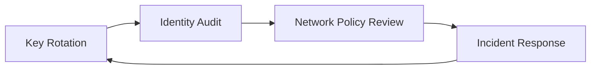

---
content_sources:
  - type: mslearn-adapted
    url: https://learn.microsoft.com/azure/azure-functions/security-concepts
  - type: mslearn-adapted
    url: https://learn.microsoft.com/azure/azure-functions/function-keys-how-to
  - type: mslearn-adapted
    url: https://learn.microsoft.com/azure/role-based-access-control/overview
  - type: mslearn-adapted
    url: https://learn.microsoft.com/azure/azure-functions/functions-identity-based-connections-tutorial
  - type: mslearn-adapted
    url: https://learn.microsoft.com/azure/app-service/app-service-web-tutorial-rest-api#app-service-cors-versus-your-cors
  - type: mslearn-adapted
    url: https://learn.microsoft.com/azure/app-service/configure-ssl-bindings
  - type: mslearn-adapted
    url: https://learn.microsoft.com/azure/app-service/app-service-ip-restrictions
  - type: mslearn-adapted
    url: https://learn.microsoft.com/azure/azure-monitor/essentials/platform-logs-overview
content_validation:
  status: verified
  last_reviewed: 2026-04-12
  reviewer: agent
  core_claims:
    - claim: "Azure Functions security operations include rotating function and host keys when secrets are exposed or on a scheduled basis."
      source: https://learn.microsoft.com/azure/azure-functions/function-keys-how-to
      verified: true
    - claim: "RBAC should be used to audit and control access to Azure resources instead of relying only on shared secrets."
      source: https://learn.microsoft.com/azure/role-based-access-control/overview
      verified: true
    - claim: "Identity-based connections are supported for Azure Functions so apps can access services without storing connection secrets in configuration."
      source: https://learn.microsoft.com/azure/azure-functions/functions-identity-based-connections-tutorial
      verified: true
    - claim: "IP restrictions, TLS/HTTPS configuration, and platform logs are core operational controls for securing Function Apps."
      source: https://learn.microsoft.com/azure/app-service/app-service-ip-restrictions
      verified: true
---

# Security Operations
This guide covers day-to-day security operations for Azure Functions: key rotation, RBAC audits, CORS controls, TLS/HTTPS enforcement, IP restrictions, and security monitoring.

!!! tip "Platform Guide"
    For security architecture and auth design decisions, see [Security](../platform/security.md).

!!! tip "Language Guide"
    For Python authentication code examples, see [HTTP Authentication](../language-guides/python/recipes/http-auth.md).

Treat security as continuous operations, not one-time setup.
For production function apps, run a recurring process for keys, access, transport, network boundaries, and monitoring.

## Prerequisites
- Azure CLI 2.58.0 or later (`az version`).
- Required permissions for `Microsoft.Web/sites/*`, `Microsoft.Authorization/roleAssignments/read`, and diagnostic settings management.
- Log Analytics workspace connected to the function app.
- Shell variables configured for repeatable commands.

```bash
RG="rg-functions-prod"
APP_NAME="func-prod-api"
FUNCTION_NAME="HttpIngress"
LAW_NAME="law-functions-prod"
VNET_NAME="vnet-functions-prod"
SUBNET_NAME="snet-functions-integration"
SUBSCRIPTION_ID="<subscription-id>"
APP_RESOURCE_ID="/subscriptions/$SUBSCRIPTION_ID/resourceGroups/$RG/providers/Microsoft.Web/sites/$APP_NAME"
WORKSPACE_ID="/subscriptions/$SUBSCRIPTION_ID/resourceGroups/$RG/providers/Microsoft.OperationalInsights/workspaces/$LAW_NAME"
```

| Command/Parameter | Purpose |
|-------------------|---------|
| `RG` | Resource group name |
| `APP_NAME` | Function app name |
| `FUNCTION_NAME` | Name of the specific function within the app |
| `LAW_NAME` | Log Analytics workspace name |
| `VNET_NAME` | Virtual network name |
| `SUBNET_NAME` | Subnet name for integration |
| `APP_RESOURCE_ID` | Fully qualified Azure resource ID for the function app |
| `WORKSPACE_ID` | Fully qualified Azure resource ID for the workspace |

## When to Use
Use this runbook in these cases:
- New production deployment that needs baseline hardening.
- Recurring maintenance windows (daily, weekly, monthly).
- Confirmed or suspected secret leakage, identity compromise, or abnormal access pattern.
- Ownership change in CI/CD pipelines, app teams, or platform teams.
- Policy rollout affecting TLS, networking, identity, or monitoring controls.

## Procedure
Operate controls in a fixed loop so key material, identities, and network boundaries are continuously validated.

<!-- diagram-id: procedure -->


### Function key rotation
Function keys are shared secrets.
Rotate on schedule (for example, every 30-90 days) and immediately after leakage or incident response.

List current function and host keys:

```bash
az functionapp function keys list --name "$APP_NAME" --resource-group "$RG" --function-name "$FUNCTION_NAME"
az functionapp keys list --name "$APP_NAME" --resource-group "$RG"
```

| Command/Parameter | Purpose |
|-------------------|---------|
| `az functionapp function keys list` | Lists all keys for a specific function |
| `az functionapp keys list` | Lists all host-level keys for the function app |
| `--name "$APP_NAME"` | Specifies the function app name |
| `--function-name "$FUNCTION_NAME"` | Target function for key listing |

Example output (sanitized):
...
Regenerate keys (recommended: let Azure generate secure values automatically):

```bash
az functionapp function keys set --name "$APP_NAME" --resource-group "$RG" --function-name "$FUNCTION_NAME" --key-name "default"
az functionapp keys set --name "$APP_NAME" --resource-group "$RG" --key-type "functionKeys" --key-name "default"
```

| Command/Parameter | Purpose |
|-------------------|---------|
| `az functionapp function keys set` | Creates or updates a specific function key |
| `az functionapp keys set` | Creates or updates a host-level key |
| `--key-name "default"` | Target key name to rotate |
| `--key-type "functionKeys"` | Specifies rotation of host-level function keys |

Example output (sanitized):
```text
{"default":"xxxxxxxxxxxxxxxxxxxxxxxxxxxxxxxxxxxxxxxxxxx"}
{"functionKeys":{"default":"xxxxxxxxxxxxxxxxxxxxxxxxxxxxxxxxxxxxxxxxxxx"},"masterKey":"xxxxxxxxxxxxxxxxxxxxxxxxxxxxxxxxxxxxxxxxxxx"}
```

Only supply explicit `--key-value` when you have a specific operational need (for example, controlled migration or deterministic rollback).


Automate rotation with Azure Automation, Logic Apps, or a scheduled function.
Recommended runbook:
1. Generate and set new keys.
2. Save values as new Azure Key Vault secret versions.
3. Notify consumers to refresh secrets.
4. Confirm traffic cutover.
5. Revoke old keys.

### RBAC and access control audit
RBAC drift is a frequent operational risk.
Review role assignments regularly and remove broad standing access.

```bash
az role assignment list --scope "$APP_RESOURCE_ID" --include-inherited true
```

| Command/Parameter | Purpose |
|-------------------|---------|
| `az role assignment list` | Lists all Azure RBAC role assignments |
| `--scope "$APP_RESOURCE_ID"` | Targets the specific function app |
| `--include-inherited true` | Shows roles assigned at higher scopes (subscription, resource group) |

Example output (sanitized):
...
Audit Owner/Contributor grants:

```bash
az role assignment list --scope "$APP_RESOURCE_ID" --include-inherited true --query "[?roleDefinitionName=='Owner' || roleDefinitionName=='Contributor'].{principalName:principalName,principalType:principalType,role:roleDefinitionName,scope:scope}" --output table
```

| Command/Parameter | Purpose |
|-------------------|---------|
| `az role assignment list` | Lists role assignments |
| `--query` | Filters for `Owner` and `Contributor` roles and extracts specific fields |
| `--output table` | Formats results as a table |

Audit one deployment principal (masked ID):

```bash
az role assignment list --assignee "xxxxxxxx-xxxx-xxxx-xxxx-xxxxxxxxxxxx" --all true --query "[].{role:roleDefinitionName,scope:scope,principalType:principalType}"
```

| Command/Parameter | Purpose |
|-------------------|---------|
| `az role assignment list` | Lists assignments for a specific identity |
| `--assignee` | The object ID of the user or service principal to audit |
| `--all true` | Shows assignments across all scopes for this identity |

Example output (sanitized):
```json
[
  {
    "principalName": "func-prod-ops-mi",
    "principalType": "ServicePrincipal",
    "roleDefinitionName": "Website Contributor",
    "scope": "/subscriptions/<subscription-id>/resourceGroups/rg-functions-prod/providers/Microsoft.Web/sites/func-prod-api"
  }
]
```

Least-privilege guidance: prefer GitHub Actions OIDC over client secrets, scope deployment identity to minimum required resources, and re-validate after pipeline ownership changes.

### CORS configuration
CORS controls which browser origins can call HTTP endpoints.
It is not authentication and must be combined with auth controls.

```bash
az functionapp cors show --name "$APP_NAME" --resource-group "$RG"
```

| Command/Parameter | Purpose |
|-------------------|---------|
| `az functionapp cors show` | Displays the current Cross-Origin Resource Sharing (CORS) settings |
| `--name "$APP_NAME"` | Specifies the function app name |
| `--resource-group "$RG"` | Specifies the resource group |

Add approved origins:

```bash
az functionapp cors add --name "$APP_NAME" --resource-group "$RG" --allowed-origins "https://portal.contoso.example" "https://admin.contoso.example"
```

| Command/Parameter | Purpose |
|-------------------|---------|
| `az functionapp cors add` | Appends a new origin to the CORS allowlist |
| `--allowed-origins` | Space-separated list of browser origins to allow |

Remove deprecated origins:

```bash
az functionapp cors remove --name "$APP_NAME" --resource-group "$RG" --allowed-origins "https://old.contoso.example"
```

| Command/Parameter | Purpose |
|-------------------|---------|
| `az functionapp cors remove` | Deletes a specific origin from the CORS allowlist |

Enable credentialed requests only when required:

```bash
az functionapp cors credentials --name "$APP_NAME" --resource-group "$RG" --enable true
```

| Command/Parameter | Purpose |
|-------------------|---------|
| `az functionapp cors credentials` | Configures whether requests can include cookies or authorization headers |
| `--enable true` | Enables support for credentialed CORS requests |

!!! warning "Wildcard risk"
    Avoid `*` in production. With credentialed traffic, wildcard origins can expose session context to unintended browser origins.

### TLS and HTTPS enforcement
Enforce encrypted transport for all production apps.
Set HTTPS-only and minimum TLS version 1.2 or higher.

```bash
az functionapp update --name "$APP_NAME" --resource-group "$RG" --https-only true
az functionapp config set --name "$APP_NAME" --resource-group "$RG" --min-tls-version "1.2"
```

| Command/Parameter | Purpose |
|-------------------|---------|
| `az functionapp update` | Updates common properties of the function app |
| `--https-only true` | Redirects all HTTP requests to HTTPS |
| `az functionapp config set` | Updates the app configuration |
| `--min-tls-version "1.2"` | Sets the minimum required TLS version for client connections |

Custom domain and certificate operations:

```bash
az functionapp config hostname add --name "$APP_NAME" --resource-group "$RG" --hostname "api.contoso.example"
az functionapp config ssl bind --name "$APP_NAME" --resource-group "$RG" --certificate-thumbprint "<certificate-thumbprint>" --ssl-type "SNI"
```

| Command/Parameter | Purpose |
|-------------------|---------|
| `az functionapp config hostname add` | Assigns a custom domain name to the function app |
| `--hostname` | The custom domain name to bind |
| `az functionapp config ssl bind` | Binds a certificate to a custom hostname |
| `--certificate-thumbprint` | Specifies the thumbprint of the SSL certificate |
| `--ssl-type "SNI"` | Sets the SSL type to Server Name Indication (SNI) |

Operational checks: monitor certificate expiry, verify HTTPS redirection, and re-check TLS baseline after IaC or policy changes.

### IP restrictions
Use access restrictions to constrain inbound access to app and deployment surfaces.
Always manage main site and SCM site independently.

Allow known ingress and deny default:

```bash
az functionapp config access-restriction add --name "$APP_NAME" --resource-group "$RG" --rule-name "AllowCorpEgress" --action "Allow" --ip-address "203.0.113.0/24" --priority 100
az functionapp config access-restriction add --name "$APP_NAME" --resource-group "$RG" --rule-name "DenyAll" --action "Deny" --ip-address "0.0.0.0/0" --priority 2147483647
```

| Command/Parameter | Purpose |
|-------------------|---------|
| `az functionapp config access-restriction add` | Adds an IP or VNet access restriction rule |
| `--rule-name` | Descriptive name for the rule |
| `--action "Allow"` | Permits access from the specified IP range |
| `--ip-address "203.0.113.0/24"` | CIDR range for the permitted network |
| `--priority 100` | Rule evaluation priority (lower is evaluated first) |
| `--action "Deny"` | Rejects all other inbound traffic |

Restrict SCM endpoint separately:

```bash
az functionapp config access-restriction add --name "$APP_NAME" --resource-group "$RG" --rule-name "AllowScmBuildAgents" --action "Allow" --ip-address "198.51.100.0/24" --priority 110 --scm-site true
```

| Command/Parameter | Purpose |
|-------------------|---------|
| `az functionapp config access-restriction add` | Adds a restriction rule |
| `--scm-site true` | Targets the SCM (Kudu) site used for deployments |

Combine with virtual network service endpoint rules when needed:

```bash
az functionapp config access-restriction add --name "$APP_NAME" --resource-group "$RG" --rule-name "AllowFromIntegrationSubnet" --action "Allow" --vnet-name "$VNET_NAME" --subnet "$SUBNET_NAME" --priority 120
```

| Command/Parameter | Purpose |
|-------------------|---------|
| `az functionapp config access-restriction add` | Adds a VNet restriction rule |
| `--vnet-name "$VNET_NAME"` | Name of the virtual network |
| `--subnet "$SUBNET_NAME"` | Subnet name within the VNet |

Check current access restrictions:

```bash
az functionapp config access-restriction show --name "$APP_NAME" --resource-group "$RG"
```

| Command/Parameter | Purpose |
|-------------------|---------|
| `az functionapp config access-restriction show` | Displays the current IP and VNet restriction rules |
| `--name "$APP_NAME"` | Specifies the function app name |
| `--resource-group "$RG"` | Specifies the resource group |

Example output (sanitized):

```text
{"ipSecurityRestrictions":[{"name":"AllowCorpEgress","action":"Allow","ipAddress":"203.0.113.0/24","priority":100},{"name":"DenyAll","action":"Deny","ipAddress":"0.0.0.0/0","priority":2147483647}],"scmIpSecurityRestrictions":[{"name":"AllowScmBuildAgents","action":"Allow","ipAddress":"198.51.100.0/24","priority":110}]}
```

### Diagnostic logging for security events
Enable diagnostics to send platform logs and metrics to Log Analytics for audit and detection.

```bash
az monitor diagnostic-settings create --name "func-security-diagnostics" --resource "$APP_RESOURCE_ID" --workspace "$WORKSPACE_ID" --logs '[{"category":"AppServiceHTTPLogs","enabled":true},{"category":"AppServiceAuditLogs","enabled":true},{"category":"AppServicePlatformLogs","enabled":true}]' --metrics '[{"category":"AllMetrics","enabled":true}]'
```

| Command/Parameter | Purpose |
|-------------------|---------|
| `az monitor diagnostic-settings create` | Configures log and metric export for the resource |
| `--resource "$APP_RESOURCE_ID"` | Target Function App resource ID |
| `--workspace "$WORKSPACE_ID"` | Destination Log Analytics workspace ID |
| `--logs` | JSON array of log categories (HTTP, Audit, and Platform logs) |
| `--metrics` | JSON array of metric categories |

KQL: failed authentication/authorization trend:
...
Create a scheduled query alert for repeated failures:

```bash
az monitor scheduled-query create --name "func-auth-failures" --resource-group "$RG" --scopes "$APP_RESOURCE_ID" --condition "count 'AUTH_FAILURE_QUERY' > 50" --condition-query "AUTH_FAILURE_QUERY=AppServiceHTTPLogs | where ScStatus in (401,403)" --description "High unauthorized/forbidden response volume" --evaluation-frequency "PT5M" --window-size "PT15M" --severity 2
```

| Command/Parameter | Purpose |
|-------------------|---------|
| `az monitor scheduled-query create` | Creates an alert based on a log query |
| `--scopes "$APP_RESOURCE_ID"` | Scopes the alert to the specified function app logs |
| `--condition "count ... > 50"` | Firing threshold for the alert |
| `--condition-query` | KQL query that counts 401 and 403 HTTP status codes |
| `--evaluation-frequency "PT5M"` | Runs the query every 5 minutes |
| `--window-size "PT15M"` | Look-back window for the query evaluation |

### Operational security routine
Run this cadence and tighten by risk profile:
- Daily: check 401/403 anomalies, confirm alert delivery, validate no emergency grant remains active.
- Weekly: review RBAC changes, reconcile CORS allowlist, verify SCM restrictions match CI/CD egress ranges.
- Monthly: rotate keys, validate Key Vault propagation and client cutover, re-check HTTPS/TLS baseline.

## Verification
Run these checks after each maintenance cycle or incident action.

Validate HTTPS and TLS posture:

```bash
az functionapp show --name "$APP_NAME" --resource-group "$RG" --query "{httpsOnly:httpsOnly,clientCertEnabled:clientCertEnabled}" --output table
az functionapp config show --name "$APP_NAME" --resource-group "$RG" --query "{minTlsVersion:minTlsVersion,scmMinTlsVersion:scmMinTlsVersion}" --output table
```

| Command/Parameter | Purpose |
|-------------------|---------|
| `az functionapp show` | Gets common properties of the app |
| `az functionapp config show` | Displays the current configuration settings |
| `--query` | Extracts HTTPS enforcement and TLS version values |
| `--output table` | Formats results as a table |

Expected output (sanitized):
...
Validate least-privilege scope:

```bash
az role assignment list --scope "$APP_RESOURCE_ID" --include-inherited true --query "[?roleDefinitionName=='Owner' || roleDefinitionName=='Contributor'].{principalName:principalName,role:roleDefinitionName}" --output table
```

| Command/Parameter | Purpose |
|-------------------|---------|
| `az role assignment list` | Verifies current role assignments |
| `--include-inherited true` | Checks for assignments at higher levels (Resource Group/Subscription) |
| `--output table` | Formats results as a table |

Validate access restriction defaults:

```bash
az functionapp config access-restriction show --name "$APP_NAME" --resource-group "$RG" --query "{mainDefault:ipSecurityRestrictionsDefaultAction,scmDefault:scmIpSecurityRestrictionsDefaultAction}" --output table
```

| Command/Parameter | Purpose |
|-------------------|---------|
| `az functionapp config access-restriction show` | Verifies the default action for the main and SCM sites |

Validate diagnostics attachment:

```bash
az monitor diagnostic-settings list --resource "$APP_RESOURCE_ID" --query "[].{name:name,workspaceId:workspaceId}" --output table
```

| Command/Parameter | Purpose |
|-------------------|---------|
| `az monitor diagnostic-settings list` | Confirms that diagnostic settings are correctly applied |
| `--resource "$APP_RESOURCE_ID"` | Target Function App resource ID |

## Rollback / Troubleshooting
Use these actions when a control change breaks production traffic or when indicators suggest compromise.

### Incident: key rotation caused client failures
Symptoms: increased 401 responses and client authentication failures immediately after key update.
Recovery steps:
1. Confirm clients still using old key versions.
2. Re-issue previous key value only for emergency bridge window.
3. Enforce a timed rollback window and track remaining callers.
4. Rotate again after all clients are updated.

```bash
az functionapp function keys set --name "$APP_NAME" --resource-group "$RG" --function-name "$FUNCTION_NAME" --key-name "default" --key-value "<previous-key-from-key-vault-version>"
```

| Command/Parameter | Purpose |
|-------------------|---------|
| `az functionapp function keys set` | Restores a specific function key value |
| `--key-value` | Reverts the key to a known previous value from vault history |

### Incident: RBAC change locked out operators
...
3. Remove emergency assignment after remediation validation.

```bash
az role assignment create --assignee "xxxxxxxx-xxxx-xxxx-xxxx-xxxxxxxxxxxx" --role "Website Contributor" --scope "$APP_RESOURCE_ID"
```

| Command/Parameter | Purpose |
|-------------------|---------|
| `az role assignment create` | Adds a temporary role assignment for recovery |
| `--assignee` | User or principal ID to grant access |
| `--role "Website Contributor"` | Standard operator role for Function App management |
| `--scope "$APP_RESOURCE_ID"` | Targets the affected app specifically |

### Incident: access restrictions blocked valid ingress
...
3. Reconcile intended CIDR ranges and remove temporary rules.

```bash
az functionapp config access-restriction add --name "$APP_NAME" --resource-group "$RG" --rule-name "TemporaryIncidentAllow" --action "Allow" --ip-address "203.0.113.25/32" --priority 105
```

| Command/Parameter | Purpose |
|-------------------|---------|
| `az functionapp config access-restriction add` | Adds an emergency IP allow rule |
| `--rule-name "TemporaryIncidentAllow"` | Named to ensure it is audited and removed after the incident |
| `--priority 105` | High priority to ensure immediate effect |

### Incident response evidence checklist
- Preserve Activity Log, platform logs, and app logs for the incident window.
- Capture timeline with UTC timestamps, command transcripts, and change ticket IDs.
- Record impacted principals, keys, origins, and IP ranges with masked identifiers.
- File prevention action items for identity, secret, network, and monitoring controls.

## Advanced Topics
### Security compliance checklist
Use this minimum operating cadence and tighten based on risk and regulation.

### Daily
- Check 401/403 anomalies and unfamiliar source IPs.
- Confirm alert delivery to on-call channels.
- Validate no emergency access grant remains active.

### Weekly
- Review RBAC changes and remove temporary privileges.
- Reconcile CORS allowlist with active front-end domains.
- Verify SCM restrictions still match CI/CD origin ranges.

### Monthly
- Rotate function and host keys.
- Validate Key Vault propagation and client cutover.
- Confirm HTTPS-only and minimum TLS baseline in all environments.

### Quarterly
- Re-certify Owner and Contributor assignments.
- Run tabletop or live drill for leaked key and compromised principal scenarios.
- Review certificate inventory and renew ahead of expiration.

!!! note "Control ownership"
    Assign explicit owners: platform team for RBAC/TLS/network controls, application team for key-consumer rollout, and operations team for monitoring triage and evidence retention.

## See Also
- [Security](../platform/security.md)
- [Configuration](../operations/configuration.md)
- [Monitoring](../operations/monitoring.md)
- [Alerts](../operations/alerts.md)
- [Recovery](../operations/recovery.md)
- [Troubleshooting Methodology](../troubleshooting/methodology.md)

## Sources
- [Azure Functions security concepts](https://learn.microsoft.com/azure/azure-functions/security-concepts)
- [Work with access keys in Azure Functions](https://learn.microsoft.com/azure/azure-functions/function-keys-how-to)
- [Azure role-based access control overview](https://learn.microsoft.com/azure/role-based-access-control/overview)
- [Use managed identities with Azure Functions](https://learn.microsoft.com/azure/azure-functions/functions-identity-based-connections-tutorial)
- [Configure CORS for App Service](https://learn.microsoft.com/azure/app-service/app-service-web-tutorial-rest-api#app-service-cors-versus-your-cors)
- [Configure TLS/SSL bindings in App Service](https://learn.microsoft.com/azure/app-service/configure-ssl-bindings)
- [Set up access restrictions for App Service](https://learn.microsoft.com/azure/app-service/app-service-ip-restrictions)
- [Azure Monitor platform logs overview](https://learn.microsoft.com/azure/azure-monitor/essentials/platform-logs-overview)
