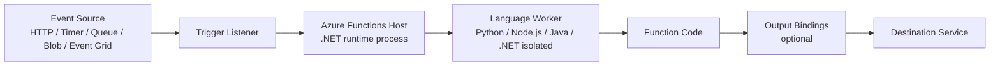
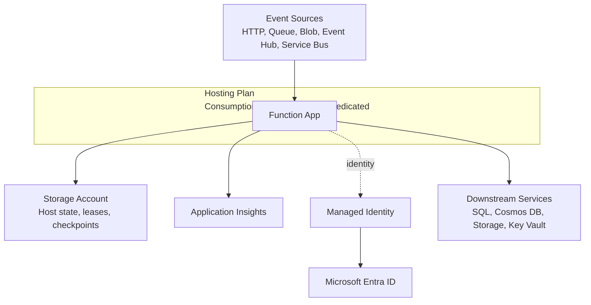

# Azure Functions Architecture

Azure Functions is an event-driven runtime built around a host/worker architecture. This model lets multiple languages share one platform for triggers, bindings, scaling, and operations.

## Why architecture matters

Architecture decisions in Azure Functions determine:

- how events are received and dispatched,
- where code executes,
- how resources are connected,
- and where reliability and security controls are enforced.

Understanding these layers helps you choose the right hosting plan and avoid design mismatches later.

## Runtime execution path

At a high level, every invocation follows this path:

`Event source -> Trigger listener -> Functions host -> Language worker -> Function code -> Output binding`



## Host process responsibilities

The Functions host is the control plane and data-plane coordinator for your app instance. It is responsible for:

- loading trigger and binding extensions,
- maintaining trigger listeners,
- routing invocation payloads,
- applying host-level configuration (`host.json`),
- coordinating with the scale controller,
- and writing runtime logs/telemetry.

Even when your function code is not .NET, the host still orchestrates the runtime behavior.

## Worker process responsibilities

Language workers execute your function code and return outputs to the host. Workers are language-specific runtimes with independent dependency graphs.

### Worker model by language

| Language | Model |
|---|---|
| Python | Out-of-process worker |
| Node.js | Out-of-process worker |
| Java | Out-of-process worker |
| .NET | In-process or isolated worker (depending on app model) |

!!! note
    The host/worker split is why platform behavior (triggers, bindings, scaling) is consistent across languages, while coding experience differs by language guide.

## Invocation lifecycle (request to completion)

1. An event source emits a trigger event.
2. The host trigger listener detects available work.
3. The host creates an invocation context.
4. Input bindings are resolved.
5. The invocation is dispatched to the worker.
6. Your function runs.
7. Output bindings are committed.
8. Completion state is reported to the trigger source (ack/checkpoint/delete).

## Deployment unit and boundaries

The **Function App** is the primary deployment and configuration boundary. It contains:

- one or more functions,
- app settings,
- host settings,
- identity configuration,
- networking and auth policy.

Most platform choices are applied at Function App scope, then interpreted at function scope by triggers/bindings.

## Core resource relationships



### Important design implication

Storage and identity are foundational runtime dependencies, not optional add-ons. Trigger execution, leases, and checkpoints depend on them.

## Plan-specific architectural differences

| Area | Consumption | Flex Consumption | Premium | Dedicated |
|---|---|---|---|---|
| Scale to zero | Yes | Yes | No | No |
| VNet integration | No | Yes | Yes | Yes |
| Inbound private endpoint | No | Yes | Yes | Yes |
| Apps per plan | Multiple | One | Multiple | Multiple |
| Kudu/SCM site | Available | Not available | Available | Available |

## Flex Consumption architectural constraints

When you choose Flex Consumption, account for these platform constraints early:

- **No Kudu/SCM endpoint** for debugging/deployment workflows.
- **Identity-based host storage is required** (for example, `AzureWebJobsStorage__accountName`).
- **Blob trigger uses Event Grid source on Flex**; polling blob trigger mode is not supported.

These constraints are design-time decisions, not post-deployment tweaks.

## Configuration layers

Azure Functions behavior is controlled through layered configuration:

1. Hosting plan capabilities (hard platform boundaries).
2. Function App settings (runtime/environment behavior).
3. `host.json` (extension and concurrency behavior).
4. Function-level trigger/binding metadata.

### Example host-level setting (cross-language)

```json
{
  "version": "2.0",
  "functionTimeout": "00:10:00",
  "extensionBundle": {
    "id": "Microsoft.Azure.Functions.ExtensionBundle",
    "version": "[4.*, 5.0.0)"
  }
}
```

## Trigger processing patterns in architecture

- **Synchronous path**: HTTP trigger returns response to client.
- **Asynchronous path**: queue/event trigger acknowledges only after successful processing.

This distinction influences timeout, retry, and scaling behavior across the whole architecture.

## Operational domains vs platform domains

Keep these concerns separate:

- **Platform docs (this section):** what to design and why.
- **Operations docs:** how to deploy, monitor, and recover.

!!! tip "Operations Guide"
    For implementation and day-2 procedures, see [Deployment](../operations/deployment.md) and [Monitoring](../operations/monitoring.md).

!!! tip "Language Guide"
    For Python worker indexing and decorator model specifics, see [v2 Programming Model](../language-guides/python/v2-programming-model.md).

## Architecture checklist

- Select hosting plan before coding integration assumptions.
- Validate trigger types against plan support.
- Define storage + identity strategy first.
- Define public/private network path per dependency.
- Separate sync API functions from async processing functions where possible.

## See also

- [Hosting](hosting.md)
- [Triggers and bindings](triggers-and-bindings.md)
- [Scaling](scaling.md)
- [Networking](networking.md)
- [Microsoft Learn: Azure Functions overview](https://learn.microsoft.com/azure/azure-functions/functions-overview)
- [Microsoft Learn: Scale and hosting](https://learn.microsoft.com/azure/azure-functions/functions-scale)
