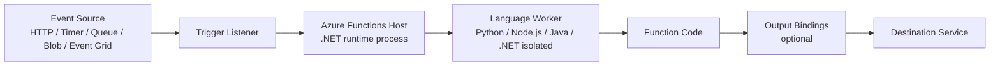
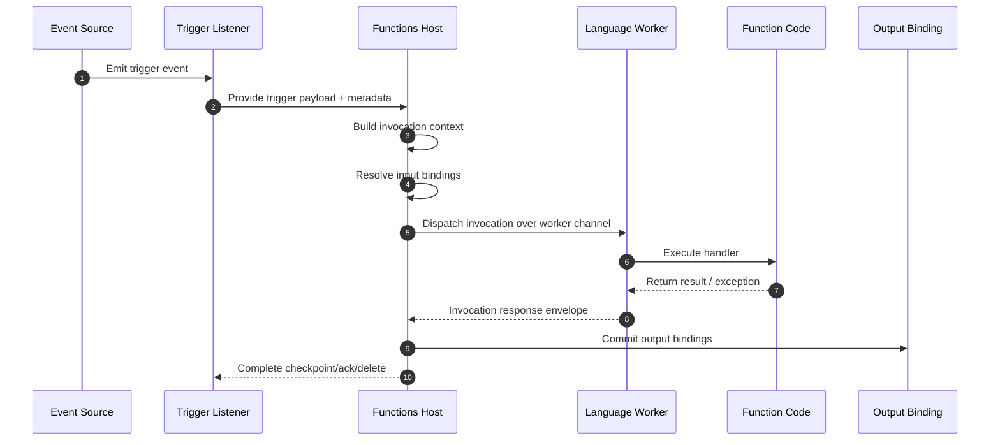
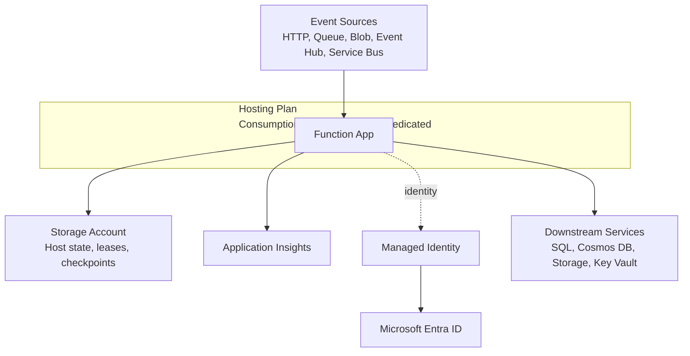
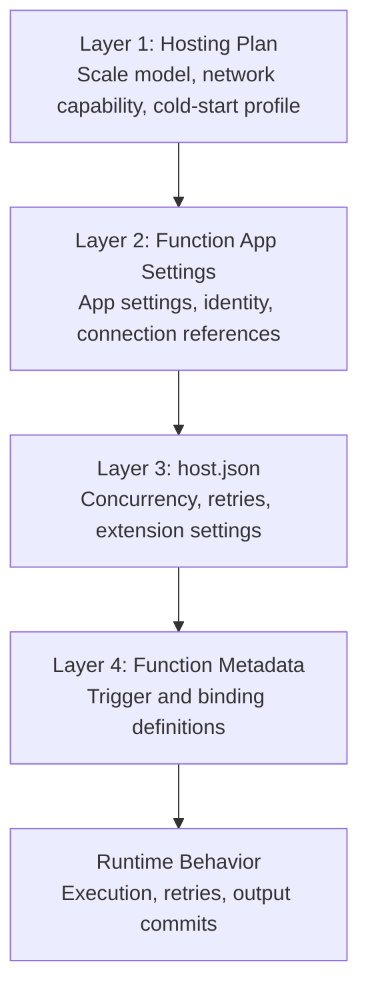
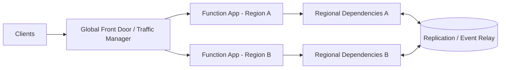
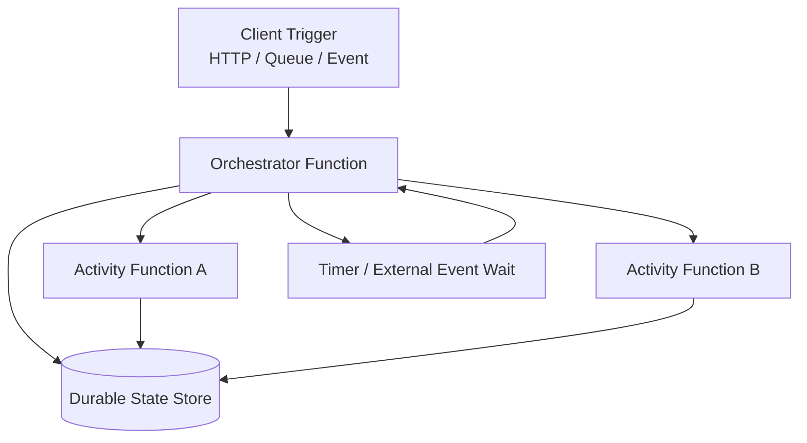

# Azure Functions Architecture
Azure Functions is an event-driven runtime built around a host/worker architecture. This model lets multiple languages share one platform for triggers, bindings, scaling, and operations.

## Prerequisites

### Reading prerequisites
- Understand Azure Functions core concepts: function app, trigger, binding, and hosting plan.
- Understand the difference between control plane and data plane in cloud runtimes.
- Know basic Azure networking terms: virtual network integration, private endpoint, DNS resolution.
- Know identity basics: system-assigned/user-assigned managed identity and Microsoft Entra ID.

### Hands-on prerequisites (optional but recommended)
1. Azure CLI 2.56+ installed and authenticated.
2. Contributor or higher access to a test subscription.
3. A sample Function App (any language) deployed in a non-production resource group.
4. Application Insights connected to the app for runtime telemetry checks.

```bash
# Set context variables for architecture validation commands
RG="rg-functions-arch-demo"
APP_NAME="func-arch-demo"
SUBSCRIPTION_ID="<subscription-id>"

az account set --subscription "$SUBSCRIPTION_ID"
```

!!! note
    All command examples in this page use long CLI flags and sanitized output. Replace placeholders with your own values.

## Main Content

### Why architecture matters
Architecture decisions in Azure Functions determine:
- how events are received and dispatched,
- where code executes,
- how resources are connected,
- and where reliability and security controls are enforced.
Understanding these layers helps you choose the right hosting plan and avoid design mismatches later.

### Runtime execution path
At a high level, every invocation follows this path:
`Event source -> Trigger listener -> Functions host -> Language worker -> Function code -> Output binding`



### Host process responsibilities
The Functions host is the control plane and data-plane coordinator for your app instance. It is responsible for:
- loading trigger and binding extensions,
- maintaining trigger listeners,
- routing invocation payloads,
- applying host-level configuration (`host.json`),
- coordinating with the scale controller,
- and writing runtime logs/telemetry.
Even when your function code is not .NET, the host still orchestrates the runtime behavior.

### Worker process responsibilities
Language workers execute your function code and return outputs to the host. Workers are language-specific runtimes with independent dependency graphs.

#### Worker model by language
| Language | Model |
|---|---|
| Python | Out-of-process worker |
| Node.js | Out-of-process worker |
| Java | Out-of-process worker |
| .NET | In-process or isolated worker (depending on app model) |

!!! note
    The host/worker split is why platform behavior (triggers, bindings, scaling) is consistent across languages, while coding experience differs by language guide.

### Detailed host/worker communication sequence
Use this sequence when investigating cold start, timeout, or extension load behavior.



### Invocation lifecycle (request to completion)
1. An event source emits a trigger event.
2. The host trigger listener detects available work.
3. The host creates an invocation context.
4. Input bindings are resolved.
5. The invocation is dispatched to the worker.
6. Your function runs.
7. Output bindings are committed.
8. Completion state is reported to the trigger source (ack/checkpoint/delete).

### Deployment unit and boundaries
The **Function App** is the primary deployment and configuration boundary. It contains:
- one or more functions,
- app settings,
- host settings,
- identity configuration,
- networking and auth policy.
Most platform choices are applied at Function App scope, then interpreted at function scope by triggers/bindings.

### Core resource relationships


#### Important design implication
Storage and identity are foundational runtime dependencies, not optional add-ons. Trigger execution, leases, and checkpoints depend on them.

### Plan-specific architectural differences
| Area | Consumption | Flex Consumption | Premium | Dedicated |
|---|---|---|---|---|
| Scale to zero | Yes | Yes | No | No |
| VNet integration | No | Yes | Yes | Yes |
| Inbound private endpoint | No | Yes | Yes | Yes |
| Apps per plan | Multiple | One | Multiple | Multiple |
| Kudu/SCM site | Available | Not available | Available | Available |

### Flex Consumption architectural constraints
When you choose Flex Consumption, account for these platform constraints early:
- **No Kudu/SCM endpoint** for debugging/deployment workflows.
- **Identity-based host storage is required** (for example, `AzureWebJobsStorage__accountName`).
- **Blob trigger uses Event Grid source on Flex**; polling blob trigger mode is not supported.
These constraints are design-time decisions, not post-deployment tweaks.

### Configuration layers
Azure Functions behavior is controlled through layered configuration:
1. Hosting plan capabilities (hard platform boundaries).
2. Function App settings (runtime/environment behavior).
3. `host.json` (extension and concurrency behavior).
4. Function-level trigger/binding metadata.

#### Configuration layers diagram


#### Example host-level setting (cross-language)
```json
{
  "version": "2.0",
  "functionTimeout": "00:10:00",
  "extensionBundle": {
    "id": "Microsoft.Azure.Functions.ExtensionBundle",
    "version": "[4.*, 5.0.0)"
  }
}
```

### Trigger processing patterns in architecture
- **Synchronous path**: HTTP trigger returns response to client.
- **Asynchronous path**: queue/event trigger acknowledges only after successful processing.
This distinction influences timeout, retry, and scaling behavior across the whole architecture.

### Inspect architecture with Azure CLI
Use these commands to validate architecture assumptions directly from deployed resources.

#### Inspect Function App shape
```bash
az functionapp show \
  --name "$APP_NAME" \
  --resource-group "$RG" \
  --query "{name:name, kind:kind, state:state, location:location, hostNames:hostNames, serverFarmId:serverFarmId}" \
  --output json
```

Example output (sanitized):
```json
{
  "hostNames": [
    "func-arch-demo.azurewebsites.net",
    "func-arch-demo.scm.azurewebsites.net"
  ],
  "kind": "functionapp,linux",
  "location": "koreacentral",
  "name": "func-arch-demo",
  "serverFarmId": "/subscriptions/<subscription-id>/resourceGroups/rg-functions-arch-demo/providers/Microsoft.Web/serverfarms/asp-arch-demo",
  "state": "Running"
}
```

#### Inspect runtime and platform configuration
```bash
az functionapp config show \
  --name "$APP_NAME" \
  --resource-group "$RG" \
  --query "{linuxFxVersion:linuxFxVersion, alwaysOn:alwaysOn, ftpsState:ftpsState, minTlsVersion:minTlsVersion, vnetRouteAllEnabled:vnetRouteAllEnabled}" \
  --output json
```

Example output (sanitized):
```json
{
  "alwaysOn": false,
  "ftpsState": "FtpsOnly",
  "linuxFxVersion": "Python|3.11",
  "minTlsVersion": "1.2",
  "vnetRouteAllEnabled": true
}
```

### Operational domains vs platform domains
Keep these concerns separate:
- **Platform docs (this section):** what to design and why.
- **Operations docs:** how to deploy, monitor, and recover.

!!! tip "Operations Guide"
    For implementation and day-2 procedures, see [Deployment](../operations/deployment.md) and [Monitoring](../operations/monitoring.md).

!!! tip "Language Guide"
    For Python worker indexing and decorator model specifics, see [v2 Programming Model](../language-guides/python/v2-programming-model.md).

### Troubleshooting matrix
Use this matrix to map symptoms to architecture layers before making changes.

| Symptom | Likely Cause | Validation Path |
|---|---|---|
| Functions are discovered locally but not in Azure | Deployment package mismatch or build output missing function metadata | Check deployment mode, inspect package structure, confirm function indexing logs in Application Insights |
| Queue trigger backlog keeps growing | Concurrency limit, poison queue retries, storage throttling, or scale ceiling | Review trigger metrics, host logs, and storage account metrics; compare inflow vs processed rate |
| HTTP function latency spikes after idle periods | Cold start behavior on scale-to-zero plan | Correlate first-request latency with instance startup events and plan type |
| Blob trigger does not fire on Flex | Architecture mismatch: polling assumptions on Flex Consumption | Confirm Event Grid based trigger configuration and storage event flow |
| Intermittent storage authorization failures | Missing RBAC role assignment for managed identity or wrong connection mode | Validate identity assignment, role scope, and related `AzureWebJobsStorage*` settings |
| App starts but outbound dependencies fail privately | DNS or route configuration mismatch with VNet integration/private endpoints | Validate DNS zone links, name resolution path, and `vnetRouteAllEnabled` setting |

### Architecture checklist
- Select hosting plan before coding integration assumptions.
- Validate trigger types against plan support.
- Define storage + identity strategy first.
- Define public/private network path per dependency.
- Separate sync API functions from async processing functions where possible.
- Validate retry and timeout expectations per trigger type.
- Validate observability baseline before load testing.

## Advanced Topics

### Multi-region architecture patterns
Use multi-region only when you have explicit resilience or latency goals that justify added operational complexity.

#### Pattern A: Active-passive with traffic failover
- Primary region serves all traffic in normal state.
- Secondary region is warm or cold standby.
- DNS or edge routing performs health-based failover.
Best fit: strict recovery goals with predictable write paths.

#### Pattern B: Active-active with regional affinity
- Both regions serve traffic simultaneously.
- Routing steers users by proximity and health.
- Eventing/data tiers must support replication or partition tolerance.
Best fit: latency-sensitive workloads with region-tolerant data architecture.



!!! caution
    Multi-region function apps without multi-region data strategy often produce partial outages instead of resilience.

### Durable Functions orchestration architecture
Durable Functions adds a workflow orchestration layer above standard trigger execution. The architecture introduces deterministic orchestration and checkpointed state transitions.
Core components:
- **Orchestrator function** defines workflow state machine.
- **Activity functions** execute unit operations.
- **Durable storage provider** persists orchestration history and checkpoints.
- **Client trigger** starts, queries, or terminates orchestration instances.



Architecture considerations:
1. Orchestrator code must remain deterministic.
2. Activity idempotency is critical for replay safety.
3. Storage throughput and latency directly affect orchestration performance.
4. Plan choice affects throughput, scale behavior, and cold start characteristics.

### Custom handler model
Custom handlers let you run unsupported or specialized runtimes behind the Functions host contract.
How it works:
1. The Functions host receives trigger events.
2. The host forwards invocation payloads to your custom executable over HTTP.
3. Your executable returns response payloads following handler contract.
4. The host applies output binding and completion semantics.

Best when:
- you need a language/runtime not covered by built-in workers,
- you need strict runtime control,
- or you are wrapping an existing service binary into the Functions model.

Trade-offs:
- more ownership for startup behavior and diagnostics,
- fewer language-specific developer conveniences,
- and stricter validation required for contract compatibility.

## Language-Specific Details
Platform architecture is consistent, but implementation details vary by language worker and programming model.

### Where to continue by language
- Python overview: [Python Guide](../language-guides/python/index.md)
- Python worker/runtime details: [Python Runtime](../language-guides/python/python-runtime.md)
- Python programming model: [v2 Programming Model](../language-guides/python/v2-programming-model.md)
- Node.js status and roadmap: [Node.js Guide](../language-guides/nodejs/index.md)
- Java status and roadmap: [Java Guide](../language-guides/java/index.md)
- .NET status and roadmap: [.NET Guide](../language-guides/dotnet/index.md)

### Architecture interpretation tips per language
| Language | Architecture focus | Practical check |
|---|---|---|
| Python | Worker indexing, dependency isolation, cold start profile | Verify package layout and startup logs for worker load |
| Node.js | Event loop behavior, async I/O pressure | Validate concurrency behavior under burst load |
| Java | JVM startup profile and memory overhead | Validate warm-up behavior and plan sizing |
| .NET isolated | Worker process separation and middleware pipeline | Validate host/worker boundary logging and dependency injection startup |

## See Also
- [Hosting](hosting.md)
- [Triggers and bindings](triggers-and-bindings.md)
- [Scaling](scaling.md)
- [Networking](networking.md)
- [Security](security.md)
- [Deployment](../operations/deployment.md)
- [Monitoring](../operations/monitoring.md)
- [Language Guides Home](../language-guides/index.md)

## Sources
- [Microsoft Learn: Azure Functions overview](https://learn.microsoft.com/azure/azure-functions/functions-overview)
- [Microsoft Learn: Azure Functions hosting options](https://learn.microsoft.com/azure/azure-functions/functions-scale)
- [Microsoft Learn: Azure Functions networking options](https://learn.microsoft.com/azure/azure-functions/functions-networking-options)
- [Microsoft Learn: Azure Functions triggers and bindings concepts](https://learn.microsoft.com/azure/azure-functions/functions-triggers-bindings)
- [Microsoft Learn: Durable Functions overview](https://learn.microsoft.com/azure/azure-functions/durable/durable-functions-overview)
- [Microsoft Learn: Azure Functions custom handlers](https://learn.microsoft.com/azure/azure-functions/functions-custom-handlers)
