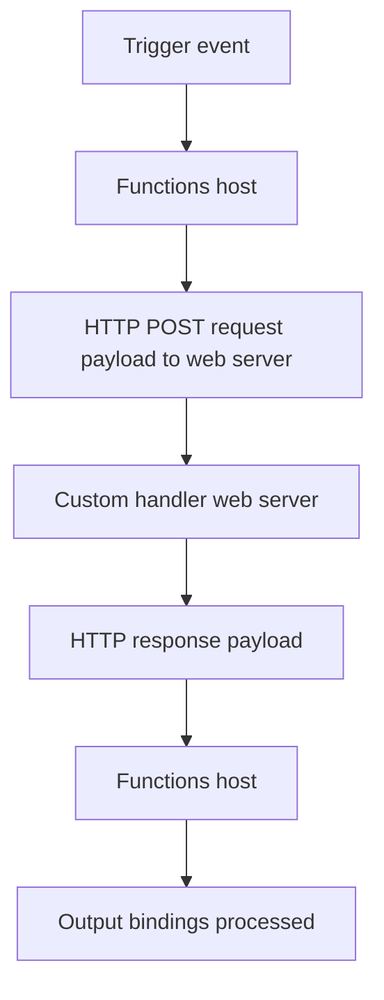

---
content_sources:
  references:
    - type: mslearn-adapted
      url: https://learn.microsoft.com/en-us/azure/azure-functions/functions-custom-handlers
  diagrams:
    - id: custom-handler-flow
      type: flowchart
      source: self-generated
      justification: Flow view of the custom handler request/response protocol, synthesized from Microsoft Learn documentation cited on this page.
      based_on:
        - https://learn.microsoft.com/en-us/azure/azure-functions/functions-custom-handlers
content_validation:
  status: verified
  last_reviewed: 2026-07-17
  reviewer: agent
  core_claims:
    - claim: "Custom handlers are lightweight web servers that receive events from the Azure Functions host process."
      source: https://learn.microsoft.com/en-us/azure/azure-functions/functions-custom-handlers
      verified: true
    - claim: "A custom handler app sets FUNCTIONS_WORKER_RUNTIME to Custom and configures a customHandler section with defaultExecutablePath in host.json."
      source: https://learn.microsoft.com/en-us/azure/azure-functions/functions-custom-handlers
      verified: true
    - claim: "The Functions host sends a request payload with Data and Metadata members and expects a response payload with Outputs, Logs, and ReturnValue keys."
      source: https://learn.microsoft.com/en-us/azure/azure-functions/functions-custom-handlers
      verified: true
    - claim: "The custom handler web server must start within 60 seconds."
      source: https://learn.microsoft.com/en-us/azure/azure-functions/functions-custom-handlers
      verified: true
---
# Custom Handlers

Azure Functions normally executes your code through language-specific workers. When you need a language or runtime that Functions does not support out of the box — such as Rust, Deno, or a self-hosted server — **custom handlers** let you run it. A custom handler is a lightweight web server that receives events from the Functions host process over HTTP.

## When to Use

- Implement a function app in a language not offered by default (for example, Rust).
- Run a runtime not featured by default (for example, Deno).
- Host a server built with standard SDKs behind Functions triggers and bindings.

!!! note "Prefer first-class support when available"
    Custom handlers exist to enable unsupported languages/runtimes. If a first-class worker exists for your language, use it — custom handlers add a web-server hop and can increase cold-start time.

## How It Works

The Functions host translates every trigger into an HTTP request to your web server and maps the response back to output bindings.

<!-- diagram-id: custom-handler-flow -->


1. An event triggers a request to the Functions host.
2. The host issues a request payload to your web server, containing trigger and input-binding data plus metadata.
3. The web server executes the function and returns a response payload.
4. The host passes the response to the function's output bindings.

## Application Structure

A custom handler app needs:

- A `host.json` file at the app root.
- A `local.settings.json` file at the app root.
- A `function.json` file per function, inside a folder named to match the function.
- A command, script, or executable that runs a web server.

```bash
| /MyQueueFunction
|   function.json
|
| host.json
| local.settings.json
| handler.exe
```

## Configuration

### host.json

The `customHandler` section points the host at your web server via `defaultExecutablePath`. Standard triggers and bindings become available by referencing extension bundles.

```json
{
  "version": "2.0",
  "customHandler": {
    "description": {
      "defaultExecutablePath": "handler.exe"
    }
  },
  "extensionBundle": {
    "id": "Microsoft.Azure.Functions.ExtensionBundle",
    "version": "[4.*, 5.0.0)"
  }
}
```

`arguments` (with `%SETTING%` environment-variable expansion) and `workingDirectory` can further control how the executable runs.

### local.settings.json

Set the worker runtime to `Custom`.

```json
{
  "IsEncrypted": false,
  "Values": {
    "FUNCTIONS_WORKER_RUNTIME": "Custom"
  }
}
```

## Request and Response Payloads

The host sends a JSON request with `Data` (keys matching input/trigger names) and `Metadata` (event-source metadata). Your handler replies with a key/value response.

| Response key | Type | Purpose |
|---|---|---|
| `Outputs` | object | Output-binding values, keyed by the binding names in `function.json`. |
| `Logs` | array | Messages surfaced in invocation logs (Application Insights in Azure). |
| `ReturnValue` | string | Response when an output is configured as `$return`. |

Your web server listens on the port supplied by the `FUNCTIONS_CUSTOMHANDLER_PORT` environment variable — this is the internal port the host uses to call the handler, not the public function URL.

## HTTP-Only Functions

For HTTP-triggered functions with no other bindings, set `enableProxyingHttpRequest` to `true` in `host.json` so your handler works directly with the raw HTTP request and response (with response streaming) instead of the `Data`/`Outputs` payload envelope.

## Deployment

- Deploy with Core Tools: `func azure functionapp publish $APP_NAME`.
- When creating the function app in Azure for custom handlers, select **.NET Core** as the stack.
- Ensure all files needed to run the handler are included, and that platform-specific binaries match the target OS.
- If the handler needs OS/runtime dependencies, use a [custom container](https://learn.microsoft.com/en-us/azure/azure-functions/functions-how-to-custom-container).

## Restrictions

- The custom handler web server must start within **60 seconds**.
- Functions is not a general reverse proxy — some HTTP headers and routes may be restricted.
- Support covers host-to-handler startup and communication, not the internals of your chosen language or framework.

## See Also

- [Triggers and Bindings](triggers-and-bindings.md)
- [Hosting](hosting.md)
- [Operations: Deployment](../operations/deployment.md)

## Sources

- [Azure Functions custom handlers (Microsoft Learn)](https://learn.microsoft.com/en-us/azure/azure-functions/functions-custom-handlers)
