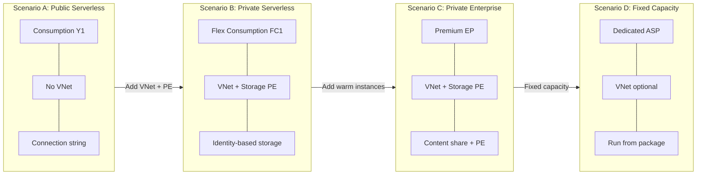
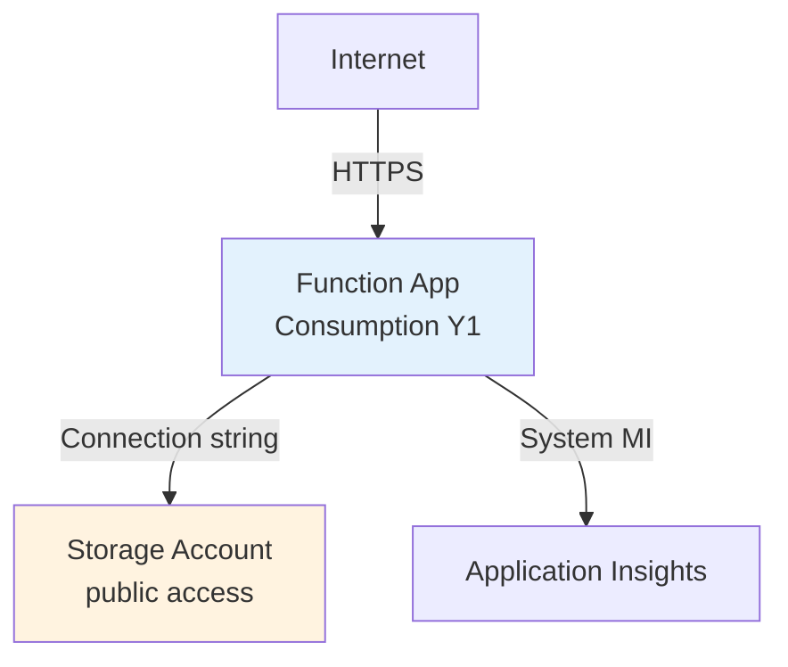
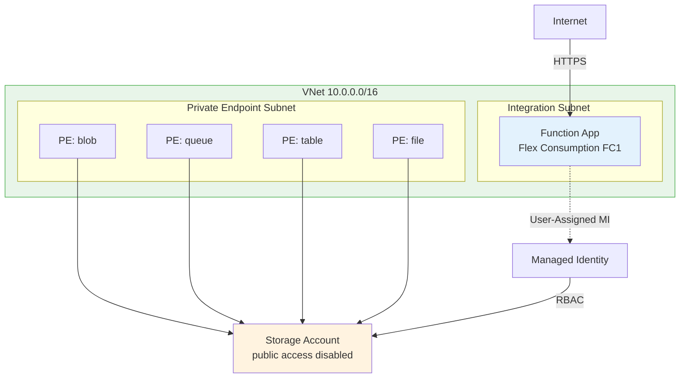
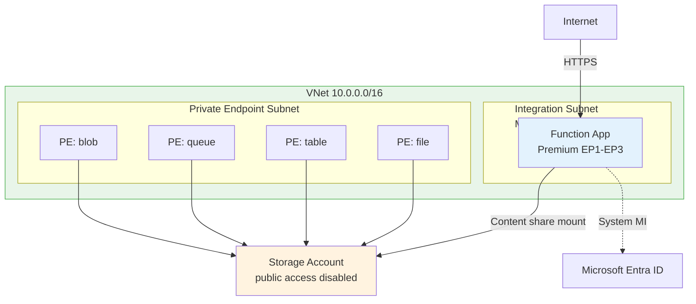
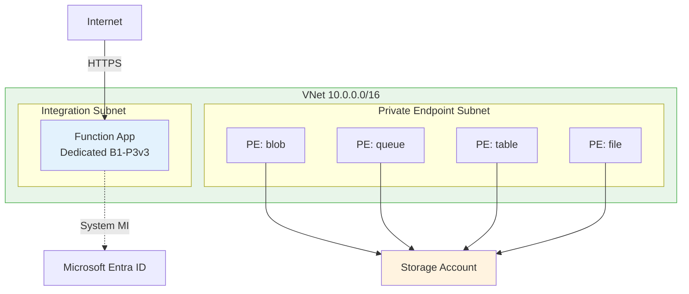

---
content_sources:
  - type: mslearn-adapted
    url: https://learn.microsoft.com/azure/azure-functions/functions-scale
  - type: mslearn-adapted
    url: https://learn.microsoft.com/azure/azure-functions/functions-networking-options
  - type: mslearn-adapted
    url: https://learn.microsoft.com/azure/azure-functions/flex-consumption-plan
  - type: mslearn-adapted
    url: https://learn.microsoft.com/azure/azure-functions/functions-create-vnet
  - type: mslearn-adapted
    url: https://learn.microsoft.com/azure/azure-functions/functions-deployment-technologies
  - type: mslearn-adapted
    url: https://learn.microsoft.com/azure/azure-functions/functions-reference?tabs=blob#configure-an-identity-based-connection
content_validation:
  status: verified
  last_reviewed: 2026-04-12
  reviewer: agent
  core_claims:
    - claim: "Consumption plan does not support VNet integration, while Flex Consumption, Premium, and Dedicated do"
      source: https://learn.microsoft.com/azure/azure-functions/functions-networking-options
      verified: true
    - claim: "Flex Consumption uses blob-container deployment through functionAppConfig instead of Kudu/SCM"
      source: https://learn.microsoft.com/azure/azure-functions/flex-consumption-plan
      verified: true
    - claim: "Premium and Dedicated plans can host multiple apps per plan"
      source: https://learn.microsoft.com/azure/azure-functions/functions-scale
      verified: true
    - claim: "Identity-based binding connections use app settings with service URIs instead of a single connection string secret"
      source: https://learn.microsoft.com/azure/azure-functions/functions-reference?tabs=blob#configure-an-identity-based-connection
      verified: true
---

# Deployment Scenarios

This page compares the reference deployment patterns used in this guide across the four Azure Functions hosting plans.

!!! info "Guide defaults, not platform limits"
    The tables below reflect the deployment patterns implemented in this repository's [Bicep templates](https://github.com/yeongseon/azure-functions-practical-guide/tree/main/infra) and tutorials. Azure supports additional configurations beyond what is shown here.

## Scenario Overview

<!-- diagram-id: scenario-overview -->

## Matrix A — Networking and Security

| Feature | Consumption (Y1) | Flex Consumption (FC1) | Premium (EP) | Dedicated (ASP) |
|---|---|---|---|---|
| **SKU** | `Y1` / Dynamic | `FC1` / FlexConsumption | `EP1`–`EP3` / ElasticPremium | `B1`–`P3v3` / Standard+ |
| **VNet integration** | :material-close: No | :material-check: Yes | :material-check: Yes | :material-check: Yes (Standard+) |
| **Subnet delegation** | N/A | `Microsoft.App/environments` | `Microsoft.Web/serverFarms` | `Microsoft.Web/serverFarms` |
| **Storage private endpoints** | :material-close: No | :material-check: blob, queue, table, file | :material-check: blob, queue, table, file | :material-check: blob, queue, table, file |
| **Site private endpoint** | :material-close: No | :material-check: Optional | :material-check: Optional | :material-check: Optional |
| **Identity type (guide default)** | System-Assigned MI | User-Assigned MI | System-Assigned MI | System-Assigned MI |
| **Shared key access** | Required (`allowSharedKeyAccess: true`) | Disabled (`allowSharedKeyAccess: false`) | Required (content share) | Required (content share) |
| **Host storage auth** | `AzureWebJobsStorage__accountName` + MI | `AzureWebJobsStorage__accountName` + MI | `AzureWebJobsStorage__accountName` + MI | `AzureWebJobsStorage__accountName` + MI |

!!! tip "Why Flex Consumption uses User-Assigned MI"
    Flex Consumption requires the managed identity to exist **before** the function app is created, because `functionAppConfig.deployment.storage.authentication` references it at deploy time. System-Assigned MI is only available after resource creation, creating a circular dependency.

## Matrix B — Deployment and Storage Mechanics

| Feature | Consumption (Y1) | Flex Consumption (FC1) | Premium (EP) | Dedicated (ASP) |
|---|---|---|---|---|
| **Content backend** | Azure Files content share | Blob container | Azure Files content share | Run from package (`WEBSITE_RUN_FROM_PACKAGE=1`) |
| **Config surface** | `siteConfig.appSettings` | `functionAppConfig` | `siteConfig.appSettings` | `siteConfig.appSettings` |
| **Key config settings** | `WEBSITE_CONTENTAZUREFILECONNECTIONSTRING`, `WEBSITE_CONTENTSHARE`, `WEBSITE_RUN_FROM_PACKAGE` | `functionAppConfig.deployment.storage.type: blobContainer` | `WEBSITE_CONTENTAZUREFILECONNECTIONSTRING`, `WEBSITE_CONTENTSHARE` | `WEBSITE_RUN_FROM_PACKAGE` |
| **Deployment method** | `func azure functionapp publish` / ZIP deploy | `func azure functionapp publish` (no Kudu) | `func azure functionapp publish` / ZIP deploy / Kudu | `func azure functionapp publish` / ZIP deploy / Kudu |
| **Kudu / SCM** | :material-check: Yes | :material-close: No | :material-check: Yes | :material-check: Yes |
| **Apps per plan** | 1 (implicit) | 1 (implicit) | Multiple | Multiple |
| **Key gotcha** | Needs connection string for content share provisioning even with MI | No SCM; deployment container must exist before publish | Content share requires shared key for mount | Must set `WEBSITE_RUN_FROM_PACKAGE=1` explicitly |

## Scenario A — Public Serverless (Consumption Y1)

The simplest deployment pattern. No VNet, no private endpoints, public storage access.

<!-- diagram-id: scenario-a-public-serverless-consumption-y1 -->

**When to use**: Development, prototyping, low-traffic workloads without compliance requirements.

**Reference template**: [`infra/consumption/main.bicep`](https://github.com/yeongseon/azure-functions-practical-guide/tree/main/infra/consumption/main.bicep)

**Tutorial**: [Consumption plan tutorial track](../language-guides/python/tutorial/consumption/01-local-run.md)

## Scenario B — Private Serverless (Flex Consumption FC1)

Full network isolation with identity-based storage access and blob-container deployment.

<!-- diagram-id: scenario-b-private-serverless-flex-consumption-fc1 -->

**When to use**: Production serverless workloads that require network isolation and identity-based storage.

**Reference template**: [`infra/flex-consumption/main.bicep`](https://github.com/yeongseon/azure-functions-practical-guide/tree/main/infra/flex-consumption/main.bicep)

**Tutorial**: [Flex Consumption plan tutorial track](../language-guides/python/tutorial/flex-consumption/01-local-run.md)

## Scenario C — Private Enterprise (Premium EP)

VNet-integrated with always-warm instances, private endpoints, and Azure Files content share.

<!-- diagram-id: scenario-c-private-enterprise-premium-ep -->

**When to use**: Enterprise workloads that need warm instances (no cold start), VNet integration, and private storage.

**Reference template**: [`infra/premium/main.bicep`](https://github.com/yeongseon/azure-functions-practical-guide/tree/main/infra/premium/main.bicep)

**Tutorial**: [Premium plan tutorial track](../language-guides/python/tutorial/premium/01-local-run.md)

## Scenario D — Fixed Capacity (Dedicated ASP)

Traditional App Service plan with fixed compute, full VNet support, and run-from-package deployment.

<!-- diagram-id: scenario-d-fixed-capacity-dedicated-asp -->

**When to use**: Workloads with predictable load, existing App Service plans, or requirements for dedicated compute (compliance, GPU, large VM sizes).

**Reference template**: [`infra/dedicated/main.bicep`](https://github.com/yeongseon/azure-functions-practical-guide/tree/main/infra/dedicated/main.bicep)

**Tutorial**: [Dedicated plan tutorial track](../language-guides/python/tutorial/dedicated/01-local-run.md)

## Pre-Deployment Checklist

Before deploying any scenario, verify:

- [ ] **Resource group** exists in the target subscription
- [ ] **Storage account name** is globally unique (3–24 lowercase alphanumeric characters)
- [ ] **VNet address space** does not overlap with existing networks (Scenarios B, C, D)
- [ ] **Subnet size** is `/24` or larger for integration subnet
- [ ] **Private DNS zones** are linked to the VNet (Scenarios B, C, D)
- [ ] **RBAC role assignments** propagated (may take up to 10 minutes after deployment)
- [ ] **Application Insights** connection string is set

!!! warning "Deployment order matters"
    For Flex Consumption (Scenario B), the managed identity and RBAC assignments must be created **before** the function app. The `dependsOn` chain in the Bicep template enforces this order.

## See Also

- [Hosting Plans](hosting.md) — detailed plan characteristics and scaling behavior
- [Networking](networking.md) — VNet integration, private endpoints, and DNS configuration
- [Security](security.md) — managed identity, RBAC, and key management
- [Hosting Plan Selection](../best-practices/hosting-plan-selection.md) — decision guide for choosing a plan
- [Hosting Plan Comparison Matrix (Lab)](../troubleshooting/lab-guides/hosting-plan-comparison-matrix.md) — hands-on comparison lab
- [Infrastructure as Code tutorials](../language-guides/python/tutorial/consumption/05-infrastructure-as-code.md) — step-by-step Bicep deployment

## Sources

- [Azure Functions hosting options (Microsoft Learn)](https://learn.microsoft.com/azure/azure-functions/functions-scale)
- [Azure Functions networking options (Microsoft Learn)](https://learn.microsoft.com/azure/azure-functions/functions-networking-options)
- [Azure Functions Flex Consumption plan (Microsoft Learn)](https://learn.microsoft.com/azure/azure-functions/flex-consumption-plan)
- [Secure Azure Functions with virtual networks (Microsoft Learn)](https://learn.microsoft.com/azure/azure-functions/functions-create-vnet)
- [Azure Functions deployment technologies (Microsoft Learn)](https://learn.microsoft.com/azure/azure-functions/functions-deployment-technologies)
- [Identity-based connections for Azure Functions (Microsoft Learn)](https://learn.microsoft.com/azure/azure-functions/functions-reference?tabs=blob#configure-an-identity-based-connection)
