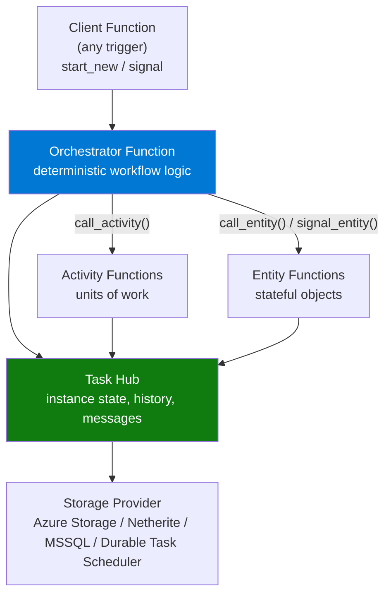
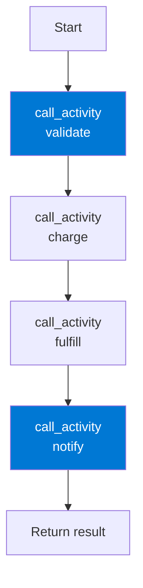
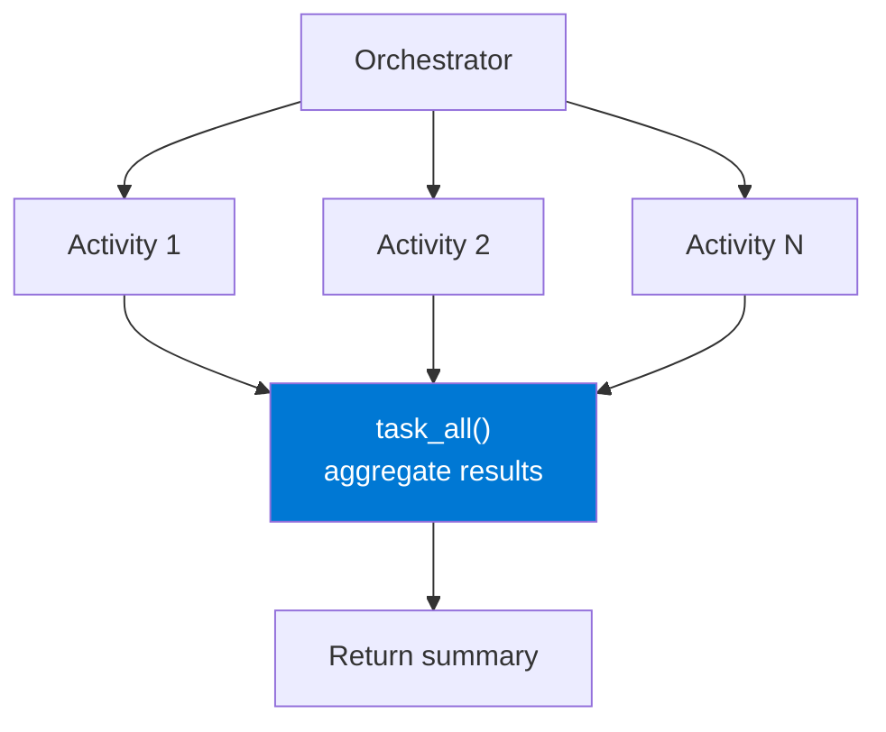
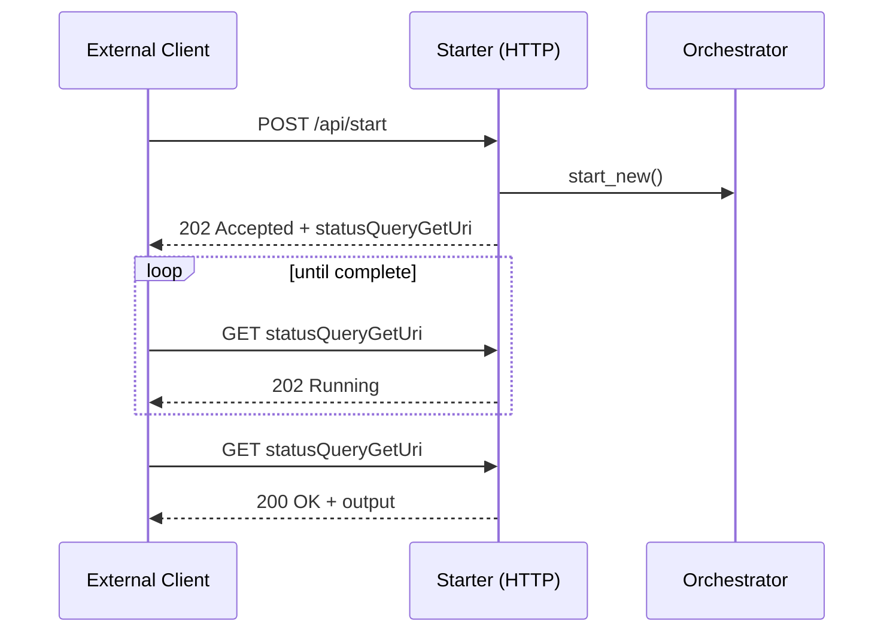
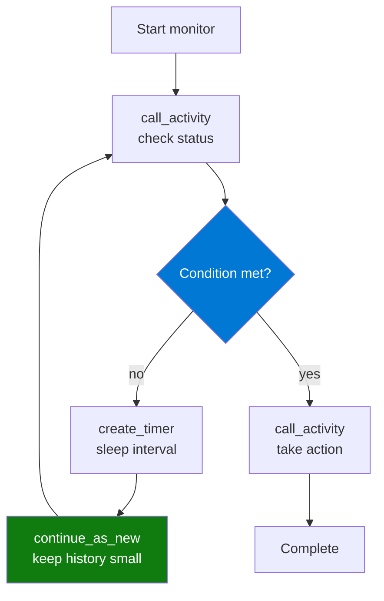
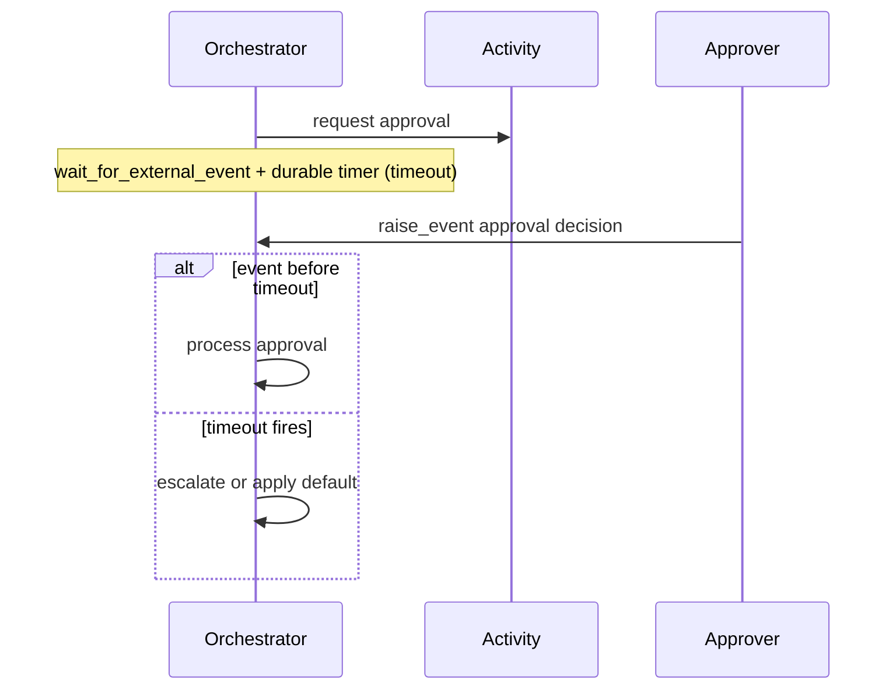

---
content_sources:

  references:
    - type: mslearn-adapted
      url: https://learn.microsoft.com/en-us/azure/azure-functions/durable/durable-functions-overview
    - type: mslearn-adapted
      url: https://learn.microsoft.com/en-us/azure/azure-functions/durable/durable-functions-task-hubs
    - type: mslearn-adapted
      url: https://learn.microsoft.com/en-us/azure/azure-functions/durable/durable-functions-storage-providers
    - type: mslearn-adapted
      url: https://learn.microsoft.com/en-us/azure/azure-functions/durable/durable-functions-http-features
    - type: mslearn-adapted
      url: https://learn.microsoft.com/en-us/azure/azure-functions/durable/durable-functions-code-constraints
    - type: mslearn-adapted
      url: https://learn.microsoft.com/en-us/azure/azure-functions/durable/durable-functions-eternal-orchestrations
  diagrams:
    - id: durable-architecture
      type: flowchart
      source: self-generated
      justification: Flow view of the Durable Functions component architecture, synthesized from Microsoft Learn documentation cited on this page.
      based_on:
        - https://learn.microsoft.com/en-us/azure/azure-functions/durable/durable-functions-overview
        - https://learn.microsoft.com/en-us/azure/azure-functions/durable/durable-functions-task-hubs
    - id: function-chaining
      type: flowchart
      source: self-generated
      justification: Flow view of the function chaining pattern, synthesized from Microsoft Learn documentation cited on this page.
      based_on:
        - https://learn.microsoft.com/en-us/azure/azure-functions/durable/durable-functions-overview
    - id: fan-out-fan-in
      type: flowchart
      source: self-generated
      justification: Flow view of the fan-out/fan-in pattern, synthesized from Microsoft Learn documentation cited on this page.
      based_on:
        - https://learn.microsoft.com/en-us/azure/azure-functions/durable/durable-functions-overview
    - id: async-http-apis
      type: sequenceDiagram
      source: self-generated
      justification: Interaction sequence for the async HTTP APIs pattern, synthesized from Microsoft Learn documentation cited on this page.
      based_on:
        - https://learn.microsoft.com/en-us/azure/azure-functions/durable/durable-functions-overview
        - https://learn.microsoft.com/en-us/azure/azure-functions/durable/durable-functions-http-features
    - id: monitor-pattern
      type: flowchart
      source: self-generated
      justification: Flow view of the monitor pattern, synthesized from Microsoft Learn documentation cited on this page.
      based_on:
        - https://learn.microsoft.com/en-us/azure/azure-functions/durable/durable-functions-overview
        - https://learn.microsoft.com/en-us/azure/azure-functions/durable/durable-functions-eternal-orchestrations
    - id: human-interaction
      type: sequenceDiagram
      source: self-generated
      justification: Interaction sequence for the human interaction pattern, synthesized from Microsoft Learn documentation cited on this page.
      based_on:
        - https://learn.microsoft.com/en-us/azure/azure-functions/durable/durable-functions-overview
content_validation:
  status: verified
  last_reviewed: 2026-07-05
  reviewer: agent
  core_claims:
    - claim: "Durable Functions provides orchestrator, activity, and entity function types for stateful serverless workflows"
      source: https://learn.microsoft.com/en-us/azure/azure-functions/durable/durable-functions-overview
      verified: true
    - claim: "A task hub name must contain only alphanumeric characters, start with a letter, and be 3 to 45 characters long"
      source: https://learn.microsoft.com/en-us/azure/azure-functions/durable/durable-functions-task-hubs
      verified: true
    - claim: "Durable Functions supports Azure Storage, Netherite, MSSQL, and the Durable Task Scheduler as storage backends"
      source: https://learn.microsoft.com/en-us/azure/azure-functions/durable/durable-functions-storage-providers
      verified: true
    - claim: "Support for the Netherite storage backend with Durable Functions ends March 31, 2028"
      source: https://learn.microsoft.com/en-us/azure/azure-functions/durable/durable-functions-storage-providers
      verified: true
    - claim: "Orchestrator functions must be deterministic because the runtime replays them from history"
      source: https://learn.microsoft.com/en-us/azure/azure-functions/durable/durable-functions-code-constraints
      verified: true
---
# Durable Functions

Durable Functions is an extension of Azure Functions that lets you write **stateful workflows** in code. The runtime manages state, checkpoints, retries, and recovery so a workflow can run reliably for seconds or for months — surviving process restarts and scale-in without losing progress.

Use Durable Functions when a single stateless function is not enough: multi-step workflows, parallel fan-out with aggregation, long-running approvals, and polling loops that must resume exactly where they left off.

## Core Concepts

Durable Functions is built from a small set of function types that play distinct roles.

| Function type | Role | Trigger |
|---------------|------|---------|
| **Client (starter)** | Starts orchestrations and signals entities. Usually triggered by HTTP, a queue, or a timer. | Any trigger + durable client binding |
| **Orchestrator** | Defines workflow logic and coordinates activities and entities. Must be **deterministic**. | `orchestration_trigger` |
| **Activity** | Performs a single unit of work (I/O, computation, calling a service). | `activity_trigger` |
| **Entity** | Manages a small piece of explicit, addressable state (actor-style). | `entity_trigger` |

Orchestrations, activities, and entities all persist their progress to a **task hub** backed by a **storage provider**.

<!-- diagram-id: durable-architecture -->


## Application Patterns

Durable Functions supports six canonical application patterns. Each solves a coordination problem that is awkward or unreliable with stateless functions alone.

### 1. Function Chaining

Execute a sequence of functions in a defined order, passing the output of one step as the input to the next. The orchestrator awaits each activity before scheduling the following one.

<!-- diagram-id: function-chaining -->


### 2. Fan-Out / Fan-In

Run many activities in parallel, then aggregate the results once all of them complete. The orchestrator schedules every task, then awaits them together with `task_all`.

<!-- diagram-id: fan-out-fan-in -->


### 3. Async HTTP APIs

Coordinate the state of a long-running operation with external HTTP clients. The starter returns **202 Accepted** with a set of management URLs; the client polls the status endpoint until the orchestration completes and returns **200 OK** with the output.

<!-- diagram-id: async-http-apis -->


The `create_check_status_response` helper produces these management URLs automatically. See [HTTP features](https://learn.microsoft.com/en-us/azure/azure-functions/durable/durable-functions-http-features).

### 4. Monitor

Run a recurring polling loop inside a workflow — for example, wait for an external job to finish. The orchestrator checks a condition, sleeps on a **durable timer**, and calls `continue_as_new` to restart with a fresh, small history rather than growing it unbounded.

<!-- diagram-id: monitor-pattern -->


### 5. Human Interaction

Pause a workflow until a person (or external system) responds, with a timeout as a safety net. The orchestrator waits on `wait_for_external_event` and a durable timer at the same time, then acts on whichever resolves first.

<!-- diagram-id: human-interaction -->


### 6. Aggregator (Stateful Entities)

Accumulate event data over time into a single addressable piece of state, with concurrency handled for you. This is the domain of **Durable Entities**: each entity processes its operations serially, so many producers can update shared state without locks. See the [Durable Entities recipe](../language-guides/python/recipes/durable-entities.md).

## Orchestrator Determinism

Because the runtime replays orchestrator code from its event history to rebuild state, orchestrator functions **must be deterministic**. On every replay the same code must make the same decisions.

Inside an orchestrator, do **not**:

- Read the current time directly (`datetime.now`). Use `context.current_utc_datetime` instead.
- Generate random numbers or new GUIDs.
- Perform I/O, call external services, or read environment variables directly. Do that work in **activity** functions.
- Write non-deterministic loops that never checkpoint. Use `continue_as_new` for long-running loops.

All external, non-deterministic, or side-effecting work belongs in activity functions, whose results are recorded in history and replayed deterministically.

## Task Hubs

A **task hub** is the representation of an application's current state in storage — instance states plus the messages waiting to be processed. It is what allows a workflow to resume after a restart and to scale compute workers dynamically.

- **Naming rules**: a task hub name contains only alphanumeric characters, starts with a letter, and is 3–45 characters long.
- **Configuration**: set it in `host.json` under `extensions.durableTask.hubName`.
- **Default name (2.x)**: when deployed in Azure, the name is derived from the function app name; running locally, it defaults to `TestHubName`.
- **Isolation**: every app that shares a backend should use its **own** task hub. If two apps share one task hub, they compete for messages and orchestrations can get unexpectedly stuck. The only exception is running identical copies of an app in multiple regions for disaster recovery, which intentionally share a task hub.

```json
{
  "version": "2.0",
  "extensions": {
    "durableTask": {
      "hubName": "MyTaskHub"
    }
  }
}
```

## Storage Providers

Durable Functions persists task hub state through a pluggable storage provider. You cannot migrate data between providers after the fact — to switch, create a new app configured with the new provider.

| Provider | Category | When to choose it |
|----------|----------|-------------------|
| **Azure Storage** | Bring your own | Default, zero-config backend; lowest-cost serverless billing; most mature and best-tooled. Auto-created on first start. |
| **Durable Task Scheduler** | Azure-managed | Microsoft's recommended managed backend; highest throughput, built-in dashboard, managed-identity auth, no storage to manage. |
| **MSSQL** | Bring your own | Portability and disconnected/on-premises scenarios; strong consistency with backup/restore and failover. |
| **Netherite** | Bring your own | High throughput at lower cost for demanding workloads — but **support ends March 31, 2028**; evaluate the Durable Task Scheduler instead. |

!!! warning "Netherite retirement"
    Microsoft has announced that support for the Netherite storage backend with Durable Functions ends **March 31, 2028**. For new high-throughput workloads, prefer the Durable Task Scheduler.

On the Flex Consumption plan, Azure Storage, MSSQL, and the Durable Task Scheduler are supported; Netherite is not.

## Plan Support and Scale

Durable Functions runs on all Azure Functions hosting plans — Consumption, Flex Consumption, Premium, and Dedicated. Because orchestrations and entities interact with the task hub frequently, orchestration startup latency benefits from always-ready instances. On Flex Consumption, configure the `durable` always-ready instance group to reduce cold-start impact on orchestration dispatch.

For scaling internals, see [Scaling Behavior](scaling.md); for failure handling and retries, see [Reliability](reliability.md).

## See Also

- [Durable Functions recipe (Python)](../language-guides/python/recipes/durable-orchestration.md)
- [Durable Entities recipe (Python)](../language-guides/python/recipes/durable-entities.md)
- [Scaling Behavior](scaling.md)
- [Reliability](reliability.md)
- [Triggers and Bindings](triggers-and-bindings.md)

## Sources

- [Durable Functions overview (Microsoft Learn)](https://learn.microsoft.com/en-us/azure/azure-functions/durable/durable-functions-overview)
- [Task hubs in Durable Functions (Microsoft Learn)](https://learn.microsoft.com/en-us/azure/azure-functions/durable/durable-functions-task-hubs)
- [Durable Functions storage providers (Microsoft Learn)](https://learn.microsoft.com/en-us/azure/azure-functions/durable/durable-functions-storage-providers)
- [Durable Functions HTTP features (Microsoft Learn)](https://learn.microsoft.com/en-us/azure/azure-functions/durable/durable-functions-http-features)
- [Orchestrator code constraints (Microsoft Learn)](https://learn.microsoft.com/en-us/azure/azure-functions/durable/durable-functions-code-constraints)
- [Eternal orchestrations (Microsoft Learn)](https://learn.microsoft.com/en-us/azure/azure-functions/durable/durable-functions-eternal-orchestrations)
