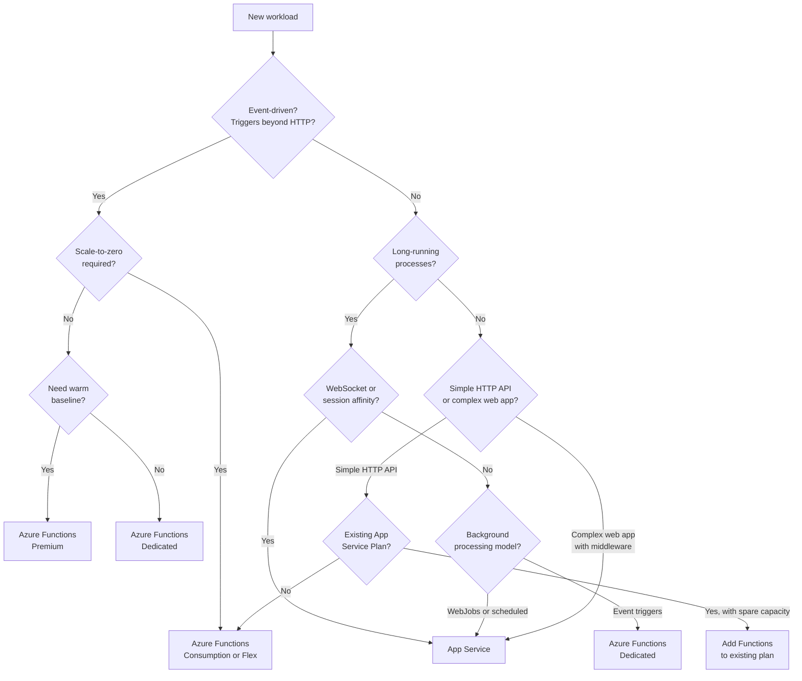
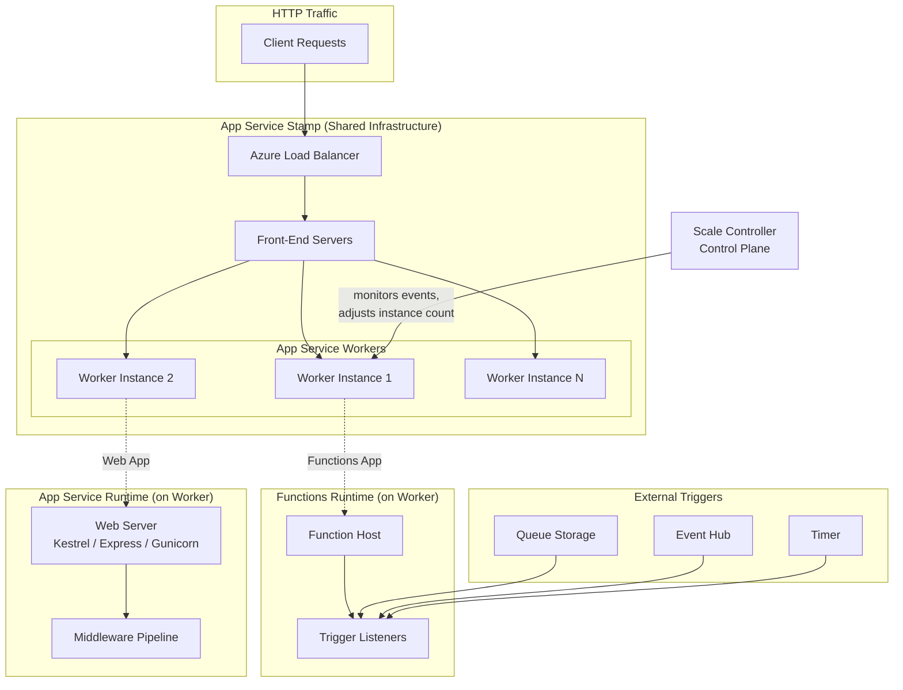

---
content_sources:
  - type: mslearn-adapted
    url: https://learn.microsoft.com/azure/azure-functions/functions-overview
  - type: mslearn-adapted
    url: https://learn.microsoft.com/azure/app-service/overview
  - type: mslearn-adapted
    url: https://learn.microsoft.com/azure/azure-functions/functions-scale
  - type: mslearn-adapted
    url: https://learn.microsoft.com/azure/architecture/guide/technology-choices/compute-decision-tree
  - type: mslearn-adapted
    url: https://learn.microsoft.com/azure/azure-functions/functions-compare-logic-apps-ms-flow-webjobs
---

# Azure Functions vs Azure App Service

Azure Functions and Azure App Service are both built on the same underlying App Service platform infrastructure. This guide compares the two services, provides a decision framework for choosing between them, and covers migration and coexistence patterns.

## Main Content
### Why This Comparison Matters

Both services share scale units, networking primitives, and deployment mechanisms. Understanding when each service fits — and when they overlap — prevents architectural misfits that are expensive to reverse after production rollout.

!!! note "Shared platform"
    Azure Functions on the Dedicated (App Service Plan) tier runs on the exact same infrastructure as a standard App Service web app. The difference is the programming model, not the compute substrate.

### Feature Comparison

| Capability | Azure Functions | Azure App Service |
|---|---|---|
| **Execution model** | Event-driven, trigger-based | Request-driven (HTTP), always-on |
| **Programming model** | Functions with bindings | Full web frameworks (ASP.NET, Express, Flask, Spring) |
| **Scale-to-zero** | Yes (Consumption, Flex Consumption) | No (minimum 1 instance) |
| **Auto-scaling** | Built-in event-driven scaling | Manual or rule-based autoscale |
| **Max execution time** | Plan-dependent `functionTimeout` (Consumption default 5 min/max 10 min, Flex default 30 min, Premium/Dedicated unbounded) with a 230-second HTTP response limit on all plans | No `functionTimeout`; request duration is governed by app/server behavior and upstream HTTP timeouts, which differ from Functions host timeout semantics |
| **Trigger types** | HTTP, Timer, Queue, Blob, Cosmos DB, Event Hub, Event Grid, Service Bus, SignalR, Durable | HTTP only (plus WebJobs for background) |
| **Bindings (input/output)** | Native support for 20+ services | Manual SDK integration |
| **WebSocket support** | No native WebSocket hosting (use Azure SignalR Service) | Full native support |
| **Session affinity (ARR)** | Not supported (stateless by design) | Supported (Basic and above) |
| **Deployment slots** | Yes (Consumption supports 2 total slots including production; Premium and Dedicated support slots) | Yes (Standard and above) |
| **VNet integration** | Yes (Flex Consumption, Premium, Dedicated) | Yes (Standard and above) |
| **Private endpoints** | Yes (Flex Consumption, Premium, Dedicated) | Yes (Basic and above) |
| **Custom domains** | Yes | Yes |
| **Managed identity** | Yes | Yes |
| **Language support** | C#, JavaScript/TypeScript, Python, Java, PowerShell, Go (custom handler) | C#, Node.js, Python, Java, PHP, Ruby, Go (custom container) |
| **Container support** | Yes (Premium, Dedicated) | Yes (all Linux tiers) |
| **Pricing model** | Per-execution (Consumption), on-demand plus optional always-ready baseline (Flex Consumption), or per-instance (Premium, Dedicated) | Per-instance (always) |
| **Startup class / host** | Function host with triggers | Web server (Kestrel, Express, Gunicorn, Tomcat) |

### Decision Framework

Use the following decision tree to determine which service best fits your workload.

<!-- diagram-id: decision-framework -->


#### When to Choose Azure Functions

- **Event-driven workloads** — processing queue messages, blob uploads, database change feeds, scheduled tasks, or webhook handlers.
- **Microservice glue** — lightweight functions that connect services without maintaining a full web application.
- **Scale-to-zero** — workloads with idle periods where paying for zero compute matters.
- **Rapid development** — bindings eliminate boilerplate for common Azure service integrations.
- **Fan-out / fan-in** — Durable Functions orchestrations that coordinate parallel work.

#### When to Choose App Service

- **Traditional web applications** — server-rendered pages, SPAs with API backends, REST APIs with complex middleware.
- **Long-running HTTP connections** — WebSocket-based applications (chat, real-time dashboards).
- **Session affinity** — workloads requiring sticky sessions (ARR affinity).
- **Full framework control** — applications needing complete control over the HTTP pipeline, middleware, and startup configuration.
- **Existing App Service estate** — organizations with existing App Service Plans and operational investment.

### Architecture Comparison

Both services run on the same App Service stamp infrastructure, but use different runtime hosts and scaling controllers.

<!-- diagram-id: architecture-comparison -->


!!! info "Key architectural difference"
    Azure Functions adds a **Scale Controller** (a separate control-plane component outside the worker pool) and **trigger listeners** on top of the App Service workers. The Scale Controller monitors event sources and adjusts instance count automatically. App Service relies on manual scaling rules or Azure Monitor-based autoscale.

### Migration Guidance

#### App Service to Azure Functions

**When to migrate:**

- Your web app evolved into mostly API endpoints and background processors.
- You want event-driven scaling instead of always-on instances.
- You are paying for idle capacity during off-peak hours.
- You need native trigger support for queues, blobs, or timers.

**Key changes:**

| App Service Pattern | Azure Functions Equivalent |
|---|---|
| Web routes / controllers | HTTP-triggered functions |
| Hosted background jobs | Timer-triggered or queue-triggered functions |
| In-process startup/configuration | Function host configuration for the chosen language model |
| `appsettings.json` | Application settings + `local.settings.json` for local development |
| WebJobs | Native Azure Functions triggers |

**Step-by-step approach:**

1. **Inventory endpoints** — catalog all routes, background jobs, and scheduled tasks.
2. **Map to triggers** — assign each endpoint to an HTTP trigger, timer trigger, or event trigger.
3. **Extract shared logic** — move business logic into shared libraries that both the app and functions can reference during the transition.
4. **Create function project** — initialize with the current Azure Functions programming model for your language (for example, Node.js v4, Java annotations, Python v2, or .NET isolated worker).
5. **Migrate incrementally** — move one endpoint or job at a time, verifying behavior with integration tests.
6. **Update routing** — use Azure API Management or Azure Front Door to gradually shift traffic.
7. **Decommission** — remove the App Service app after all traffic is migrated.

!!! warning "Common pitfalls"
    - **Execution timeout**: Consumption plan has a 5-minute default timeout. Move long-running logic to Premium or Dedicated, or redesign with Durable Functions.
    - **Cold starts**: If the App Service app had always-on enabled, users may notice latency regression on Consumption or Flex Consumption.
    - **State management**: Functions are stateless by default. Externalize any in-memory session or cache state to Redis or Cosmos DB.
    - **WebSocket loss**: Azure Functions does not support WebSocket connections. Keep WebSocket endpoints on App Service or migrate to Azure SignalR Service.

#### Azure Functions to App Service

**When to migrate:**

- The function app grew into a complex API with 50+ endpoints and shared middleware.
- You need WebSocket support or session affinity.
- Execution time requirements exceed Consumption plan limits and Durable Functions is not a fit.
- You want full control over the HTTP pipeline and startup sequence.

**Key changes:**

| Azure Functions Pattern | App Service Equivalent |
|---|---|
| HTTP-triggered functions | Controllers or route handlers |
| Input/output bindings | Direct SDK or service client calls |
| Timer-triggered functions | Hosted services or WebJobs |
| Queue-triggered functions | Hosted services, WebJobs, or a retained function app |
| Durable orchestrations | Custom workflow/orchestration implementation or Logic Apps |
| `local.settings.json` | `appsettings.json` + environment variables |

**Step-by-step approach:**

1. **Audit function triggers** — list all functions and their trigger types.
2. **Identify non-HTTP triggers** — these need replacement strategies (WebJobs, hosted services, or separate function apps).
3. **Create web app project** — scaffold with your preferred framework.
4. **Migrate HTTP functions** — convert to controllers or minimal API endpoints.
5. **Replace bindings** — swap input/output bindings for direct SDK calls.
6. **Handle background work** — move timer and queue triggers to WebJobs or keep them in a small function app.
7. **Deploy and validate** — use deployment slots for safe rollout.

!!! warning "Common pitfalls"
    - **Binding replacement**: Input and output bindings handle retries, serialization, and connection management automatically. Direct SDK usage requires implementing this logic yourself.
    - **Scale model change**: You lose event-driven auto-scaling. Plan instance counts based on load testing.
    - **Cost model shift**: App Service charges per instance (always running), not per execution.

### Coexistence Patterns

In most real-world architectures, Functions and App Service coexist rather than replace each other.

#### Pattern 1: Functions for Events, App Service for Web

The most common pattern: a web application on App Service handles user-facing HTTP traffic while Azure Functions processes background events.

```
User → App Service (Web UI / API) → Queue Storage → Azure Functions (Processor)
                                   → Blob Storage → Azure Functions (Thumbnail Generator)
```

!!! tip "When to use"
    This is the default recommendation for applications that have both a web frontend and event-driven processing requirements.

#### Pattern 2: Shared App Service Plan

When using the Dedicated (App Service Plan) tier, you can run both web apps and function apps on the same plan to maximize instance utilization.

```bash
# Create an App Service Plan
az appservice plan create \
    --resource-group $RG \
    --name $PLAN_NAME \
    --sku P1V3 \
    --is-linux

# Deploy a web app on the plan
az webapp create \
    --resource-group $RG \
    --plan $PLAN_NAME \
    --name $APP_NAME \
    --runtime "DOTNET|8.0"

# Deploy a function app on the same plan
az functionapp create \
    --resource-group $RG \
    --plan $PLAN_NAME \
    --name $FUNC_NAME \
    --runtime dotnet-isolated \
    --functions-version 4 \
    --storage-account $STORAGE_NAME
```

!!! warning "Resource contention"
    Web apps and function apps on the same plan share CPU and memory. A spike in function app executions can starve the web app. Monitor both apps and consider separate plans for production workloads with strict SLAs.

#### Pattern 3: API Management as Unified Gateway

Use Azure API Management to expose both App Service and Functions endpoints behind a single API gateway, providing a unified URL namespace, authentication, rate limiting, and monitoring.

```
Client → API Management Gateway → /api/users/* → App Service
                                → /api/events/* → Azure Functions
                                → /api/reports/* → Azure Functions
```

#### Pattern 4: Gradual Migration Bridge

During migration from one service to the other, run both side by side with traffic splitting. Use Azure Front Door or API Management to route a percentage of traffic to the new service while monitoring error rates and latency.

## See Also

- [Hosting Plans](hosting.md) — detailed comparison of Azure Functions hosting plans
- [Architecture](architecture.md) — Azure Functions runtime architecture and execution model
- [Scaling](scaling.md) — event-driven scaling behavior across hosting plans
- [Hosting Plan Selection](../best-practices/hosting-plan-selection.md) — best practices for choosing a hosting plan
- [Hosting Options Overview](../start-here/hosting-options.md) — quick start guide for hosting options

## Sources

- [Azure Functions overview — Microsoft Learn](https://learn.microsoft.com/azure/azure-functions/functions-overview)
- [Azure App Service overview — Microsoft Learn](https://learn.microsoft.com/azure/app-service/overview)
- [Azure Functions hosting options — Microsoft Learn](https://learn.microsoft.com/azure/azure-functions/functions-scale)
- [Choose an Azure compute service — Microsoft Learn](https://learn.microsoft.com/azure/architecture/guide/technology-choices/compute-decision-tree)
- [App Service, Functions, and Logic Apps comparison — Microsoft Learn](https://learn.microsoft.com/azure/azure-functions/functions-compare-logic-apps-ms-flow-webjobs)
