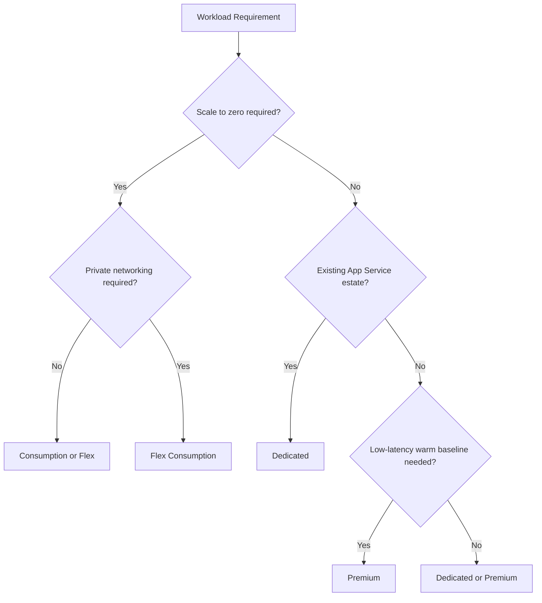
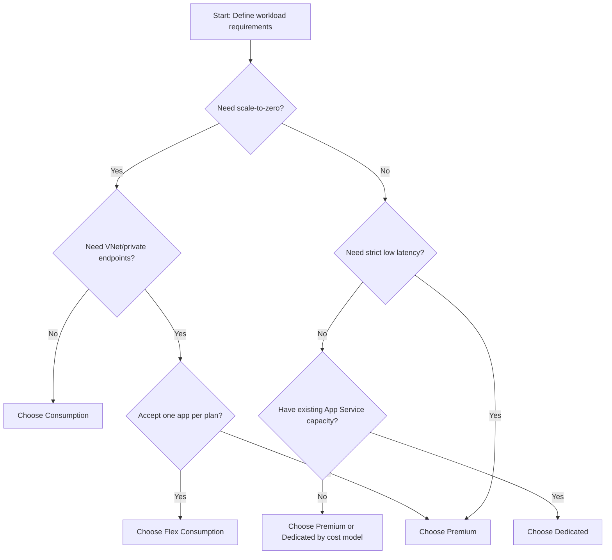

---
content_sources:
  - type: mslearn-adapted
    url: https://learn.microsoft.com/azure/azure-functions/functions-scale
  - type: mslearn-adapted
    url: https://learn.microsoft.com/azure/azure-functions/flex-consumption-plan
  - type: mslearn-adapted
    url: https://learn.microsoft.com/azure/azure-functions/functions-premium-plan
  - type: mslearn-adapted
    url: https://learn.microsoft.com/azure/app-service/overview-hosting-plans
  - type: mslearn-adapted
    url: https://learn.microsoft.com/azure/azure-functions/functions-networking-options
content_validation:
  status: verified
  last_reviewed: 2026-04-12
  reviewer: agent
  core_claims:
    - claim: "Consumption plan scales to zero and bills per execution"
      source: https://learn.microsoft.com/azure/azure-functions/consumption-plan
      verified: true
    - claim: "Flex Consumption supports VNet integration with identity-based storage"
      source: https://learn.microsoft.com/azure/azure-functions/flex-consumption-plan
      verified: true
    - claim: "Premium plan provides pre-warmed instances to avoid cold starts"
      source: https://learn.microsoft.com/azure/azure-functions/functions-premium-plan
      verified: true
    - claim: "Dedicated plan runs on App Service infrastructure with always-on support"
      source: https://learn.microsoft.com/azure/app-service/overview-hosting-plans
      verified: true
---

# Hosting Plans

Choosing a hosting plan is the most important Azure Functions platform decision. It controls scale behavior, cold start profile, networking options, limits, and baseline cost.

## Prerequisites

Before selecting a plan, align on these inputs with your application and platform teams:

- A latency objective (for example p95 HTTP response target) and whether cold starts are acceptable.
- A traffic profile (steady, bursty, batch, or unpredictable) with expected baseline and peak concurrency.
- Networking and security requirements, including VNet integration, private endpoints, and egress controls.
- Runtime and operating-system constraints (Linux/Windows support and language stack requirements).
- Execution characteristics such as average duration, maximum duration, and trigger model.
- Cost model preference (pure consumption, warm baseline, or fixed-capacity reservation).

!!! note "Validation first"
    Hosting choice is not just a pricing decision. Validate scale, networking, and timeout behavior in a staging environment before production rollout.

## Main Content

### Hosting plans at a glance

Azure Functions supports four main hosting models:

| Plan | Best for | Scale profile | Cold start profile |
|---|---|---|---|
| Consumption | Bursty, lower-cost serverless workloads | 0 to platform limit | Present after idle |
| Flex Consumption | New serverless apps needing VNet + high scale | 0 to high scale ceiling, per-function scaling | Reduced with always-ready |
| Premium | Low-latency, enterprise integration | Elastic with warm baseline | Eliminated for warm baseline |
| Dedicated (App Service Plan) | Predictable, fixed-capacity workloads | Manual/autoscale by plan rules | None (always on) |

!!! tip "Decision rule"
    Start with Flex Consumption for most new serverless workloads, then choose Premium when you need permanently warm behavior and advanced App Service premium features.

<!-- diagram-id: hosting-plans-at-a-glance -->


### Consumption plan (classic)

Consumption is the original serverless model.

#### Key characteristics

- Scale to zero when idle.
- Billed per execution and execution resources.
- No VNet integration.
- Typical default function timeout: **5 minutes**, maximum **10 minutes**.

#### Design trade-offs

Use Consumption when:

- traffic is sporadic,
- private networking is not required,
- and occasional cold starts are acceptable.

Avoid Consumption when you require private-only backend access or strict latency SLOs.

### Flex Consumption plan

Flex Consumption combines serverless economics with modern networking and scaling controls.

#### Key characteristics

- Scale to zero when idle.
- Per-function (or function-group) scaling model.
- Supports VNet integration and private endpoints.
- One Function App per plan.
- Linux-based runtime model.

#### Critical platform facts

- **No Kudu/SCM site** is available.
- **Identity-based storage is required** for host storage configuration.
- Blob trigger must use **Event Grid source** on Flex; standard polling blob trigger is not supported.
- Default function timeout is **30 minutes**; maximum is **unbounded**.

#### Flex memory profiles

At creation time, you choose an instance memory size profile (for example 512 MB, 2048 MB, 4096 MB). This choice affects throughput density and cost.

#### Always-ready behavior

Flex supports always-ready instances per function group to reduce startup latency while retaining scale-to-zero for non-baseline traffic.

### Premium plan

Premium (Elastic Premium) is designed for consistently low latency and enterprise workloads.

#### Key characteristics

- Instances are **permanently warm** at configured minimum count.
- Elastic scale beyond baseline.
- Supports VNet integration, private endpoints, and advanced App Service capabilities.
- No practical execution timeout ceiling for most long-running patterns (host settings still apply).

#### Premium is a fit when

- cold start must be eliminated,
- private networking is mandatory,
- long-running executions are expected,
- and you need features like always-warm baseline instances.

### Dedicated plan (App Service Plan)

Dedicated runs Functions on pre-provisioned App Service compute.

#### Key characteristics

- Fixed VM allocation (you pay regardless of invocation volume).
- Full App Service plan capabilities.
- Manual/autoscale rules at App Service layer.
- Suitable for shared hosting with existing web workloads.

#### Dedicated is a fit when

- you already operate App Service capacity,
- predictable fixed spend is preferred,
- and always-on behavior is required.

### Capability matrix

| Capability | Consumption | Flex Consumption | Premium | Dedicated |
|---|---|---|---|---|
| Scale to zero | Yes | Yes | No | No |
| VNet integration | No | Yes | Yes | Yes |
| Inbound private endpoint | No | Yes | Yes | Yes |
| Deployment slots | Yes (2 including production) | No | Yes | Yes |
| Kudu/SCM | Yes | No | Yes | Yes |
| Apps per plan | Multiple | One | Multiple | Multiple |

### Timeout reference (design-time)

| Plan | Default timeout | Maximum timeout |
|---|---:|---:|
| Consumption (classic) | 5 minutes | 10 minutes |
| Flex Consumption | 30 minutes | Unbounded |
| Premium | 30 minutes (common default) | Unbounded |
| Dedicated | 30 minutes (common default) | Unbounded |

!!! note
    HTTP responses still have platform front-end constraints independent of background function timeout. Design long-running HTTP operations using async patterns.

### Cost comparison (relative)

The table below is conceptual and should be validated with the Azure Pricing Calculator for your region and workload.

| Plan | Idle cost profile | Burst cost profile | Steady-state cost profile | Cost predictability |
|---|---|---|---|---|
| Consumption | Very low | Can increase rapidly with high execution volume | Can become less efficient than warm plans at high sustained traffic | Low to medium |
| Flex Consumption | Low with optional always-ready baseline | Efficient burst handling with per-function scaling | Moderate; depends on memory profile and always-ready count | Medium |
| Premium | Baseline cost always present | Incremental during burst above warm baseline | Often efficient for high sustained workloads needing low latency | Medium to high |
| Dedicated | Fixed regardless of invocation count | Usually unchanged unless autoscale adds workers | Predictable if workload is stable | High |

### CLI examples (plan creation/selection)

Use long-form flags only.

```bash
# Consumption Function App
az functionapp create \
  --resource-group "$RG" \
  --name "$APP_NAME" \
  --storage-account "$STORAGE_NAME" \
  --consumption-plan-location "$LOCATION" \
  --runtime node \
  --functions-version 4
```

```bash
# Flex Consumption Function App
az functionapp create \
  --resource-group "$RG" \
  --name "$APP_NAME" \
  --storage-account "$STORAGE_NAME" \
  --flexconsumption-location "$LOCATION" \
  --runtime python \
  --runtime-version 3.12
```

```bash
# Premium plan + Function App
az functionapp plan create \
  --resource-group "$RG" \
  --name "$PLAN_NAME" \
  --location "$LOCATION" \
  --sku EP1 \
  --is-linux

az functionapp create \
  --resource-group "$RG" \
  --name "$APP_NAME" \
  --plan "$PLAN_NAME" \
  --storage-account "$STORAGE_NAME" \
  --runtime dotnet-isolated \
  --functions-version 4
```

#### CLI inspection examples with output

```bash
# Show plan details
az functionapp plan show \
  --resource-group "$RG" \
  --name "$PLAN_NAME" \
  --output json
```

Example output (PII masked):

```json
{
  "id": "/subscriptions/<subscription-id>/resourceGroups/rg-functions-demo/providers/Microsoft.Web/serverfarms/plan-demo-functions",
  "name": "plan-demo-functions",
  "resourceGroup": "rg-functions-demo",
  "location": "koreacentral",
  "kind": "linux",
  "sku": {
    "name": "EP1",
    "tier": "ElasticPremium",
    "size": "EP1",
    "capacity": 1
  },
  "reserved": true,
  "numberOfWorkers": 1,
  "status": "Ready"
}
```

```bash
# List Function Apps in a resource group
az functionapp list \
  --resource-group "$RG" \
  --output table
```

Example output (PII masked):

```text
Name                    Location      State    ResourceGroup
----------------------  ------------  -------  -------------------
func-demo-api           koreacentral  Running  rg-functions-demo
func-demo-jobs          koreacentral  Running  rg-functions-demo
func-demo-ingest        koreacentral  Stopped  rg-functions-demo
```

### Hosting decision workflow

1. Decide if scale-to-zero is required.
2. Decide if private networking is required.
3. Decide if cold-start elimination is required.
4. Decide if one-app-per-plan (Flex) is acceptable.
5. Validate timeout requirements against plan limits.

If you need both serverless cost behavior and private networking, Flex is usually the first candidate.

#### Workflow flowchart

<!-- diagram-id: workflow-flowchart -->


### Troubleshooting matrix

| Symptom | Likely Cause | Validation Path |
|---|---|---|
| Cold start exceeding SLA | Consumption plan idle deallocation | Review invocation gap and first-request latency metrics; consider Flex always-ready or Premium warm instances |
| VNet-dependent calls fail on startup | Plan does not support required private networking path | Verify plan capability matrix, check networking configuration, then move to Flex/Premium/Dedicated as needed |
| Blob-trigger function not firing on Flex | Blob trigger source not configured for Event Grid | Validate trigger configuration and storage event subscription wiring |
| Deployment diagnostics missing on Flex | Expectation of Kudu/SCM availability | Confirm Flex platform constraints; use deployment logs and Application Insights telemetry |
| Unbounded execution assumed for HTTP request | Confusion between function timeout and HTTP front-end limits | Validate HTTP behavior with async pattern and durable orchestration approach |
| Premium costs unexpectedly high | Warm instance baseline set above actual need | Inspect minimum instance settings versus real traffic baseline and reduce warm capacity where safe |

### Anti-patterns

- Choosing Consumption, then requiring private-only data paths later.
- Choosing Dedicated for highly sporadic workloads.
- Ignoring Flex one-app-per-plan constraint in multi-app tenancy designs.
- Assuming Kudu is available on Flex.

!!! tip "Language Guide"
    For Python-specific deployment nuances on each plan, see [Python Runtime](../language-guides/python/python-runtime.md).

## Advanced Topics

### Plan migration strategies

Use migration as a controlled rollout, not a same-day in-place switch:

1. Baseline current latency, error rate, and concurrency under representative load.
2. Provision target plan in parallel with matching app settings and identities.
3. Deploy the same artifact, then run synthetic and replay tests.
4. Shift traffic gradually (for example by route or percentage) and observe key indicators.
5. Keep rollback path ready until stability is validated over at least one peak cycle.

### Flex memory profile selection guide

Use these selection heuristics:

- Start with 2048 MB for mixed trigger production workloads unless profiling shows a lower or higher requirement.
- Use 512 MB for lightweight handlers with small dependency footprints.
- Use 4096 MB for CPU-intensive transforms, larger runtime dependencies, or memory-heavy bindings.
- Re-evaluate profile choice after observing p95 duration, worker restarts, and memory pressure trends.

### Multi-app vs single-app design in Premium

Premium supports multiple Function Apps per plan, which enables density but introduces tenancy choices:

- Multi-app-per-plan is efficient when apps have aligned scaling behavior and shared ownership.
- Single-app-per-plan improves isolation for compliance, release independence, and noisy-neighbor control.
- Separate plans are recommended when one workload is highly bursty and another is latency critical.

### Cost estimation formulas (conceptual)

Use conceptual formulas to compare plan behavior before detailed calculator modeling:

- Consumption monthly cost ~= execution_count * execution_unit_price + execution_gb_seconds * gb_second_price
- Flex monthly cost ~= variable_execution_cost + always_ready_instance_hours * instance_hour_price
- Premium monthly cost ~= warm_instance_count * hours_per_month * instance_hour_price + burst_scale_cost
- Dedicated monthly cost ~= worker_count * hours_per_month * worker_hour_price

## Language-Specific Details

- [Python hosting and runtime guidance](../language-guides/python/python-runtime.md)
- [Python platform limits and sizing considerations](../language-guides/python/platform-limits.md)
- [Node.js language guide landing page](../language-guides/nodejs/index.md)
- [Java language guide landing page](../language-guides/java/index.md)
- [.NET language guide landing page](../language-guides/dotnet/index.md)

## See Also

- [Architecture](architecture/index.md)
- [Scaling](scaling.md)
- [Networking](networking.md)
- [Security](security.md)
- [Deployment Scenarios](deployment-scenarios.md) — Cross-plan comparison of VNet, PE, identity, and deployment patterns

## Sources

- [Microsoft Learn: Azure Functions hosting options](https://learn.microsoft.com/azure/azure-functions/functions-scale)
- [Microsoft Learn: Flex Consumption plan](https://learn.microsoft.com/azure/azure-functions/flex-consumption-plan)
- [Microsoft Learn: Premium plan](https://learn.microsoft.com/azure/azure-functions/functions-premium-plan)
- [Microsoft Learn: App Service plan](https://learn.microsoft.com/azure/app-service/overview-hosting-plans)
- [Microsoft Learn: Azure Functions networking options](https://learn.microsoft.com/azure/azure-functions/functions-networking-options)
