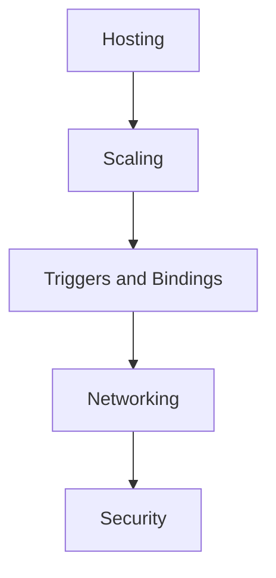

---
content_sources:

- type: mslearn-adapted
  url: https://learn.microsoft.com/en-us/azure/azure-functions/functions-overview
- type: mslearn-adapted
  url: https://learn.microsoft.com/en-us/azure/azure-functions/functions-scale
- type: mslearn-adapted
  url: https://learn.microsoft.com/en-us/azure/azure-functions/functions-triggers-bindings
- type: mslearn-adapted
  url: https://learn.microsoft.com/en-us/azure/azure-functions/functions-networking-options
- type: mslearn-adapted
  url: https://learn.microsoft.com/en-us/azure/reliability/reliability-functions
content_validation:
  status: verified
  last_reviewed: '2026-05-23'
  reviewer: agent
  core_claims:
  - claim: This page uses Microsoft Learn as the primary source basis for its Azure-specific
      guidance.
    source: https://learn.microsoft.com/en-us/azure/azure-functions/functions-overview
    verified: true
---
# Platform

The Platform section helps you make design-time decisions for Azure Functions: runtime architecture, hosting plan, scaling model, network boundaries, reliability controls, and security posture.

Use this section before implementation to choose the right operating model for your workload.

## What this section covers

<!-- diagram-id: what-this-section-covers -->

- [Architecture](architecture/index.md) — host/worker runtime model, deployment unit, and resource relationships.
- [Hosting](hosting.md) — Consumption, Flex Consumption, Premium, and Dedicated plan behavior.
- [Triggers and bindings](triggers-and-bindings.md) — eventing patterns and integration contracts.
- [Scaling](scaling.md) — how scale decisions differ by trigger type and hosting plan.
- [Networking](networking.md) — VNet integration, private endpoints, and hybrid connectivity.
- [Networking Scenarios](networking-scenarios/index.md) — practical deployment patterns for public, private egress, private ingress, and fixed outbound IP.
- [Reliability](reliability.md) — retries, poison message handling, and high-availability choices.
- [Security](security.md) — auth models, managed identity, and network isolation.

## Start with the design sequence

1. Pick a hosting plan from [Hosting](hosting.md).
2. Validate scale behavior in [Scaling](scaling.md).
3. Design private/public paths in [Networking](networking.md) and [Networking Scenarios](networking-scenarios/index.md).
4. Add failure handling from [Reliability](reliability.md).
5. Lock down access using [Security](security.md).

## Platform principles

- **Platform = design decisions** (not deployment runbooks).
- **Language-agnostic guidance** for Python, Node.js, .NET, and Java.
- **Microsoft Learn aligned** values, limits, and capabilities.
- **Plan-aware architecture**: capabilities are not identical across plans.

!!! tip "Language Guide"
    For Python-specific implementation details, see [v2 Programming Model](../language-guides/python/v2-programming-model.md).

## Review Matrix

| Review area | Page-specific check |
|---|---|
| Scope | Confirm the guidance applies to Platform. |
| Source basis | Validate the recommendation against the Microsoft Learn sources in this page. |
| Evidence | Capture command output, portal state, metrics, logs, or screenshots before treating the result as proven. |

## See Also

- [Start Here: Hosting Options](../start-here/hosting-options.md)
- [Operations: Deployment](../operations/deployment.md)
- [Operations: Monitoring](../operations/monitoring.md)
- [Troubleshooting: Index](../troubleshooting/index.md)

## Sources

- [Microsoft Learn source 1](https://learn.microsoft.com/en-us/azure/azure-functions/functions-overview)
- [Microsoft Learn source 2](https://learn.microsoft.com/en-us/azure/azure-functions/functions-scale)
- [Microsoft Learn source 3](https://learn.microsoft.com/en-us/azure/azure-functions/functions-triggers-bindings)
- [Microsoft Learn source 4](https://learn.microsoft.com/en-us/azure/azure-functions/functions-networking-options)
- [Microsoft Learn source 5](https://learn.microsoft.com/en-us/azure/reliability/reliability-functions)
