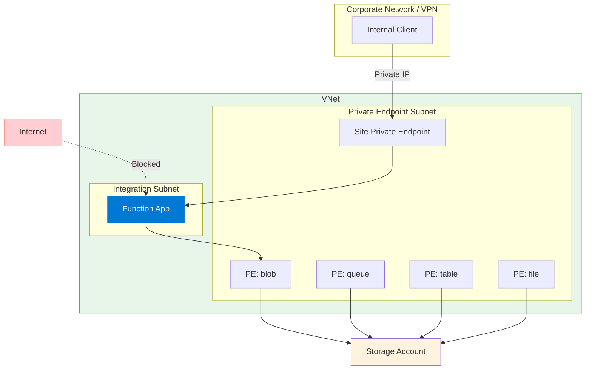

---
content_sources:
  - type: mslearn-adapted
    url: https://learn.microsoft.com/azure/azure-functions/functions-networking-options
  - type: mslearn-adapted
    url: https://learn.microsoft.com/azure/app-service/networking/private-endpoint
  - type: mslearn-adapted
    url: https://learn.microsoft.com/azure/private-link/private-endpoint-overview
  diagrams:
    - id: private-ingress-architecture
      type: flowchart
      source: self-generated
      justification: "Private endpoint ingress pattern from MSLearn networking documentation"
      based_on:
        - https://learn.microsoft.com/azure/app-service/networking/private-endpoint
content_validation:
  status: verified
  last_reviewed: 2026-04-12
  reviewer: agent
  core_claims:
    - claim: "Azure Functions private endpoints are supported on Flex Consumption, Premium, and Dedicated plans, but not classic Consumption"
      source: https://learn.microsoft.com/azure/azure-functions/functions-networking-options
      verified: true
    - claim: "App Service private endpoints use the sites group for the main app endpoint"
      source: https://learn.microsoft.com/azure/app-service/networking/private-endpoint
      verified: true
    - claim: "Private endpoints provide private IP-based access to the app through Azure Private Link"
      source: https://learn.microsoft.com/azure/private-link/private-endpoint-overview
      verified: true
    - claim: "Disabling public network access prevents public ingress to the function app"
      source: https://learn.microsoft.com/azure/app-service/networking/private-endpoint
      verified: true
---

# Scenario 3: Private Ingress (Site Private Endpoint)

Full network isolation with private inbound access via site private endpoint and private outbound through VNet integration.

## When to Use

- Zero-trust architectures requiring no public exposure
- Compliance requirements (PCI-DSS, HIPAA, FedRAMP)
- Internal-only APIs accessible only from corporate network
- Backend services in hub-spoke or landing zone architectures

## Architecture

<!-- diagram-id: private-ingress-architecture -->


## Supported Plans

| Plan | Supported | Notes |
|------|:---------:|-------|
| Consumption (Y1) | :material-close: | No private endpoint support |
| Flex Consumption (FC1) | :material-check: | Requires VNet integration first |
| Premium (EP) | :material-check: | Recommended for private workloads |
| Dedicated (B1) | :material-minus:[^1] | Not tested in this guide |
| Dedicated (S1+) | :material-check: | Full support |

[^1]: Basic (B1) supports VNet integration and private endpoints per Azure documentation, but is not tested or recommended for private networking scenarios in this guide. Use Standard (S1+) for production.

## Prerequisites

Complete [Scenario 2: Private Egress](private-egress.md) first. This scenario adds a site private endpoint on top of VNet integration.

**Required from Scenario 2:**
- [ ] Function App with VNet integration enabled
- [ ] Storage private endpoints configured
- [ ] Private DNS zones linked to VNet

**Additional requirements:**
- [ ] Private DNS zone for `privatelink.azurewebsites.net`
- [ ] Network access from client (VPN, ExpressRoute, or same VNet)

## Step-by-Step Configuration

### Step 1: Get Function App Resource ID

```bash
export APP_ID=$(az functionapp show \
  --name "$APP_NAME" \
  --resource-group "$RG" \
  --query "id" \
  --output tsv)
```

| Command/Parameter | Purpose |
|-------------------|---------|
| `--query "id"` | Retrieves the full resource ID for private endpoint creation |

### Step 2: Create Site Private Endpoint

```bash
az network private-endpoint create \
  --name "pe-$APP_NAME" \
  --resource-group "$RG" \
  --location "$LOCATION" \
  --vnet-name "$VNET_NAME" \
  --subnet "snet-private-endpoints" \
  --private-connection-resource-id "$APP_ID" \
  --group-ids "sites" \
  --connection-name "conn-$APP_NAME"
```

| Command/Parameter | Purpose |
|-------------------|---------|
| `--group-ids "sites"` | Targets the function app's primary web endpoint |
| `--private-connection-resource-id "$APP_ID"` | Links the endpoint to the function app |

### Step 3: Create Private DNS Zone for Web Apps

```bash
az network private-dns zone create \
  --resource-group "$RG" \
  --name "privatelink.azurewebsites.net"

az network private-dns link vnet create \
  --resource-group "$RG" \
  --zone-name "privatelink.azurewebsites.net" \
  --name "link-webapp" \
  --virtual-network "$VNET_NAME" \
  --registration-enabled false
```

| Command/Parameter | Purpose |
|-------------------|---------|
| `privatelink.azurewebsites.net` | Standard private DNS zone for App Service/Functions |
| `--registration-enabled false` | Disables auto-registration |

### Step 4: Link Private Endpoint to DNS Zone

```bash
az network private-endpoint dns-zone-group create \
  --resource-group "$RG" \
  --endpoint-name "pe-$APP_NAME" \
  --name "webapp-dns-zone-group" \
  --private-dns-zone "privatelink.azurewebsites.net" \
  --zone-name "webapp"
```

| Command/Parameter | Purpose |
|-------------------|---------|
| `az network private-endpoint dns-zone-group create` | Automatically registers the private IP in the DNS zone |

### Step 5: Disable Public Network Access (Recommended)

```bash
az functionapp update \
  --name "$APP_NAME" \
  --resource-group "$RG" \
  --set publicNetworkAccess=Disabled
```

| Command/Parameter | Purpose |
|-------------------|---------|
| `publicNetworkAccess=Disabled` | Completely disables the public endpoint |

!!! warning "SCM Site Access"
    Disabling public access also blocks the SCM/Kudu site. For deployment:
    
    - Use a self-hosted agent in the VNet for CI/CD
    - Deploy from a VM with VNet access
    - Use Azure DevOps or GitHub Actions with VNet connectivity

### Step 6: SCM Access for Deployment

!!! info "SCM Access with Private Endpoints"
    When you create a private endpoint with `--group-ids "sites"`, both the main site and SCM/Kudu endpoint are accessible via the same private endpoint. With a private DNS zone group, Azure creates private DNS A records for both hosts inside `privatelink.azurewebsites.net`, while public DNS keeps the CNAME chain from `*.azurewebsites.net` and `*.scm.azurewebsites.net` to those private records.
    
    - `your-app.privatelink.azurewebsites.net` → private IP
    - `your-app.scm.privatelink.azurewebsites.net` → same private IP
    
    No separate SCM private endpoint is needed for most scenarios.

For deployment from within the VNet:

```bash
# From a VM or agent in the VNet
func azure functionapp publish "$APP_NAME"
```

| Command/Parameter | Purpose |
|-------------------|---------|
| `func azure functionapp publish` | Deploys to the function app via SCM endpoint |

## Verification

### Check Private Endpoint Status

```bash
az network private-endpoint show \
  --name "pe-$APP_NAME" \
  --resource-group "$RG" \
  --query "privateLinkServiceConnections[0].privateLinkServiceConnectionState.status" \
  --output tsv
```

| Command/Parameter | Purpose |
|-------------------|---------|
| `az network private-endpoint show` | Verifies that the site private endpoint connection is approved and usable |

Expected output: `Approved`

### Check Private DNS Records

```bash
az network private-dns record-set a list \
  --resource-group "$RG" \
  --zone-name "privatelink.azurewebsites.net" \
  --output table
```

| Command/Parameter | Purpose |
|-------------------|---------|
| `az network private-dns record-set a list` | Confirms that A records exist for both the app hostname and the SCM hostname |

Expected output includes records similar to `$APP_NAME` and `$APP_NAME.scm`.

### Testing from VNet (VM/Bastion Required)

!!! warning "VNet Access Required"
    After disabling public access, the function is **only reachable from within the VNet**. You need one of:
    
    - Jump box VM in the VNet + Azure Bastion
    - VPN/ExpressRoute connection

!!! info "Management Subnet Recommendation"
    Private endpoint subnets can technically host other resources, but using a separate management subnet for test VMs keeps private endpoints isolated and matches common production landing zone patterns.

#### Option A: Deploy Jump Box VM with Bastion

```bash
# Create Bastion subnet (required: /26 or larger)
az network vnet subnet create \
  --resource-group "$RG" \
  --vnet-name "$VNET_NAME" \
  --name "AzureBastionSubnet" \
  --address-prefixes "10.0.3.0/26"

# Create management subnet for the jump box VM
az network vnet subnet create \
  --resource-group "$RG" \
  --vnet-name "$VNET_NAME" \
  --name "snet-management" \
  --address-prefixes "10.0.4.0/24"

# Create public IP for Bastion
az network public-ip create \
  --resource-group "$RG" \
  --name "pip-bastion-$APP_NAME" \
  --sku "Standard" \
  --location "$LOCATION"

# Create Bastion host (takes 5-10 minutes)
az network bastion create \
  --resource-group "$RG" \
  --name "bastion-$APP_NAME" \
  --vnet-name "$VNET_NAME" \
  --public-ip-address "pip-bastion-$APP_NAME" \
  --location "$LOCATION" \
  --sku "Basic"

# Create jump box VM (no public IP - accessed via Bastion)
az vm create \
  --resource-group "$RG" \
  --name "vm-jumpbox" \
  --image "Ubuntu2404" \
  --size "Standard_B1s" \
  --vnet-name "$VNET_NAME" \
  --subnet "snet-management" \
  --admin-username "azureuser" \
  --generate-ssh-keys \
  --public-ip-address ""
```

| Command/Parameter | Purpose |
|-------------------|---------|
| `AzureBastionSubnet` | Required subnet name for Bastion (must be exactly this name) |
| `--address-prefixes "10.0.3.0/26"` | Minimum /26 CIDR for Bastion subnet |
| `snet-management` | Separate subnet for test or operations VMs |
| `--sku "Basic"` | Basic Bastion SKU (~$0.19/hour) |
| `--public-ip-address ""` | VM has no public IP - only accessible via Bastion |

#### Connect to VM via Bastion

```bash
# Connect via Azure Portal: VM > Connect > Bastion
# Or use Azure CLI:
az network bastion ssh \
  --resource-group "$RG" \
  --name "bastion-$APP_NAME" \
  --target-resource-id $(az vm show --resource-group "$RG" --name "vm-jumpbox" --query "id" --output tsv) \
  --auth-type "ssh-key" \
  --username "azureuser" \
  --ssh-key ~/.ssh/id_rsa
```

| Command/Parameter | Purpose |
|-------------------|---------|
| `az network bastion ssh` | Opens an SSH session to the private VM through Azure Bastion |
| `--target-resource-id $(az vm show ...)` | Resolves the VM resource ID required by the Bastion command |

#### Test from Jump Box

Once connected to the VM:

```bash
# Test DNS resolution - should return private IP (10.x.x.x)
nslookup $APP_NAME.azurewebsites.net
```

| Command/Parameter | Purpose |
|-------------------|---------|
| `nslookup $APP_NAME.azurewebsites.net` | Verifies that the public hostname resolves to the private endpoint IP inside the VNet |

Expected output:
```
Server:         127.0.0.53
Address:        127.0.0.53#53

Non-authoritative answer:
func-demo.azurewebsites.net  canonical name = func-demo.privatelink.azurewebsites.net.
Name:   func-demo.privatelink.azurewebsites.net
Address: 10.0.2.5
```

```bash
# Test function endpoint
curl --request GET "https://$APP_NAME.azurewebsites.net/api/health"
```

| Command/Parameter | Purpose |
|-------------------|---------|
| `curl --request GET` | Confirms that HTTPS requests succeed through the site private endpoint |

Expected output:
```json
{"status":"healthy","timestamp":"2026-04-11T10:30:00Z","version":"1.0.0"}
```

#### Option B: Minimal Test VM (No Bastion)

For quick testing, create a VM with public IP and SSH directly:

```bash
az vm create \
  --resource-group "$RG" \
  --name "vm-test" \
  --image "Ubuntu2404" \
  --size "Standard_B1s" \
  --vnet-name "$VNET_NAME" \
  --subnet "snet-management" \
  --admin-username "azureuser" \
  --generate-ssh-keys

# SSH to VM (use the public IP from output)
ssh azureuser@<public-ip>

# Test from inside VM
nslookup $APP_NAME.azurewebsites.net
curl --request GET "https://$APP_NAME.azurewebsites.net/api/health"
```

| Command/Parameter | Purpose |
|-------------------|---------|
| `az vm create` | Creates a temporary VM for private endpoint validation without Bastion |
| `ssh azureuser@<public-ip>` | Connects to the test VM so validation runs from inside the VNet |
| `curl --request GET` | Confirms that the function app is reachable privately from the VM |

!!! tip "Cost Optimization"
    Delete test resources after verification:
    ```bash
    az vm delete --resource-group "$RG" --name "vm-test" --yes
    az vm delete --resource-group "$RG" --name "vm-jumpbox" --yes
    az network bastion delete --resource-group "$RG" --name "bastion-$APP_NAME"
    az network public-ip delete --resource-group "$RG" --name "pip-bastion-$APP_NAME"
    ```

    | Command/Parameter | Purpose |
    |-------------------|---------|
    | `az vm delete` | Removes temporary validation VMs after testing |
    | `az network bastion delete` | Removes the Bastion host if it was created only for validation |
    | `az network public-ip delete` | Removes the Bastion public IP resource |
    
    - VM (B1s): ~$0.01/hour
    - Bastion (Basic): ~$0.19/hour

## CI/CD Considerations

With public access disabled, deployment requires VNet connectivity:

### Option A: Self-Hosted Agent in VNet

Deploy a VM or container in the VNet running Azure DevOps agent or GitHub Actions runner.

### Option B: Azure DevOps with VNet Integration

Use Azure DevOps Managed DevOps Pool with VNet integration (preview).

### Option C: GitHub Actions with Private Networking

Use GitHub Actions larger runners with Azure private networking (preview).

### Option D: Temporary Public Access

```bash
# Enable public access for deployment
az functionapp update \
  --name "$APP_NAME" \
  --resource-group "$RG" \
  --set publicNetworkAccess=Enabled

# Deploy
func azure functionapp publish "$APP_NAME"

# Disable public access
az functionapp update \
  --name "$APP_NAME" \
  --resource-group "$RG" \
  --set publicNetworkAccess=Disabled
```

| Command/Parameter | Purpose |
|-------------------|---------|
| `--set publicNetworkAccess=Enabled` | Temporarily allows public access for deployment |
| `func azure functionapp publish` | Deploys the function app code |
| `--set publicNetworkAccess=Disabled` | Restores private-only access after deployment |

## Troubleshooting

| Symptom | Likely Cause | Solution |
|---------|--------------|----------|
| Connection refused | DNS resolving to public IP | Verify DNS zone linked to VNet |
| 403 Forbidden | Public access disabled, not on VNet | Connect via VPN or from VM in VNet |
| Deployment fails | SCM site not accessible | Deploy from VNet (see Step 6) or use temporary public access (Option D) |
| DNS not resolving | Zone not linked or cached | Check `az network private-dns link vnet list`, clear DNS cache |

## Next Steps

- [Scenario 4: Fixed Outbound IP](fixed-outbound-nat.md) — Add NAT Gateway for stable egress IP

## See Also

- [Networking Scenarios Overview](index.md)
- [Scenario 2: Private Egress](private-egress.md)
- [Platform: Networking](../networking.md)

## Sources

- [Azure Functions networking options (Microsoft Learn)](https://learn.microsoft.com/azure/azure-functions/functions-networking-options)
- [Use private endpoints for Azure App Service (Microsoft Learn)](https://learn.microsoft.com/azure/app-service/networking/private-endpoint)
- [What is Azure Private Endpoint? (Microsoft Learn)](https://learn.microsoft.com/azure/private-link/private-endpoint-overview)
