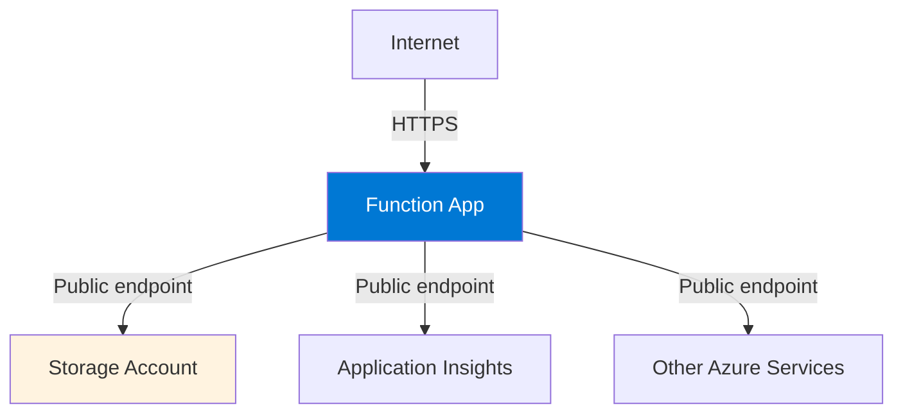

---
content_sources:
  - type: mslearn-adapted
    url: https://learn.microsoft.com/azure/azure-functions/functions-networking-options
  - type: mslearn-adapted
    url: https://learn.microsoft.com/azure/azure-functions/create-first-function-cli-python
  diagrams:
    - id: public-only-architecture
      type: flowchart
      source: self-generated
      justification: "Standard public deployment pattern from MSLearn quickstarts"
      based_on:
        - https://learn.microsoft.com/azure/azure-functions/create-first-function-cli-python
content_validation:
  status: verified
  last_reviewed: 2026-04-12
  reviewer: agent
  core_claims:
    - claim: "Classic Consumption is the default serverless public deployment option and does not provide VNet integration"
      source: https://learn.microsoft.com/azure/azure-functions/functions-networking-options
      verified: true
    - claim: "Flex Consumption, Premium, and Dedicated plans can be deployed without VNet integration"
      source: https://learn.microsoft.com/azure/azure-functions/functions-networking-options
      verified: true
    - claim: "A basic Azure Functions deployment can be created publicly with Azure CLI without extra networking resources"
      source: https://learn.microsoft.com/azure/azure-functions/create-first-function-cli-python
      verified: true
---

# Scenario 1: Public Only

The simplest deployment pattern with no VNet integration. All traffic flows over the public internet.

## When to Use

- Development and testing environments
- Public-facing APIs without backend dependencies
- Prototypes and demos
- Workloads without compliance requirements for network isolation

## Architecture

<!-- diagram-id: public-only-architecture -->


## Supported Plans

| Plan | Supported | Notes |
|------|:---------:|-------|
| Consumption (Y1) | :material-check: | Default and only option |
| Flex Consumption (FC1) | :material-check: | VNet integration is optional |
| Premium (EP) | :material-check: | VNet integration is optional |
| Dedicated (B1) | :material-check: | Public only in this guide; VNet scenarios use S1+ |
| Dedicated (S1+) | :material-check: | VNet integration is optional |

## Prerequisites

This scenario requires no additional networking setup beyond the base deployment. Follow your language tutorial's `02-first-deploy.md`:

=== "Python"

    - [Consumption](../../language-guides/python/tutorial/consumption/02-first-deploy.md)
    - [Flex Consumption](../../language-guides/python/tutorial/flex-consumption/02-first-deploy.md)
    - [Premium](../../language-guides/python/tutorial/premium/02-first-deploy.md)
    - [Dedicated](../../language-guides/python/tutorial/dedicated/02-first-deploy.md)

=== "Node.js"

    - [Consumption](../../language-guides/nodejs/tutorial/consumption/02-first-deploy.md)
    - [Flex Consumption](../../language-guides/nodejs/tutorial/flex-consumption/02-first-deploy.md)
    - [Premium](../../language-guides/nodejs/tutorial/premium/02-first-deploy.md)
    - [Dedicated](../../language-guides/nodejs/tutorial/dedicated/02-first-deploy.md)

=== "Java"

    - [Consumption](../../language-guides/java/tutorial/consumption/02-first-deploy.md)
    - [Flex Consumption](../../language-guides/java/tutorial/flex-consumption/02-first-deploy.md)
    - [Premium](../../language-guides/java/tutorial/premium/02-first-deploy.md)
    - [Dedicated](../../language-guides/java/tutorial/dedicated/02-first-deploy.md)

=== ".NET"

    - [Consumption](../../language-guides/dotnet/tutorial/consumption/02-first-deploy.md)
    - [Flex Consumption](../../language-guides/dotnet/tutorial/flex-consumption/02-first-deploy.md)
    - [Premium](../../language-guides/dotnet/tutorial/premium/02-first-deploy.md)
    - [Dedicated](../../language-guides/dotnet/tutorial/dedicated/02-first-deploy.md)

## Plan-Specific Configuration

### Consumption (Y1)

No special configuration needed. Public access is the only option.

```bash
az functionapp create \
  --name "$APP_NAME" \
  --resource-group "$RG" \
  --storage-account "$STORAGE_NAME" \
  --consumption-plan-location "$LOCATION" \
  --functions-version 4 \
  --runtime python \
  --runtime-version 3.11 \
  --os-type Linux
```

| Command/Parameter | Purpose |
|-------------------|---------|
| `--consumption-plan-location "$LOCATION"` | Creates a serverless Consumption plan in the specified region |

### Flex Consumption (FC1) — Public Mode

Skip VNet integration parameters for public deployment.

```bash
az functionapp create \
  --name "$APP_NAME" \
  --resource-group "$RG" \
  --storage-account "$STORAGE_NAME" \
  --flexconsumption-location "$LOCATION" \
  --runtime python \
  --runtime-version 3.11 \
  --functions-version 4
```

| Command/Parameter | Purpose |
|-------------------|---------|
| `--flexconsumption-location "$LOCATION"` | Creates a Flex Consumption plan without VNet integration |

!!! note "Storage Authentication"
    FC1 public deployments can use either connection string or identity-based storage authentication. Identity-based is recommended for security.

### Premium (EP) — Public Mode

Create without VNet integration.

```bash
az functionapp plan create \
  --name "$PLAN_NAME" \
  --resource-group "$RG" \
  --location "$LOCATION" \
  --sku EP1 \
  --is-linux

az functionapp create \
  --name "$APP_NAME" \
  --resource-group "$RG" \
  --plan "$PLAN_NAME" \
  --storage-account "$STORAGE_NAME" \
  --runtime python \
  --runtime-version 3.11 \
  --functions-version 4 \
  --os-type Linux
```

| Command/Parameter | Purpose |
|-------------------|---------|
| `--sku EP1` | Creates an Elastic Premium plan (smallest tier) |
| `--is-linux` | Configures the plan for Linux hosting |

### Dedicated (B1) — Public Only

This guide uses B1 for public-only scenarios. For VNet integration, see [Private Egress](private-egress.md) with Standard (S1+) tier.

```bash
az appservice plan create \
  --name "$PLAN_NAME" \
  --resource-group "$RG" \
  --location "$LOCATION" \
  --sku B1 \
  --is-linux

az functionapp create \
  --name "$APP_NAME" \
  --resource-group "$RG" \
  --plan "$PLAN_NAME" \
  --storage-account "$STORAGE_NAME" \
  --runtime python \
  --runtime-version 3.11 \
  --functions-version 4 \
  --os-type Linux
```

| Command/Parameter | Purpose |
|-------------------|---------|
| `--sku B1` | Creates a Basic tier App Service plan (public-only in this guide) |

## Verification

Test public endpoint access:

```bash
curl --request GET "https://$APP_NAME.azurewebsites.net/api/health"
```

| Command/Parameter | Purpose |
|-------------------|---------|
| `curl --request GET` | Tests the public HTTP endpoint |

Expected response:

```json
{"status":"healthy","timestamp":"2026-04-11T00:00:00Z","version":"1.0.0"}
```

## Security Considerations

!!! warning "Public Exposure"
    Without VNet integration, your function app and its dependencies are accessible over the public internet. Consider:
    
    - **Function-level authorization keys** for HTTP triggers
    - **IP access restrictions** to limit source networks
    - **App Service Authentication** for user/workload identity
    - **Storage firewall rules** if not using private endpoints

### Add IP Access Restrictions

Limit access to known IP ranges:

```bash
az functionapp config access-restriction add \
  --name "$APP_NAME" \
  --resource-group "$RG" \
  --rule-name "AllowCorporate" \
  --priority 100 \
  --action Allow \
  --ip-address "203.0.113.0/24"
```

| Command/Parameter | Purpose |
|-------------------|---------|
| `--rule-name "AllowCorporate"` | Descriptive name for the access rule |
| `--priority 100` | Lower numbers are evaluated first |
| `--ip-address "203.0.113.0/24"` | CIDR range to allow |

## Migrating to Private Networking

To add VNet integration later, see:

- [Scenario 2: Private Egress](private-egress.md) — Add VNet integration for private backend access
- [Scenario 3: Private Ingress](private-ingress.md) — Add site private endpoint for private inbound

## See Also

- [Networking Scenarios Overview](index.md)
- [Platform: Networking](../networking.md)
- [Best Practices: Security](../../best-practices/security.md)

## Sources

- [Azure Functions networking options (Microsoft Learn)](https://learn.microsoft.com/azure/azure-functions/functions-networking-options)
- [Create a function app using Azure CLI (Microsoft Learn)](https://learn.microsoft.com/azure/azure-functions/create-first-function-cli-python)
