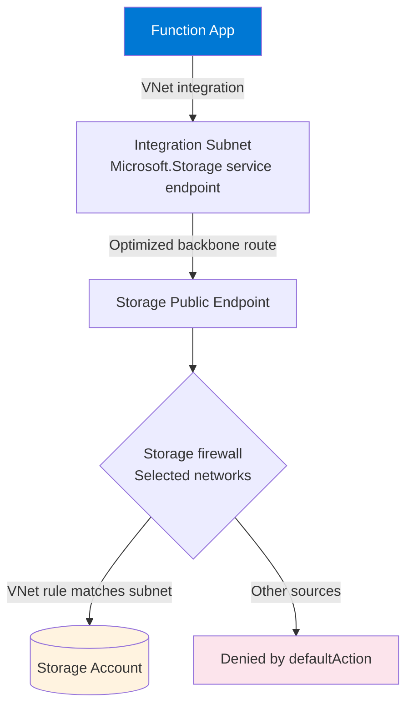

---
content_sources:
  diagrams:
    - id: storage-service-endpoint-architecture
      type: flowchart
      source: self-generated
      justification: "Service-endpoint access pattern synthesized from Microsoft Learn storage networking and Functions networking documentation"
      based_on:
        - https://learn.microsoft.com/en-us/azure/storage/common/storage-network-security
        - https://learn.microsoft.com/en-us/azure/virtual-network/virtual-network-service-endpoints-overview
        - https://learn.microsoft.com/en-us/azure/azure-functions/functions-networking-options
content_validation:
  status: verified
  last_reviewed: 2026-07-16
  reviewer: agent
  core_claims:
    - claim: "A virtual network service endpoint for Microsoft.Storage extends the subnet identity to the storage account and is authorized with a storage network (VNet) rule under Selected networks."
      source: https://learn.microsoft.com/en-us/azure/storage/common/storage-network-security
      verified: true
    - claim: "Service endpoints keep traffic on the Azure backbone but the storage account is still reached through its public endpoint, so its DNS name continues to resolve to a public IP address."
      source: https://learn.microsoft.com/en-us/azure/virtual-network/virtual-network-service-endpoints-overview
      verified: true
    - claim: "Private endpoints, unlike service endpoints, assign a private IP from the VNet to the storage account and require Private DNS to resolve the storage FQDN to that private IP."
      source: https://learn.microsoft.com/en-us/azure/storage/common/storage-private-endpoints
      verified: true
    - claim: "Azure Functions VNet integration routes the app's outbound calls through the integration subnet, which is what allows subnet-scoped storage network rules to apply to the Function App."
      source: https://learn.microsoft.com/en-us/azure/azure-functions/functions-networking-options
      verified: true
---

# Storage Service Endpoint

This scenario secures Azure Storage access with a **virtual network service endpoint** instead of a private endpoint. It is the middle ground between fully public storage and a private-endpoint deployment: the storage account stays on its **public endpoint** (DNS resolves to a public IP), but the account only accepts traffic from an authorized **subnet**.

This is a common and often-overlooked posture for Azure Functions, because the Function App reaches storage through its **VNet integration** subnet, and that same subnet is what the storage network rule authorizes.

## Prerequisites

- A Function App on a plan that supports VNet integration: Flex Consumption (FC1), Premium (EP), or Dedicated (S1+). Consumption (Y1) does **not** support VNet integration and cannot use this scenario.
- An existing virtual network with an integration subnet.
- A base deployment completed via your language tutorial's `02-first-deploy.md`.

## How Service Endpoints Differ From Private Endpoints

The key distinction is **where the storage account lives on the network** and **what DNS returns**.

| Aspect | Service Endpoint | Private Endpoint |
|--------|------------------|------------------|
| Storage endpoint | Public endpoint (retained) | Private endpoint (new NIC in the VNet) |
| DNS result for `*.blob.core.windows.net` | **Public IP** (unchanged) | **Private IP** (requires Private DNS zone) |
| Authorization model | Subnet **VNet rule** on Selected networks | Network isolation at the NIC + Private DNS |
| Private DNS zone required | No | Yes (`privatelink.*.core.windows.net`) |
| Route All required | No | No (but often paired with it) |
| Cross-region support | Same-region subnets (and specific paired scenarios) | Works across regions and peered VNets |
| Traffic path | Azure backbone, optimized route from the subnet | Azure backbone via private NIC |

!!! info "DNS is the giveaway"
    With a service endpoint, `nslookup <account>.blob.core.windows.net` still returns a **public IP**. That is expected and correct — the *subnet identity*, not DNS, is what grants access. If you expect a private IP here, you actually want a [private endpoint](private-egress.md).

## Architecture

<!-- diagram-id: storage-service-endpoint-architecture -->


The Function App's outbound storage calls leave through the integration subnet. Because the subnet carries the `Microsoft.Storage` service endpoint and the storage account authorizes that subnet with a VNet rule, the request is allowed. All other sources hit the firewall's `defaultAction` (Deny) and are rejected — even though the endpoint is technically public.

## Supported Plans

| Plan | Supported | Notes |
|------|:---------:|-------|
| Consumption (Y1) | :material-close: | No VNet integration |
| Flex Consumption (FC1) | :material-check: | VNet integration required |
| Premium (EP) | :material-check: | VNet integration required |
| Dedicated (S1+) | :material-check: | VNet integration required |

## Procedure

### Step 1: Enable VNet Integration on the Function App

The Function App must route outbound traffic through the subnet before storage subnet rules can match it. Follow the VNet integration steps in [Private Egress](private-egress.md) (Enable VNet Integration), or use the plan-appropriate command.

### Step 2: Add the Microsoft.Storage Service Endpoint to the Integration Subnet

```bash
az network vnet subnet update \
  --resource-group "$RG" \
  --vnet-name "$VNET_NAME" \
  --name "$INTEGRATION_SUBNET" \
  --service-endpoints "Microsoft.Storage"
```

| Command/Parameter | Purpose |
|-------------------|---------|
| `--service-endpoints "Microsoft.Storage"` | Extends the subnet's identity to Azure Storage over the backbone |

### Step 3: Restrict the Storage Account to Selected Networks and Add the VNet Rule

```bash
# Default the firewall to Deny, keeping the public endpoint Enabled
az storage account update \
  --name "$STORAGE_NAME" \
  --resource-group "$RG" \
  --default-action Deny

# Authorize the integration subnet
az storage account network-rule add \
  --account-name "$STORAGE_NAME" \
  --resource-group "$RG" \
  --vnet-name "$VNET_NAME" \
  --subnet "$INTEGRATION_SUBNET"
```

| Command/Parameter | Purpose |
|-------------------|---------|
| `--default-action Deny` | Sets the storage firewall default to Deny. The public endpoint stays **Enabled**; only authorized rules pass. |
| `az storage account network-rule add ... --subnet` | Adds the subnet VNet rule so the integration subnet is allowed |

!!! warning "publicNetworkAccess stays Enabled"
    This scenario relies on `publicNetworkAccess = Enabled` with `defaultAction = Deny`. Do **not** set `--public-network-access Disabled` here — that disables the public endpoint entirely and breaks service-endpoint access (only private endpoints would work at that point). See [Storage Connectivity](../storage-connectivity.md) for the full setting matrix.

### Step 4: Apply the Same Rule to Every Storage the App Uses

Azure Functions may depend on more than one storage account. A service-endpoint rule must exist for **each** account and role the app touches:

- `AzureWebJobsStorage` (host storage)
- Any separate trigger/binding storage account (for example a Blob or Queue trigger on a different account)
- Deployment storage, if separate

If only `AzureWebJobsStorage` is authorized but a Blob-trigger account is not, the host can start while the trigger silently fails. See [Storage Connectivity — Storage roles](../storage-connectivity.md).

## Verification

Confirm DNS still returns a **public** IP (expected for service endpoints):

```bash
nslookup "$STORAGE_NAME.blob.core.windows.net"
```

Expected: a public IP address (not a `10.x`/private range). Access is granted by the subnet rule, not by DNS.

Confirm connectivity from the app (for example via a health endpoint that touches storage, or by checking that triggers fire and the host is healthy). A `403 AuthorizationFailure` / `This request is not authorized` in storage logs indicates the subnet rule is missing or the request did not egress through the integration subnet.

## Rollback / Troubleshooting

- **403 from storage after enabling Deny**: The subnet VNet rule is missing, or VNet integration is not actually routing storage traffic through the subnet. Re-check Step 1 and Step 3.
- **Works for host but triggers fail**: A secondary storage account (trigger/deployment) lacks the VNet rule — see Step 4.
- **You expected a private IP**: Service endpoints never change DNS. If you need private IPs and Private DNS, use [Private Egress](private-egress.md) instead.

To roll back, set the storage firewall default back to `Allow`:

```bash
az storage account update \
  --name "$STORAGE_NAME" \
  --resource-group "$RG" \
  --default-action Allow
```
| Command/Parameter | Purpose |
| --- | --- |
| `az storage account update` | Update the storage account's network rules. |
| `--name` | Name of the target resource. |
| `--resource-group` | Resource group that contains the resource. |
| `--default-action` | Default network access action. |

## See Also

- [Networking Scenarios Overview](index.md)
- [Scenario 2: Private Egress](private-egress.md) — Private endpoint alternative
- [Storage Connectivity](../storage-connectivity.md) — Central reference and full setting matrix
- [Troubleshooting: Storage Access Failure](../../troubleshooting/lab-guides/storage-access-failure.md)

## Sources

- [Configure Azure Storage firewalls and virtual networks (Microsoft Learn)](https://learn.microsoft.com/en-us/azure/storage/common/storage-network-security)
- [Virtual Network service endpoints (Microsoft Learn)](https://learn.microsoft.com/en-us/azure/virtual-network/virtual-network-service-endpoints-overview)
- [Use private endpoints for Azure Storage (Microsoft Learn)](https://learn.microsoft.com/en-us/azure/storage/common/storage-private-endpoints)
- [Azure Functions networking options (Microsoft Learn)](https://learn.microsoft.com/en-us/azure/azure-functions/functions-networking-options)
