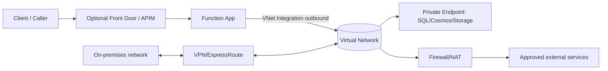
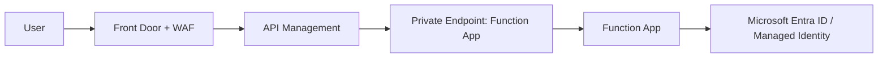
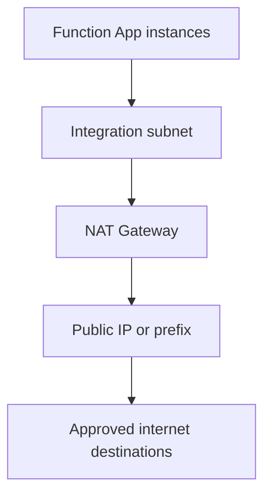
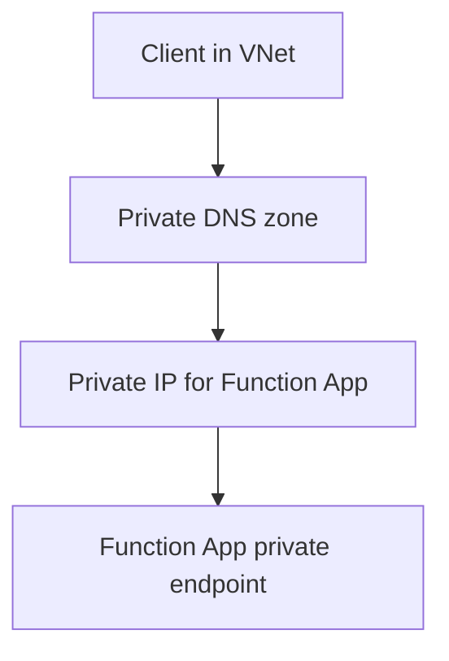
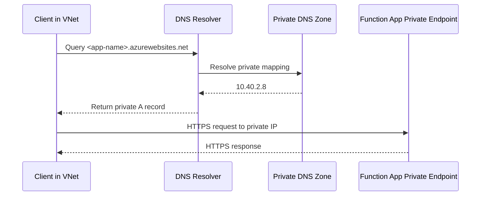

# Networking
Azure Functions networking design has two separate concerns:
- **Inbound**: who can call your function endpoints.
- **Outbound**: what your functions can reach.
Capabilities differ significantly by hosting plan, so networking must be chosen together with hosting.

## Prerequisites
Prepare these items before applying networking controls:
- Azure CLI authenticated to the target subscription.
- Function App already deployed.
- VNet and subnets planned for integration and private endpoints.
- DNS ownership model decided (Azure-managed, hybrid forwarder, or custom resolver).

```bash
az account show --output table
```

Example output (sanitized):

```text
Name                  CloudName    SubscriptionId      TenantId           State    IsDefault
--------------------  -----------  ------------------  -----------------  -------  -----------
Platform-Subscription AzureCloud   <subscription-id>   <tenant-id>        Enabled  True
```

!!! note "Plan-first design"
    Confirm the hosting plan supports required networking features before
    implementing ingress, egress, and DNS changes.

## Main Content
### Networking capability matrix
| Capability | Consumption | Flex Consumption | Premium | Dedicated |
|---|---|---|---|---|
| IP access restrictions | Yes | Yes | Yes | Yes |
| VNet integration (outbound) | No | Yes | Yes | Yes |
| Inbound private endpoint | No | Yes | Yes | Yes |
| NAT Gateway egress pattern | No | Yes | Yes | Yes |
| Hybrid Connections | No | No | Yes (Windows apps only) | Yes (Windows apps only) |

### Reference architecture


### Inbound network controls

#### 1) Access restrictions (IP/CIDR)
Use access restrictions to allow or deny source networks.

```bash
az functionapp config access-restriction add \
  --name "$APP_NAME" \
  --resource-group "$RG" \
  --rule-name "AllowCorporate" \
  --priority 100 \
  --action Allow \
  --ip-address "203.0.113.0/24"
```

List current restrictions:

```bash
az webapp config access-restriction show \
  --name "$APP_NAME" \
  --resource-group "$RG" \
  --output json
```

Example output (sanitized):

```json
{
  "ipSecurityRestrictions": [
    {
      "name": "AllowCorporate",
      "priority": 100,
      "action": "Allow",
      "ipAddress": "203.0.113.0/24"
    },
    {
      "name": "DenyAll",
      "priority": 2147483647,
      "action": "Deny",
      "ipAddress": "Any"
    }
  ],
  "scmIpSecurityRestrictionsUseMain": true
}
```

#### 2) Private endpoint for Function App inbound
For private ingress, place the Function App behind a private endpoint (Flex, Premium, Dedicated).

```bash
az network private-endpoint create \
  --name "pe-$APP_NAME" \
  --resource-group "$RG" \
  --vnet-name "$VNET_NAME" \
  --subnet "$PE_SUBNET" \
  --private-connection-resource-id "/subscriptions/<subscription-id>/resourceGroups/$RG/providers/Microsoft.Web/sites/$APP_NAME" \
  --group-id "sites" \
  --connection-name "pe-conn-$APP_NAME"
```

Inspect private endpoint status:

```bash
az network private-endpoint show \
  --name "pe-$APP_NAME" \
  --resource-group "$RG" \
  --output json
```

Example output (sanitized):

```json
{
  "name": "pe-<app-name>",
  "resourceGroup": "<resource-group>",
  "customDnsConfigs": [
    {
      "fqdn": "<app-name>.privatelink.azurewebsites.net",
      "ipAddresses": [
        "10.40.2.8"
      ]
    }
  ],
  "privateLinkServiceConnections": [
    {
      "privateLinkServiceConnectionState": {
        "status": "Approved"
      }
    }
  ]
}
```

#### 3) Zero-trust ingress architecture pattern


### Outbound network controls

#### 1) VNet integration
VNet integration enables private outbound access from the Function App to resources in VNets or connected networks.

```bash
az functionapp vnet-integration add \
  --name "$APP_NAME" \
  --resource-group "$RG" \
  --vnet "$VNET_NAME" \
  --subnet "$INTEGRATION_SUBNET"
```

Validate integration:

```bash
az functionapp vnet-integration list \
  --name "$APP_NAME" \
  --resource-group "$RG" \
  --output json
```

Example output (sanitized):

```json
[
  {
    "name": "<vnet-name>",
    "isSwift": true,
    "dnsServers": "168.63.129.16",
    "vnetResourceId": "/subscriptions/<subscription-id>/resourceGroups/<resource-group>/providers/Microsoft.Network/virtualNetworks/<vnet-name>"
  }
]
```

#### 2) Route-all pattern
To force all egress through VNet controls on plans that support this app setting (for example, Premium and Dedicated):

```bash
az functionapp config appsettings set \
  --name "$APP_NAME" \
  --resource-group "$RG" \
  --settings "WEBSITE_VNET_ROUTE_ALL=1"
```

Flex Consumption already routes outbound traffic through the integrated VNet path, so `WEBSITE_VNET_ROUTE_ALL=1` is not required on Flex.

#### 3) NAT Gateway for stable outbound IP
Attach NAT Gateway to the integration subnet when downstream allowlists require stable egress identity.



### Outbound SNAT and connection planning
SNAT exhaustion appears when many outbound sockets are opened to the same destination without reuse.

Planning baseline:
1. Reuse SDK/HTTP clients; avoid one client per request.
2. Prefer pooled transport defaults unless measured otherwise.

Observable symptoms:
- Intermittent dependency timeouts at peak traffic.
- Error bursts that recover after scale events or restarts.
- Heavier impact on high fan-out destinations.

Mitigation options:
- Add NAT Gateway capacity for larger outbound concurrency.
- Reduce avoidable parallel outbound operations.

### Subnet delegation requirements
When configuring VNet integration, subnet delegation depends on plan:
- Flex Consumption: `Microsoft.App/environments`
- Premium and Dedicated: `Microsoft.Web/serverFarms`
Plan this before deployment to avoid subnet redesign.

### DNS design for private endpoints
Private endpoint architectures require private DNS resolution.

Recommended baseline:
- Use `privatelink.azurewebsites.net` naming for Function App private endpoint records.
- Link private DNS zones to every VNet that must resolve private endpoints.
- Configure conditional forwarding in hybrid DNS environments.



DNS resolution sequence (private endpoint path):



### Hybrid connectivity
For on-premises integration:
- Premium and Dedicated support Hybrid Connections.
- VNet integration with VPN/ExpressRoute supports broader private reachability.
Use Hybrid Connections when simple TCP reachability is enough and full private routing is not required.

### Flex Consumption networking notes
- Flex supports VNet integration and private endpoints.
- Flex has no Kudu/SCM site.
- Runtime storage integration is identity-based.
- Blob trigger ingestion model on Flex should use Event Grid source.

### Security alignment
Networking should align with identity and authorization controls:
- Function authorization level for endpoint keys.
- App Service Authentication for user/workload identity.
- Managed identity for service-to-service access.
- NSG/firewall policy for egress governance.

!!! tip "Security Guide"
    Combine network isolation with identity controls in [Security](security.md).

### Common architecture patterns

#### Public API pattern
- Public endpoint with auth keys or App Service Authentication.
- Best fit: Consumption or Flex for low idle cost.

#### Private backend API pattern
- Public ingress via APIM.
- Function outbound via VNet integration to private data services.
- Best fit: Flex or Premium.

#### Private-only workload pattern
- Inbound private endpoint only.
- No public network access.
- Best fit: Premium or Dedicated (or Flex when one-app-per-plan is acceptable).

### Troubleshooting matrix
| Symptom | Likely Cause | Validation Path |
|---|---|---|
| Private endpoint unreachable | DNS zone not linked to VNet | Run `nslookup <app-name>.azurewebsites.net` from inside VNet and verify private IP |
| Access restriction denies valid caller | Rule priority or CIDR mismatch | Review rules with `az webapp config access-restriction show --name "$APP_NAME" --resource-group "$RG" --output table` |
| Private backend not reachable | Missing VNet integration | Validate with `az functionapp vnet-integration list --name "$APP_NAME" --resource-group "$RG"` |
| Downstream allowlist mismatch | NAT egress IP not published | Confirm NAT association and compare observed egress IP |
| Intermittent outbound timeout spikes | SNAT pressure | Correlate dependency failures with connection reuse and load |
| Hybrid lookup inconsistency | Conditional forwarder gaps | Compare DNS answers from on-premises and VNet clients |

### Validation checklist
- Confirm plan supports required network features.
- Confirm subnet delegation is correct.
- Confirm DNS resolves private endpoints as expected.
- Confirm egress path (default vs route-all) matches policy.
- Confirm downstream allowlists include NAT egress IP if used.

## Advanced Topics
### Zero-trust ingress pattern
A practical zero-trust ingress model for Functions is:
1. Front Door + WAF at the edge.
2. APIM policy enforcement in front of backend APIs.
3. Function App private endpoint only.
4. Identity-first authorization at every hop.

### Route-all outbound strategy
- Enable `WEBSITE_VNET_ROUTE_ALL=1` for controlled egress paths on Premium/Dedicated.
- Flex Consumption already uses VNet-routed outbound behavior and does not require this setting.
- Force internet egress through firewall and NAT controls.

### Multi-environment DNS governance
For dev/test/prod environments:
- Standardize zone naming and ownership.
- Define zone-link conventions in infrastructure code.
- Version control conditional forwarder rules.
- Add DNS resolution checks in release validation.

### SNAT exhaustion detection and mitigation
Detection approach:
1. Inspect dependency timeout bursts.
2. Correlate with scale events and traffic fan-out.
3. Identify high-frequency destination endpoints.

Mitigation approach:
1. Reuse clients and improve pooling behavior.
2. Reduce avoidable parallel outbound calls.
3. Increase NAT capacity and retest.

### NAT Gateway sizing
NAT sizing depends on concurrency, destination mix, and connection lifetime.
- Start with one gateway and one public IP for moderate workloads.
- Add public IPs/prefix capacity for high-volume burst traffic.
- Validate sizing using load tests and telemetry, not assumptions.

## Language-Specific Details
Networking architecture is shared, but connection behavior differs by runtime.
- [Python guide index](../language-guides/python/index.md)
- [Node.js guide index](../language-guides/nodejs/index.md)
- [Java guide index](../language-guides/java/index.md)
- [.NET guide index](../language-guides/dotnet/index.md)

Runtime focus areas:
- Python: process model and HTTP client reuse.
- Node.js/.NET/Java: use pooled clients and tuned connection lifetime settings.

## See Also
- [Hosting](hosting.md)
- [Scaling](scaling.md)
- [Security](security.md)
- [Troubleshooting architecture](../troubleshooting/architecture.md)
- [Troubleshooting playbooks](../troubleshooting/playbooks.md)

## Sources
- [Microsoft Learn: Networking options in Azure Functions](https://learn.microsoft.com/azure/azure-functions/functions-networking-options)
- [Microsoft Learn: Integrate your app with an Azure virtual network](https://learn.microsoft.com/azure/app-service/configure-vnet-integration-enable)
- [Microsoft Learn: Use private endpoints for Azure App Service apps](https://learn.microsoft.com/azure/app-service/networking/private-endpoint)
- [Microsoft Learn: NAT Gateway integration with App Service](https://learn.microsoft.com/azure/app-service/overview-nat-gateway-integration)
