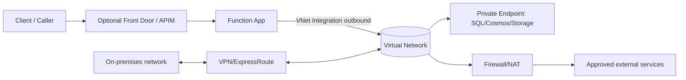
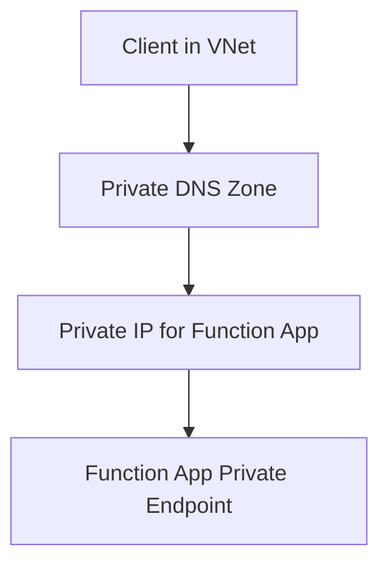

# Networking

Azure Functions networking design has two separate concerns:

- **Inbound**: who can call your function endpoints.
- **Outbound**: what your functions can reach.

Capabilities differ significantly by hosting plan, so networking must be chosen together with hosting.

## Networking capability matrix

| Capability | Consumption | Flex Consumption | Premium | Dedicated |
|---|---|---|---|---|
| IP access restrictions | Yes | Yes | Yes | Yes |
| VNet integration (outbound) | No | Yes | Yes | Yes |
| Inbound private endpoint | No | Yes | Yes | Yes |
| NAT Gateway egress pattern | No | Yes | Yes | Yes |
| Hybrid Connections | No | No | Yes | Yes |

## Reference architecture



## Inbound network controls

### 1) Access restrictions (IP/CIDR)

Use access restrictions to allow or deny source networks.

```bash
az functionapp config access-restriction add \
  --name "$APP_NAME" \
  --resource-group "$RG" \
  --rule-name "AllowCorporate" \
  --priority 100 \
  --action Allow \
  --ip-address "203.0.113.0/24"
```

### 2) Private endpoint for Function App inbound

For private ingress, place the Function App behind a private endpoint (supported on Flex, Premium, Dedicated).

```bash
az network private-endpoint create \
  --name "pe-$APP_NAME" \
  --resource-group "$RG" \
  --vnet-name "$VNET_NAME" \
  --subnet "$PE_SUBNET" \
  --private-connection-resource-id "/subscriptions/<subscription-id>/resourceGroups/$RG/providers/Microsoft.Web/sites/$APP_NAME" \
  --group-id "sites" \
  --connection-name "pe-conn-$APP_NAME"
```

Then disable public ingress if required by policy.

## Outbound network controls

### 1) VNet integration

VNet integration enables private outbound access from the Function App to resources in VNets or connected networks.

```bash
az functionapp vnet-integration add \
  --name "$APP_NAME" \
  --resource-group "$RG" \
  --vnet "$VNET_NAME" \
  --subnet "$INTEGRATION_SUBNET"
```

### 2) Route-all pattern

To force all egress through VNet controls:

```bash
az functionapp config appsettings set \
  --name "$APP_NAME" \
  --resource-group "$RG" \
  --settings "WEBSITE_VNET_ROUTE_ALL=1"
```

### 3) NAT Gateway for stable outbound IP

Attach NAT Gateway to integration subnet when downstream allowlists require stable egress IP addresses.

## Subnet delegation requirements

When configuring VNet integration, subnet delegation depends on plan:

- Flex Consumption: `Microsoft.App/environments`
- Premium and Dedicated: `Microsoft.Web/serverFarms`

Plan this before deployment to avoid rework.

## DNS design for private endpoints

Private endpoint architectures require private DNS resolution.

Recommended baseline:

- Use `privatelink.azurewebsites.net` for Function App private endpoint naming.
- Link private DNS zone to integration VNets.
- Configure conditional forwarding for hybrid DNS environments.



## Hybrid connectivity

For on-premises integration:

- Premium and Dedicated support Hybrid Connections.
- VNet integration + VPN/ExpressRoute enables broader private reachability.

Use Hybrid Connections when you need simple TCP access without full VNet routing complexity.

## Flex Consumption networking notes

- Flex supports VNet integration and private endpoints.
- Flex still has no Kudu/SCM site.
- Storage integration for runtime uses identity-based configuration.
- Blob-trigger ingestion model on Flex should be Event Grid source.

## Security alignment

Networking should align with security controls:

- Function authorization level for endpoint keys.
- App Service Authentication for user auth.
- Managed identity for service-to-service authentication.
- NSG/firewall policy for egress governance.

!!! tip "Security Guide"
    Combine network isolation with identity controls in [Security](security.md).

## Common architecture patterns

### Public API pattern

- Public endpoint + auth keys or App Service Authentication.
- Best fit: Consumption or Flex for low idle cost.

### Private backend API pattern

- Public ingress through APIM.
- Function outbound via VNet integration to private data services.
- Best fit: Flex or Premium.

### Private-only workload pattern

- Inbound private endpoint only.
- No public network access.
- Best fit: Premium or Dedicated (or Flex when one-app-per-plan is acceptable).

## Validation checklist

- Confirm plan supports required network features.
- Confirm subnet delegation is correct.
- Confirm DNS resolves private endpoints as expected.
- Confirm egress path (default vs route-all) matches policy.
- Confirm downstream allowlists include NAT egress IP if used.

!!! tip "Language Guide"
    For language-specific SDK connection patterns, see [Python language guide](../language-guides/python/index.md).

## See also

- [Hosting](hosting.md)
- [Scaling](scaling.md)
- [Security](security.md)
- [Microsoft Learn: Networking options](https://learn.microsoft.com/azure/azure-functions/functions-networking-options)
