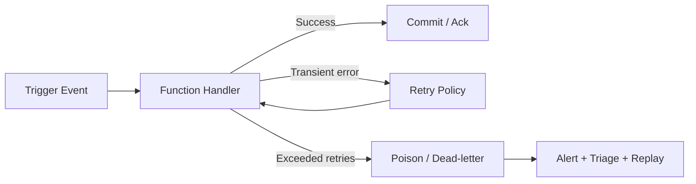

# Reliability

Reliability in Azure Functions is a design concern, not only an operations concern. Your trigger model, hosting plan, retry policy, and network topology jointly determine failure behavior.

## Reliability layers

Design for reliability across four layers:

1. **Trigger semantics** (delivery guarantees, retries, checkpointing)
2. **Function behavior** (idempotency, timeout, exception handling)
3. **Platform behavior** (scale transitions, zone support, host restarts)
4. **Dependency behavior** (throttling, transient failure, private network reachability)

## Retry strategy

Azure Functions supports built-in retry behavior for supported triggers.

Common retry models:

- Fixed delay retry
- Exponential backoff retry

Use retries for transient failures only. Non-transient failures should route to dead-letter/poison handling paths.

### Cross-language retry annotation patterns

=== "Python"
    ```python
    import azure.functions as func

    app = func.FunctionApp()

    @app.function_name(name="ProcessQueue")
    @app.queue_trigger(arg_name="msg", queue_name="orders", connection="AzureWebJobsStorage")
    def process_queue(msg: func.QueueMessage) -> None:
        # Handle message idempotently; raise on transient failures
        pass
    ```

=== "Node.js"
    ```javascript
    const { app } = require('@azure/functions');

    app.storageQueue('processQueue', {
      queueName: 'orders',
      connection: 'AzureWebJobsStorage',
      handler: async (message, context) => {
        // Handle idempotently
      }
    });
    ```

=== ".NET (Isolated)"
    ```csharp
    using Microsoft.Azure.Functions.Worker;

    public class ProcessQueue
    {
        [Function("ProcessQueue")]
        public void Run([QueueTrigger("orders", Connection = "AzureWebJobsStorage")] string message)
        {
            // Handle idempotently
        }
    }
    ```

## Poison message handling

For queue-based triggers, repeated failure eventually moves messages to poison/dead-letter paths (service-specific behavior).

Design requirements:

- preserve original payload and correlation metadata,
- alert on poison queue growth,
- provide replay workflow after remediation,
- prevent infinite retry loops.

!!! warning "Do not drop poison messages"
    Poison events are high-signal reliability data. Route them to explicit triage and replay pipelines.

## Timeout design

Timeout boundaries are part of reliability behavior.

| Plan | Default | Maximum |
|---|---:|---:|
| Consumption (classic) | 5 min | 10 min |
| Flex Consumption | 30 min | Unbounded |
| Premium | 30 min (common default) | Unbounded |
| Dedicated | 30 min (common default) | Unbounded |

If your business process exceeds timeout bounds, redesign to asynchronous orchestration.

## Availability zones and high availability

Zone-aware architecture options are strongest on Premium and Dedicated plans.

- Premium and Dedicated can be designed for zone-resilient deployments (region permitting).
- Zone-resilient design should include zone-redundant dependencies (storage, messaging, data stores).
- Flex and Consumption designs should emphasize retry/idempotency and multi-region recovery patterns where needed.

## Idempotency is mandatory

Because retries and duplicate deliveries are normal in distributed systems, handlers must be idempotent.

Idempotency patterns:

- deterministic operation keys,
- upsert instead of blind insert,
- de-duplication table/cache,
- exactly-once effects at domain boundary where feasible.

## Dependency resilience

Protect downstream dependencies using:

- timeout budgets per call,
- transient retry with jitter,
- circuit breaking,
- and bulkheading (separate processing lanes for critical/non-critical work).

## Reliability architecture pattern



## Reliability checklist

- Define retry policy per trigger type.
- Enforce idempotency in every async handler.
- Define poison queue alert + replay process.
- Align timeout with business SLA.
- Validate zone strategy on Premium/Dedicated where required.

!!! tip "Operations Guide"
    For runbook details, see [Operations: Retries and Poison Handling](../operations/retries-and-poison-handling.md).

## See also

- [Triggers and bindings](triggers-and-bindings.md)
- [Scaling](scaling.md)
- [Security](security.md)
- [Microsoft Learn: Azure Functions reliability](https://learn.microsoft.com/azure/reliability/reliability-functions)
